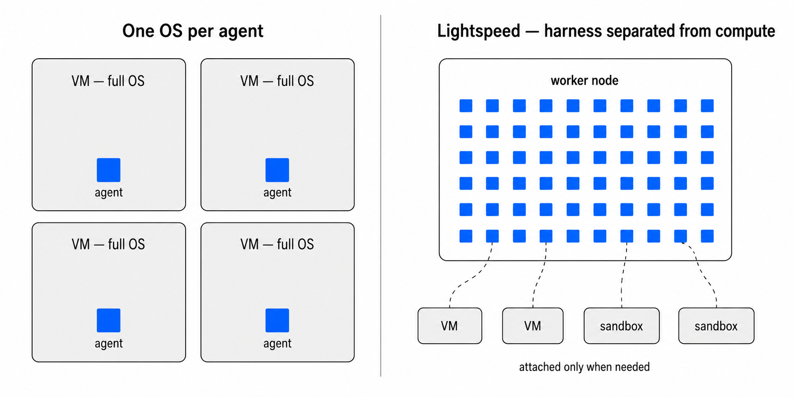
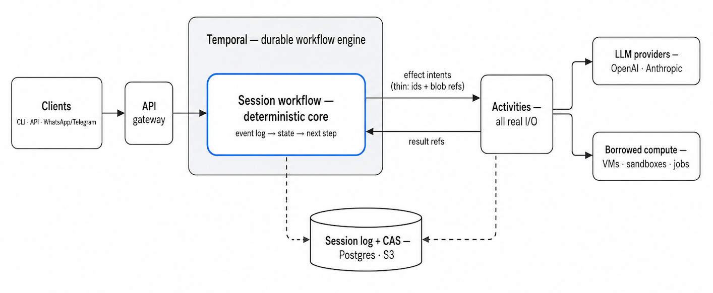

<p align="center">
  
</p>

# Lightspeed

Lightspeed is a powerful agent harness built for durable workflow engines. It allows you to run complex agents and sub-agents that survive restarts, run for months, and scale to thousands, without needing a dedicated VM for each one.

[Temporal](https://temporal.io/) is fully supported today; others are coming soon: [Restate](https://www.restate.dev/), [Inngest](https://www.inngest.com/), Hatchet, AWS Step Functions, etc. The core is written in Rust. The production data backend is Postgres and optional S3.

## Why?
**The goal of Lightspeed is to build as powerful an agent as Claude Code, Codex, or OpenClaw, but running _outside_ operating systems, thus separating the harness from compute. Plus, making this tenable for workflow engines**.

Concretely, that means the harness—the agent loop, context management, session state—runs as a lightweight durable workflow, while OS-level work (shells, code execution, full file systems) happens on machines the agent attaches to only when a task needs them. The result: thousands of agents managed by a single worker node.

<p align="center">
  
</p>

Frontier agent harnesses like Claude Code, Codex, OpenCode, or OpenClaw are designed to run inside a guest OS and need an entire OS for themselves, which makes them difficult to scale and secure. Hence the emerging pattern to ["separate the harness from compute"](https://openai.com/index/the-next-evolution-of-the-agents-sdk/#:~:text=long%2Drunning%20task.-,Separating%20harness%20from%20compute%20for%20security%2C%20durability%2C%20and%20scale,-Agent%20systems%20should), and to run agents inside workflow engines for durability. This is especially interesting in enterprise or multi-tenant settings, where you cannot easily co-locate agents on the same VM.

But most agent SDKs are not designed for workflow engines: they do not separate the deterministic core from effects such as LLM or tool calls, and they pass too much data between the core workflow logic and the effectful "tasks" or "activities"—e.g. the entire chat history back and forth—which bloats workflow histories.

One caveat we take seriously: frontier models are optimized to the hilt (via RL) assuming they control a full POSIX-compatible OS, so an agent with just MCPs and provider-native tools will underperform one with a real machine. Bridging that gap is a central goal of Lightspeed: agents can borrow compute (dedicated VMs via a bridge daemon, ad-hoc sandboxes, delegated coding-agent jobs) while the harness stays outside the OS.

**What you can build with Lightspeed**:
- An insanely **scalable OpenClaw-style personal assistant**: thousands of users, very low cost (besides tokens)
- A fully **autonomous software factory**: a fleet of agents that build, test, and critique your next feature — and keep running for weeks
- **Research agents** that spin up compute for long-running experiments, stay live for days, and supervise progress
- ...and much more!

## Features
What constitutes an "agent harness" is a rapidly expanding set of table-stakes features. Lightspeed is not 1.0 yet, but it is far enough along to try: everything checked below works today (see [Run Lightspeed Locally](#run-lightspeed-locally)), and the unchecked items are actively in flight:

**Models & providers**
- [x] **OpenAI and Anthropic, provider-native**: reasoning traces, native compaction, advanced tool configs, provider tools, files and images, OAuth login, multiple API keys
- [ ] **Other providers** via the "Completions API" standard

**Agent capabilities**
- [x] **Virtual file system**: the agent uses standard file tools (read, glob, patch) without an OS attached
- [x] **Web access**: fetch, search, and extract tools
- [x] **Skills**, hosted on the VFS or inside sandboxes
- [x] **Hosted MCP**, with API-key and OAuth authentication
- [x] **Flexible prompt & instruction configuration**
- [x] **Sub-agents (aka "fleets")**: agents that start and manage other agents
- [x] **Agent profiles**: reusable session setups, shared across CLI, bridges, and fleets

**Durability & scale**
- [x] **Long-running agents**: sessions that last weeks to months and survive restarts
- [x] **Session fork & clone**: cheap forks of a running agent's full state, straight from the event-sourced log
- [x] **Eval harness** for regression-testing agent and tool workflows
- [ ] **Timers, schedules, wake-ups**
- [x] **Multi-tenancy**: many isolated universes (tenants) on one worker, with pluggable gateway auth

**Borrowed compute**
- [x] **Dedicated VMs**, connected as universe environment instances that
  sessions attach to through explicit bindings
- [x] **Jobs** for long-running work: environment-owned downloads,
  experiments, and delegated coding-agent runs with optional session/run
  supervision
- [ ] **Ad-hoc sandboxes**

**Security & auth**
- [x] **Encrypted secrets**: AEAD-encrypted secret store, plus an OAuth token broker with automatic refresh
- [x] **Credential injection**: secrets reach environments and jobs without ever being exposed to the model

**Interfaces**
- [x] **Typed JSON-RPC API**: committed schema contract, generated TypeScript client
- [x] **CLI** to connect to running agent sessions
- [x] **Messaging bridges**: WhatsApp and Telegram today; media and group chats included, more channels coming

## Design
At the heart of every agent is a carefully engineered state machine that manages what goes into the context window of the LLM.

In Lightspeed, that state machine is an event-sourced, deterministic core: it replays a session's event log into state, decides the next step, and emits effect _intents_ that runtime adapters execute against real LLM providers and tools. The core itself performs no I/O, which is exactly the shape that plays well with durable workflow engines.

Two more decisions make this practical inside a workflow engine:
1) **Minimal provider abstraction.** We extract only the information needed to decide and branch inside the deterministic core; provider-native data stays opaque and blob-backed, instead of being converted into a fake universal LLM message model.
2) **Offloading to CAS.** All data not directly needed by the workflow logic goes to content-addressed storage, so the payloads passed between workflow and activities are extremely thin and the workflow history stays small.

The full design walk-through is in [docs/design.md](docs/design.md).

<p align="center">
  
</p>

## Quick Start

Prerequisites:
- Rust toolchain with edition 2024 support (e.g. [rustup](https://rustup.rs/))
- Docker with Compose for the local Postgres, MinIO, and Temporal stack
- `OPENAI_API_KEY` for live OpenAI-backed chat and eval runs
- `ANTHROPIC_API_KEY` for live Anthropic client tests

Easiest is to copy `.env_example` to `.env` and set provider keys there. The
hosted server worker mode registers real provider adapters and session-mounted
VFS tools; for OpenAI-backed local chat, set `OPENAI_API_KEY`.

Build and test:

```bash
cargo build
cargo test
```

## Run Lightspeed Locally

The hosted path runs three pieces locally:

1. Docker infra: Postgres/CAS catalog, MinIO object storage, Temporal.
2. `temporal-server`: registers the Temporal workflow/activities and exposes
   the public JSON-RPC API on HTTP. Its binary is named `server`, and it
   can also run only the worker or only the gateway.
3. `cli`: starts or resumes sessions and submits chat messages through the
   gateway.

### 1. Start Local Infra

From the repository root:

```bash
local/up.sh
```

This starts Postgres on `localhost:15432`, MinIO on `localhost:29000`,
Temporal on `localhost:7233`, and the Temporal UI on `http://localhost:8233`.

Each shell that runs Lightspeed commands should load the local environment:

```bash
source local/env.sh
```

### 2. Run The Server

Open a first shell:

```bash
source local/env.sh

# export OPENAI_API_KEY=...  # omit this if it is already in .env

cargo run -p temporal-server
```

With no subcommand, the `server` binary runs the gateway and Temporal worker
together in one process. The gateway listens on `http://127.0.0.1:18080` by default.
Optional health check:

```bash
curl http://127.0.0.1:18080/health
```

For split deployments, run the two roles separately:

```bash
cargo run -p temporal-server -- worker
cargo run -p temporal-server -- gateway
```

### 3. Start Chatting With The CLI

Open another shell:

```bash
source local/env.sh
cargo run -p cli -- chat --new
```

That starts an interactive TUI session. `LIGHTSPEED_API_URL` is exported by
`local/env.sh`, so you do not need to pass `--api-url`.

For OpenAI-backed chat, the CLI sends typed session/run configuration through
the API. Use `--model ...` on a command, or set `LIGHTSPEED_CHAT_MODEL`, if you want
a specific model.

The repository includes runnable example profiles under `profiles/`. Import one
through the gateway, then start a chat with its profile id:

```bash
cargo run -p cli -- profiles import profiles/workspace-prompts-skills.json
cargo run -p cli -- chat --new --profile example.workspace-prompts-skills \
  "summarize the mounted profile workspace"
```

The workspace-backed profile provisions `profiles/workspace-prompts-skills/` as
a VFS workspace and mounts it at `/workspace`. The local `provision` block is
consumed by the CLI during import and is not stored in the profile record.

There is also a multi-profile Fleet demo:

```bash
cargo run -p cli -- profiles import profiles/fleet-demo.json
cargo run -p cli -- chat --new --profile example.fleet.supervisor
```

Profiles can be managed through the same gateway:

```bash
cargo run -p cli -- profiles list
cargo run -p cli -- profiles check profiles/fleet-demo.json
cargo run -p cli -- profiles read example.workspace-prompts-skills
cargo run -p cli -- profiles export example.workspace-prompts-skills \
  --out /tmp/example.workspace-prompts-skills.json
```

`profiles import` and `profiles check` accept either one profile object or a
non-empty JSON array of profile objects. See `profiles/README.md` for the full
set of examples, including the MCP echo profile, which requires registering the
test MCP server before import.

To chat with a local directory mounted as a writable CAS-backed VFS workspace:

```bash
cargo run -p cli -- chat --new --mount docs/
```

The CLI snapshots the directory locally, uploads missing blobs, creates a VFS
workspace from that snapshot, mounts it at `/workspace`, and starts the chat
session with `/workspace` as the working directory. Use `--mount-path` to pick
a different VFS mount path.

The `cli` package builds the `lightspeed` binary, so installed usage is equivalent:

```bash
lightspeed chat --new
```

### Multi-Tenancy

One deployment serves many isolated *universes* (tenants): one gateway, one
worker, one Postgres pool, one object-store bucket. Every universe's sessions,
profiles, registries, and blobs are fully isolated; Temporal workflow ids are
composed as `{universe_id}/{session_id}` on a shared task queue.

The API never carries a universe parameter. The gateway resolves the tenant
per request based on `LIGHTSPEED_AUTH_MODE`:

- `single` (default) — the whole deployment is pinned to
  `LIGHTSPEED_PG_UNIVERSE_ID`; no credentials. This is the local/dev mode.
- `trusted-header` — bring your own auth: an upstream gateway authenticates
  callers and injects `x-lightspeed-universe: <uuid>` (optionally
  `x-lightspeed-principal: user:<id>` or `service_account:<id>`). Requests
  without the header are rejected, and unknown universes fail closed —
  universes exist only through explicit creation.
- `api-key` — built-in credentials for directly exposed deployments:
  `Authorization: Bearer lsk_…` resolves to a universe and principal.

Deployment-level administration is exposed as operator-scoped JSON-RPC
methods on the same `/rpc` endpoint (`operator/universes/create|list|read|
delete`), callable in `trusted-header` and `single` modes only. Deleting a
universe terminates its live session workflows, sweeps its externally stored
blobs, and cascades every universe-scoped row.

Manage universes and keys with the server binary (the key secret prints
exactly once):

```bash
cargo run -p temporal-server -- universe create --slug acme
cargo run -p temporal-server -- api-key create --universe-id <uuid> --name acme-prod
cargo run -p temporal-server -- api-key list
cargo run -p temporal-server -- api-key revoke <key-prefix>
```

The CLI and the messaging bridge send credentials from `LIGHTSPEED_API_KEY`
(api-key mode) or `LIGHTSPEED_UNIVERSE` (trusted-header mode) automatically.
See [docs/roadmap/p90-multi-tenancy.md](docs/roadmap/p90-multi-tenancy.md)
for the design.

### Stop Or Reset Local Infra

```bash
local/down.sh
```

To reset persisted local state while keeping containers available:

```bash
local/reset.sh
```

## Testing
Default deterministic tests:

```bash
cargo test
```

Ignored live provider tests require API keys and may cost money:

```bash
cargo test -p llm-clients -- --ignored
```

## Contributing
See [CONTRIBUTING.md](CONTRIBUTING.md)

## License
[Apache 2.0](LICENSE)
