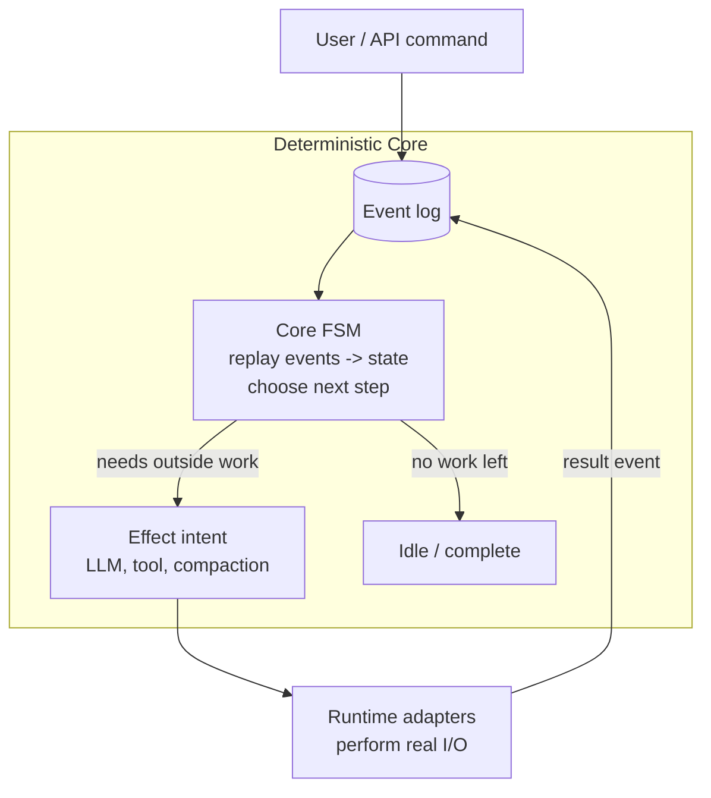
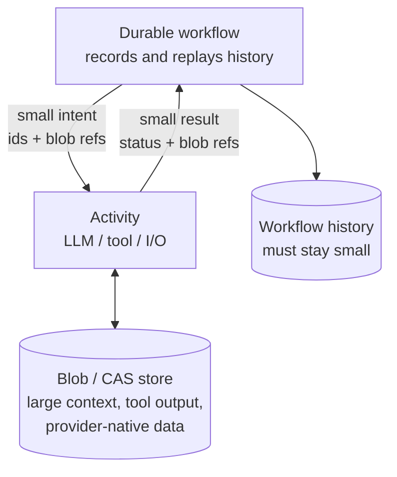
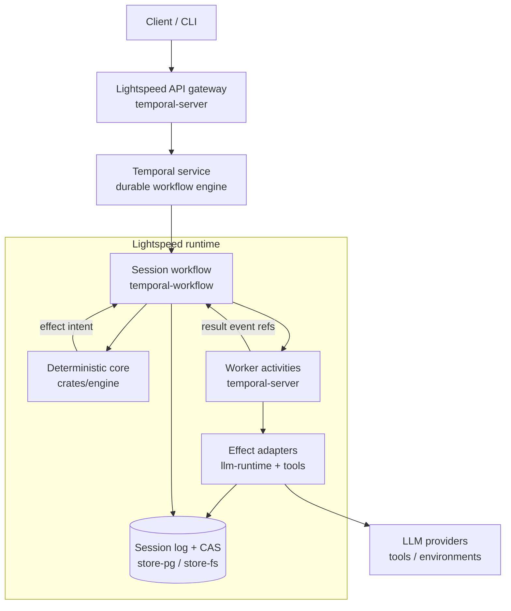

# Lightspeed

Lightspeed is a powerful agent harness built around a deterministic core and data structures designed to run inside [durable workflow engines](https://en.wikipedia.org/wiki/Workflow_engine). [Temporal](https://temporal.io/) is fully supported today; others are coming soon: [Restate](https://www.restate.dev/), [Inngest](https://www.inngest.com/), Hatchet, AWS Step Functions, etc. The core is written in Rust. The production data backend is Postgres and optional S3.

**What you can build with Lightspeed**:
- An insanley **scalable OpenClaw**: thousands of users, very low cost (besides tokens)
- Fully **autonomous software factory**: agents collaborating to build, test, critique your next feature
- **@Claude that you control**: multi-provider, on-prem hosting
- ...and much more!

## Why?
Frontier agent harnesses like Claude Code, Codex, OpenCode, OpenClaw are designed to run inside a guest OS and need an entire OS process for themselves. These agents are difficult to scale and secure.

There's an emerging pattern to ["separate the harness from compute"](https://openai.com/index/the-next-evolution-of-the-agents-sdk/#:~:text=long%2Drunning%20task.-,Separating%20harness%20from%20compute%20for%20security%2C%20durability%2C%20and%20scale,-Agent%20systems%20should) for security, and partially for scale. Further, it's also a pattern to run agents inside workflow engines, for durability and easier scale. This is especially interesting for agents running in enterprise settings.

Further, most agent SDKs are not designed for workflow engines: they do not separate the deterministic core from effects such as LLM or tool calls, and they pass too much data between the core workflow logic and the effectful "tasks" or "activities"–e.g. passing the entire chat history back and forth–creating various issues for the workflow runtimes.

**The goal of Lightspeed is to build as powerful of an agent as Claude Code, Codex, or OpenClaw, but running _outside_ operating systems, thus separating the harness from compute. Plus, making this tenable for workflow engines**. This unlocks very scalable agent architectures–think thousands of agents that run for months.

We also acknowledge that the current iteration of frontier models are optimized to the hilt (via RL) to accomplish most tasks under the assumption that they fully control a POSIX-compatible OS. So, just giving the agent access to some MCPs or provider native tools, will not yield the same results as when the agent has full access to an OS. Therefore, a central goal is to bridge that gap with various features where the agent can still use or borrow sandboxes, permanent VMs, or other computers.

## Features
What constitutes an "agent harness" is a rapidly expanding set of table-stakes features. Here is a list of where we are at:
- [x] Broad frontier model support for OpenAI and Anthropic: native compaction, reasoning traces, advanced tool configurations and provider native tools, MCP, files, images, provider OAuth login, multiple API keys, etc.
- [x] Long-lasting and durable agent runs (weeks to months)
- [x] Virtual file system that allows the agent to use standard file tools (read, glob, patch. etc), without needing a full operating system attached
- [x] Skills hosted on a virtual file system or inside sandboxes
- [x] Flexible prompt and instruction configuration features
- [x] Reusable agent profiles for named or inline session setup across CLI, bridge, and Fleet spawns
- [x] Hosted MCP, including various authentication methods such as API keys, OAuth flows
- [x] Sub-agents (aka. "fleets"), letting agents start or manage other agents (planned)
- [ ] Sandboxes, including delegating work to standard coding agents inside sandboxes (in progress)
  - [x] Dedicated VMs that connect via a bridge daemon to the agent
  - [ ] Ad-hoc sandboxes
  - [ ] Jobs for long running tasks: downloads, start a coding agent like Codex, etc
- [ ] Timers, schedules, wake-ups (planned)
- [ ] Multi-tenant support (in progress)
- [ ] Other model support via the "Completion API" standard (in progress)
- [x] CLI to connect to running agent sessions
- [x] Bridge to various messaging platforms (WhatsApp, Telegram, others coming soon)

## Design
At the heart of every agent is a carefully engineered state machine that manages what goes into the context window of the LLM. We start with that core and then layer various systems on top until we have a complete, working agent.

### Deterministic Core
The [core engine](crates/engine/src/core/components/) is implemented as an event-sourced deterministic finite state machine.

> [!NOTE]
> The event log we are talking of here is separate from the Temporal event history (or other workflow). We are talking specifically of the events that constitute an agent's session state. These events are stored in Lightspeed's own Postgres event store.

When a command arrives, it is converted to an event, which is then recorded in the event log. The event is then applied to the core state. Then a "next step decider" figures out what to do next. If effects need to be issued, the decider outputs a list of effect _intents_, which then get later executed against the LLM providers or tool call surfaces. The results of these effects get sent back to the event log to be recorded and then sent to the FSM, resulting in an event loop.

This stack is entirely workflow engine agnostic, and it can be thoroughly tested in isolation by simulating the effect adapters.

### Context Management & Provider APIs
The purpose of the deterministic core is to decide what goes into the context window of the next LLM turn, plus the provider API configurations. Anything that does not pertain to this problem, needs to live elsewhere. In Lightspeed, we call the history and state of an individual context window a _session_.

So, what are the things that need to feed into the LLM session?
1) Top-level instructions (prompts/system messages)
2) Configured tool definitions (including MCP)
3) Transcript/message items, which can the split further:
	- Inputs: user messages, business events
	- LLM output items: responses, reasoning traces, tool calls, compaction traces
	- Tool results
	- Actively managed transcript items: skill catalogs, memory subsystem, etc
4) (not in the context window) LLM configurations such as model, reasoning efforts

The main challenge is how to balance what goes into the context window each turn, what to retain when compacting the context window (because it is full), and how to do all this with as much LLM caching consistency as possible.

Lightspeed adds the _absolute minimal_ abstraction over the LLM provider data structures and APIs. Many agent SDKs (e.g. LangChain) convert the provider specific data into a unified structure and then convert it back when they pass it back to the LLM. We, on the other hand, extract only the information that is needed to decide and branch inside the deterministic core. The provider-native data is stored inside blobs inside content addressed storage.

### Offloading to CAS
Workflow engines differentiate between the deterministic code that expresses the business logic and the code that executes effects such as database calls or API calls, usually called "activities" or "tasks". This introduces an important seam that need to be carefully managed. Specifically, the data that travels back and forth between workflow and activities needs to be kept to a minimum, because all those transitions are logged and stored (which is part of the magic that makes the workflows "durable").


Lightspeed solves this by offloading all data that is not directly needed by the workflow logic to a content addressed storage (CAS) system. The structures that are passed between workflow and activities are extremely thin, keeping workflow state and log size small and efficient. So, instead of passing, say, the entire user input message to the LLM activity, we first store it in the CAS and then only pass a reference to the blob–and vice versa with model outputs.

### Hosting inside a Workflow Runtime (e.g. Temporal)
With the above pieces in place, running an agent inside a workflow runtime becomes feasible and pleasant. We just have to put it all together.


The Temporal workflow owns an instance of the deterministic core–aka a "session". It drives the core state machine until it is idle. When not idle, it sends the the effect intents via activities to real APIs and services, such as LLM providers. It also logs all events that constitute a session state in a Postgres store (or optionally an file system store, for testing). Small CAS blobs get stored in Postgres, large blobs go to S3 (also supporting different blob providers).

Around the main stack, there is also a gateway API and CLI tooling to make interacting with the whole Lightspeed system easier. Agent profiles live on that public API boundary: a profile is a reusable setup document for session config, instructions, mounts, MCP links, and environments. The hosted runtime resolves and applies profiles outside the deterministic core.


## Quick Start

Prerequisites:
- Rust toolchain with edition 2024 support (e.g. [rustup](https://rustup.rs/))
- Docker with Compose for the local Postgres, MinIO, and Temporal stack
- `OPENAI_API_KEY` for live OpenAI-backed chat and eval runs
- `ANTHROPIC_API_KEY` for live Anthropic client tests

Easiest is to copy `.env_example` to `.env` and set provider keys there. The
hosted server worker mode registers real provider adapters and session-mounted
VFS tools; for OpenAI-backed local chat, set `OPENAI_API_KEY`.

Build and test:

```bash
cargo build
cargo test
```

## Run Lightspeed Locally

The hosted path runs three pieces locally:

1. Docker infra: Postgres/CAS catalog, MinIO object storage, Temporal.
2. `temporal-server`: registers the Temporal workflow/activities and exposes
   the public JSON-RPC API on HTTP. Its binary is named `server`, and it
   can also run only the worker or only the gateway.
3. `cli`: starts or resumes sessions and submits chat messages through the
   gateway.

### 1. Start Local Infra

From the repository root:

```bash
local/up.sh
```

This starts Postgres on `localhost:15432`, MinIO on `localhost:29000`,
Temporal on `localhost:7233`, and the Temporal UI on `http://localhost:8233`.

Each shell that runs Lightspeed commands should load the local environment:

```bash
source local/env.sh
```

### 2. Run The Server

Open a first shell:

```bash
source local/env.sh

# export OPENAI_API_KEY=...  # omit this if it is already in .env

cargo run -p temporal-server
```

With no subcommand, the `server` binary runs the gateway and Temporal worker
together in one process. The gateway listens on `http://127.0.0.1:18080` by default.
Optional health check:

```bash
curl http://127.0.0.1:18080/health
```

For split deployments, run the two roles separately:

```bash
cargo run -p temporal-server -- worker
cargo run -p temporal-server -- gateway
```

### 3. Start Chatting With The CLI

Open another shell:

```bash
source local/env.sh
cargo run -p cli -- chat --new
```

That starts an interactive TUI session. `LIGHTSPEED_API_URL` is exported by
`local/env.sh`, so you do not need to pass `--api-url`.

For OpenAI-backed chat, the CLI sends typed session/run configuration through
the API. Use `--model ...` on a command, or set `LIGHTSPEED_CHAT_MODEL`, if you want
a specific model.

The repository includes runnable example profiles under `profiles/`. Import one
through the gateway, then start a chat with its profile id:

```bash
cargo run -p cli -- profiles import profiles/workspace-prompts-skills.json
cargo run -p cli -- chat --new --profile example.workspace-prompts-skills \
  "summarize the mounted profile workspace"
```

The workspace-backed profile provisions `profiles/workspace-prompts-skills/` as
a VFS workspace and mounts it at `/workspace`. The local `provision` block is
consumed by the CLI during import and is not stored in the profile record.

There is also a multi-profile Fleet demo:

```bash
cargo run -p cli -- profiles import profiles/fleet-demo.json
cargo run -p cli -- chat --new --profile example.fleet.supervisor
```

Profiles can be managed through the same gateway:

```bash
cargo run -p cli -- profiles list
cargo run -p cli -- profiles check profiles/fleet-demo.json
cargo run -p cli -- profiles read example.workspace-prompts-skills
cargo run -p cli -- profiles export example.workspace-prompts-skills \
  --out /tmp/example.workspace-prompts-skills.json
```

`profiles import` and `profiles check` accept either one profile object or a
non-empty JSON array of profile objects. See `profiles/README.md` for the full
set of examples, including the MCP echo profile, which requires registering the
test MCP server before import.

To chat with a local directory mounted as a writable CAS-backed VFS workspace:

```bash
cargo run -p cli -- chat --new --mount docs/
```

The CLI snapshots the directory locally, uploads missing blobs, creates a VFS
workspace from that snapshot, mounts it at `/workspace`, and starts the chat
session with `/workspace` as the working directory. Use `--mount-path` to pick
a different VFS mount path.

The `cli` package builds the `lightspeed` binary, so installed usage is equivalent:

```bash
lightspeed chat --new
```

### Stop Or Reset Local Infra

```bash
local/down.sh
```

To reset persisted local state while keeping containers available:

```bash
local/reset.sh
```

## Testing
Default deterministic tests:

```bash
cargo test
```

Ignored live provider tests require API keys and may cost money:

```bash
cargo test -p llm-clients -- --ignored
```

## Contributing
See [CONTRIBUTING.md](CONTRIBUTING.md)
