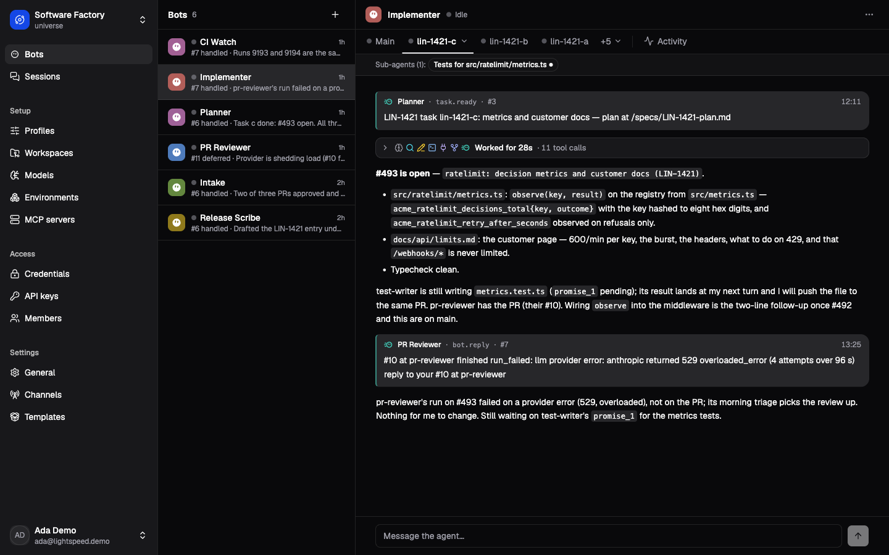

<p align="center">
  <a href="https://ls.bot/" target="_blank" rel="noopener">
    
  </a>
</p>

# Lightspeed

<p align="center"><strong>Run thousands of agents. Efficient, durable, auditable.</strong></p>

Lightspeed is open-source infrastructure for running long-lived agent fleets as durable workflows.

Agents survive restarts, can run for months, and stay cheap when idle. When they
need an operating system, they borrow a real machine for as long as the task
requires.

<p align="center">
  <a href="https://ls.bot/demo/u/software-factory/bots/implementer" target="_blank" rel="noopener">
    
  </a>
</p>

Lightspeed's Rust core runs on [Temporal](https://temporal.io/) today and stores
production data in Postgres with optional S3. The frontend is TypeScript and
React. Support for other durable workflow engines is planned.

## Why Lightspeed?

Lightspeed aims for the capability of Claude Code, Codex, and OpenClaw without
requiring one operating system per agent. 

Most frontier harnesses live inside a guest OS, which makes them difficult to scale and secure. Hence the emerging pattern to
["separate the harness from compute"](https://openai.com/index/the-next-evolution-of-the-agents-sdk/#:~:text=long%2Drunning%20task.-,Separating%20harness%20from%20compute%20for%20security%2C%20durability%2C%20and%20scale,-Agent%20systems%20should). This is especially
useful in enterprises with more stringent supervision and scaling requirements.

So, in Lightspeed, the harness (the agent loop, context, and session state) runs as a lightweight
durable workflow. Shells, code execution, and full filesystems run on machines
attached only when needed. One worker can therefore manage hundreds of agents.

<p align="center">
  
</p>

**What you can build with Lightspeed**:

- **Personal assistants** for thousands of users without one idle VM per user
  (<a href="https://ls.bot/demo/u/personal-assistant" target="_blank" rel="noopener">Assistant Demo</a>)
- **Autonomous software factories** that coordinate agents to build, test, and
  critique features for weeks at a time
  (<a href="https://ls.bot/demo/u/software-factory" target="_blank" rel="noopener">Software Factory Demo</a>)
- **On-call operations agents** that investigate alerts, propose fixes, and
  report back through chat
  (<a href="https://ls.bot/demo/u/technical-support" target="_blank" rel="noopener">Technical Support Demo</a>)
- **Research agents** that spin up compute for long-running experiments, stay live for days, and supervise progress
- and more...

## Quick start

You need Rust with edition 2024 support, Node.js 24 or newer, and Docker with
Compose. Then start the complete
local product:

```bash
./dev.sh
```

You can set the LLM API keys directly in the UI. But you can also set them via environment variable:
```bash
cp .env.example .env
# Set OPENAI_API_KEY or ANTHROPIC_API_KEY in .env
# Then restart ./dev.sh
```

When the readiness checks pass, open
[http://localhost:5173/app/](http://localhost:5173/app/) and sign in with the
development account printed by the launcher. The defaults are
`admin@lightspeed.dev` and `lightspeed-dev-password`.

The launcher installs dependencies, starts local infrastructure and application
processes, applies migrations, and waits until the product is ready.

For other development profiles, service addresses, resets, and live tests, see
the [local development guide](docs/documentation/development/local-development.md). See
[Environment variables](docs/documentation/reference/environment-variables.md) for environment variables.

## Features

Lightspeed covers the table stakes of a modern agent harness. Everything below works today.

**Models & providers**

- [x] **OpenAI and Anthropic**: support for reasoning, compaction, tools,
  files, images, OAuth, and multiple credentials
- [x] **Media from tools**: images and PDFs returned by MCP servers, read from
  files, or handed up by sub-agents reach the model natively and are named by
  stable `media:` handles the model can reference in its answers
- [x] **OpenAI-compatible providers**: OpenRouter, DeepSeek, vLLM, Ollama, and
  similar servers, each configured with its own endpoint and credential
- [x] **Prompt caching**: automatic cache breakpoints and stable cache keys

**Agent capabilities**

- [x] **Virtual file system**: agents read and edit persistent files without an
  OS attached
- [x] **Web access**: provider-hosted search/fetch for Anthropic Messages,
  hosted search for OpenAI Responses, and guarded local fetch/extraction on
  non-Anthropic routes
- [x] **Catalogs**: one keyed text representation for VFS, skill, sub-agent,
  and client catalogs, with independent source data and version history
- [x] **Environment tool grants**: independent Off/Read only/Edit file tools,
  command execution, and durable jobs; transfers respect file grants.
- [x] **Filesystem sources**: independent VFS/environment working directories,
  opt-in prompt instructions from direct `.md`/`.txt` files in filename order,
  skill discovery, and optional root overrides
- [x] **Skills**: an opt-in VFS catalog with conventional linked roots or explicit overrides
  and ordinary file reads; CLI and
  chat selection ask the agent to read and use the selected skill
- [x] **Hosted and native MCP**: connect local or remote servers with API keys
  or OAuth; Lightspeed handles tool discovery and approvals
- [x] **Sub-agents**: delegate work to supervised child agents with configurable
  profiles and limits
- [x] **Agent profiles**: reusable session setups, shared across clients and sub-agents;
  the session workflow prepares configuration, tools, and context before publishing
  the complete change atomically, and finishes setup before admitting new work

**Bots & channels**

- [x] **Bots**: create always-on agents that wake up for scheduled tasks,
  incoming webhooks, data changes, or chat messages; session instructions
  identify their conversation, thread kind, and original routing key
- [x] **Bot federation**: bots talk to each other and coordinate work
- [x] **Triggers**: bots can create and manage their own schedules, webhooks,
  and pollers
- [x] **Chat channels**: talk to bots via Telegram and WhatsApp

**Durability & scale**

- [x] **Long-running agents**: sessions last weeks to months and survive restarts
- [x] **Active-run control**: cancel or steer a run, or queue the next message
- [x] **Session fork & clone primitives**: share stored history for branches or
  start from copied configuration; currently exposed at the core/storage layer
- [x] **Workflow-backed tools**: external workflows create sessions and add
  durable tools with delivery, deadlines, results, and cancellation
- [x] **One backend binary**: run every role in one process or scale them
  independently across Temporal workers

**Borrowed compute**

- [x] **Dedicated VMs**: attach an existing machine or provision one through the
  included Incus provider; environment lifecycles remain independent of sessions.
  Session selection checks registry access without waking or connecting to the machine
- [x] **Bring your own compute**: start `lightspeed-envd` anywhere with a
  registration key and it dials in and registers itself, so NATed VMs,
  Kubernetes pods, and benchmark sandboxes need no inbound address
- [x] **Power states and idle policy**: environments pause, suspend, or stop when
  idle, then wake automatically when needed
- [x] **Environment skill discovery**: separate VFS and selected-machine catalogs
  exposed through one catalog API shape,
  refreshed at idle boundaries from ordinary installer directories; see
  [Workspaces and skills](docs/documentation/using-lightspeed/workspaces-and-skills.md)
- [x] **VFS–environment transfer**: materialize and capture files or trees on Linux
  and macOS, with whole-file reuse, bounded streaming, and atomic replacement;
  see [VFS transfer](docs/documentation/environments/vfs-transfer.md)
- [x] **Environment jobs**: run downloads, experiments, or delegated coding work
  in the background and check the results later

**Security & auth**

- [x] **Encrypted secrets**: credentials are encrypted at rest, with automatic
  OAuth token refresh
- [x] **Credential injection**: environments and jobs receive secrets without
  exposing them to the model
- [x] **Multi-tenant by default**: isolate tenants in universes on one deployment
  or run dedicated per-tenant deployments

**Interfaces**

- [x] **Web app**: manage universes, sessions, profiles, bots, and channels
  from the browser
- [x] **Progressive transcripts**: open at recent activity and automatically
  load earlier history as you scroll, while live updates continue
- [x] **Input origin metadata**: distinguish direct human input from event deliveries
  in persisted inputs and transcript API items, independently of model role
- [x] **Typed JSON-RPC API**: committed schema contract, generated TypeScript client
- [x] **Configurator MCP**: control Lightspeed from any MCP client
- [x] **CLI**: connect to running sessions through a TUI or perform admin tasks

## Design

In Lightspeed, every agent is driven by an event-sourced, deterministic core. The runtime replays the
session log, decides the next step, and emits effect _intents_ that
adapters execute against LLM providers and tools. The core itself performs no
I/O, which makes it a natural fit for durable workflow engines.

Two more decisions make this practical inside a workflow engine:

1. **Minimal provider abstraction.** The core extracts only the facts needed to
   make decisions; provider-native data stays opaque and blob-backed.
2. **Offloading to CAS.** Large payloads live in content-addressed storage,
   keeping workflow histories small. Blobs nothing reaches any more are
   collected after a grace period, so deleting sessions frees their storage.

Built-in tools are registered by logical identity, such as `env.run_process`.
The LLM activity selects their names, schemas, and argument adapters for the
turn's model. Those definitions live in runtime code; externally authored tool
definitions and conversation payloads continue to use CAS.

CAS collection runs hourly with a seven-day default grace. Transactional roots
retain session and bot content, while scans of up to 100,000 rows per universe,
in small pages within a time budget, reclaim abandoned and released blobs.
Profiles borrow CAS refs; use inline text or content retained by another durable
resource. See [context and storage](docs/documentation/how-it-works/context-and-storage.md) and
[configuration](docs/documentation/reference/environment-variables.md) for retention behavior.

Context entries and run outputs share a content descriptor: the CAS reference
and its encoding. Display text and citations are derived from the original
payload, preserving native provider data for replay. API message and reasoning
views include full visible text; detailed run reads also include the terminal
output independently of active context. Tool payloads retain bounded previews
and can be expanded through raw blob reads. Optional provenance links
an entry to its source audio or prompt assembly report.

The [architecture walkthrough](docs/documentation/how-it-works/architecture.md)
introduces the system. Continue with the
[agent loop and durability](docs/documentation/how-it-works/agent-loop-and-durability.md),
[context and storage](docs/documentation/how-it-works/context-and-storage.md), and
[tools and controller workflows](docs/documentation/how-it-works/tools-and-controller-workflows.md)
for the mechanisms and their limits.

<p align="center">
  
</p>

## Development checks

```bash
cargo test
npm run check
```

See [Testing and evaluation](docs/documentation/development/testing-and-evaluation.md)
for focused checks, replay coverage, live-test prerequisites, and model evaluations.

## Documentation

- [Product documentation](docs/documentation/index.md) — concepts, first agent,
  compute, and self-hosting
- [Architecture and design](docs/documentation/how-it-works/architecture.md)
- [Local development](docs/documentation/development/local-development.md)
- [Changing contracts](docs/documentation/development/changing-contracts.md)
- [Environment variables](docs/documentation/reference/environment-variables.md)
- [Universes, tenant isolation, and gateway authentication](docs/documentation/deployment/multi-tenancy.md)
- [JSON-RPC API reference](crates/api/contract/api-reference.md)
- [Contributing and releasing](docs/documentation/development/contributing-and-releasing.md)
- [Roadmap and design decisions](docs/roadmap/)

Preview the Starlight manual with `npm run dev:docs`, or build and validate it
with `npm run check:docs`. See the [documentation site guide](docs/site/README.md)
for authoring, styling, and static hosting at `/docs/`.
Main snapshots and tagged releases include a static documentation archive,
identified by `artifacts.docs` in the release manifest. Docs CI runs when the
site's content, assets, references, or shared build inputs change.
The site also exports per-page `.md` files and `/docs/llms.txt` for agents;
these ship in the same documentation archive.

## Contributing

See [CONTRIBUTING.md](CONTRIBUTING.md)

## License

[Apache 2.0](LICENSE)
