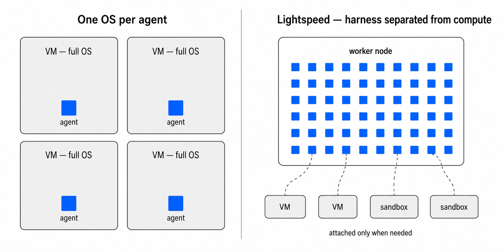
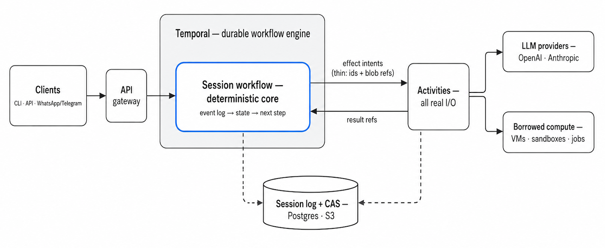

<p align="center">
  
</p>

# Lightspeed

Lightspeed is a powerful agent harness built for durable workflow engines. It allows you to run complex agents and sub-agents that survive restarts, run for months, and scale to thousands, without needing a dedicated VM for each one.

[Temporal](https://temporal.io/) is fully supported today; others are coming soon: [Restate](https://www.restate.dev/), [Inngest](https://www.inngest.com/), Hatchet, AWS Step Functions, etc. The core is written in Rust. The production data backend is Postgres and optional S3.

## Why?

**The goal of Lightspeed is to build as powerful an agent as Claude Code, Codex, or OpenClaw, but running _outside_ operating systems, thus separating the harness from compute. Plus, making this tenable for workflow engines**.

Concretely, that means the harness—the agent loop, context management, session state—runs as a lightweight durable workflow, while OS-level work (shells, code execution, full file systems) happens on machines the agent attaches to only when a task needs them. The result: thousands of agents managed by a single worker node.

<p align="center">
  
</p>

Frontier agent harnesses like Claude Code, Codex, OpenCode, or OpenClaw are designed to run inside a guest OS and need an entire OS for themselves, which makes them difficult to scale and secure. Hence the emerging pattern to ["separate the harness from compute"](https://openai.com/index/the-next-evolution-of-the-agents-sdk/#:~:text=long%2Drunning%20task.-,Separating%20harness%20from%20compute%20for%20security%2C%20durability%2C%20and%20scale,-Agent%20systems%20should), and to run agents inside workflow engines for durability. This is especially interesting in enterprise or shared deployments, where you cannot easily co-locate agents on the same VM.

But most agent SDKs are not designed for workflow engines: they do not separate the deterministic core from effects such as LLM or tool calls, and they pass too much data between the core workflow logic and the effectful "tasks" or "activities"—e.g. the entire chat history back and forth—which bloats workflow histories.

One caveat we take seriously: frontier models are optimized to the hilt (via RL) assuming they control a full POSIX-compatible OS, so an agent with just MCPs and provider-native tools will underperform one with a real machine. Bridging that gap is a central goal of Lightspeed: agents can borrow compute (dedicated VMs via a bridge daemon, ad-hoc sandboxes, delegated coding-agent jobs) while the harness stays outside the OS.

**What you can build with Lightspeed**:

- An insanely **scalable OpenClaw-style personal assistant**: thousands of users, very low cost (besides tokens)
- A fully **autonomous software factory**: a fleet of agents that build, test, and critique your next feature — and keep running for weeks
- **Research agents** that spin up compute for long-running experiments, stay live for days, and supervise progress
- ...and much more!

## Quick start

You need Rust with edition 2024 support, Node.js 24 or newer, and Docker with
Compose. Then configure at least one model provider and start the complete
local product:

```bash
cp .env.example .env
# Set OPENAI_API_KEY or ANTHROPIC_API_KEY in .env
./dev.sh
```

When the readiness checks pass, open
[http://localhost:5173/app/](http://localhost:5173/app/) and sign in with the
development account printed by the launcher. The defaults are
`admin@lightspeed.dev` and `lightspeed-dev-password`.

That is the supported happy path. The launcher installs npm dependencies when
needed, starts the local infrastructure and editable application processes,
applies migrations, and waits until the product is ready.

For focused profiles, lifecycle commands, provider-free startup, connector
configuration, manual runtime roles, local service addresses, resets, and live
test setup, see the [development environment guide](scripts/dev/README.md).
Environment variables are documented separately in
[docs/variables.md](docs/variables.md).

## Features

What constitutes an "agent harness" is a rapidly expanding set of table-stakes features. Lightspeed is not 1.0 yet, but it is far enough along to try: everything checked below works today (see [Quick start](#quick-start)), and the unchecked items are actively in flight:

**Models & providers**

- [x] **OpenAI and Anthropic, provider-native**: reasoning traces, native compaction, advanced tool configs, provider tools, files and images, OAuth login, multiple API keys
- [ ] **Other providers** via the "Completions API" standard

**Agent capabilities**

- [x] **Virtual file system**: dedicated `vfs_*` tools read and edit linked
  snapshots/workspaces without an OS attached
- [x] **Web access**: fetch, search, and extract tools
- [x] **Skills**, automatically cataloged and loaded from linked VFS roots
- [x] **Hosted MCP**, with universe-configured API-key and OAuth identities
  shared by every session selecting that MCP server id
- [x] **Flexible prompt & instruction configuration**
- [x] **Sub-agents (aka "fleets")**: agents that start and manage other agents
- [x] **Agent profiles**: reusable session setups, shared across clients and fleets

**Durability & scale**

- [x] **Long-running agents**: sessions that last weeks to months and survive restarts
- [x] **Session fork & clone**: cheap forks of a running agent's full state, straight from the event-sourced log
- [x] **Managed sessions and workflow-backed tools**: trusted workflow
  controllers can create sessions with immutable tool bindings, durable
  emissions, keyed completions, deadlines, and cancellation
- [x] **Eval harness** for regression-testing agent and tool workflows
- [ ] **Timers, schedules, wake-ups**

**Borrowed compute**

- [x] **Dedicated VMs**, connected as universe environment instances that
  sessions use through event-sourced active environment state; model discovery
  and selection is a separate, default-off `selectionTools` grant. Ordinary
  file and process tools always operate on the selected environment and never
  on linked VFS content. The in-repo stateless Incus provider supplies
  durable full-VM provisioning, explicit takeover of existing VMs, and
  on-demand envd routes; real
  Incus deployment still requires node certificates, an immutable image, and
  provider policy configuration
- [x] **Provider-owned jobs** for long-running work: downloads, experiments,
  and delegated coding-agent runs with optional session/run supervision. Jobs
  are an advanced, default-off environment grant and appear as model tools
  when the environment feature grants them; live availability is checked when
  invoked
- [ ] **Ad-hoc sandboxes**

**Security & auth**

- [x] **Encrypted secrets**: AEAD-encrypted secret store, plus an OAuth token broker with automatic refresh
- [x] **Credential injection**: secrets reach environments and jobs without ever being exposed to the model

**Interfaces**

- [x] **Typed JSON-RPC API**: committed schema contract, generated TypeScript client
- [x] **Configurator MCP**: a configurable universe API surface as generated tools over
  Streamable HTTP
- [x] **CLI** to connect to running agent sessions

The generated [JSON-RPC API reference](crates/api/contract/api-reference.md) is
derived from the same Rust manifest and schemas that drive OpenRPC, the
TypeScript client, and Configurator MCP tool descriptions.

## Design

At the heart of every agent is a carefully engineered state machine that manages what goes into the context window of the LLM.

In Lightspeed, that state machine is an event-sourced, deterministic core: it replays a session's event log into state, decides the next step, and emits effect _intents_ that runtime adapters execute against real LLM providers and tools. The core itself performs no I/O, which is exactly the shape that plays well with durable workflow engines.

Two more decisions make this practical inside a workflow engine:

1) **Minimal provider abstraction.** We extract only the information needed to decide and branch inside the deterministic core; provider-native data stays opaque and blob-backed, instead of being converted into a fake universal LLM message model.
2) **Offloading to CAS.** All data not directly needed by the workflow logic goes to content-addressed storage, so the payloads passed between workflow and activities are extremely thin and the workflow history stays small.

Lightspeed's plugin infrastructure lets external workflows add durable tools
to an agent. A plugin can create and manage a session, provide tools backed by
its own workflows, and rely on Lightspeed to deliver calls, wait for results,
handle timeouts, and cancel work. Plugins stay independent from the core
session worker.

The full design walk-through is in [docs/design.md](docs/design.md).

<p align="center">
  
</p>

## Development checks

```bash
cargo test
npm run check
```

## Documentation

- [Design](docs/design.md)
- [Development environment](scripts/dev/README.md)
- [Environment variables](docs/variables.md)
- [Universes, tenant isolation, and gateway authentication](docs/multi-tenancy.md)
- [JSON-RPC API reference](crates/api/contract/api-reference.md)
- [Build and release](docs/releasing.md)
- [Roadmap and design decisions](docs/roadmap/)

## Contributing

See [CONTRIBUTING.md](CONTRIBUTING.md)

## License

[Apache 2.0](LICENSE)
