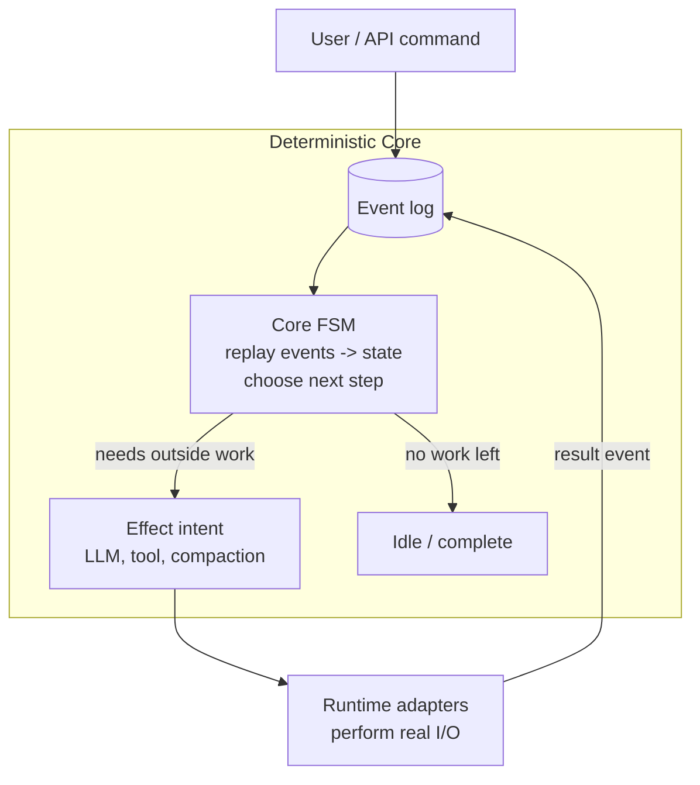
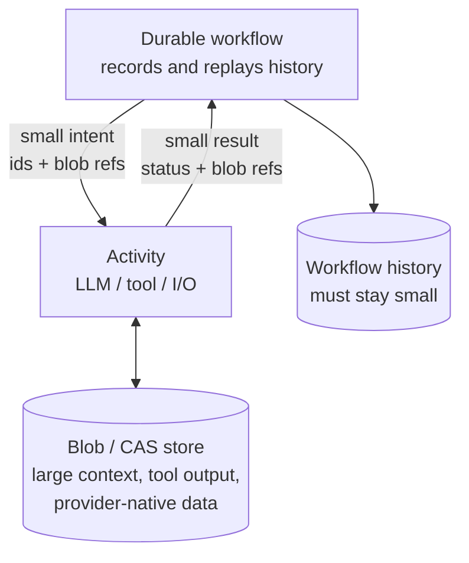
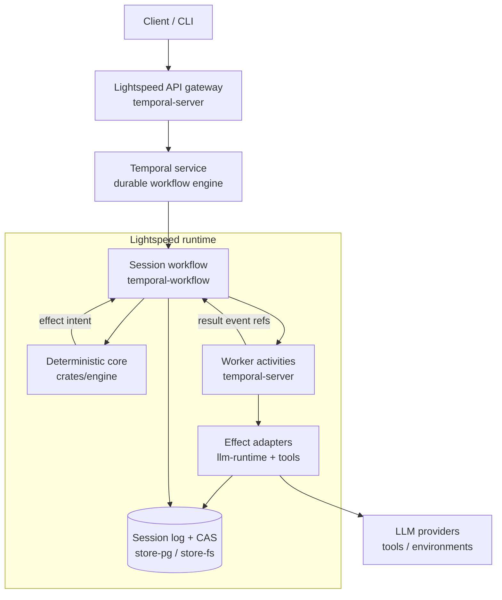

# Lightspeed Design

<!-- TODO(lukas): WRITE — 2-3 sentences of standalone framing, since this no longer
has the README above it. Who is this doc for, what does it cover, and a link back
to the README for the "what/why". E.g.: "This is the design walk-through behind
Lightspeed (see the README for what it is and why). It covers the deterministic
core, context management, the CAS offloading seam, and how it all runs inside
Temporal." -->

At the heart of every agent is a carefully engineered state machine that manages what goes into the context window of the LLM. We start with that core and then layer various systems on top until we have a complete, working agent.

## Deterministic Core
The [core engine](../crates/engine/src/core/components/) is implemented as an event-sourced deterministic finite state machine.

> [!NOTE]
> The event log we are talking of here is separate from the Temporal event history (or other workflow). We are talking specifically of the events that constitute an agent's session state. These events are stored in Lightspeed's own Postgres event store.

When a command arrives, it is converted to an event, which is then recorded in the event log. The event is then applied to the core state. Then a "next step decider" figures out what to do next. If effects need to be issued, the decider outputs a list of effect _intents_, which then get later executed against the LLM providers or tool call surfaces. The results of these effects get sent back to the event log to be recorded and then sent to the FSM, resulting in an event loop.

This stack is entirely workflow engine agnostic, and it can be thoroughly tested in isolation by simulating the effect adapters.

<!-- TODO(lukas): EXPAND — the event loop is described, but three things readers
will ask about the core are missing:
  1. What does the "next step decider" actually consider? A concrete example
     (e.g. "LLM response contained two tool calls -> decider emits two tool
     intents; results recorded -> decider plans the next LLM turn") would make
     the loop tangible.
  2. Determinism over time: sessions run for weeks to months, so the code
     replaying old events WILL be newer than the code that wrote them. How do
     you handle event schema evolution / versioned decision logic so replay
     stays deterministic across deploys?
  3. Command admission: what gets validated before a command becomes an event
     (you mention admission boundaries for provider params in AGENTS.md — one
     paragraph on that boundary belongs here). -->

## Context Management & Provider APIs
The purpose of the deterministic core is to decide what goes into the context window of the next LLM turn, plus the provider API configurations. Anything that does not pertain to this problem, needs to live elsewhere. In Lightspeed, we call the history and state of an individual context window a _session_.

So, what are the things that need to feed into the LLM session?
1) Top-level instructions (prompts/system messages)
2) Configured tool definitions (including MCP)
3) Transcript/message items, which can the split further:
	- Inputs: user messages, business events
	- LLM output items: responses, reasoning traces, tool calls, compaction traces
	- Tool results
	- Actively managed transcript items: skill catalogs, memory subsystem, etc
4) (not in the context window) LLM configurations such as model, reasoning efforts

The main challenge is how to balance what goes into the context window each turn, what to retain when compacting the context window (because it is full), and how to do all this with as much LLM caching consistency as possible.

Lightspeed adds the _absolute minimal_ abstraction over the LLM provider data structures and APIs. Many agent SDKs (e.g. LangChain) convert the provider specific data into a unified structure and then convert it back when they pass it back to the LLM. We, on the other hand, extract only the information that is needed to decide and branch inside the deterministic core. The provider-native data is stored inside blobs inside content addressed storage.

<!-- TODO(lukas): EXPAND — this section poses "the main challenge" (what to include
each turn, what to retain when compacting, cache consistency) and then never says
how Lightspeed answers it. That's the biggest gap in the doc. Add a few paragraphs:
  - Compaction: how does it work here? (Provider-native compaction is a checked
    README feature — how does the core represent a compaction event, what
    survives it, how does the transcript get rebuilt afterward?)
  - Cache consistency: what does the core actually do to keep prompt prefixes
    stable across turns (ordering rules, when actively-managed items like skill
    catalogs are allowed to change, etc.)?
  - A worked example of "reducer facts vs. opaque blob" for one real provider
    item (e.g. an Anthropic tool-use block) would make the minimal-abstraction
    claim concrete instead of asserted. -->

## Offloading to CAS
Workflow engines differentiate between the deterministic code that expresses the business logic and the code that executes effects such as database calls or API calls, usually called "activities" or "tasks". This introduces an important seam that need to be carefully managed. Specifically, the data that travels back and forth between workflow and activities needs to be kept to a minimum, because all those transitions are logged and stored (which is part of the magic that makes the workflows "durable").

Lightspeed solves this by offloading all data that is not directly needed by the workflow logic to a content addressed storage (CAS) system. The structures that are passed between workflow and activities are extremely thin, keeping workflow state and log size small and efficient. So, instead of passing, say, the entire user input message to the LLM activity, we first store it in the CAS and then only pass a reference to the blob—and vice versa with model outputs.

## Hosting inside a Workflow Runtime (e.g. Temporal)
With the above pieces in place, running an agent inside a workflow runtime becomes feasible and pleasant. We just have to put it all together.

The Temporal workflow owns an instance of the deterministic core—aka a "session". It drives the core state machine until it is idle. When not idle, it sends the effect intents via activities to real APIs and services, such as LLM providers. It also logs all events that constitute a session state in a Postgres store (or optionally a file system store, for testing). Small CAS blobs get stored in Postgres, large blobs go to S3 (also supporting different blob providers).

<!-- TODO(lukas): EXPAND — the questions every experienced Temporal reader will ask
of this section, in rough priority order:
  1. History growth: you promise runs of weeks to months, and Temporal workflows
     have hard history limits. Do you continue-as-new? What state carries over,
     and how does the Lightspeed event log make that cheap? This is probably the
     single most-anticipated paragraph in the doc for the newsletter audience.
  2. Replay vs. session log: when Temporal replays the workflow, what is
     recomputed vs. reloaded? Spell out the relationship between the two logs
     the NOTE at the top only hints at.
  3. Failure semantics: what happens when an LLM/tool activity fails or times
     out — retry policies, idempotency of recording result events, exactly-once
     vs. at-least-once at the event-log boundary.
  4. Signals/queries: how do user messages reach a running workflow
     (signal-with-start?), and what do queries serve? -->

Around the main stack, there is also a gateway API and CLI tooling to make interacting with the whole Lightspeed system easier. Agent profiles live on that public API boundary: a profile is a reusable setup document for session config, instructions, mounts, MCP links, and environments. The hosted runtime resolves and applies profiles outside the deterministic core.

<!-- TODO(lukas): WRITE — missing sections that would round the doc out. Suggested,
in order of value:

  ## Tools, VFS & Environments
  The README headlines a virtual file system, skills, hosted MCP, and bridged
  VMs/sandboxes, but the design doc never explains the tool-execution side.
  One section covering: how a tool intent becomes a tool-package call, how the
  CAS-backed VFS gives the agent file tools without an OS, and how environments
  /the bridge daemon fit the "borrow a computer" goal from the README.

  ## Sub-agents & Sessions Spawning Sessions
  Fleets are a checked feature: is a sub-agent just another session workflow,
  and how do parent/child communicate (events? signals?)? Two paragraphs.

  ## Client API Boundary
  How clients observe a run: run/start as an acceptance boundary (not a
  final-output boundary), session/events/read for progress, why clients consume
  `api` views instead of reducer internals. You have strong opinions here (see
  AGENTS.md architecture rules) that deserve public prose.

  ## Supporting Other Workflow Engines
  The README claims Restate/Inngest/etc. are coming. One section on what the
  substrate-neutral "drive machine" looks like and what a new engine adapter
  actually has to implement would make that claim credible instead of
  aspirational.

  Optionally, close the doc with a short crate map paragraph linking each design
  concept above to its crate (engine, temporal-workflow, temporal-server,
  llm-runtime, store-pg/fs, tools), so readers can jump from prose to code. -->
