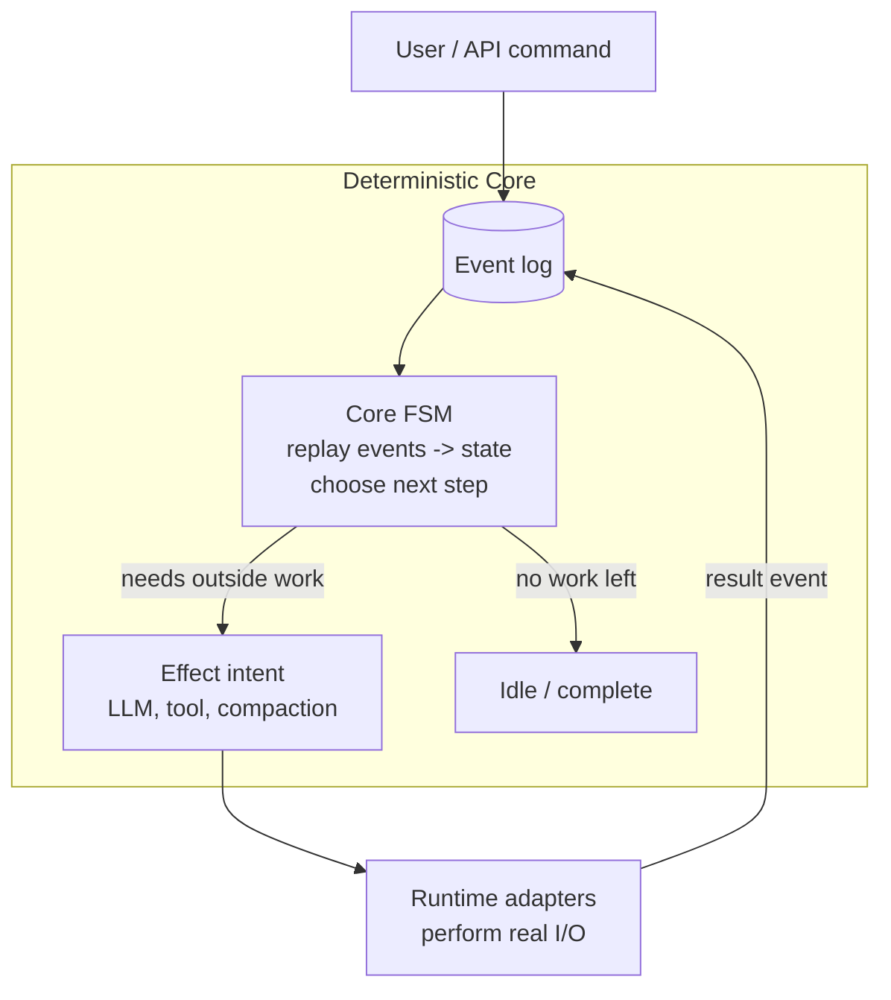
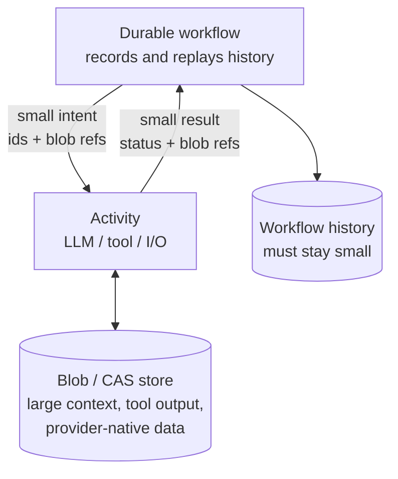
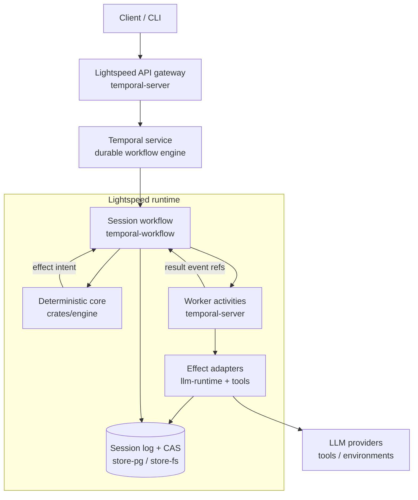

# Lightspeed Design

This is the design walk-through behind Lightspeed — see the [README](../README.md) for what it is and why it exists. It covers the deterministic core, context management, the CAS offloading seam, and how the pieces run inside a durable workflow engine such as Temporal.

At the heart of every agent is a carefully engineered state machine that manages what goes into the context window of the LLM. We start with that core and then layer various systems on top until we have a complete, working agent.

## Deterministic Core
The [core engine](../crates/engine/src/core/components/) is implemented as an event-sourced deterministic finite state machine.

> [!NOTE]
> The event log we are talking of here is separate from the Temporal event history (or other workflow). We are talking specifically of the events that constitute an agent's session state. These events are stored in Lightspeed's own Postgres event store.

When a command arrives, it is validated at the admission boundary, converted to an event, and recorded in the event log. The event is then applied to the core state. Then a "next step decider" figures out what to do next. If effects need to be issued, the decider outputs a list of effect _intents_, which then get executed against the LLM providers or tool call surfaces. The results of these effects get sent back to the event log to be recorded and then applied to the FSM, resulting in an event loop.

A concrete round: a user message is admitted and recorded; the decider plans an LLM turn intent; the LLM response comes back containing two tool calls and is recorded; the decider emits two tool intents; their results are recorded; the decider plans the next LLM turn — and so on, until there is no work left and the session goes idle.

This stack is entirely workflow engine agnostic, and it can be thoroughly tested in isolation by simulating the effect adapters.

## Context Management & Provider APIs
The purpose of the deterministic core is to decide what goes into the context window of the next LLM turn, plus the provider API configurations. Anything that does not pertain to this problem needs to live elsewhere. In Lightspeed, we call the history and state of an individual context window a _session_.

So, what are the things that need to feed into the LLM session?
1) Top-level instructions (prompts/system messages)
2) Configured tool definitions (including MCP)
3) Transcript/message items, which can be split further:
	- Inputs: user messages, business events
	- LLM output items: responses, reasoning traces, tool calls, compaction traces
	- Tool results
	- Actively managed transcript items: skill catalogs, memory subsystem, etc
4) (not in the context window) LLM configurations such as model, reasoning efforts

The main challenge is how to balance what goes into the context window each turn, what to retain when compacting the context window (because it is full), and how to do all this with as much LLM caching consistency as possible.

Lightspeed adds the _absolute minimal_ abstraction over the LLM provider data structures and APIs. Many agent SDKs (e.g. LangChain) convert the provider specific data into a unified structure and then convert it back when they pass it back to the LLM. We, on the other hand, extract only the information that is needed to decide and branch inside the deterministic core. The provider-native data is stored as blobs in content addressed storage.

Compaction follows the same philosophy: it is provider-native, not a homegrown summarizer. The core treats compaction as a first-class part of the session: it decides when the context window needs compacting, records a compaction-requested event, and marks the affected context pending until the compaction result event lands. The actual compaction runs through the provider's own mechanism (e.g. OpenAI Responses or Anthropic Messages compaction), so the compacted trace stays in the provider's native format.

## Offloading to CAS
Workflow engines differentiate between the deterministic code that expresses the business logic and the code that executes effects such as database calls or API calls, usually called "activities" or "tasks". This introduces an important seam that needs to be carefully managed. Specifically, the data that travels back and forth between workflow and activities needs to be kept to a minimum, because all those transitions are logged and stored (which is part of the magic that makes the workflows "durable").

Lightspeed solves this by offloading all data that is not directly needed by the workflow logic to a content addressed storage (CAS) system. The structures that are passed between workflow and activities are extremely thin, keeping workflow state and log size small and efficient. So, instead of passing, say, the entire user input message to the LLM activity, we first store it in the CAS and then only pass a reference to the blob, and vice versa with model outputs.

## Hosting inside a Workflow Runtime (e.g. Temporal)
With the above pieces in place, running an agent inside a workflow runtime becomes feasible and pleasant. We just have to put it all together.

The Temporal workflow owns an instance of the deterministic core — aka a "session". It drives the core state machine until it is idle. When not idle, it sends the effect intents via activities to real APIs and services, such as LLM providers. It also logs all events that constitute a session state in a Postgres store (or optionally a file system store, for testing). Small CAS blobs get stored in Postgres, large blobs go to S3 (also supporting different blob providers).

Commands reach a running session as Temporal signals: the gateway submits admissions (a validated command plus optional context key), the workflow queues them, and the drive loop admits them into the session log. A `status` query serves session state to the gateway without touching the log.

Because sessions can run for weeks to months and Temporal caps workflow history, the workflow continues-as-new whenever it is idle and Temporal suggests it (or a configured history threshold is crossed). This is where the event-sourced design pays off twice: the workflow start arguments are tiny—a session id, the session config, a blob ref for instructions—because the entire session state rehydrates from Lightspeed's own event log. Workflow history stays bounded no matter how long the agent lives, and a worker crash or deploy simply replays into the same state.

## The Client API Boundary
Clients — the CLI, messaging bridges, editors, future frontends — consume the typed `api` crate surface through the JSON-RPC gateway, never the reducer internals. `session/runs/start` is an acceptance boundary, not a final-output boundary: it returns once the run is admitted, and clients follow `session/events/read` or refresh `session/read` for progress and completion. This keeps the public contract stable while the core evolves underneath it.

Collection reads do not fan out to Temporal workflows. `session/list` reads a
materialized `new` / `open` / `closed` lifecycle projection maintained in the
session-store transaction that appends lifecycle events; the event log remains
authoritative. `session/delete` only removes closed sessions and rejects a
session while a fork still inherits its history, so fork trees are deleted
leaf-first.

Agent profiles live on this boundary too: a profile is a reusable setup document for session config, instructions, mounts, and environments. Session config itself is a sparse, capability-oriented document: core sections (model, generation, limits, context) plus feature grants (vfs, web, messaging, fleet, timers, environments, mcp) where an absent feature is simply not granted — the default session is a model that can process runs and nothing else. Config is replaced whole via `session/config/put` guarded by an expected revision (no field-level patch vocabulary), and the session's toolset — including remote MCP tools declared under `features.mcp` — is derived from that document rather than managed imperatively. The hosted runtime resolves and applies profiles outside the deterministic core.

## Tools, Environments & Sub-agents
Tool intents are executed by tool packages outside the core. The important ones for the harness-without-an-OS story: a CAS-backed virtual file system gives the agent standard file tools (read, glob, patch) with no operating system attached; web fetch/search/extract tools work the same way. When a task genuinely needs a machine, the agent borrows one; dedicated VMs connect through a bridge daemon, and durable jobs run long tasks (downloads, delegated coding agents) on that borrowed compute while the harness stays outside.

Sub-agents are not a separate concept: a fleet is just more sessions. The fleet control plane clones or forks a session and starts an additional session workflow for it. Callbacks flow back as ordinary Temporal signals.

## Crate Map
Where the pieces above live:

- `crates/engine` — the deterministic core: session log, state, decider, codecs
- `crates/temporal-workflow` / `crates/temporal-server` — the session workflow, worker activities, and the JSON-RPC gateway
- `crates/llm-runtime` / `crates/llm-clients` — effect adapters from planned LLM requests down to provider-native API calls
- `crates/tools` — tool packages: VFS, web, environments, messaging, prompts, skills, fleet
- `crates/store-pg` / `crates/store-fs` — session log and CAS storage backends
- `crates/api` / `crates/api-projection` — the client-facing types and projection helpers

The full crate index lives in [`AGENTS.md`](../AGENTS.md) at the repo root.
