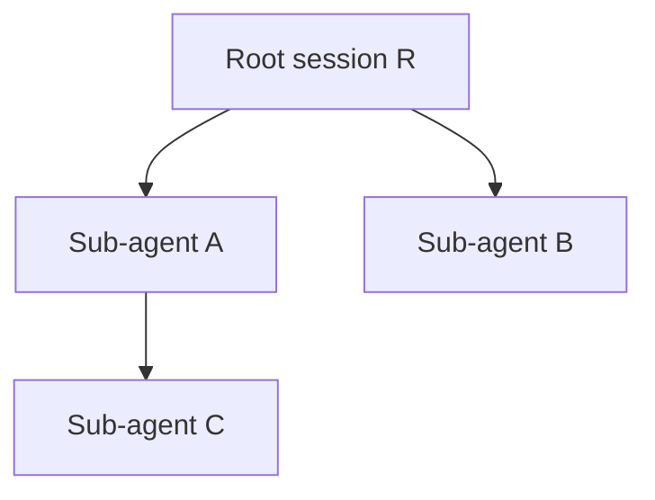

# Agent and tool access

An agent performs work with the tools and resources configured for its session.
The person starting the run must have permission to request that work, but the
run does not execute as that person's Platform account. Execution belongs to
the universe. Removing a membership blocks subsequent Platform requests; it
does not terminate that person's existing runs.

There are three boundaries to keep in view: the session's tool configuration,
the runtime's authority to manage related sessions, and the credentials used
by external services. Each constrains a different part of the operation.

## Give a session tools and resources

A profile is a reusable session configuration. Its features determine the
tools Lightspeed exposes, and its attachments identify the resources those
tools may use. An absent feature grants no tools or access. Instructions can
describe a task, but cannot add a capability to the configuration.

Suppose Acorn's release editor needs to read source notes and write a draft.
Attach its workspace with edit access. A reviewer can attach the same workspace
with read access. The tool implementation checks the attachment's access; the
reviewer's prompt is not what prevents an edit. Environment access similarly
distinguishes reading, editing, process execution, and jobs. Attachments must
refer to resources that exist in the same universe.

MCP adds two selections: the registered server's tool allowance, and the
profile's selection within that allowance. The session cannot widen the
server's allowance. Registration alone does not expose its tools to every
agent. See [Tools and MCP](../using-lightspeed/tools-and-mcp.md) for setup and
[Profiles and instructions](../using-lightspeed/profiles-and-instructions.md)
for applying configuration changes.

Delegating a task selects an allowed child profile. The child receives that
profile's full capabilities and the supplied brief, not the parent's tools or
conversation. A parent that cannot write to a database can still delegate to
a child whose profile can, so review the allowed child profiles as part of
the parent's access. Depth, descendant, concurrency, and deadline limits bound
delegation separately from tool access. The [sub-agent guide](../using-lightspeed/subagents-and-federation.md)
explains those settings and environment inheritance.

## Bound the runtime's session control

Bots and sub-agents need internal operations such as starting runs, reading
results, steering work, and closing sessions. The runtime gives those calls a
*controller context*: the bot or delegated session carrying out the operation,
its universe, and the root governing its session tree.

The shared API service checks that context against the target's stored bot,
parent, root, and visibility. A bot controller controls its own sessions,
including its delegated descendants, and manages its own bot. It cannot
control another bot's sessions or reconfigure that bot. A delegated session
controls itself and its direct children, not its parent or siblings.

Consider this delegation tree:

For a controller acting as A, the policy is:

| Target | Read | Control |
| --- | --- | --- |
| A itself or its direct child C | Yes | Yes |
| Parent R or sibling B | Yes: same root | No |
| Another root's private session | No | No |
| Another root's shared session | Yes | No |

Control here includes starting or steering runs, changing session
configuration, stopping work, and deleting sessions where the operation's
lifecycle rules allow it. Cascade deletion checks every affected session.
Reading permission does not automatically supply a model-facing tool or load
another session into the model's context.

These relationships come from runtime records. Bot authority is bound to the
actual Temporal workflow identity. The delegation service verifies that a
claimed parent matches the admitted tool invocation, and delegated authority
requires a recorded parent. Supplying an arbitrary session ID cannot establish
that relationship. Internal session lists are also narrowed to shared work
and the controller's own root.

Controllers may read and use universe resources such as profiles, workspaces,
and environments; this authority does not let them reconfigure those resources.
The checks protect internal runtime calls. They are not a policy automatically
attached to every network request a tool makes.

## Follow credentials across a tool call

An external MCP server authorizes a call using the credentials configured for
that connection. The requesting Platform user's role does not follow the call.
For example, an agent using Configurator MCP makes core API requests with the
Configurator connection's key. Those requests obey the key's groups, not the
controller rules above.

The Platform's built-in Configurator setup asks an Admin which key the
Configurator acts with on every install, repair or upgrade: the current key, a
new key (starting from the configuration groups, without session access), or
an existing universe key whose secret the Admin pastes. The setup revokes only
keys it minted. Configurator lists only the tools its key may call. A key with
the `session` group can read private sessions. See [API keys and service access](api-keys-and-service-access.md#connect-services)
before attaching a management connection to a profile.

Resource sharing also shares practical access. Two sessions attached to the
same live workspace see the same files. Two sessions using the same environment
share its real filesystem and the credentials injected into their processes.
A private conversation does not make either resource private. The
[environment credential guide](../environments/credentials.md) explains
injection, renewal, and copies retained by running processes.

## Approve and stop work explicitly

An MCP server can require approval before proposed calls proceed. That policy
gates calls on that server; it does not add an approval step to all other tools.
Members need permission to control the session before approving its calls
through the Platform. Follow [tool approval](../using-lightspeed/tools-and-mcp.md#require-approval-for-tool-calls)
for supported execution modes and verification.

Changing a person's membership is not a running-agent revocation mechanism.
To stop work, cancel the run or close the session through the appropriate
control, and manage external processes or jobs according to their own
lifetimes. Cancellation cannot undo completed tool effects. Removing a
credential binding cannot recall a value already delivered to a process.
