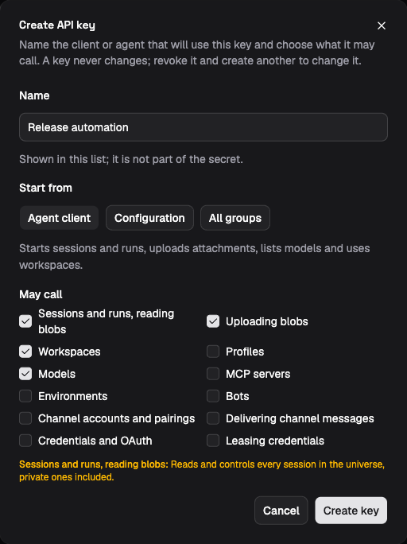

# API keys and service access

An API key gives a program access to the core gateway. Its authority has three
parts: the scope it reaches, the method groups it may call, and whether it may
name an actor. Core checks those facts on each request. It does not look up a
Platform user or apply that user's role.

This distinction matters when giving someone a key. A key with the `session`
group can read and control private sessions in its universe. It is an
integration credential, not a personal token constrained by the holder's
[Platform membership](people-and-roles.md).

## Gateway modes

Set `LIGHTSPEED_AUTH_MODE` explicitly; the gateway refuses to start without it.

| Mode | Behavior |
| --- | --- |
| `authenticated` | Each request requires `Authorization: Bearer lsk_…`. The gateway resolves an active key and checks scope, method group, and any actor assertion. |
| `single` | Unauthenticated local development access to the universe selected by `LIGHTSPEED_PG_UNIVERSE_ID`, plus deployment administration. Keep this listener private. |

Single mode rejects authorization, universe, actor, and the retired principal
headers. It cannot be combined with authenticated clients. The Platform uses
authenticated mode, including in the full development stack. The former
`trusted-header` and `api-key` modes are no longer supported.

In authenticated mode, scope determines how the request selects its target:

| Key and operation | `x-lightspeed-universe` |
| --- | --- |
| Universe key, universe operation | Omit it. Even the key's own universe UUID is rejected as a header. |
| Deployment key, universe operation | Required; selects the target universe UUID. |
| Deployment key, deployment operation | Omit it; the operation addresses the deployment. |

A universe key cannot call deployment operations. A deployment key can reach
any universe, but only through its assigned method groups. Groups cover API
families such as `session`, `profiles`, `mcp`, and `environments`; they are not
Viewer, Contributor, Operator, or Admin roles. For example, `session` includes
session mutations as well as reads and blob reads. `blobs/put` is separate so
a connector can upload attachments without reading sessions. Exact groups are
listed in the [API reference](../../../crates/api/contract/api-reference.md).

An actor assertion uses `x-lightspeed-actor`. Only keys created with
`assertActor` may send it. Core records the opaque actor ID for attribution;
asserting a user does not reduce the key to that person's permissions. The
Platform checks membership, role, and session visibility before asserting its
user's ID. Any other service allowed to assert actors must make its own
authorization decisions.

## Bootstrap the Platform

For local development, use [the root launcher](../development/local-development.md).
It provisions the authenticated stack. For a manually operated deployment,
first configure the stores and apply migrations as described in
[Self-hosting](../deployment/self-hosting.md), then mint the Platform's key
from the server host:

```bash
lightspeed-server api-key create \
  --deployment --assert-actor --name "Platform"
```

From a source checkout, replace `lightspeed-server` with
`cargo run -p temporal-server --` in these commands.

Omitting `--group` grants every group allowed by the scope. This is intentional
for the Platform, which manages universes and keys as well as member requests.
The command prints the secret once. Store it as
`LIGHTSPEED_PLATFORM_API_KEY` in the Platform's protected configuration and set
`LIGHTSPEED_API_URL` to the gateway's `/rpc` endpoint. Set the gateway to
`LIGHTSPEED_AUTH_MODE=authenticated`.

Before the Platform's first startup, also set
`LIGHTSPEED_PLATFORM_ADMIN_EMAIL` and `LIGHTSPEED_PLATFORM_ADMIN_PASSWORD` in
its protected configuration. When its users table is empty, Platform creates
that local administrator account. These settings do not reset an existing
account or grant a runtime key to the browser. Sign in with the new account,
then create a universe and add members as described in
[People and roles](people-and-roles.md).

If provisioning a universe directly through the server host, use
`lightspeed-server universe create --slug acorn` and retain its
printed UUID. Platform-created universes are provisioned through its deployment
key. See [People and roles](people-and-roles.md) for account administration.

## Create and revoke keys

Universe Admins can open their universe's **API keys** page, choose **Create
key**, supply a name, and choose the method groups the key may call. The form
starts from the **Agent client** preset (sessions, blob uploads, models and
workspaces) and also offers **Configuration** and **All groups**; any box can
be ticked or cleared. Credential leasing and channel delivery are never
included unless chosen, and the form warns when they are, as it does for
sessions, which reach private sessions too. Keys minted here never assert
actors. The list shows what each key may call. Copy the displayed secret into
the client's protected credential configuration before closing the dialog; it
cannot be recovered.



*The demo form shows the Agent client preset before key creation. Review the
selected groups and their warnings before choosing Create key.*

Platform administrators can instead use **Platform admin → API keys** to
select a universe or deployment scope, method groups, and actor assertion.
The host CLI provides the same controls. For example, to restrict a key to
profile operations in an existing universe:

```bash
lightspeed-server api-key create \
  --universe-id "<universe-uuid>" --name "Profile automation" --group profiles
```

Repeat `--group` for additional groups. This key can modify profiles; the group
does not mean read-only access. Verify it with a profile read through the
[API client](../integrating-and-extending/api-and-typescript.md), then confirm
an operation outside that group is refused.

Core stores a SHA-256 hash of the random secret, a display prefix, and key
metadata. The scope, groups, and actor flag cannot be edited. To rotate or
change authority, create a replacement, update and verify its consumer, then
revoke the old key in the UI or by prefix:

```bash
lightspeed-server api-key list
lightspeed-server api-key revoke "<key-prefix>"
```

Revocation rejects subsequent requests. Already admitted requests, including
parked long-poll reads, are not reauthenticated while waiting. Revocation does
not cancel admitted work or recall credentials delivered to another process.

## Connect services

Give each service the groups its API calls require:

| Service | Key and behavior |
| --- | --- |
| Platform | Deployment key with all groups and actor assertion; the Platform gates member requests. |
| Shipped channel connector host | Deployment key with `deployment/channels`, `channels/inbound`, `auth/lease`, and `blobs/put`; account requests select their universe. |
| Configurator MCP client | Supplies its own key per request; Configurator forwards its authority to core. A browser login is not a credential for this path. |
| Platform's Configurator setup | Creates a universe key with `profiles`, `mcp`, `environments`, `bots`, `channels`, `auth`, and `models`, without actor assertion. It excludes `session`, so the key cannot call session methods. |

The Platform stores the Configurator setup key in an outbound credential grant
for the MCP connection. That credential lets an attached agent configure shared
resources; the requesting person's role does not travel through the MCP call. Follow
[Configurator MCP](../integrating-and-extending/configurator-mcp.md) or
[Channel connectors](../integrating-and-extending/channel-connectors.md) for
connection procedures, and [Agent and tool access](agent-and-tool-access.md)
for the execution boundary.
