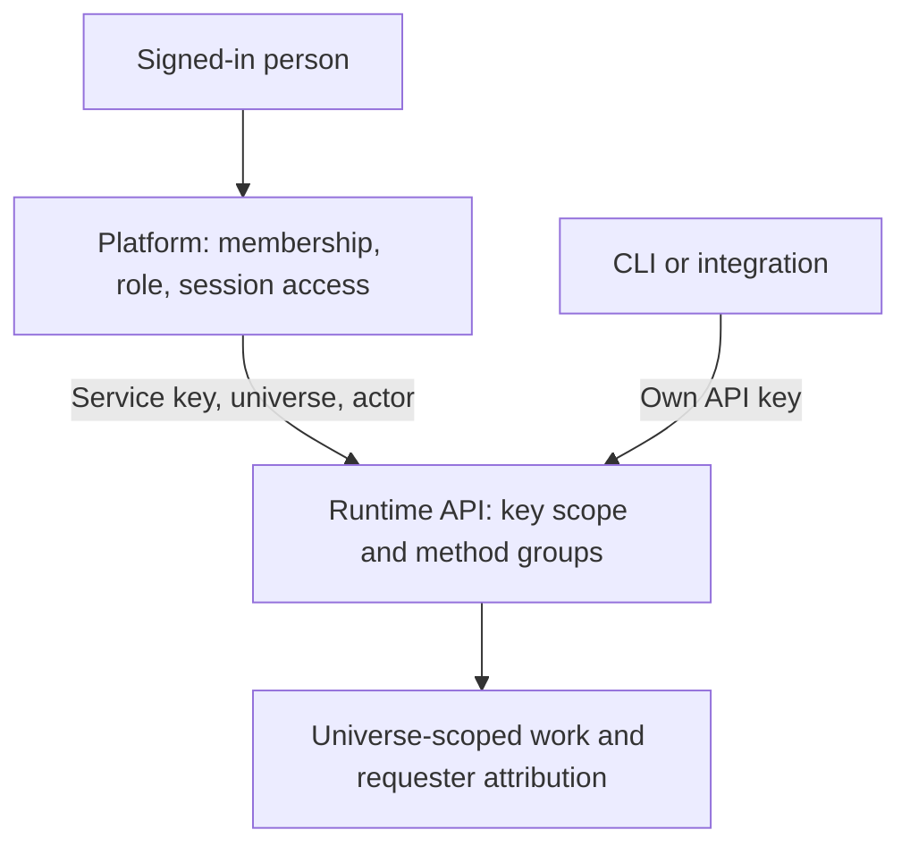

# Access and security

Lightspeed gives a team a universe in which to run agents and keep their work.
The Platform decides which people belong to that universe and what they may
do. The runtime authenticates API keys, keeps each request inside its universe,
and records who asked for the work. Those responsibilities meet at the API
boundary, so the runtime can also serve applications that supply their own
sign-in and access rules.

Suppose Acorn uses Lightspeed to investigate incidents. An investigator can
start a private session, ask an agent to examine a problem, and share the
conversation when it is useful to the team. Acorn's administrators can read
private sessions too. Meanwhile, a bot can keep handling incoming incidents
without depending on the investigator staying signed in.

## The pieces of the access model

Each part answers a different question:

| Part | What it establishes |
| --- | --- |
| Universe | Which team's resources a request addresses. The Platform maps one organization to one runtime universe. |
| Account and membership | Who signed in, and their role in each universe. These records live in the Platform. |
| Role | Which operations a person may request: Viewer, Contributor, Operator, or Admin. |
| API key | Which universe or deployment a client can address and which groups of runtime methods it may call. |
| Actor | Who a trusted client says requested an operation. The Platform supplies the signed-in user's ID. |
| Session visibility | Whether a session is private to its creator and admins, or shared with the universe through the Platform. |

An actor is attribution, not a role or an execution identity. Core stores the
identifier without looking up a person. It can compare that identifier when
filtering session lists, but the Platform decides which filter a person must
use and whether they may act on a particular session.

## Follow a request

When the investigator starts a run, the browser sends the request to the
Platform. The Platform reads their universe membership, checks that their role
allows starting runs, and checks that they can access the session. It then
calls the runtime with its service key, the universe UUID, and the person's
actor ID.

The two entry paths matter when deciding who should receive a runtime key:

The runtime checks the key and its method groups before executing the request.
A direct API client reaches this boundary without passing through the
Platform's role and session checks. A key with the `session` group can therefore
read private sessions in its universe. Use the Platform for people whose
access must follow their membership and role; treat direct runtime keys as
integration credentials. [API keys and service access](api-keys-and-service-access.md)
explains their scope and lifecycle.

## People requesting work and agents carrying it out

Sessions execute using their configured tools and resources within the
universe. A run does not inherit the requesting person's role, and the runtime
does not recheck that person's membership before each model call. Removing an
investigator from Acorn blocks their next Platform request; it does not stop
an investigation they already started or a bot they created.

Internal bot and delegation controllers have a separate, narrow set of rules
for the sessions they manage. External tools use their configured credentials.
For example, Configurator MCP acts with its runtime API key, even when an agent
calls it. [Agent and tool access](agent-and-tool-access.md) follows both paths
and explains what each check protects.

## What is recorded today

Session and bot records identify their creator. Session events identify who
requested a run, steering, or cancellation, and who decided a tool approval.
An attribution can name an asserted actor, an API key, a local caller, or the
runtime controller responsible for internal work.

These records explain an individual session's history. Lightspeed does not yet
have a separate durable Platform audit trail for membership changes, access
refusals, and administrative operations. Session attribution is subject to
session retention and deletion; it is not an audit archive that survives
deleting the session. Enterprise SSO, directory synchronization, SCIM, and
member invitations are also not implemented in the current product.

## Choose the next detail

- [People and roles](people-and-roles.md): sign in, add members, assign roles,
  and understand the effect of removing access.
- [Private and shared work](private-and-shared-work.md): investigate privately,
  share a session, and understand access to bots and delegated work.
- [API keys and service access](api-keys-and-service-access.md): configure
  gateway authentication and connect clients and services.
- [Agent and tool access](agent-and-tool-access.md): understand tools,
  controller authority, credentials, approvals, and stopping work.
- [Tenant isolation and data protection](tenant-isolation-and-data-protection.md):
  evaluate the storage, infrastructure, and compute boundaries of a universe.
