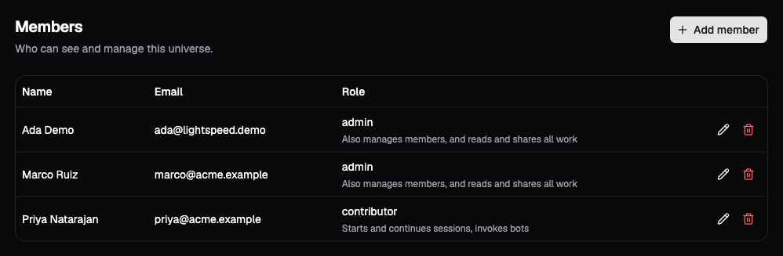

# People and roles

A Platform account identifies a person. A membership gives that account a role
in one universe. The same person can be an Admin in Acorn's engineering
universe and a Viewer in its support universe; signing in does not grant access
to every universe on the deployment.

The Platform stores these accounts and memberships and checks them when a
person makes a request. Core receives an API key, the selected universe, and
an actor ID for attribution. It does not maintain a second directory of people
or re-evaluate their roles. See the [access overview](overview.md) for that
boundary.

## Choose a universe role

The four roles are cumulative: each includes the permissions of the preceding
role. Session visibility is a separate check. An Operator can configure a bot
but cannot read another person's private session simply because they manage
the universe's resources.

| Role | What the person can do |
| --- | --- |
| **Viewer** | Read visible sessions, bots, and universe resources. A session they previously created remains visible after a downgrade to Viewer. |
| **Contributor** | Create and continue sessions, steer or stop work, decide tool approvals, invoke bots, and use resources. Create and update workspaces. |
| **Operator** | Create and configure profiles, bots, environments, MCP servers, credentials, and channels; manage bot triggers and replay bot events. |
| **Admin** | Manage universe members, settings, and API keys. Read, control, share, and delete every session, including private sessions. |

Contributors and Operators can control any shared session. Sharing and deleting
a session require its creator, with at least the Contributor role, or an Admin.
The [private and shared work guide](private-and-shared-work.md) develops those
rules with an example.

A **Platform admin** has a separate deployment-wide role. Platform admins
create accounts and universes, manage deployment configuration, and act as
Admin in every universe even without a membership there. Giving someone an
Admin membership in Acorn does not make them a Platform admin.

## Create an account and add a member

The browser sign-in page accepts an email address and password. Public password
signup is disabled; a Platform admin creates the account before a universe
Admin adds it to the team. For the first account on a deployment, follow
[Bootstrap the Platform](api-keys-and-service-access.md#bootstrap-the-platform).

1. As a Platform admin, open **Platform admin → Users → Create user**. Enter the person's
   **Name**, **Email**, and initial **Password**. Leave **Role** as `user` unless
   they need deployment-wide administration; `admin` here means Platform admin.
2. Give the person their initial password through your organization's protected
   credential-sharing channel. They can change it under **Account → Password**;
   changing it signs out their other browser sessions.
3. As an Admin of the target universe, open that universe's **Members** page and
   choose **Add member**. Select the **Account** and its **Role**, then choose
   **Add member**.
4. Confirm the account appears in the member list with the intended role. The
   person can now select that universe after signing in.

*The demo member list shows each person's role in this universe. Use the row
controls to change or remove their membership.*

Creating the account alone gives an ordinary user no universe membership. The
member picker selects existing accounts; it does not send an invitation.

The server can optionally configure GitHub OAuth through Better Auth, but the
current browser sign-in page exposes only email and password. External accounts
are not automatically linked to existing local accounts by matching email.
Organization SSO, SCIM provisioning, and email invitation workflows are not
implemented yet.

## Change or remove access

On **Members**, choose the edit control beside a person, select their new role,
and choose **Save role**. To remove them from the universe, use that row's remove
control and confirm. The server refuses to demote or remove the last Admin
membership: add another Admin first. Platform admins' deployment-wide authority
does not replace this membership requirement.

The Platform looks up membership for each universe request. A role change
applies to the next request, and removal prevents further access through the
Platform. An in-flight read can still complete; removal does not recall
content already delivered. Existing sessions and their creator attribution
remain.

Work already admitted continues because the runtime executes for the universe,
not with the requesting person's role. If work must stop, cancel its active
and queued runs separately. Removing membership also does not revoke an
integration's API key; revoke that credential separately using
[API keys and service access](api-keys-and-service-access.md).
