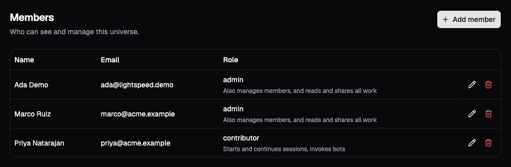

# People and roles

A Platform account identifies a person. A membership gives that account a role
in one universe. The same person can be an Admin in Acorn's engineering
universe and a Viewer in its support universe; signing in does not grant access
to every universe on the deployment.

The Platform stores these accounts and memberships and checks them when a
person makes a request. Core receives an API key, the selected universe, and
an actor ID for attribution. It does not maintain a second directory of people
or re-evaluate their roles. See the [access overview](overview.md) for that
boundary.

## Choose a universe role

The four roles are cumulative: each includes the permissions of the preceding
role. Session visibility is a separate check. An Operator can configure a bot
but cannot read another person's private session simply because they manage
the universe's resources.

| Role | What the person can do |
| --- | --- |
| **Viewer** | Read visible sessions, bots, and universe resources. A session they previously created remains visible after a downgrade to Viewer. |
| **Contributor** | Create sessions with universe defaults or an existing profile; continue sessions, steer or stop work, decide tool approvals, invoke bots, and update workspace contents. |
| **Operator** | Customize session setup and run options; create workspaces and create or configure profiles, bots, environments, MCP servers, credentials, and channels; manage bot triggers and replay bot events. |
| **Admin** | Manage universe members, settings, and API keys. Read, control, and share every session, including private sessions; soft-delete closed sessions and set deletion retention. |

Contributors can name a new session and choose its saved profile, but cannot
author inline setup, override the chosen setup, create managed sessions, or
create or edit profiles. After creation, changing configuration, custom
instructions, metadata, or the active environment requires an Operator or
Admin. Per-message model and reasoning overrides also require an Operator or
Admin. These checks apply to the server, including a Contributor’s own sessions.

Viewers and Contributors can inspect profiles in **Form** or **JSON** view and
open **Session settings** for sessions they can read. The form keeps sections
expandable and values readable, with editing controls protected and save
actions hidden.

Contributors and Operators can start and control runs in any shared session.
Sharing a session requires its creator, with at least the Contributor role,
or an Admin. Contributors can close only their own unshared sessions;
Operators can close their own or shared sessions. Operators can soft-delete
shared closed sessions; Admins can close and soft-delete any session in their
universe, subject to lifecycle requirements.
The [private and shared work guide](private-and-shared-work.md) develops those
rules with an example.

A **Platform admin** has a separate deployment-wide role. Platform admins
create accounts and universes, manage deployment configuration, and act as
Admin in every universe even without a membership there. Giving someone an
Admin membership in Acorn does not make them a Platform admin. Only Platform
admins can permanently delete soft-deleted session history.

## Create an account and add a member

With company sign-in configured, opening Lightspeed starts sign-in automatically
by default when you have no active session. A deployment can instead require a
click to start sign-in. The login page also offers **Sign in with your
company account** for manual sign-in. Your provider handles internal single
sign-on and any external password or MFA
prompt. The company grants ordinary application access or Platform admin
access. A first admitted sign-in creates the account; an ordinary account has
no universe membership until an admin adds it on **Members**. Your company
profile and Platform admin status are refreshed at each company sign-in.

Without company sign-in, use an email address and password. Public signup is
disabled. A Platform admin creates the account as follows; the first account
comes from [Bootstrap the Platform](api-keys-and-service-access.md#bootstrap-the-platform).

1. As a Platform admin, open **Platform admin → Users → Create user**. Enter the person's
   **Name**, **Email**, and initial **Password**. Leave **Role** as `user` unless
   they need deployment-wide administration; `admin` here means Platform admin.
2. Give the person their initial password through your organization's protected
   credential-sharing channel. They can change it under **Account → Password**;
   changing it signs out their other browser sessions.
3. As an Admin of the target universe, open that universe's **Members** page and
   choose **Add member**. Select the **Account** and its **Role**, then choose
   **Add member**.
4. Confirm the account appears in the member list with the intended role. The
   person can now select that universe after signing in.

*The demo member list shows each person's role in this universe. Use the row
controls to change or remove their membership.*

Creating the account alone gives an ordinary user no universe membership. The
member picker selects existing accounts; it does not send an invitation.

Company accounts are identified by the provider's exact issuer and subject,
not by email. The provider must supply a unique email. Matching a local
account's email never links the two accounts. Company sign-in preserves local
universe memberships; each universe uses the same four roles without needing
its own directory group. SCIM and email invitation workflows are deferred.

For provider registration, entitlement claims and emergency-access setup,
follow [Company sign-in (SSO)](single-sign-on.md).

## Session expiry and suspension

With company sign-in configured, sessions expire after eight hours by default.
Activity does not extend them; company users return to the provider to sign in
again. Explicit local emergency admins use **Admins** when
password access is enabled. See [Company sign-in](single-sign-on.md#session-expiry-and-suspension)
for renewal, outages and provider revocation behavior.

Under **Platform admin → Users**, admins can suspend a person, reinstate them,
or sign out all their sessions. Suspension blocks new sign-ins and subsequent
requests immediately and persists until an admin lifts it. Reinstatement
requires a fresh login; it does not revive old sessions. Users shows identity
source, application access and the last successful provider check.

Suspension preserves local memberships and historical records. There is no
automatic deactivation for inactivity. Running work and core API keys require
separate cancellation or revocation.

## Change or remove access

On **Members**, choose the edit control beside a person, select their new role,
and choose **Save role**. To remove them from the universe, use that row's remove
control and confirm. The server refuses to demote or remove the last Admin
membership: add another Admin first. Platform admins' deployment-wide authority
does not replace this membership requirement.

The Platform looks up membership for each universe request. A role change
applies to the next request, and removal prevents further access through the
Platform. An in-flight read can still complete; removal does not recall
content already delivered. Existing sessions and their creator attribution
remain.

Work already admitted continues because the runtime executes for the universe,
not with the requesting person's role. If work must stop, cancel its active
and queued runs separately. Removing membership also does not revoke an
integration's API key; revoke that credential separately using
[API keys and service access](api-keys-and-service-access.md).
