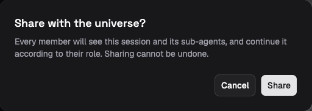
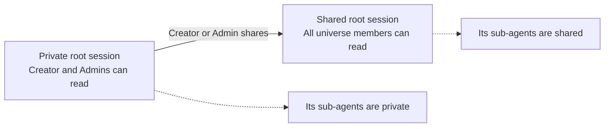

# Private and shared work

A new standalone session starts private. Through the Platform, only its creator
and the universe's Admins can read it. The creator can investigate a problem,
collect context, and then share the conversation with the whole universe when
it is ready for other people to use.

This is a Platform visibility rule. A direct core API key with the `session`
method group can access private sessions in its universe. Such keys are
integration credentials and are not limited by a person's membership or role;
see [API keys and service access](api-keys-and-service-access.md).

## Follow a session from private to shared

Suppose an Acorn Contributor creates a session to review a release. Its header
shows a lock marked **Private**. Other Contributors cannot find or open it, but
Acorn's Admins can. Private work is not hidden from the people administering the
universe.

After finishing the initial review, the creator opens the session title menu
and chooses **Share with universe…**. The confirmation explains that sharing
includes the session's sub-agents and cannot be undone. Choose **Share** to
publish that conversation to the team. The header now shows **Shared**.

*The demo's sharing confirmation names the new audience and includes the
session's sub-agents. Sharing cannot be undone.*

Sharing changes who may use the same continuing conversation. It does not make
a snapshot or start another session. Viewers can inspect it; Contributors and
above can continue, steer, cancel, or configure its work, subject to ordinary
session lifecycle rules. Someone joining the universe later can read its
shared history too.

## What each person may do

The Platform first checks the member's role, then the session's visibility and
creator. These checks apply on the server as well as in the UI.

| Operation | Private session | Shared session |
| --- | --- | --- |
| Read | Creator and Admins | Every member |
| Start, steer, cancel, approve tools, configure, or close | Creator with Contributor or Operator role, and Admins | Contributors, Operators, and Admins |
| Share | Creator with Contributor or Operator role, and Admins | Already shared; no reverse operation |
| Delete | Creator with Contributor or Operator role, and Admins | Creator with Contributor or Operator role, and Admins |

A creator downgraded to Viewer can still read their session but cannot control,
share, or delete it. An Operator does not acquire another creator's private
work by managing profiles or environments. Platform admins act as Admin in
every universe.

Deleting a session still requires its lifecycle conditions, such as closing it
first. See [Sessions and runs](../using-lightspeed/sessions-and-runs.md#close-and-retain-a-session)
for the procedure and retention behavior.

## One root determines the audience

A **root** is the resource from which a session inherits its visibility and
creator attribution. A standalone session is its own root. Delegated
sub-agents follow the root of their parent, including through further levels
of delegation. Share the root session; an individual child cannot choose a
different audience.

Bots and all their conversations are always shared with the universe, as are
their sub-agents. There is no private bot setting. Members' roles determine
whether they can read, invoke, or manage the bot. The runtime's own bot and
sub-agent controllers have separate limits on which sessions they may control;
[Agent and tool access](agent-and-tool-access.md) explains those checks.

Sharing currently has only two states: private or shared with the universe.
There are no named-person invitations, group audiences, or per-session read
and write grants. The API calls private visibility `restricted` and shared
visibility `universe`.

## Files keep their own access boundary

Keeping Acorn's review conversation private does not make its attached
workspace or execution environment private. If the agent writes its findings
into a shared workspace, other members can read them through that workspace
before the session is shared. The same distinction applies to files on an
attached machine and to external systems reached through tools.

Content-addressed blobs also have a separate read path. A caller who knows a
blob's digest and has blob-read permission in the universe can read it without
a session visibility check. The Platform permits that method from Viewer
upward. Session visibility therefore controls access to the conversation, not
every copy of data it refers to. See
[Tenant isolation and data protection](tenant-isolation-and-data-protection.md)
for the storage boundary.
