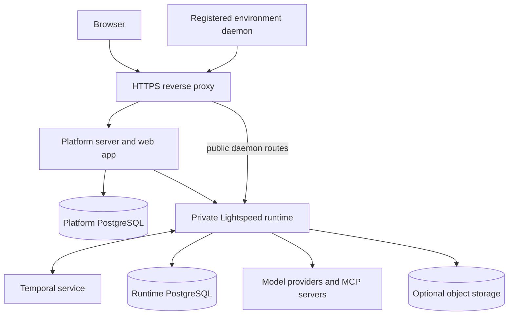

# Deployment overview

A Lightspeed deployment combines the agent runtime with durable infrastructure
and, optionally, the Platform web app. The runtime executes sessions, bots, and
channel workflows. Temporal coordinates that work, PostgreSQL stores the
product's records and canonical access directory, and the Platform handles login and
the browser interface.

The first deployment can run all runtime roles in one process. Separate those
roles when you need to scale or operate them independently.

## The components

| Component | Responsibility | Needed for |
| --- | --- | --- |
| `lightspeed-server` | JSON-RPC gateway, environment gateway, and Temporal workers for sessions, bots, and channels | Every hosted Lightspeed installation |
| Temporal | Durable workflow execution and coordination | The hosted runtime |
| Runtime PostgreSQL database | Session events, blobs, workspaces, credentials, profiles, bots, channels, and environment records | The hosted runtime |
| Platform server and web app | Sign-in, user profiles, core directory administration, universe management, and browser access | The full web product |
| Platform PostgreSQL database | Authentication and Platform-owned records | The Platform |
| S3-compatible object storage | Stores blobs larger than the 64 KiB inline limit | Required for larger payloads; small blobs remain in PostgreSQL |
| Configurator MCP | Exposes Lightspeed management operations to an MCP client | Managing Lightspeed through MCP |
| Connector host | Telegram and WhatsApp transport connections | Those chat channels |
| Environment daemon and providers | Filesystem/process access and, with a provider, machine lifecycle | Agent tasks requiring compute |

The two Lightspeed databases can live on the same PostgreSQL server, but they
have separate schemas and migration histories. Temporal has its own
persistence requirements, managed as part of the Temporal deployment.

The Platform sends authenticated, universe-scoped requests to the private
runtime. Registered machines use separate public daemon routes. The reverse
proxy must preserve that distinction.

## Choose the client and authentication boundary

The full web product uses an authenticated runtime. Platform authenticates with
`LIGHTSPEED_PLATFORM_API_KEY` and selects a universe on each universe request.
The runtime checks canonical principal status, action permissions, ownership,
service capabilities and credential scope. Bare tenant headers never authenticate a caller.

| Mode | How requests are scoped | Use |
| --- | --- | --- |
| `authenticated` | Canonical bearer principal; universe or deployment credential ceiling | Platform, connectors, and direct clients |
| `single` | Explicit local development principal in one configured universe | Private local development |

Platform calls assert canonical users. Sessions, bots and collections have their
own audiences within a universe; ordinary administration does not grant access
to restricted content.
See the [access guide](authentication-and-tenancy.md) for the exact boundary and
[Multitenancy](multi-tenancy.md) for isolation and shared infrastructure.

## Runtime roles and scaling

One `lightspeed-server` executable supplies five roles:

| Role | Work it owns |
| --- | --- |
| `gateway` | JSON-RPC, OAuth callbacks, and bot webhook ingestion |
| `environment-gateway` | Worker routes to environments, outbound daemon connections, environment lifecycle reconciliation, and idle power management |
| `sessions` | Session workflows and activities, plus session and blob retention work |
| `bots` | Bot controllers, trigger work, and bot activities |
| `channels` | Chat conversation workflows and core channel activities |

By default, all five run in one process. Worker roles use their own task queues,
and a role can be split further into workflow and activity workers.
Cross-component work reaches other workflows through starts and signals.

Run exactly one `environment-gateway` process per deployment. It owns live
daemon connections, and worker requests for those daemons must reach that
process. Other roles can have multiple workers. If you share a Temporal
namespace between deployments, assign distinct session, bot, and channel task
queues to each deployment.

## Persistence determines what survives

The runtime database holds Lightspeed's session history and domain records;
Temporal persistence holds the workflow execution history. Both are necessary
to continue durable work. A successful worker restart does not replace a
backup and recovery procedure for those stores.

Keep the runtime secrets master key stable and backed up with appropriate
access controls. It encrypts stored credentials. The Platform has its own
authentication secret and database. If object storage is enabled, include its
objects in the recovery plan as well. Each execution environment's files and
processes have a separate lifecycle from these stores.

## The first self-hosted installation

The [self-hosting guide](self-hosting.md) installs the full web product on one
Linux x86_64 application host, using release images built from a pinned source
revision and existing PostgreSQL and Temporal services. It uses PostgreSQL
for blobs up to 64 KiB initially. Configure object storage before using larger
payloads. External integrations and compute can be added as needed.

That is a single application-host topology. High availability also requires
planning the infrastructure, public edge, and the current singleton
environment gateway. The local `dev.sh` stack has different defaults and is
intended for development.

Continue with [Configuration](configuration.md) for service settings,
[Operations](operations.md) for monitoring and scaling, and
[Upgrades and recovery](upgrades-and-recovery.md) for maintenance. Use
[Troubleshooting](troubleshooting.md) to follow failures across components.
