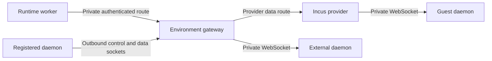
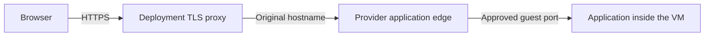

# Networking and ingress

Environment networking has two paths. The runtime needs a protected route to
the daemon that executes file and process operations. An application running
inside the machine may separately need a route for people using a browser.
Enabling application ingress does not expose the daemon or grant access to
Lightspeed's runtime API.

Deployment operators configure these routes. The connection path depends on
whether the environment is registered, externally attached, or provisioned.
The application publishing procedure later in this guide needs an Operator
or Admin account in the universe.

## Follow an environment operation



For a file or process tool, the runtime resolves the selected environment to
its current machine and connection. The request follows that route and the
response returns as the tool result. Registered machines initiate their own
outbound connections; external daemons and Incus guests are reached over
private deployment networks.

Run exactly one **environment-gateway** process per deployment. It owns live
registered-daemon connections, lifecycle reconciliation, and idle power
management. Worker routes must reach that process. Other runtime roles can
scale independently; distributing this gateway's live connection ownership
across replicas is not currently supported.

Processes that do not run the environment-gateway role need
`LIGHTSPEED_ENVIRONMENT_GATEWAY_URL` and
`LIGHTSPEED_ENVIRONMENT_GATEWAY_TOKEN`. The URL is the gateway's stable base
URL; the token authenticates deployment workers using its data routes. Keep
that token within the deployment. It is not a daemon registration key.

## Connect a registered daemon through a public edge

A registered daemon opens its connection outward, which lets it run behind
NAT without exposing an inbound daemon listener. Publish these runtime paths
through an HTTPS/WebSocket-capable proxy:

| Path | Purpose |
| --- | --- |
| `/environment-gateway/connect` | Long-lived daemon control connection and identity admission/reconnection. |
| `/environment-gateway/data` | Additional outbound data sockets opened when the gateway requests a worker route. |

Use `wss://` for a remote gateway. The daemon accepts plain `ws://` only for
loopback. For a private certificate authority, configure
`LIGHTSPEED_ENVD_CA_FILE` with the additional trust anchors.

The first connection uses a registration key and the daemon's identity. Later
connections use the retained identity, and requested data sockets use a
one-time pairing token. Publishing only the control path can therefore make
the machine appear connected while its actual tool operations fail. Both
paths need WebSocket upgrades and suitable long-lived-connection handling.

The worker route under `/environment-gateway/routes/` is a separate private,
bearer-authenticated path. Do not give its deployment token to borrowed
machines. The daemon registration flow supplies what those machines need.

Follow [Bring your own compute](bring-your-own-compute.md) for the complete
registration procedure. [Self-hosting](../deployment/self-hosting.md#configure-the-public-edge)
shows how to publish the daemon routes while keeping the runtime RPC
listener private.

## Reach passive daemons and Incus guests

An external environment stores a daemon endpoint that the deployment can
reach. The local development example uses `ws://127.0.0.1:19091/`. In a
container, that address refers to the container making the connection; choose
a protected reachable address for a different topology.

The passive daemon listener has no built-in authentication or TLS. Protect it
with the network or transport boundary. A filesystem root setting or default
working directory does not make a publicly reachable process service safe to
expose.

For Incus, the environment gateway reaches the provider's private `/control`
and derived `/routes/...` endpoints. The provider then dials the guest daemon
over the private guest IPv4 network, normally on port 19091. Provider endpoints
also currently rely on the deployment boundary rather than application
authentication. The provider's connection to the Incus API uses HTTPS client
credentials and server trust separately.

Standalone Incus uses a managed bridge per universe binding. Cluster mode
uses a managed OVN network over the configured uplink. The provider and its
application edge must be able to route to the resulting guest addresses; API
access to Incus alone does not establish guest connectivity.

The provider separates sibling binding networks and applies configured
`deniedEgressCidrs`. That list defaults to empty. Add the destinations the
deployment needs to block, and avoid overlapping the binding subnets. These
specific rules are not a general application-aware egress policy.

Relay connection timeouts and VM idle policies control different resources.
An idle relay can close without closing the machine or deleting its files.
The next operation can open another route while the daemon remains available.

## Configure public application ingress

The Incus provider can publish one template-approved guest port over HTTP and
WebSockets. It does not expose arbitrary TCP services or let a session choose
its own public hostname, private target address, or forwarding port.

The application edge does not authenticate visitors against Lightspeed users,
universes, or session cookies. Anyone who can reach an enabled endpoint can
reach its application. Supply access control in the application or deployment
proxy when the service requires it.

As the operator, add an `ingress` block to the provider configuration:

```json
{
  "ingress": {
    "publicBaseUrl": "https://env.example.com",
    "listen": "127.0.0.1:19092"
  }
}
```

This is a fragment to merge into the full configuration from
[Incus VMs](incus-vms.md#configure-and-start-the-provider). Define an
ingress-capable template with its own stable template ID and these additional
fields:

```json
{
  "publicIngress": true,
  "ingressPort": 8080
}
```

Both template fields are required together, and the provider ingress block
must exist. Ports 0, 22, 2375, 2376, and the daemon's own configured port are
reserved and cannot be exposed this way. Restart the provider after changing
its configuration, then provision a machine from the intended template.

For this example, configure wildcard DNS and TLS for `*.env.example.com` at
the deployment proxy. Forward those hosts to the provider edge listener,
preserving the original `Host` header, streaming responses, and WebSocket
upgrades. The edge listener itself serves plain HTTP; the deployment proxy
terminates HTTPS.

Keep the provider controller and private daemon routes out of that public
application proxy. A certificate-issuance authorization hook, if used by the
TLS setup, does not provide visitor authentication.

## Publish a small application

Use a ready environment created from the ingress-capable template. The
application must bind the approved port on a guest-reachable address, such as
`0.0.0.0:8080`, rather than only the guest's loopback interface.

For a minimal test on a machine with Python 3 installed, ask the agent to
create a dedicated directory containing only a harmless test page and run:

```bash
mkdir -p ingress-demo
printf 'Acorn environment is reachable\n' > ingress-demo/index.html
python3 -m http.server 8080 --bind 0.0.0.0 --directory ingress-demo
```

Run the server as a tracked environment process, allowing the tool to yield
while the root process stays alive, and retain its process handle. Avoid a
short command kill timeout for the duration of this check. Do not simply
background it with a shell and forget which process serves it.

In **Environments → Details**, choose **Enable public ingress** and open the
generated HTTPS endpoint. The page should show `Acorn environment is
reachable`. Use the returned URL rather than constructing a hostname from
the display name.

This verifies application delivery separately from environment tool access:



The edge resolves the enabled route from current Incus target metadata and
proxies HTTP, streaming bodies, and WebSockets. You supply the application and
its content on the guest machine.

## Keep application lifetime and power aligned

The route is useful only while the application and machine are available.
Public requests do not reset the daemon's idle activity clock, and browser
access does not wake a sleeping VM. A sleeping target can therefore return
404 even though ingress remains configured.

A tracked running root process keeps the idle reaper from treating the
machine as idle. A service left behind by a command that already exited does
not. Set the VM's power policy according to how the application should remain
available, and inspect the distinction in [Power and cleanup](power-and-cleanup.md#understand-the-current-staging-limit).

Choose **Disable public ingress** to remove the route. This does not stop the
application process. Stop the tracked server separately when it is no longer
needed, and close a disposable VM only after saving its useful output.
Removing a route should not be treated as a promise that an already-open
stream was terminated immediately.

The API equivalent is `environments/ingress/put`, with params such as:

```json
{
  "environmentId": "<environment-id>",
  "enabled": false
}
```

See the [API reference](../../../crates/api/contract/api-reference.md) for its
response and the environment's endpoint fields.

## Locate a connection failure

| Symptom | What to check |
| --- | --- |
| A registered daemon connects but commands cannot route | Publish both connect and data paths; check WebSocket handling and routing to the single environment gateway. |
| Worker calls fail while the daemon looks healthy | Check the worker's gateway URL/token and private route reachability. |
| Incus health passes but guest operations fail | Check guest daemon readiness, guest IPv4 routing, and the provider-to-daemon port. |
| A loopback endpoint works locally but fails in containers | Replace it with the private address reachable from the actual connecting process. |
| **Enable public ingress** is absent or disabled | Check template permission, provider ingress configuration, and ready status. |
| The public endpoint returns 404 | Check the original Host header, enabled route, and whether the target is ready rather than asleep. |
| The public endpoint returns 502 | Check the edge's Incus lookup and connectivity to the application on the approved guest port. |
| HTTP works but WebSockets or long responses fail | Check upgrades, streaming, and timeouts at the deployment TLS proxy. |

The [environment-variable reference](../reference/environment-variables.md#environment-services)
and [Incus provider guide](../../../crates/environment-provider-incus/README.md)
hold the exact deployment configuration surfaces.
