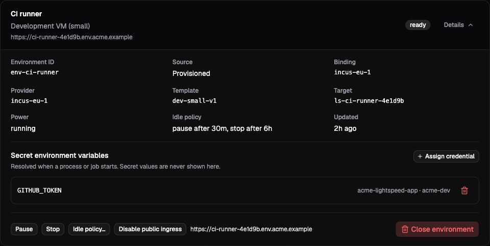

# Using environments

An environment gives a session access to a machine's files and processes.
The session selects one environment at a time, while the environment remains
a resource in the universe. Several sessions can select the same machine;
selection does not reserve it or create a private copy.

This guide starts with a machine that already appears under **Environments**.
Use [Bring your own compute](bring-your-own-compute.md) to connect one you
control, or [Incus VMs](incus-vms.md) to configure provider-managed machines.
The [environment overview](overview.md) explains the available sources and
the separate VFS and machine filesystems.

Use a universe owner/admin or platform administrator account for these web
procedures. You also need a session with a working model.

## Select a machine for a task

Open **Environments**, find the machine, and expand **Details**. Check its
source, status, and **Environment ID**. A display name helps you find it;
the ID is the stable value profiles and API calls reference.



*The demo's CI runner is a provisioned machine. Its **Environment ID** is the
value to select; its status and power state describe the machine's current state.*

Open the session you want to use. With no active or queued runs, choose
**Session settings**, enable **Environments**, and select the machine under
**Active environment**. Choose **Apply setup**.

Enabling **Environments** in the profile or session editor selects **Edit files**
and enables **Command execution**, **Durable jobs**, **Prompt loading**, and
**Skill discovery**. You can adjust each independently. Existing configurations
keep their saved settings; omitted API grants remain off.

**Environment selection tools**, below **Skill discovery**, remains off by
default. For this first check, turn **Durable jobs** off too; **Command execution**
is sufficient to run a simple command on the machine you selected.

Send:

```text
Inspect the active environment, then run pwd there and report the working
directory. Do not create or change files.
```

Inspect the tool result, including any process error. On the machine from the
bring-your-own-compute walkthrough, the working directory should be the
`workspace` directory passed to the daemon. A successful reply in chat is
useful, but the actual process output verifies where the command ran.

The environment's default working directory belongs to the daemon setup.
Commands can choose a different working directory. Neither setting confines
the process to that directory; it runs with the operating-system permissions
of the daemon user.

## Choose the tool grants

Under **Environments** in a profile or session setup, **File tools** offers
**No file tools**, **Read only**, or **Edit files**. Read only exposes reading,
listing, search, and glob tools. Edit adds write, edit, and patch tools.
**Command execution** independently enables starting and continuing processes;
**Durable jobs** independently enables workflow-backed jobs. All are off when
omitted. Prompt loading and skill discovery do not implicitly grant file or
command tools; enable Read only if the agent should read discovered skills.

```json
{"features":{"environments":{"tools":"readOnly","commands":false,"jobs":false}}}
```

These are tool grants, subject to the endpoint's capabilities and operating-system
permissions. Read-only file tools do not constrain commands or jobs: either can
modify files when enabled. Source discovery remains separately authorized by
its prompt/skill capability. Selection and environment status remain separate.

## Keep files in the right domain

Suppose the session also links the release-notes VFS workspace at `/workspace`.
That path belongs to the session's VFS view. It does not place the files in a
directory named `/workspace` on the selected machine.

To check VFS content with a command, use `vfs_materialize` to copy the selected
file or tree to an exact environment destination. Use `vfs_capture` to save
machine outputs into a writable VFS workspace. Both replace the complete
selected destination by default, preserving siblings. See
[VFS transfer](vfs-transfer.md) for partial copies, content reuse, large files,
and workspace revision conflicts.

After transfer, the copies can diverge. Editing the machine's copy does not
update VFS, and changing the active environment does not move either copy.
Use explicit source and destination paths in tasks that cross this boundary.

## Reuse a machine through a profile

In **Profiles**, open the profile and enable **Environments**. Under
**Session environment → Mode**, choose **Activate an existing environment**,
then select its **Environment**. Save the profile and start a new session
from it.

Every session using this setup selects that existing machine. This is useful
for a shared repository checkout, a long-lived service, or several bot
conversations working with the same operating-system state. The profile does
not close the existing environment when one of those sessions ends.

Sharing also means sharing file changes, processes, installed tools, and
environment-bound credentials. Lightspeed does not coordinate edits between
the sessions. Use separate directories for independent tasks and separate
environments when they need separate machine state or credential access.

Prefer a persistent registered environment for a profile that names a
borrowed machine. An ephemeral registration closes after its disconnect
grace period; once closed, that identity cannot return and the profile's
saved selection becomes unavailable.

## Provision a machine per session

A profile can request its own environment when a session starts. The universe
must have an enabled provider binding and an available template first. In the
profile's **Session environment** settings:

1. Choose **Mode → Provision a new environment for the session**.
2. Select **Provider** and **Template**. The template identifies an immutable
   provider version, including its machine setup.
3. Choose **Retention → Close with the session** for a task-specific machine,
   or **Retain after the session closes** when its files must stay available
   afterward.
4. Optionally set a display name, an idle policy, and
   [environment credentials](credentials.md).
5. Save the profile and create a new session from it.

The environment can be selected while it is still provisioning or booting.
When an environment-dependent tool reaches it before it is ready, the runtime
waits for readiness and then dispatches the tool. Inspect the environment's
status if that wait takes longer than expected; a failed provision needs
attention at the provider.

Provisioning is tied to the session identity. Retrying creation or reapplying
the profile finds the same environment instead of allocating another one.
Changing the profile template or credentials does not rebuild or resynchronize
that existing machine. If its environment has closed or failed, explicitly
create and select a replacement, or start a new session.

**Close with the session** is the default. The environment can still be
selected by another session, but that does not transfer or extend its cleanup
policy. Closing its originating session can remove the machine another
session is using. Choose a separately managed existing environment for a
shared lifetime, and read [Power and cleanup](power-and-cleanup.md) before
retaining machines beyond their original tasks.

You can create that separate resource directly through **Environments → New
environment**. Select a **Template**, enter a **Display name**, configure any
idle policy, and choose **Provision**. The button appears only when the
universe has a non-deprecated template from an enabled binding. The created
environment has no originating session that automatically owns its closure.

## Use environments with bots and sub-agents

For a bot whose Main conversation, routed threads, and chat conversations
should use one machine, select the same **existing** environment in its
profile. Provisioning in the profile instead creates a machine for each
session that uses that intent. Resetting a conversation can therefore close
its old machine and provision another for its successor.

A child profile can choose **Inherit the parent's active environment
(sub-agents only)**. The child shares the parent's selected machine without
copying it and does not close it as its own resource. The parent must have an
active environment, and the child's grants must allow access to it. Using
this mode for a standalone session is rejected.

The child can also select a different existing machine or provision one of
its own. Its VFS links remain independent of all these choices. See
[Sub-agents and federation](../using-lightspeed/subagents-and-federation.md)
for the rest of the child-profile boundary.

## Grant model-driven selection carefully

Enable **Environment selection tools** when the model should list, activate,
and deactivate allowed environments itself. Without that switch, you can
still select a machine through the client or profile, and the model can read
its active environment. The switch does not grant environment provisioning.

The feature supports two independent filters:

| Configuration field | Source it restricts |
| --- | --- |
| `providers` | Provisioned environments from the listed provider IDs. |
| `registrationKeys` | Registered environments admitted by the listed registration-key IDs. |

An absent filter allows every environment of its source kind. An explicit
empty list denies that source kind. External environments are allowed only
when both filters are absent. A provider filter alone therefore still allows
registered machines; it is not an allowlist covering every environment source.

The form exposes **Allowed providers**, with an empty selection meaning no
provider restriction. Registration-key filtering and explicit empty lists
need the profile's JSON view or the API. The current form's model-configuration
normalizer does not preserve those advanced values when editing the config;
keep such edits in JSON/API and inspect the saved configuration afterward.

The session settings form also currently rejects a registered environment
when a nonempty provider filter is present, even when runtime policy permits
it. Use the profile JSON/API or CLI to apply that valid combination instead
of removing the intended restriction.

The runtime also rejects an ambiguous tool batch that changes selection and
uses the selected environment in the same batch. The agent must select first,
then perform the file or process operation in a later batch. Existing job
handles keep their original environment even after selection changes.

## Change or clear the selection

In an idle session's settings, choose another **Active environment**, or choose
**No active environment**, then **Apply setup**. This changes the reference;
it does not migrate files, terminate existing jobs, or close the machine.

A profile's **Do not change the active environment** mode also leaves an
existing selection in place. It does not mean “clear the selection.” Use the
session control or explicit deactivation for that operation.

With the [CLI connection settings](../using-lightspeed/sessions-and-runs.md#continue-from-the-cli)
configured, the equivalent controls are:

```bash
target/debug/lightspeed env list
target/debug/lightspeed env read "<environment-id>"
target/debug/lightspeed env activate --session "<session-id>" "<environment-id>"
target/debug/lightspeed env deactivate --session "<session-id>"
```

The public methods are `environments/list`, `environments/read`,
`session/environments/activate`, and `session/environments/deactivate` in the
[API reference](../../../crates/api/contract/api-reference.md).

## If the machine is unavailable

| Symptom | What to check |
| --- | --- |
| **New environment** is missing | Check the universe binding, provider templates, and whether the template is deprecated. Borrowed machines use registration or attachment instead. |
| Selection succeeds but the first tool waits | A provisioned machine may still be booting or waking. Inspect its status and provider health. |
| A registered machine is offline | Restart or reconnect its daemon using the retained identity. Lightspeed cannot power on that borrowed machine. |
| A visible environment is rejected by the session | Inspect the feature grant and both source filters, plus the machine's capabilities and lifecycle status. |
| A saved profile points to a closed machine | Select a replacement explicitly. The runtime does not silently switch to another environment. |
| A VFS file is missing on the machine | Transfer it explicitly and check which filesystem each tool used. |
