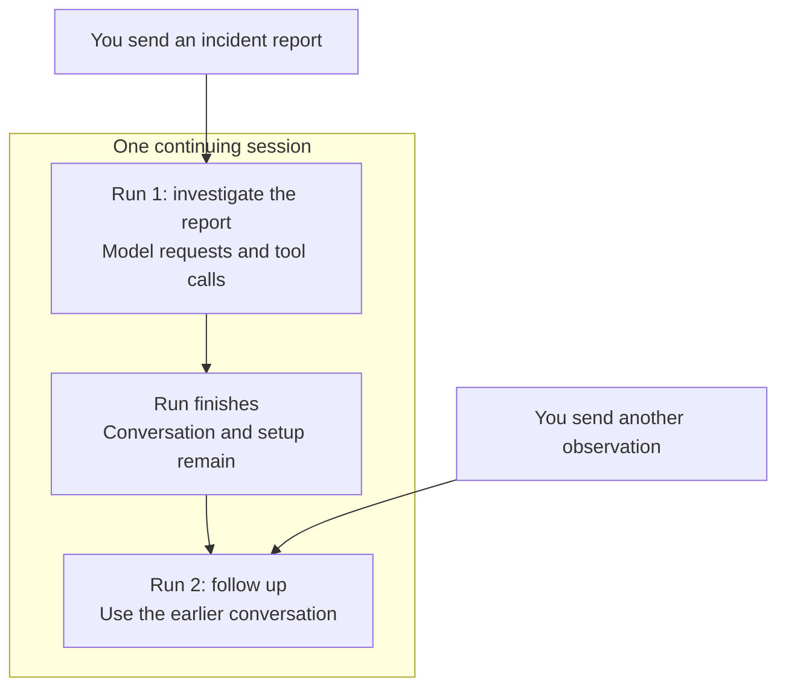
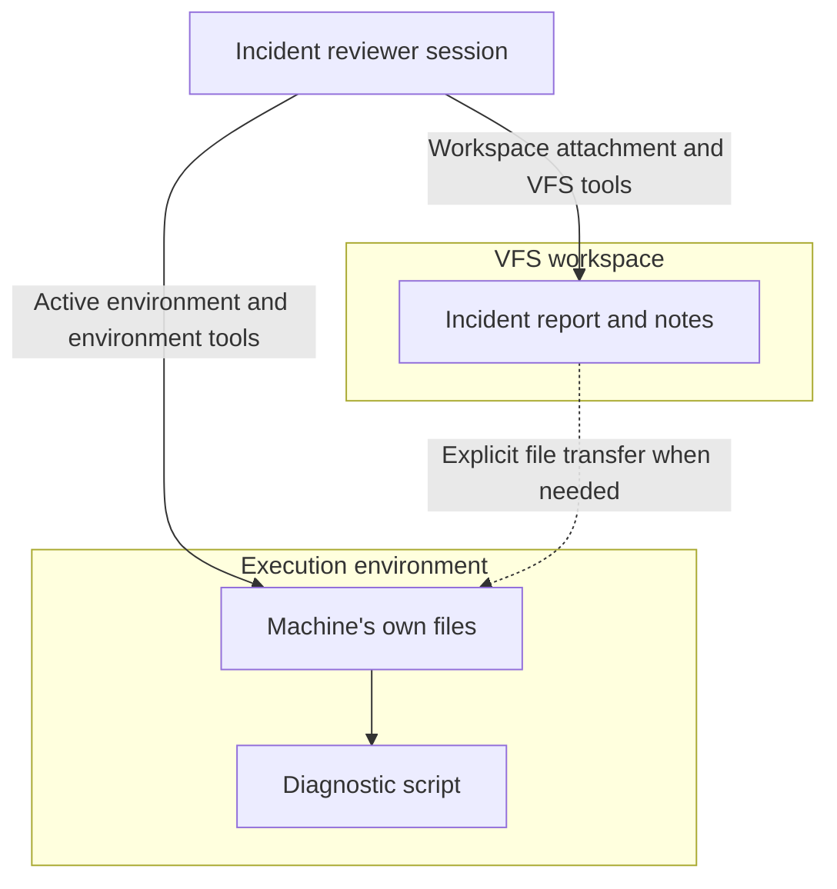
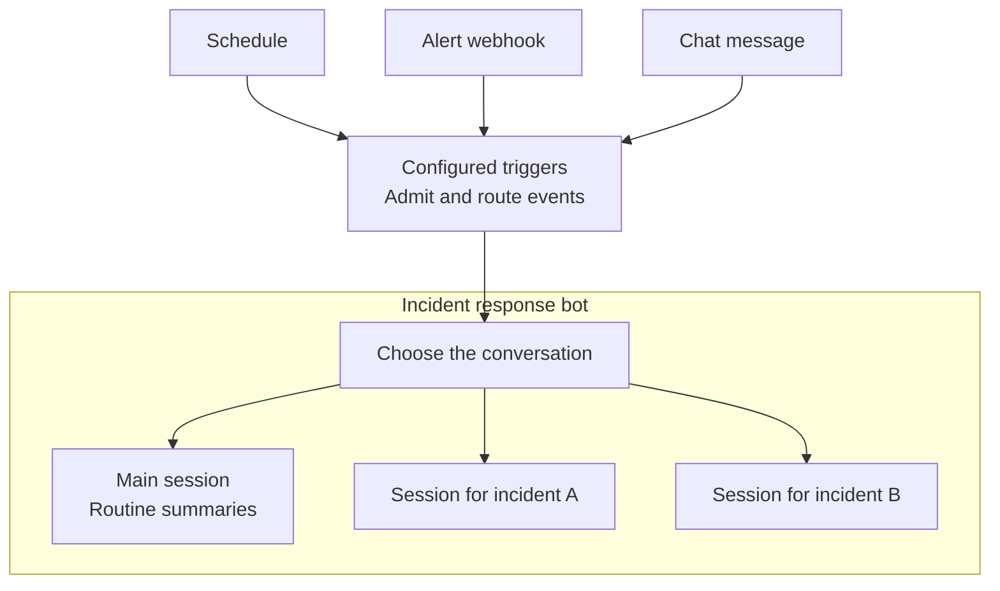
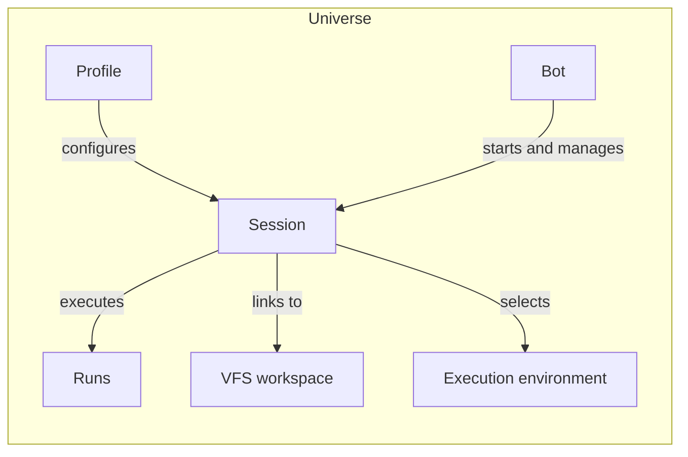

# Core concepts

Lightspeed runs an agent as a durable session. The session holds the agent's
conversation and configuration, and the runtime does the work needed to advance
it. When a task needs a real filesystem or a shell, the session can select an
execution environment. The session and the machine have separate lifetimes,
so keeping an agent around does not require keeping a machine running for it.

Consider an agent that helps a team investigate incidents. It reads an incident
report, keeps notes, and proposes an explanation. Later, it might need to run a
diagnostic script. Eventually, the team might want it to react to alerts on its
own. The same few concepts cover each stage.

## A universe groups the team's resources

A universe is the boundary around a set of sessions, profiles, bots,
workspaces, environments, and credentials. The incident response team can keep
these resources in one universe, while another team uses a different universe
on the same Lightspeed deployment.

Resources in one universe cannot resolve resources from another. Within a
universe, the Platform handles user membership and access. The runtime's
universe boundary does not itself provide permissions between individual users
in that universe. This distinction matters when deciding which teams or
customers should share resources.

## A session continues across runs

A session is the agent's ongoing conversation and execution state. When you
send the incident report, you start a run in that session. During the run, the
model may read files, call tools, and make several model requests before it
produces an answer. One run can therefore contain much more than a single model
response.

When the answer is ready, the run finishes and the session remains available.
You can return later, add another observation, and start another run using the
same session. While a run is active, you can steer it, queue another message,
or cancel it. Canceling a run does not delete the session.

Each task starts a run. The session connects those runs through the conversation
and setup it retains between them.

Lightspeed records the events that make up the session in persistent storage.
The runtime can reconstruct its state after a worker restart, and Temporal
coordinates the outstanding work. The browser is a client of that process:
closing a tab does not end the agent's session.

The visible conversation history and the model's active context are related
but different. A long session can compact older context to fit subsequent
model requests while retaining its recorded history. Persistence does not
mean sending the entire conversation to the model on every turn.

## A profile gives sessions a reusable setup

A profile describes how to start an agent: its model, instructions,
capabilities, limits, and the workspaces and environments it attaches. The
incident response team could create an `incident-reviewer` profile that asks
the agent to distinguish evidence from speculation and gives it access to a
workspace for notes.

Starting two sessions from that profile gives them the same setup and separate
conversations. The profile is not a running agent, and editing it does not
automatically reconfigure sessions already created from it.

Capabilities determine which tools a session can use. Giving an agent
instructions to search the web or run a command does not grant the corresponding
capability. Those abilities must be enabled in its configuration. A bare session
can converse with a model without any optional tool capabilities.

## Workspaces hold files; environments run processes

A VFS workspace stores persistent files in Lightspeed's virtual filesystem.
The incident reviewer can write notes there without an operating system
attached. A session uses files through workspace attachments, and several sessions
can link to the same workspace. Those sessions still have separate
conversations even though they can work with shared files.

Instructions and skills can also come from linked VFS content. A skill is a
documented procedure that the agent can discover, read, and follow for relevant
work. It adds guidance; the session's granted capabilities still determine
which tools are available.

Running the diagnostic script needs something else: an execution environment.
An environment provides a real machine or container filesystem and the ability
to execute processes. Lightspeed can use an existing machine through its
`lightspeed-envd` daemon or provision compute through an environment provider.

The VFS and the environment filesystem are separate. A report saved in the VFS
does not automatically appear on the machine, even if both files have the same
path. Transfer the file explicitly if the script needs it. See
[Environments](../environments/overview.md) for how selection, sharing, and
machine lifecycle work.

The two paths give the session different operations. A workspace is enough
to read and write notes; running a script also needs a machine. The dotted
arrow is a deliberate copy, not a shared mount or automatic synchronization.

## Bots react to events

A bot adds ongoing behavior around managed sessions. Instead of waiting for a
person to send every message, the incident reviewer could wake when an alert
arrives through a webhook, on a schedule, or through a chat connection.

Triggers determine which events a bot receives and how they reach its
sessions. A bot can maintain several conversations, so a bot and a session are
not interchangeable terms. The bot coordinates the ongoing work; each session
holds a particular conversation and executes its runs.

Chat channels connect Telegram or WhatsApp conversations to bots. A channel
account supplies the connection to the messaging service, and a chat trigger
routes incoming messages to the bot.

This bot is configured to keep incident conversations separate and routine
summaries in Main. Later events for the same incident can return to its
existing session; routing is a choice in the trigger configuration.

## Sub-agents delegate a task

A session can delegate a bounded task to a sub-agent using an allowed profile.
The child has its own session, returns a result, and closes when the delegation
finishes. Limits control how much delegation the parent can create.

For example, the incident reviewer might ask one sub-agent to examine logs and
another to inspect a configuration change. Bot federation serves a different
lifetime: independent, ongoing bots send each other events to coordinate work.

These relationships fit together as follows:

You can begin with a session and add these pieces as the work calls for them.
The [quickstart](quickstart.md) gets a local installation running; the
[first-agent walkthrough](first-agent.md) then builds a reusable agent that
works with persistent files.
