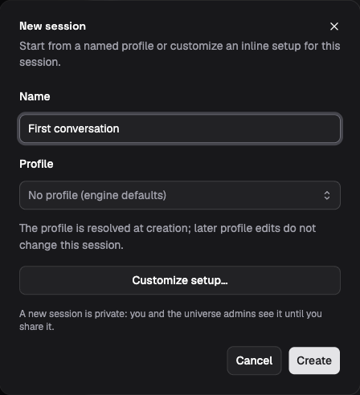

# Get started with Lightspeed

This walkthrough takes you from an installation to a model response in a
persistent session. On Linux, start with a prebuilt release. You only need
Rust and a source checkout if you choose the development launcher.

## Before you start

To configure a model, you need an OpenAI or Anthropic API key and an Operator
or Admin account. If your operator has already connected a model, a Contributor
account is enough to start a session. Creating a universe requires a Platform
administrator. See
[People and roles](../access-and-security/people-and-roles.md).

If someone has already deployed Lightspeed for you, open that installation
with your assigned account and continue at
[Sign in and create a universe](#sign-in-and-create-a-universe).

## Install a prebuilt release on Linux

[GitHub Releases](https://github.com/smartcomputer-ai/lightspeed/releases)
provides Linux x86_64 binaries and a release manifest identifying the matching
container images. You can install these without Rust, Cargo, or a source
checkout.

For the complete product, including the web app used in this walkthrough,
follow [Self-host Lightspeed](../deployment/self-hosting.md). That guide pulls
the published runtime and Platform images, connects them to PostgreSQL and
Temporal, and sets up your administrator account and public URL. It assumes
you provide those services and an HTTPS reverse proxy.

You can also [download the standalone binaries](../deployment/self-hosting.md#download-standalone-binaries)
directly from the release assets. The server archive contains
`lightspeed-server`; the CLI archive contains `lightspeed`. The server still
needs PostgreSQL and Temporal, and the web app runs in the separate Platform
application. Downloading the server alone does not start the complete product.

Once your installation is running, continue at
[Sign in and create a universe](#sign-in-and-create-a-universe).

## Run from source for local development

The development launcher starts the web app, runtime, databases, storage, and
Temporal together. Use this path to work on Lightspeed itself, or to try the
complete local stack on macOS or Linux with the build tools installed.

You need:

- A Lightspeed source checkout, with a terminal open at its root.
- Rust and Cargo through rustup. The repository's `rust-toolchain.toml`
  selects the required compiler version.
- Node.js 24 or newer, including npm.
- Docker running, with Docker Compose v2.
- A native build toolchain and the Protocol Buffers compiler (`protoc`),
  including its standard `.proto` include files, for the Rust dependencies.

### Start the local product

From the repository root:

```bash
./dev.sh --no-envd
```

The launcher installs missing npm dependencies, starts infrastructure in
Docker, applies database migrations, and builds and starts the application
processes on your machine. The first startup can take a while because it
compiles the Rust runtime. Leave this terminal running and wait for the
readiness checks to finish.

The `--no-envd` flag leaves the local execution daemon disabled. The first
walkthrough uses only the model and Lightspeed's persistent files. You can
[connect compute](../environments/bring-your-own-compute.md) when a task needs
processes or a shell. Running plain `./dev.sh` also starts a local daemon;
sessions still need an environment configured before they can use it.

The launcher reads a root `.env` if one exists. A fresh installation can start
without deployment-wide model credentials because you will add a key through
the web app below.

## Sign in and create a universe

Open your installation's web app and sign in with the account configured
during deployment or supplied by your operator.

If you used the development launcher, open
[http://localhost:5173/app/](http://localhost:5173/app/). The launcher prints
the development account. Unless you have overridden it, use:

| Field | Development value |
| --- | --- |
| Email | `admin@lightspeed.dev` |
| Password | `lightspeed-dev-password` |

These credentials belong to the local development setup. A deployed
installation uses an administrator account configured by its operator.

Select a universe from the switcher. The development launcher creates a
**Test** universe you can use for this walkthrough. The universe holds your
sessions, credentials, profiles, and workspaces.

If the app shows **No universes yet**, sign in as a Platform administrator,
choose **New universe**, enter `Getting started`, and choose **Create**.

## Configure a model

In your universe, open **Models → Add provider**. Choose
**OpenAI (API key)** or **Anthropic (API key)**, enter your key in **API key**,
and choose **Save key**. Wait for a model list to appear under **Available
models**, then choose **Done**.

Use an API-key integration for this walkthrough. The Codex and Claude Code
subscription integrations serve those coding agents inside execution
environments; they do not supply model inference for a Lightspeed session.

If model discovery reports an error, resolve it here before creating the
session. A saved key needs access to the model you will select.

## Start a conversation

1. Open **Sessions** and choose the plus button labeled **New session**.
2. Enter `First conversation` as the **Name** and leave **Profile** at
   **No profile (engine defaults)**.
3. Choose **Customize setup…**. Under **Model configuration → Model**, select
   a conversational model from the provider you just connected.
4. Choose **Create session**.



*Demo mode: choose **Customize setup…** to select a model before creating
the conversation.*

Select the model explicitly. Adding a credential does not change the
deployment's default model, so leaving **Deployment default** selected can
send the request to a different provider.

Send a short message:

```text
Give me three questions to ask when reviewing an incident report.
```

An assistant answer confirms that the web app, runtime, and provider
connection work together. Refresh the page and open the same session: the
conversation should still be there. The answer completed one run; another
message will start a new run in this session.

## Stop and return later

For a self-hosted release, follow [Operations](../deployment/operations.md)
to manage the services. Your sessions remain available when you sign in again.

For the development launcher, inspect the local stack in another terminal at
the repository root:

```bash
./dev.sh status
```

Press Ctrl+C in the launcher terminal, or run `./dev.sh stop`, to stop the
application processes. The Docker infrastructure remains available. To stop
both the application processes and infrastructure:

```bash
./dev.sh down
```

Ordinary shutdown keeps the data volumes. Run `./dev.sh --no-envd` again when
you want to continue. The reset and volume-removal commands in the development
guide erase local state; they are for deliberately starting over.

## If something fails

For a release installation, start with the
[self-hosting checks](../deployment/self-hosting.md#operate-and-update-the-installation)
and [deployment troubleshooting](../deployment/troubleshooting.md). The build
and launcher checks below apply to the source path.

| Symptom | What to check |
| --- | --- |
| Docker or Compose cannot be reached | Start Docker and check `docker compose version`. |
| The Rust build cannot find `protoc` or an imported standard protobuf file | Install the compiler and its standard include files. If the build cannot locate the include directory, set `PROTOC_INCLUDE` to that directory. |
| A port is already in use | Check `./dev.sh status` and the conflicting process. Service ports and overrides are listed in the [development guide](../../../scripts/dev/README.md). |
| The launcher warns that no provider key is configured | Continue to **Models → Add provider** and add the key there. The warning alone does not prevent startup. |
| The session reports missing credentials or model access | Check both the integration and the model selected for this session. They must refer to the same provider. |
| Sign-in fails with the displayed defaults | Check the credentials printed by the launcher; an existing `.env` or existing user account may use different values. |

Continue with [Build your first agent](first-agent.md) to give the agent a
reusable profile and a workspace it can edit. For local profiles, ports, and
configuration options, see the [development guide](../../../scripts/dev/README.md)
and [environment-variable reference](../reference/environment-variables.md).
