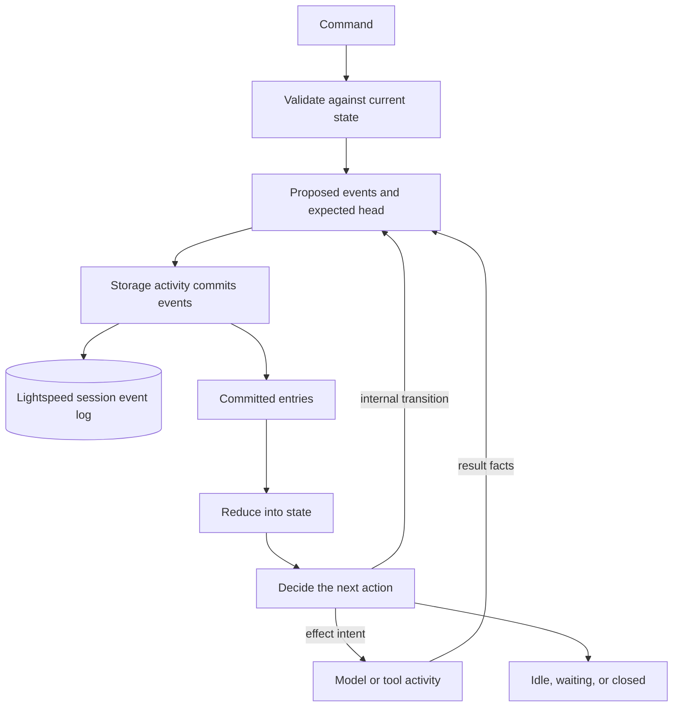

# The agent loop and durability

A conversation may last much longer than the process that happens to be
running it. An agent can call a model, wait for tools or a human decision, and
continue after its worker has restarted. To make that possible, Lightspeed
records the facts that determine the session's next step. The process holds a
working copy of state; durable history allows another process to reconstruct it.

The core loop is straightforward: admit work, record facts, reduce them into
state, and decide what should happen next.
A proposed event must be committed before it changes authoritative state, and
an external effect must be represented by its recorded result before replay
can rely on it.

## Separate requests, facts, and decisions

Four terms describe the core's work:

| Term | Meaning |
| --- | --- |
| Command | A request to change the session, such as starting a run, steering it, or deciding an approval. |
| Event | A fact admitted into the session's ordered log. |
| State | The result of reducing committed events in order. |
| Effect intent | A description of outside work needed to make progress, such as a model generation or tool invocation. |

Admission validates a command against current state and proposes the events
that should result. It may instead reject the command or recognize that an
equivalent request was already admitted. Planning examines the resulting state
and determines which internal transition or external operation should follow.

Those are deterministic operations. Time is passed into the engine explicitly;
the hosted workflow supplies its workflow clock. The engine does not read the
wall clock, open a database connection, or ask a provider what happened last time.

The [drive machine](../../../crates/engine/src/core/drive.rs) first emits an
append action with an expected session head. The host commits that append and
returns the committed entries. Only then does the reducer apply them. It checks
their sequence and advances the state to the committed position.

Storage commits the event before the core advances its state. Effects follow
that committed decision, and their results go through the same commit step.
Recovery can therefore distinguish the work requested from the work completed.

## Follow one run

Return to the release editor. The user asks it to read `changes.md` and prepare
release notes. The gateway validates and materializes the input, then sends an
admission to the session workflow. `session/runs/start` returns when the run is
accepted; it does not wait for the release notes to be finished.

The accepted request joins the session's queue. When the active slot is
available, the planner starts that run and assembles the next model turn from
the recorded configuration and context references. The generation activity
loads the content, resolves credentials, builds the provider request, and
performs the network call.

Suppose the model asks for two file reads. The adapter stores the provider
payload and returns the decision facts the core needs: the generation outcome,
context references, and admitted tool calls. Those facts become committed
events. The planner can now issue tool work.

The tool adapters read the files and return their results. Each committed
result advances the batch's state. Once the required results are available,
the planner can request another model turn. The model writes the notes,
receives the write result, and produces an answer. Run completion records the
terminal outcome and output descriptor.

This is one run with several turns and tool operations. Completing it normally
leaves the session open. A later request to revise the notes starts another run
in the same session, with the continuity described in
[Context and storage](context-and-storage.md).

## Waiting is a state of the work

A session has one active run slot and can retain queued submissions behind
it. The active run can be executing, parked, or cancelling before reaching a
terminal outcome. These are separate from the session's `new`, `open`, and
`closed` lifecycle.

When the drive has no immediately executable action, the workflow may still
have work to wait for. A parked run can be waiting on an MCP approval, a timer,
a tool promise, or another workflow's result. The workflow waits for a signal
or a relevant deadline and resumes when that fact arrives. It does not need
to occupy a provider call or a sleeping activity merely to represent the wait.

Consequently, an idle drive does not necessarily mean the run is complete, and
a completed run does not mean the session is closed. The session workflow
finishes after session closure and the draining of its pending deliveries.
[Tools and controller workflows](tools-and-controller-workflows.md) explains
how outstanding work is represented by durable promises.

## There are two histories

Lightspeed runs an event-sourced agent inside a durable workflow. Each layer
records the history needed for its own responsibility:

| History | What it records | What it reconstructs |
| --- | --- | --- |
| Lightspeed session log | Configuration and context changes, accepted runs, turns, tool results, approvals, promises, and lifecycle facts. | The agent's domain state and the history exposed to clients. |
| Temporal workflow history | Workflow starts, delivered signals, activity results, timers, and orchestration progress. | The execution of the workflow code coordinating that work. |

Temporal replay lets workflow code encounter the recorded result of an activity
without executing that completed activity again. Session replay lets the engine
reconstruct its state from the committed domain events without asking the model
to reproduce its old answer.

These mechanisms complement each other. Temporal can contain an admission or
delivery that has not yet become a committed session event. The session log
also remains useful independently of the current Temporal execution: it serves
history reads and can reconstruct the agent after workflow rollover. Neither
history is an interchangeable backup of the other.

There is another distinction at the payload boundary. An activity's recorded
result can contain content references instead of the provider's full response.
Replaying the orchestration therefore does not require carrying all historical
payload bytes in Temporal. The referenced storage must still exist when an
activity or client needs to read that content.

## Reconstruct state without replaying every old event every time

The session log is authoritative, but repeatedly reducing an entire long
conversation would be unnecessary work. Lightspeed stores reducer checkpoints:
the reduced state at a known position in the session history.

To reconstruct a session, a storage activity loads a valid checkpoint and
replays the events committed since it was taken. If the checkpoint cannot be
used, it falls back to the event log. A missing checkpoint slows recovery;
missing authoritative events prevent it.

The activity returns reduced state, its head, and the run-submission index to
the workflow. It does not send the entire event history through the activity
result. The same distinction lets a transcript reader load a bounded event
range without reconstructing the full execution state first.

The [checkpoint loader](../../../crates/temporal-server/src/checkpoint.rs)
validates checkpoints and checks that the required history is complete.

## Continue with a new Temporal execution

Even small workflow events accumulate over a long conversation. Temporal
continue-as-new starts a fresh execution of the same logical workflow so the
old execution's history no longer has to grow with every new turn.

Lightspeed makes rollover due when Temporal suggests it or when the configured
history threshold is reached. It then waits for a safe committed boundary.
This can happen during an active run; the agent does not have to finish the
whole task first.

Before rollover, the workflow must finish recording or delivering work that
exists only in its current execution. That can delay rollover. Parked tool
batches and durable promises can survive because their facts are already in
session state.

The new execution loads the session through the storage activity and resumes
the drive. An active run does not require another user message to wake it.
The logical session ID and Lightspeed run ID remain the same, while the
Temporal execution ID changes.

Rollover limits the growth of Temporal history. Context compaction, payload
storage, and retention address other kinds of growth, as described in
[Context and storage](context-and-storage.md).

## Accept control while work is in flight

The session workflow listens for admissions while generation and tool activities
run. New queued work, cancellation, steering, approval decisions, and promise
facts can be recorded without waiting for a slow model call to return.

That responsiveness does not mean the request already sent to the provider
can be edited. A turn uses frozen context and configuration revisions.
Steering admitted during generation is materialized at a subsequent turn
boundary. Mutations that would invalidate the in-flight generation wait for
the appropriate boundary. Standalone compaction temporarily holds admissions
until the compaction operation finishes.

Cancellation changes the authoritative run state and requests cancellation
of its executing activities or owned work. Obsolete results cannot turn the
cancelled task back into a successful active run. A watchdog can recover a run
that remains stuck in cancellation, but neither that watchdog nor an API
acknowledgment reverses a remote operation that already happened.

For the user-facing choices between queueing, steering, and cancellation, see
[Sessions and runs](../using-lightspeed/sessions-and-runs.md).

## Retry without repeating completed work

Suppose a storage activity commits an append and loses its completion response.
Temporal may retry the activity. The storage activity recognizes an exact repeat
at the expected position by comparing the already committed entries, including
their sequence and event contents. It can return that committed result instead
of appending duplicates. A conflicting append remains an error.

Client submissions have a similar boundary. Reusing a `submission_id` with the
same submission resolves to the accepted run. Reusing it with different input,
configuration, or notification intent is rejected. The identifier makes the
retry recognizable; it is not a request to create another run.

External effects need their own policy. Read-only or explicitly retry-safe
tools receive bounded retries. Other calls, including process operations, use
one attempt. Completed tool siblings have their results committed
independently, so retrying unfinished work does not require re-executing those
completed calls. Provider generation and compaction have bounded handling for
transient failures; exhausted retries become visible failures rather than an
endless model call.

Deterministic replay and external exactly-once execution are different claims.
If a remote service performed an operation but its response was lost, the
runtime may not be able to infer the result. Stable operation IDs, appropriate
provider idempotency, and effect-specific recovery are still necessary. An
email already sent or a machine command already run is not undone by replaying
the session.

For monitoring and backup procedures, see [Operations](../deployment/operations.md)
and [Upgrades and recovery](../deployment/upgrades-and-recovery.md).
