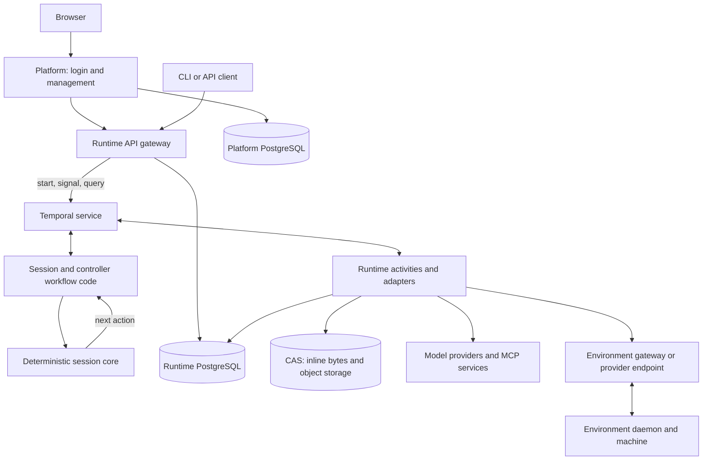

# Architecture

At the heart of an agent is a state machine that manages a conversation with
a model. It decides which context to send, records what the model returned,
requests tool execution, and uses the results to decide the next step.
A useful agent may repeat that cycle many times, wait for outside work, and
return to the same conversation days later.

Lightspeed starts with that core and layers persistence, durable execution,
and product services around it. The session owns the conversation and its
execution state. A machine supplies operating-system access when a task needs
it. Keeping those responsibilities separate lets the conversation outlive both
the worker processing it and the machine on which a command happened to run.

This page follows those layers from the core to a complete installation. The
other pages in this section examine the [agent loop](agent-loop-and-durability.md),
[context and storage](context-and-storage.md), and
[tools and controller workflows](tools-and-controller-workflows.md) in more detail.

## Start with a session

Consider the release editor from the [first-agent walkthrough](../getting-started/first-agent.md).
It reads `changes.md`, writes `release-notes.md`, and answers the user. The
session needs to remember the request, the tool calls, their results, and the
answer. If the user returns to ask for a revision, those facts provide the
continuity between the two tasks.

A **session** is that continuing conversation and execution state. A **run**
is one admitted task within it. Completing a run does not discard the session;
another task can use the same configuration, workspace attachments, and accumulated
context. A **profile** supplies reusable setup when creating or configuring a
session. It is resolved by the hosted runtime, outside the deterministic core.

The session workflow prepares configuration, profiles, and instructions before
work begins. A configuration change is committed as one operation after all
its parts validate; failed preparation leaves the previous setup in place.
When a new run is submitted, the workflow also reads the current tool
configuration and grants. Changes take effect at safe turn boundaries.

Environments have independent lifecycles. A session's configuration lists
which machines it may use and what it may do on each. Selecting a machine
makes it active for subsequent tool calls. Use checks readiness and requests
wake-up where the provider supports it; an offline registered machine must
reconnect. Closing or deleting the session leaves the environment available
for other work.

The core represents a session as events reduced into state. Admission checks
whether a command is valid against that state. Planning decides which fact or
effect comes next. The effect might be a model request, a tool invocation, or
context compaction. The core emits an intent describing the work; an adapter
performs it and returns facts for the next state transition.

Because the core performs no I/O, replaying those recorded facts does not send
another model request or run another shell command. Replaying a recorded tool
result reconstructs the state from which the next decision was made. This also makes it
possible to test the agent loop with controlled effect results, independently
of a provider or workflow service.

The [core drive machine](../../../crates/engine/src/core/drive.rs) expresses
this separation in code: it asks the host to append events or execute effects,
then resumes from the committed entries or results.

## Give payloads a home outside the workflow

The core needs to know that a model asked for two tools, which tools they were,
and whether their results permit another turn. It does not need to interpret
every byte of the provider's response to make those decisions.

Lightspeed therefore keeps a small set of decision facts in deterministic
state and stores larger payloads in content-addressed storage, or **CAS**.
A content reference identifies immutable bytes. The provider adapter can read
those bytes and reconstruct a request; the core can carry their reference
through its state transitions.

This serves two purposes. Provider-native messages, reasoning data, and tool
results can retain the information their provider needs. At the same time,
workflow commands and results can pass references instead of repeatedly
carrying complete conversations and files through the workflow history.

The event log, current context, and payload bytes are related but distinct.
The log records what happened. Current context selects what the next model
request should see. CAS holds the immutable material those records refer to.
Compacting current context can reduce the next request without erasing the
historical answer shown in the UI. The
[storage page](context-and-storage.md) follows that relationship through
provider assembly, compaction, workspace files, and collection.

## Put the loop inside durable execution

The production runtime hosts the session in Temporal. Workflow code drives
the core, schedules activities for effects, and waits for signals, timers, or
activity results. Worker processes execute both workflow code and activities;
the Temporal service coordinates their tasks and retains workflow history.

The following diagram shows the main ownership boundaries. Database and
provider I/O is performed by activities or gateway services. The arrows through
Temporal represent durable scheduling and delivery.

There are two histories in this arrangement. Lightspeed's session log records
the facts that define the agent. Temporal's history records the orchestration
that delivered work and results. They solve different recovery problems and
both matter to a running deployment. A PostgreSQL session backup is not, by
itself, a replacement for lost Temporal state.

An idle or waiting session needs no dedicated worker process or VM. Temporal
retains the work needed to resume it, and shared workers process the next
available tasks. Durable storage, workflow history, and any machines kept
running still have a cost.

The supported hosted runtime uses Temporal and PostgreSQL. Local execution
and tests can drive the same core through other adapters, including the
filesystem store.

## Build product behavior around sessions

A bot adds continuing behavior around the session loop. It receives events,
applies routing and admission policy, and creates or drives sessions for work.
A channel conversation handles a chat's pairing, inbound messages, and
outbound delivery. Neither responsibility has to become another branch inside
the deterministic session engine.

Controllers instead communicate through workflow starts and signals.
Workflow-backed tools let a session ask another workflow to do work and receive
its result through an admitted protocol. Sub-agents use the same separation:
a delegation workflow owns a child session's creation, result, and cleanup,
while the parent sees a tool operation and its outcome.

That arrangement is why a session can remain a general agent harness as bots,
channels, and integrations evolve. The
[controller page](tools-and-controller-workflows.md) explains the bindings,
promises, and ownership that make these relationships durable.

The Platform owns login, user accounts, universe membership, and the browser
application. It checks each person's role and session visibility before
calling the runtime with a service key and actor ID. The runtime checks the
key's scope and method groups and records the actor for attribution.

This separates a person's web access from a program's API access. A direct
runtime key with the `session` group can reach private sessions in its
universe. Once work is admitted, it runs for the universe; removing the
requester's membership does not stop it. [Access and security](../access-and-security/overview.md)
explains these policies and the separate checks on internal controllers.

## Attach compute when the task needs it

The release editor can read and write VFS files without an execution
environment. Suppose it now needs to run a test script over the notes. That
requires a machine with a real filesystem and processes. The session selects
an environment, and the runtime routes the process tool to its daemon.

The **VFS** stores persistent agent files through snapshots and workspace
heads. The **execution environment** exposes the files and processes of a
machine. These are separate filesystem domains. Selecting an environment does
not copy the workspace onto it, and writing a machine file does not update the
VFS. Transfer the files needed for the task explicitly.

An environment can be a directly reachable daemon, a machine registered
outbound through the environment gateway, or compute managed through a provider
such as Incus. The daemon supplies the data operations. A provider additionally
supplies the supported machine lifecycle operations. The Incus provider depends
on the public environment protocol, so it can perform that job without access
to Lightspeed's database or agent internals.

This separation also defines a failure boundary. A session workflow can resume
after a worker restart without implying that a process on a failed machine is
still running. Machine storage, daemon identity, and job state have their own
lifecycle. [Environments](../environments/overview.md) explains how to choose
and operate those resources.

## Share infrastructure through runtime roles

The hosted runtime remains one executable, `lightspeed-server`, with selectable
roles. Combining roles in one process is convenient for a first installation;
separating them lets the deployment give different work different capacity.

| Role | Responsibility |
| --- | --- |
| `gateway` | Public API admission and reads, OAuth callbacks, and bot webhooks. |
| `sessions` | Session, sub-agent, and environment-job workflows and their activities, plus session and blob maintenance. |
| `bots` | Bot controllers, trigger workflows, and related activities. |
| `channels` | Conversation workflows and core channel activities. |
| `environment-gateway` | Live outbound daemon connections, worker routes, environment reconciliation, and power management. |

The session, bot, and channel roles poll their own task queues. Cross-subsystem
work uses workflow starts and signals rather than relying on one role executing
another role's activities. Connector hosts provide the provider-specific chat
transport and activity workers; they have no database access or authority to
choose which bot owns a conversation.

The environment gateway is currently a singleton because its connected daemon
sockets are held by that process. The other runtime roles can be scaled
separately. See [Operations](../deployment/operations.md) for the supported
topology and its current limits.

A deployment can serve several universes over shared processes, database
connections, and provider clients. Universe-bound queries, object references,
and workflow identities keep tenant resources distinct. This is logical data
isolation over shared infrastructure, with the limits described in
[Tenant isolation and data protection](../access-and-security/tenant-isolation-and-data-protection.md).

## Read the implementation by responsibility

The important source boundaries follow the same model:

| Responsibility | Starting point |
| --- | --- |
| Deterministic state and decisions | [Engine](../../../crates/engine/README.md) |
| Durable orchestration and effect execution | [Workflow code](../../../crates/temporal-workflow/src/lib.rs) and [runtime composition](../../../crates/temporal-server/src/main.rs) |
| Provider-native requests and results | [LLM runtime](../../../crates/llm-runtime/src/lib.rs) and [provider clients](../../../crates/llm-clients/README.md) |
| Persistent records and payloads | [PostgreSQL store](../../../crates/store-pg/src/lib.rs) and [VFS](../../../crates/vfs/src/lib.rs) |
| Client contracts and display projections | [API crate](../../../crates/api/src/lib.rs) and [API projections](../../../crates/api-projection/src/lib.rs) |
| People, web UI, and chat transports | [Platform guide](../../../platform/README.md) |
| Compute boundary | [Environment protocol](../../../crates/environment-protocol/src/lib.rs) and [Incus provider](../../../crates/environment-provider-incus/README.md) |

Use the root [workspace manifest](../../../Cargo.toml) for the complete current
crate list. Follow [The agent loop and durability](agent-loop-and-durability.md)
next to see how a decision is recorded and recovered.
