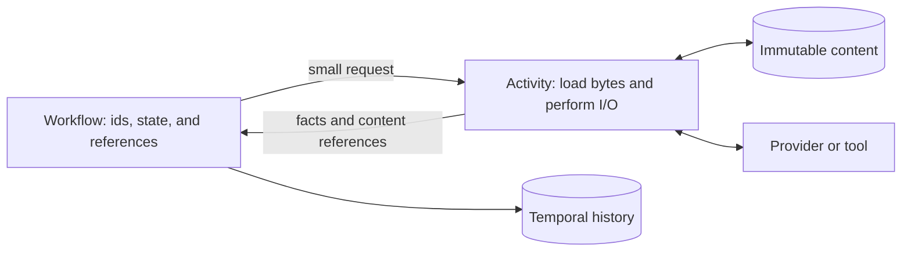

# Context and storage

A session can remember something without sending it to the model on every
turn. Suppose the release editor has already written three drafts of the
Acorn release notes. Its history records the requests, tool calls, and results
that produced them. The next request may need the current instructions and a
compacted account of the work, with the latest draft available in a workspace
for the agent to read.

Lightspeed keeps three things distinct: the event history records what
happened, active context determines what the next turn will consume, and
content-addressed storage holds the immutable bytes those records refer to.
This distinction explains how the conversation can remain inspectable while
its model context changes over time.

## Give content an identity independent of its current use

A content descriptor, `ContentRef`, identifies immutable bytes by their
SHA-256 hash, media type, and optional provider encoding. The same bytes can
serve as a context input, a historical message, or a run's final output without
being copied or converted into display text.

A context entry adds how that content is used: its role, source, position, and
an optional preview. The preview helps people inspect an entry; the model
receives the referenced content. Provenance can link to source material, such
as the original audio behind a transcript or a report of how instructions
were assembled. These source labels describe content; they grant no access.

Active context has a revision and ordered entries. Adding, removing, or
rewriting entries happens through events. An entry removed from the active
set still has the event that introduced it in session history. Replaying that
history reconstructs both the earlier state and the later removal.

## Keep provider-native material at the provider boundary

Provider responses contain more than visible text. They can include tool calls,
citations, reasoning signatures, opaque continuation data, and other structures
needed for a subsequent request. Flattening every response into a generic
message would require inventing a common representation for all of that data,
then reconstructing the provider's representation later.

Lightspeed keeps the native payload and extracts the smaller facts needed by
the core. The engine needs to know that generation completed, which tool calls
were admitted, and what context entries resulted. The provider adapter owns
the decoding and request construction.

The supported routes preserve their data in different ways:

| Route | Stored assistant material |
| --- | --- |
| OpenAI Responses | The original native message item, with native reasoning and tool items represented by their appropriate semantic entries. |
| Anthropic Messages | Consecutive text blocks form one native message, retaining block data and citations; reasoning and other native content retain their required continuation material. |
| Chat Completions | Assistant content, refusal, and annotations stay together; separately recorded tool calls and reasoning entries fold back into the corresponding assistant turn. |

API projections derive visible text and citations from these bytes. They do
not replace the native payload with a second authoritative text copy. Opaque
reasoning data can therefore remain intact while the UI shows only the visible
reasoning text the provider exposed.

Each adapter rebuilds requests according to its provider's format and allowed
fields. Keeping native material does not make histories interchangeable across
API kinds. A session's API kind is fixed; start a new session to change it.

Durable model selection contains the provider ID, API kind, and model name.
The endpoint, authentication, and transport headers are resolved outside the
engine immediately before provider I/O. This allows credentials to change
without storing their secret values in the session's deterministic state.
See [Models and credentials](../using-lightspeed/models-and-credentials.md)
for the resolution rules.

## Assemble a turn from recorded inputs

Before an idle session admits new run work, the session workflow refreshes
material derived from its attached workspaces and selected environment. That
includes enabled prompt sources, skill catalogs, the environment catalog, and
the sub-agent menu. The
gateway submits the run without first repeating this discovery. Session setup,
configuration changes, and explicit skill reads retain their own refresh paths.
The admission refresh occurs when no run is active or already queued; it is not
an unconditional refresh before each previously queued task.

Prompt discovery reads configured sources in VFS workspaces and the selected
environment. It records an assembly report so readers can see where the
instructions came from and which sources were omitted. An oversized source
is omitted whole instead of becoming truncated instructions.

Skill discovery supplies a catalog of available skills. The model reads the
chosen skill's document when it needs the procedure. Its body then follows
ordinary conversation retention and compaction; the current catalog remains
available. [Workspaces and skills](../using-lightspeed/workspaces-and-skills.md)
explains the source locations and how to configure discovery.

Once the refreshed inputs are admitted, the turn freezes the context revision
it uses. Instructions are ordered first by key; other entries follow their
recorded positions. The adapter reads the referenced bytes, builds the native
request, and sends it with the effective model and tool catalog. New steering
can be admitted while that call is in flight, but it applies at a later turn
boundary rather than changing a request already sent.

For the release editor, editing workspace instructions can change a later
request. It cannot change the request already sent to the model. Reading a
workspace file produces a tool result that records what the agent saw at that
point in time.

## Preserve useful request prefixes

Providers can reuse a cached request prefix when the same material appears at
the start of later requests. Lightspeed keeps ordering stable and appends
catalog updates so they do not rewrite an otherwise reusable prefix.

A catalog tells the model what is available: workspaces, skills, environments,
or sub-agents. Its rendered text is stored in CAS along with a structured
source snapshot. Replaying an old catalog uses the stored text, so a change
to the renderer cannot change an earlier request. Runtime catalogs are managed
by the session workflow; clients can publish their own catalogs under separate
keys through the [context API](../../../crates/api/contract/api-reference.md).

A changed keyed catalog is appended as the current version at the context
tail. Earlier versions remain in their original positions, with their bytes
unchanged. The new entry identifies which catalog it supersedes. This lets a
skill or sub-agent catalog change while preserving an earlier cached prefix.

Active context retains at most five superseded versions per catalog;
compaction clears them. Instructions and other ordinary keyed entries replace
their earlier version, so editing those can change the beginning of the next
request.

Tool definitions also keep a stable order. Reordering an otherwise identical
set of tools can change the prefix the provider sees.

The adapters then use each provider's cache controls. OpenAI Responses and
Chat Completions generation supply a stable session-derived `prompt_cache_key`.
Anthropic generation places ephemeral cache markers on the assembled system
prompt, the last eligible non-deferred tool, and the last eligible message
block. Supported provider parameters can configure the marker TTL.

The provider decides whether a request hits its cache. Stable ordering and
cache controls improve the opportunity for reuse without guaranteeing a hit.

## Compact the active conversation

Compaction replaces part of the active conversation with a smaller account
that can support later turns. It is a lossy context transformation. The original
session events and output descriptors remain in history, so this is separate
from deleting stored data.

The core treats standalone compaction as explicit work. It records the request
and selected context revision, waits for an adapter result, then commits the
replacement. If the operation fails, it clears the pending state and retains
the original entries. A stale result cannot rewrite a newer context revision.
The core rejects new runs and context edits while standalone compaction is
pending; the hosted workflow holds their admissions until the operation finishes.

Standalone compaction can be requested manually or through an optional
threshold. It starts only with no active or queued run. The threshold sums
token estimates for compactable entries. It needs a valid estimate to fire;
provider usage totals are not a substitute for the current context size.

The adapter mechanism depends on the API kind:

| Route and mode | What performs the compaction |
| --- | --- |
| OpenAI Responses, `provider_triggered` | The ordinary generation request includes `context_management`. Returned native compaction material enters context, and older eligible conversation is pruned. |
| OpenAI Responses, `provider_standalone` | A separate call to the Responses compact endpoint produces native compaction output. |
| Anthropic Messages, `provider_standalone` | A summarization request with Lightspeed-authored instructions produces a plain-text replacement summary. |
| Chat Completions, `provider_standalone` | A summarization request produces a plain-text replacement summary. |

Only OpenAI Responses supports `provider_triggered` compaction. The summary
adapters use `targetTokens` as guidance and an output budget; the Responses
compact endpoint does not receive that setting.

Instructions and current catalogs survive compaction. Skill reads and inserted
skill text follow ordinary conversation retention. Eligible conversation and
superseded catalogs can be removed;
nonterminal tool work and unconsumed active input are protected. These rules
retain the material needed to continue valid execution while reducing the
conversation carried forward.

## Keep large bytes outside Temporal history

Temporal records activity inputs and results as part of durable execution.
Passing a full conversation, file, or provider response across that boundary
every time would make its history grow with payload size as well as with the
number of operations.

Activities instead write payloads to CAS and return references plus the facts
needed for branching. A later activity loads the content when constructing
its request. Both directions use the same principle:

Equal bytes share a logical content reference within one universe. Catalog
rows and external object keys are universe-scoped even when tenants share
PostgreSQL and object storage. A known hash is not an authorization to read
another tenant's content.

In the hosted store, blobs up to and including 64 KiB remain inline in
PostgreSQL. Larger blobs require configured object storage. Without it, writes
above that limit fail. PostgreSQL continues to hold their catalog entries and
physical object keys. [Deployment configuration](../deployment/configuration.md#choose-the-blob-backend)
explains this operational choice.

Each external upload has its own physical object key. If content is collected
and later uploaded again, delayed cleanup of the old object cannot delete the
new copy.

## Build persistent files from immutable content

The VFS uses the same storage primitive. A snapshot manifest describes a
directory tree and references its files' immutable content. Editing one file
creates new content and a new manifest while unchanged file blobs can be
reused. This is similar to the useful part of a versioned source tree: a
snapshot identifies a particular view without requiring every file to be
copied again.

A workspace adds a named, mutable head over those snapshots. Updating that
head uses a revision check so a writer does not silently overwrite another
writer's move. A snapshot attachment pins a particular version; a workspace attachment
resolves its current head at the relevant operation boundary.

None of this overlays a machine filesystem. VFS file edits and environment
process files remain distinct. [Workspaces and skills](../using-lightspeed/workspaces-and-skills.md)
describes their user-facing behavior.

## Retain bytes through recorded ownership

Immutability makes content reusable, but it also raises a practical question:
when can storage reclaim it? Lightspeed answers through durable holders and
explicit parent-to-child edges.

Appending session events records their canonical content references as session
roots in the same database transaction. Missing referenced blobs reject the
append, and constraints protect references attached concurrently with cleanup.
Bot events, reducer checkpoints, and VFS records also retain the content they
own.

A container also records which content it retains: a snapshot keeps its file
blobs, and an instruction assembly report keeps its sources. Formats must
declare these relationships. A hash-shaped string in arbitrary payload bytes
is not enough to keep the referenced content alive.

The collector can remove an old blob only when no durable holder or incoming
edge protects it. Removing a parent can release its children for a later pass.

An elected collector runs hourly with bounded scanning. The default grace is
seven days since the last put or API admission of an existing reference;
reading content does not renew that grace. Session deletion releases its roots,
while compaction leaves those roots intact because session history still
records the original content. Reducing a model window and reclaiming disk
space are therefore separate operations.

Profiles borrow their content references rather than holding blobs indefinitely.
Workflow state alone is not a holder either. Ordinary uncommitted activity
handoffs rely on the grace period; a handoff stalled beyond it can lose content
and require resubmission. [Operations](../deployment/operations.md#manage-retention-and-blob-collection)
documents the collection bounds and diagnostics.

## Read the view that answers the question

The transcript shows what happened by reading and projecting a range of
historical events. It can page through old work while live updates continue
from the current session head.

`session/read` asks for current execution state. It uses a reducer checkpoint
and the authoritative event tail, falling back to full replay when a checkpoint
is unusable. Incomplete required history fails explicitly in both paths.

Detailed run reads also retain a terminal output descriptor independently of
active context. A completed native message can still supply its full projected
text after context compaction removes it from the next model request. Visible
reasoning and message text are projected in full; tool and catalog previews
remain bounded, and the original bytes remain available through blob reads.
An output can describe media without inventing a text representation for it.

Images and PDFs use content descriptors too, whether they arrive as user
input, a tool result, or a sub-agent result. The model sees a stable `media:`
handle it can use to refer to the attachment; clients resolve that handle
against the descriptors exposed by the API.

Together, these views let the model work with a manageable context while
people inspect retained history and the runtime reconstructs execution state.
