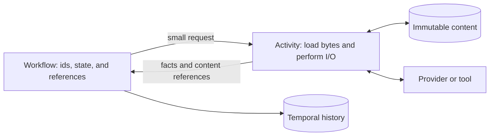

# Context and storage

A session can remember something without sending it to the model on every
turn. Suppose the release editor has already written three drafts of the
Acorn release notes. Its history records the requests, tool calls, and results
that produced them. The next request may need the current instructions and a
compacted account of the work, with the latest draft available in a workspace
for the agent to read.

Lightspeed keeps three things distinct: the event history records what
happened, active context determines what the next turn will consume, and
content-addressed storage holds the immutable bytes those records refer to.
This distinction explains how the conversation can remain inspectable while
its model context changes over time.

## Give content an identity independent of its current use

A context entry combines a content descriptor with facts about its use. The
descriptor, `ContentRef`, contains a SHA-256 content reference, a media type,
and an optional provider kind describing the encoding. The surrounding entry
adds its semantic kind, insertion source, immutable session-local entry ID,
accounting, and a bounded preview where useful.

The distinction is concrete: the same immutable bytes can be a context input,
a committed message, or a terminal run output. Those uses do not require
another copy of the payload or a conversion into display text. The preview
helps inspect an entry; it is not the authoritative input sent to the model.

Two optional fields describe provenance. `origin` is a display string such as
`user:<id>` or `event`, independent of message role. It does not authorize a
request. `provenance_ref` can point to a construction artifact, such as the
source audio for a transcript or the report explaining how instructions were
assembled.

Audio preprocessing uses this pattern directly: it stores transcript text and
filename in a structured payload and retains the original audio as provenance.
The adapter renders the transcript label for the model, while display
projections consume the text field.

Active context has a revision and ordered entries. Adding, removing, or
rewriting entries happens through events. An entry removed from the active
set still has the event that introduced it in session history. Replaying that
history reconstructs both the earlier state and the later removal.

## Keep provider-native material at the provider boundary

Provider responses contain more than visible text. They can include tool calls,
citations, reasoning signatures, opaque continuation data, and other structures
needed for a subsequent request. Flattening every response into a generic
message would require inventing a common representation for all of that data,
then reconstructing the provider's representation later.

Lightspeed keeps the native payload and extracts the smaller facts needed by
the core. The engine needs to know that generation completed, which tool calls
were admitted, and what context entries resulted. The provider adapter owns
the decoding and request construction.

The supported routes preserve their data in different ways:

| Route | Stored assistant material |
| --- | --- |
| OpenAI Responses | The original native message item, with native reasoning and tool items represented by their appropriate semantic entries. |
| Anthropic Messages | Consecutive text blocks form one native message, retaining block data and citations; reasoning and other native content retain their required continuation material. |
| Chat Completions | Assistant content, refusal, and annotations stay together; separately recorded tool calls and reasoning entries fold back into the corresponding assistant turn. |

API projections derive visible text and citations from these bytes. They do
not replace the native payload with a second authoritative text copy. Opaque
reasoning data can therefore remain intact while the UI shows only the visible
reasoning text the provider exposed.

The runtime performs explicit provider-specific lowering, including tool definitions,
content formats, and allowed request fields. Keeping native material does
not make arbitrary histories interchangeable across API kinds. A session's
API kind is fixed; use a new session when that boundary changes.

Durable model selection contains the provider ID, API kind, and model name.
The endpoint, authentication, and transport headers are resolved outside the
engine immediately before provider I/O. This allows credentials to change
without storing their secret values in the session's deterministic state.
See [Models and credentials](../using-lightspeed/models-and-credentials.md)
for the resolution rules.

## Assemble a turn from recorded inputs

Before an idle session admits new run work, the runtime can refresh the
material derived from its linked workspaces. That includes prompt sources,
the VFS skill catalog, and the sub-agent menu. This refresh occurs when no run
is active or already queued; it is not an unconditional refresh before each
previously queued task.

Prompt discovery reads conventional locations such as `.lightspeed/prompts`
and `.agents/prompts` in linked VFS workspaces. It assembles direct `.md` and
`.txt` files in filename order, without recursion, with source information and warnings recorded in an assembly report. A source exceeding
its limit is omitted whole rather than silently turned into truncated
instructions.

Skills use a related separation. Discovery supplies a sorted metadata catalog
so the model can find and read an appropriate `SKILL.md` through the VFS.
Selecting a skill submits ordinary run input or steering that asks the model
to read its document. Skill reads and inserted skill text use ordinary
conversation retention and compaction. The current catalog remains retained,
but skill bodies have no dedicated scope, expiry, or protected context state.
Environment files do not participate in this automatic prompt and skill
discovery.

Once the refreshed inputs are admitted, the turn freezes the context revision
it uses. Instructions are ordered first by key; other entries follow their
recorded positions. The adapter reads the referenced bytes, builds the native
request, and sends it with the effective model and tool catalog. New steering
can be admitted while that call is in flight, but it applies at a later turn
boundary rather than changing a request already sent.

For the release editor, this means a workspace head is resolved into explicit
instruction and catalog inputs at the refresh boundary. The model's subsequent
file read returns another explicit result. There is no hidden live mount that
changes the old model request when someone edits the workspace.

## Preserve useful request prefixes

Prompt caching rewards repeated request material, but an agent's context also
needs to evolve. Lightspeed makes ordering and updates deliberate so changes
need not disturb more of the request than necessary.

VFS, skill, sub-agent, and client catalogs share one `Catalog { title }`
context kind. Each runtime publisher stores the rendered text in CAS and keeps
its structured snapshot in `provenance_ref` for API reads and source retention.
Provider adapters read that stored text and add only the title and, for a
successor, an update header. Replaying an old entry does not rerender its source
with newer publisher code.

Catalog identity comes from its key. The runtime owns `runtime.catalog.vfs`,
`runtime.catalog.skills.vfs`, and `runtime.catalog.subagents`. Public context
append and remove reject `runtime` and `runtime.*`, as well as `run` and `run.*`.
Client catalogs use other keys. Source discovery and refresh policy remain
specific to each publisher; publishing compares both text and provenance.
The executable tool registry remains separate from catalog context documents.

A changed keyed catalog is appended as the current version at the context
tail. Earlier versions remain in their original positions, with their bytes
unchanged. The new entry identifies which catalog it supersedes. This lets a
skill or sub-agent catalog change while preserving an earlier cached prefix.

The catalog history retained in active context is bounded: a key can keep up to five
superseded versions alongside the current one. Older versions are removed when
that cap is exceeded, and compaction clears superseded catalogs. Ordinary
keyed entries, including instructions, still replace their earlier active
version. Editing those entries can change the beginning of the next request.

Tool presentation also has stable ordering. Built-in expansion preserves the
advertised order, and externally supplied definition lists keep their supplied
order. These details belong to request construction because a logically
equivalent set of tools in a different order can produce a different prefix.

The adapters then use each provider's cache controls. OpenAI Responses and
Chat Completions generation supply a stable session-derived `prompt_cache_key`.
Anthropic generation places ephemeral cache markers on the assembled system
prompt, the last eligible non-deferred tool, and the last eligible message
block. Supported provider parameters can configure the marker TTL.

These are request choices, not a local cache containing model answers. Actual
hits depend on the provider and the material it receives. Stable ordering
improves the opportunity for reuse; it does not guarantee that every turn is
served from cache.

## Compact the active conversation

Compaction replaces part of the active conversation with a smaller account
that can support later turns. It is a lossy context transformation. The original
session events and output descriptors remain in history, so this is separate
from deleting stored data.

The core treats standalone compaction as explicit work. It records the request
and selected context revision, waits for an adapter result, then commits the
replacement. If the operation fails, it clears the pending state and retains
the original entries. A stale result cannot rewrite a newer context revision.
The core rejects new runs and context edits while standalone compaction is
pending; the hosted workflow holds their admissions until the operation finishes.

Standalone compaction can be requested manually or through an optional
threshold. It starts only with no active or queued run. The threshold sums
token estimates for compactable entries; if any required estimate is missing
or the sum overflows, there is no usable aggregate and that automatic trigger
does not fire. Provider usage totals are not silently substituted for this
context estimate.

The adapter mechanism depends on the API kind:

| Route and mode | What performs the compaction |
| --- | --- |
| OpenAI Responses, `provider_triggered` | The ordinary generation request includes `context_management`. Returned native compaction material enters context, and older eligible conversation is pruned. |
| OpenAI Responses, `provider_standalone` | A separate call to the Responses compact endpoint produces native compaction output. |
| Anthropic Messages, `provider_standalone` | A summarization request with Lightspeed-authored instructions produces a plain-text replacement summary. |
| Chat Completions, `provider_standalone` | A summarization request produces a plain-text replacement summary. |

Other API kinds reject `provider_triggered` configuration. The two summary
adapters use `targetTokens` as summary guidance and an output budget; the
OpenAI Responses compact adapter does not send that setting to its compact
endpoint. Understand the configured mode together with the session's API kind.

Instructions and current catalogs survive compaction. Skill reads and inserted
skill text follow ordinary conversation retention. Eligible conversation and
superseded catalogs can be removed;
nonterminal tool work and unconsumed active input are protected. These rules
retain the material needed to continue valid execution while reducing the
conversation carried forward.

## Keep large bytes outside Temporal history

Temporal records activity inputs and results as part of durable execution.
Passing a full conversation, file, or provider response across that boundary
every time would make its history grow with payload size as well as with the
number of operations.

Activities instead write payloads to CAS and return references plus the facts
needed for branching. A later activity loads the content when constructing
its request. Both directions use the same principle:

Equal bytes share a logical content reference within one universe. Catalog
rows and external object keys are universe-scoped even when tenants share
PostgreSQL and object storage. A known hash is not an authorization to read
another tenant's content.

In the hosted store, blobs up to and including 64 KiB remain inline in
PostgreSQL. Larger blobs require configured object storage. Without it, writes
above that limit fail. PostgreSQL continues to hold their catalog entries and
physical object keys. [Deployment configuration](../deployment/configuration.md#choose-the-blob-backend)
explains this operational choice.

Logical identity and physical address are different. External object keys
include a unique upload incarnation as well as the universe and content
digest. If an old unreferenced blob is deleted and the same bytes are uploaded
again, the new upload gets a different physical key. Delayed cleanup of the
old object therefore cannot delete the new copy.

## Build persistent files from immutable content

The VFS uses the same storage primitive. A snapshot manifest describes a
directory tree and references its files' immutable content. Editing one file
creates new content and a new manifest while unchanged file blobs can be
reused. This is similar to the useful part of a versioned source tree: a
snapshot identifies a particular view without requiring every file to be
copied again.

A workspace adds a named, mutable head over those snapshots. Updating that
head uses a revision check so a writer does not silently overwrite another
writer's move. A snapshot link pins a particular version; a workspace link
resolves its current head at the relevant operation boundary.

Session history has related fork primitives at the core/storage layer. A
history fork references a source session position and combines that inherited
prefix with its own later events. A configuration-only clone has no inherited
history position. The current public clients do not expose fork/clone creation
as ordinary RPC operations, so these are storage capabilities rather than a
second session-creation walkthrough.

None of this overlays a machine filesystem. VFS file edits and environment
process files remain distinct. [Workspaces and skills](../using-lightspeed/workspaces-and-skills.md)
describes their user-facing behavior.

## Retain bytes through recorded ownership

Immutability makes content reusable, but it also raises a practical question:
when can storage reclaim it? Lightspeed answers through durable holders and
explicit parent-to-child edges.

Appending session events records their canonical content references as session
roots in the same database transaction. Missing referenced blobs reject the
append, and constraints protect references attached concurrently with cleanup.
Bot events, reducer checkpoints, and VFS records also retain the content they
own.

Nested formats record edges. A snapshot manifest retains its file blobs; a
snapshot-backed skill catalog retains its source snapshots. Its published text
and structured catalog are both retained by the context event, through content
and provenance references. An instruction
assembly report retains its sources. Merely placing a hash-shaped string inside arbitrary payload
bytes does not create a retention relationship. The writer of a format must
declare the edges that make its embedded references meaningful to collection.

The collector can remove an old blob only when no durable holder or incoming
edge protects it. Removing a parent can release its children for a later page
or pass. Unique physical keys allow catalog deletion to commit before external
object cleanup without confusing an old upload with a later one.

An elected collector runs hourly with bounded scanning. The default grace is
seven days since the last put or API admission of an existing reference;
reading content does not renew that grace. Session deletion releases its roots,
while compaction leaves those roots intact because session history still
records the original content. Reducing a model window and reclaiming disk
space are therefore separate operations.

Profiles borrow their content references rather than holding blobs indefinitely.
Workflow state alone is not a holder either. Ordinary uncommitted activity
handoffs rely on the grace period; a handoff stalled beyond it can lose content
and require resubmission. [Operations](../deployment/operations.md#manage-retention-and-blob-collection)
documents the collection bounds and diagnostics.

## Read the view that answers the question

The transcript asks what happened. It reads a bounded event range and projects
its content for display, without reconstructing the full reducer state. A
backward read captures a session head and returns the selected events in
chronological order. Earlier pages use an exclusive cursor; forward updates
start after the captured head. Loading old history must not move that live
cursor or overwrite current run controls.

`session/read` asks for current execution state. It uses a reducer checkpoint
and the authoritative event tail, falling back to full replay when a checkpoint
is unusable. Incomplete required history fails explicitly in both paths.

Detailed run reads also retain a terminal output descriptor independently of
active context. A completed native message can still supply its full projected
text after context compaction removes it from the next model request. Visible
reasoning and message text are projected in full; tool and catalog previews
remain bounded, and the original bytes remain available through blob reads.
An output can describe media without inventing a text representation for it.

Media the model sees lives in context as user-role message entries whose
content descriptor carries an image or PDF media type; run input and tool
results produce the same shape, so provider lowering, compaction, and
projection treat them alike. A tool appends its admitted media right after its
result entry, and a sub-agent's or awaited promise's media rides on the resume
output as descriptors the reducer copies into entries without reading bytes.
Every such entry is named by a handle derived from its content reference,
`media:` plus the first twelve hex characters of the SHA-256, which the model
sees in the announcement before each provider block and writes back as a URL
to refer to media. Views expose the handle on the content descriptor and list
a tool call's media beside it; clients resolve `media:` links against those.

These views are derived from the same retained facts and content. Keeping their
jobs separate lets the model work with a manageable context, the user inspect
the full retained history, and the runtime reconstruct the state needed to
continue execution.
