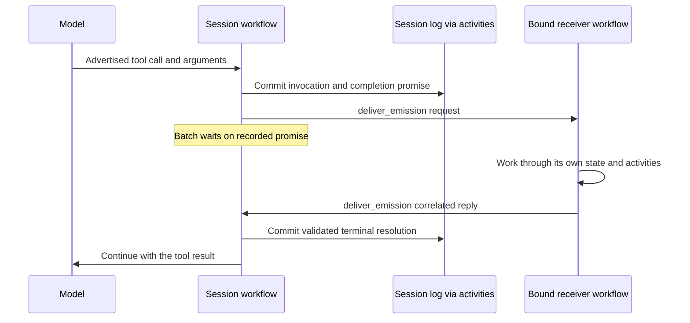

# Tools and controller workflows

A tool call starts as a request from the model, but the model does not decide
which infrastructure should receive it. Lightspeed first resolves the call to
an admitted operation. That operation determines how arguments are interpreted,
which adapter can execute them, and how the result returns to the session.

This boundary supports very different kinds of work. Reading a VFS file can
return immediately from an activity. A long-running job or delegated task
needs an execution with its own lifetime. Bots and channel conversations add
continuing policy around sessions. Each case uses the same small agent loop,
with the additional ownership and delivery handled outside it.

## Give an operation a stable identity

The engine's tool registry records logical identities and admitted execution
policy. A logical identity names an operation such as `env.run_process`; the
name shown to a model is a presentation chosen for that turn.

The runtime builds the tool catalog for the effective model, including any
run override. A shared built-in resolver selects names, descriptions, schemas,
argument adapters, and result renderers. One operation can have several
presentations. For example, `env.continue_process` exposes `BashOutput` and
`KillShell` in the Claude-style presentation normally used for Anthropic.

The model returns an exposed name and arguments. The request-local reverse
mapping identifies the admitted operation and the selected variant. Only
advertised client calls receive a routable identity, and exposed names must
be unique. A provider-hosted helper cannot become a local function call merely
by using a similar name.

This separates two kinds of stability. Scheduling, workflow lookup, and
environment rules use the logical identity. The native conversation retains
the original exposed name, arguments, and call ID so the provider can see a
consistent continuation of its own call.

Built-in definitions live in runtime code. Externally authored function and
native declarations load their definition references from CAS; MCP inventories
are resolved by the runtime. A specific tool choice names a logical identity
and resolves to its primary presentation. The model-facing vocabulary can
change without granting a different underlying operation.

There is no archive of every historical built-in implementation. Replay
reduces recorded results without rerunning adapters. An activity execution or
retry uses the deployed implementation with the original admitted settings,
turn model, and presentation variant. Release compatibility still matters at
that boundary.

## Execute effects and record progress

Suppose the release editor asks to read both `changes.md` and an existing
`release-notes.md`. The generation result records the two admitted calls. The
core can then request tool execution without knowing how the VFS loads a file.

For ordinary tool batches, the hosted workflow schedules one activity per
call. Consecutive calls marked `ParallelSafe` can run together, with a current
window of up to eight in flight. An `Exclusive` call runs alone in batch order.
Reads can therefore overlap, while an edit or process operation takes its own
exclusive position.

Each terminal call result is committed independently. If one read completes
and another is slow or retried, the first result is already durable; progress
does not require repeating the completed read. When the batch has the results
needed for continuation, the agent can plan its next model turn.

This policy orders work within a batch. It is not a transaction over a shared
workspace or machine. Another session may still operate on the same resource,
so revision checks and the resource's own concurrency rules remain relevant.

Batches containing `await` or workflow-backed calls use a batch activity
because their suspension and emission ordering is shared. That activity can
return a durable suspension rather than remain occupied until all outside
work finishes. The session workflow then owns the wait.

Web and MCP tools make the execution boundary particularly visible. Hosted
web search and Anthropic web fetch run inside the model provider's turn;
other fetch paths use Lightspeed's guarded HTTP adapter. MCP calls can run
through Lightspeed or through a supporting model provider. A large inventory
can be discovered on demand instead of placing every definition in each
request. These choices belong to runtime presentation and transport, and
neither requires attaching an execution environment.
[Tools and MCP](../using-lightspeed/tools-and-mcp.md) explains the supported
combinations.

## Distinguish an approval from an outstanding result

An approval asks whether a particular operation may proceed. A promise records
a result that has not arrived yet. Both can park a run, but they represent
different facts and resume for different reasons.

The current approval system represents MCP tool-call approvals. An approval
records its subject, arguments reference, and native or provider continuation.
It belongs to the run and accepts a single decision. The run resumes once its
pending approval set has decisions; cancellation closes pending approvals.
This is not a universal human-approval layer around every built-in tool.

A durable promise records an outstanding result in session state. It is
different from an in-memory future: its identity, ownership, scope, deadline,
and terminal outcome can survive replay. A parked batch records the promises
and continuations it needs, so another workflow execution can reconstruct the
wait after rollover.

An `await` timeout ends one waiting interval. It does not by itself cancel or
fail the underlying promise. The promise's own hard deadline has a different
job: it terminates that outstanding result through the normal resolution path.
Keeping those deadlines separate lets an agent check for progress without
necessarily abandoning the work.

## Bind workflow tools through trusted declarations

A workflow-backed tool connects an ordinary typed function to a workflow
relationship. The model supplies business arguments such as a task brief or
a list of jobs. Its destination, delivery mode, and completion behavior come
from a trusted admitted declaration.

There are two destination lifecycles:

| Destination | How it receives work |
| --- | --- |
| Existing receiver | An admitted endpoint receives pushed invocations or pulls accepted invocations from the session log. |
| New execution for the invocation | A trusted CAS-backed recipe starts an execution with a stable derived identity. |

The completion behavior is another independent choice:

| Completion | What the calling agent receives |
| --- | --- |
| `accepted` | An acknowledgment that the invocation was accepted, without a result promise. |
| `joined` | The final tool reply after the batch waits on a runtime-owned promise. |
| `promises` | Model-visible keyed promise handles that can be awaited later. |

The valid combinations express the delivery guarantee the caller needs. Pull
dispatch supports accepted completion only. Joined calls require push delivery
or a started execution and a nonzero hard deadline. Started executions must
have promise-bearing completion. A single call can produce several keyed
promises, which is useful when submitting several compute jobs together.

The destination is not a model argument. An agent cannot redirect a tool by
inventing a workflow ID or task queue. Admitted bindings also do not change
with an ordinary session configuration edit. Trusted system bindings can be
added through their separate admission path without making the session
lifecycle-managed.

## Follow a joined call across workflows

For a pushed joined call, the session records the invocation and its argument
reference, emits the request to the bound receiver, and parks the batch. The
receiver does its work and returns a correlated reply. The session validates
the reply, records the promise's terminal result, and resumes the tool batch.

Push requests, replies, cancellation notices, and lifecycle notifications use
the fixed `deliver_emission` envelope. Pull receivers instead read authorized
invocations from the log. Start-on-call uses the generic recipe adapter, and
started producers expose a fixed recovery query to recover terminal results
when delivery was missed. A bound receiver does not automatically acquire
that polling recovery path.

The reply must match the stored producer workflow identity and completion
correlation. An optional immutable reply schema is checked in an activity.
Terminal resolutions converge through ordinary admission, so a late success
does not revive an already cancelled promise.

This protocol keeps feature-specific transports out of the stable session
worker. Adding a workflow tool does not require teaching the engine a new
kind of external system. The [generated workflow contract](../../../crates/temporal-workflow/contract/workflow-contract.md)
defines the actual envelopes and signals.

There is a useful ownership rule for joined calls: the receiver must answer
from its own state and activities. If it requires another model turn from the
session waiting for its reply, both sides wait on each other. A deadline can
end that wait, but it cannot make the circular dependency productive.

## Put cancellation where the work is owned

Cancelling a promise tells its producer that the caller no longer needs the
corresponding result. For a bound receiver, this is a best-effort notice for
that completion key. It does not cancel the shared receiver workflow, which
may be serving other callers.

A started execution also receives per-key cancellation. Once all of its keyed
promises are terminal, the session requests cancellation of that particular
execution. The execution owns cleanup of its activities and external
resources. A job workflow can therefore cancel one submitted job without
cancelling its siblings merely because they were started by the same call.

Stable identities and recorded terminal facts make repeated deliveries
converge, but they do not roll back external effects. The producer still needs
appropriate idempotency and cleanup at its own boundary, as described in
[The agent loop and durability](agent-loop-and-durability.md#make-retries-converge-at-explicit-boundaries).

## Give lifecycle ownership to a controller

A session can have one lifecycle controller. When present, the controller
receives run-terminal notifications and owns the surrounding session lifecycle. The
same session can have several tool receivers, because providing an operation
does not require owning the whole conversation.

That distinction has a concrete consequence for branching. A lifecycle-managed
session is nonbranchable and noncloneable at the core boundary: copying it
would create another conversation with ambiguous controller ownership.
Merely admitting workflow-tool bindings does not impose lifecycle management.

### Bots own their sessions

A bot controller owns the continuing policy around an agent: its durable
inbox, event routing, coalescing, budgets, session creation and rotation, and
delivery lanes. It turns an admitted business event into work for a session
and receives the terminal outcome. Different target sessions can make progress
independently under that controller's policy.

For the release-watch bot, an incoming release event is first a bot event.
The controller decides how it should reach the release-editor session. The
session handles the model conversation; the controller remains responsible
for what should happen to later events and when that session should be rotated.
This is why a bot's lifetime is not just the duration of one active run.

### Channel conversations own chat delivery

A channel conversation has a different responsibility. It tracks the activated
chat and turns incoming messages into bot events. It receives the routed
session's `message_*` tool calls and coordinates the provider delivery.
It does not create sessions, start their runs, or own their lifecycle. The bot
controller owns the agent session and reports delivery receipts to the
conversation workflow.

Telegram and WhatsApp connectors sit beyond that boundary. They normalize
provider ingress and execute delivery, media, and typing activities. They do
not read the database or select the bot that should receive a conversation.
This keeps external chat transport replaceable without moving routing
authority into the connector.

See [Bots and triggers](../using-lightspeed/bots-and-triggers.md) and
[Chat channels](../using-lightspeed/chat-channels.md) for the corresponding
product setup.

## Reuse the same mechanism for delegation and compute

A sub-agent is another session, supervised by a delegation workflow.
`agent_run` uses joined completion, while `agent_spawn` returns a promise the
parent can await later. The execution validates the admitted profile and grant,
reserves capacity in the delegation tree, creates the child, and starts its
run. It then receives the child's terminal result, resolves the parent's
promise, and closes the child. Cancellation and deadline paths also close it.

The child receives its brief and its own profile. It does not automatically
inherit the parent's transcript or every capability. Workspace sharing and
environment inheritance require the relevant attachments; an `inherit`
environment attachment is resolved against the parent's active machine
captured at admission and stored on the child as a concrete id. Root-scoped limits
constrain depth, total descendants, concurrent open descendants, and deadlines.
These policies live around normal session execution; the engine does not
need a delegation-specific transport.

An independent bot contacted through federation is a different relationship.
The sender puts an event into that bot's independently configured inbox and
routing policy. The receiver is not a child session and does not inherit the
sender's task lifetime. A requested reply receipt is a later event.
[Sub-agents and federation](../using-lightspeed/subagents-and-federation.md)
explains when to choose each relationship.

Compute jobs provide another example of the same protocol. An environment-job
workflow starts and polls actual daemon jobs, returns terminal outcomes for
their completion keys, and routes cancellation to the corresponding jobs.
The session deals with admitted tool calls and durable promises rather than
implementing daemon polling itself.

The job still runs on a real machine. Durable orchestration does not make its
operating-system process replayable, and a daemon restart has different
consequences from a session worker restart. VFS tools also remain separate
from environment file and process tools: one operates on CAS-backed workspace files,
the other on the batch's selected machine. The installed environment tools
are the union of the configuration's attachments; a call the active machine's
own access does not cover is refused at execution rather than removed from
the toolset, so switching machines never changes the advertised tools. [Processes and jobs](../environments/processes-and-jobs.md)
describes those execution limits.

The common structure is now visible. A session records an admitted operation,
an adapter performs the immediate effect, and a controller or execution owns
work that needs an independent lifetime. Results return as facts the same
deterministic core can reduce, regardless of whether they came from a file
read, a child agent, a bot receiver, or a machine job.
