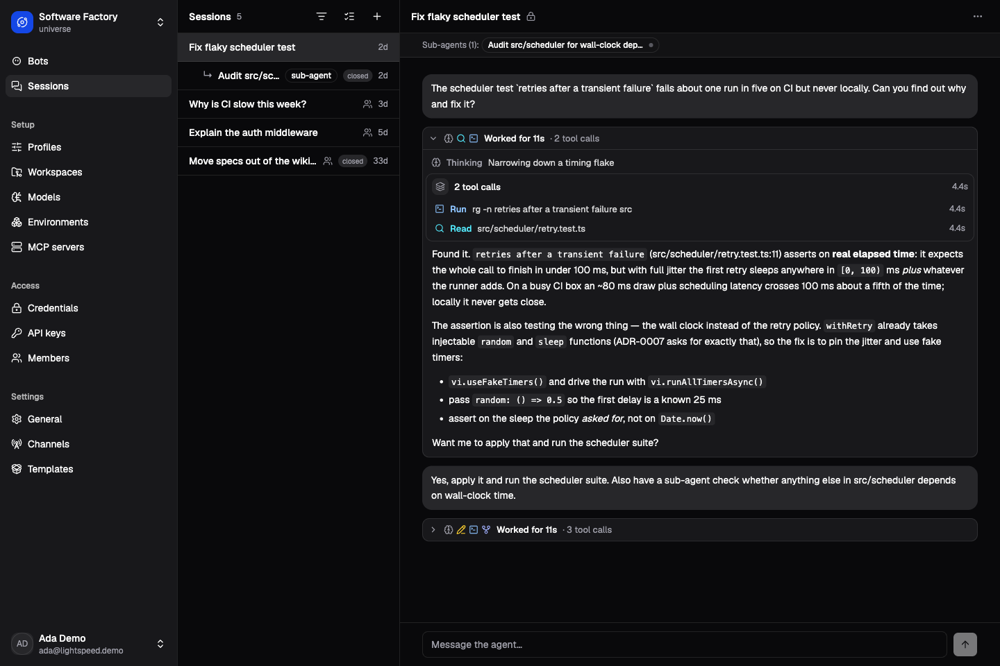

# Lightspeed documentation

Lightspeed runs long-lived agents as durable workflows. A session keeps its
conversation and execution state across worker restarts. Agents can use tools,
work with persistent files, and react to events. When a task needs a shell or
other machine resources, you attach an execution environment.

Start with a model and a conversation, then add a reusable profile, workspace,
or bot as the work requires. The guides below follow that progression.

*The Software Factory demo: a session investigates a flaky test, uses tools,
and delegates an audit.*

## Try Lightspeed

Follow [Get started with Lightspeed](getting-started/quickstart.md) to run the
product, connect a model, and start a conversation. Then
[build your first agent](getting-started/first-agent.md): a release editor that
reads source material and saves a file you can inspect and revise.

[Core concepts](getting-started/concepts.md) introduces sessions, runs,
profiles, bots, workspaces, and environments.

## Use an existing installation

Sign in with the account and universe supplied by your operator. A Contributor
can start sessions using existing resources; configuring models and profiles
requires an Operator or Admin. [People and roles](access-and-security/people-and-roles.md)
explains how an administrator grants access.

Start with [Sessions and runs](using-lightspeed/sessions-and-runs.md) for
working with an agent. Use [Profiles and instructions](using-lightspeed/profiles-and-instructions.md)
to reuse its setup, [Bots and triggers](using-lightspeed/bots-and-triggers.md)
to give it ongoing work, or [Environments](environments/overview.md) to connect
compute. The sidebar contains the guides for each capability.

## Manage access and evaluate security

[Access and security](access-and-security/overview.md) explains who can do
what, where those rules are enforced, and how agent execution differs from a
person's access to the web app.

Use [People and roles](access-and-security/people-and-roles.md) to manage
members, [API keys and service access](access-and-security/api-keys-and-service-access.md)
to connect programs, and [Tenant isolation and data protection](access-and-security/tenant-isolation-and-data-protection.md)
to assess a deployment.

## Deploy Lightspeed

Read the [deployment overview](deployment/overview.md) to understand the
services you will run, then follow [Self-host Lightspeed](deployment/self-hosting.md).
[Operations](deployment/operations.md) covers monitoring, scaling, and
retention; [Upgrades and recovery](deployment/upgrades-and-recovery.md) covers
backups and release changes.

For a specific setting or failure, use the
[environment-variable reference](reference/environment-variables.md) or
[Troubleshooting](deployment/troubleshooting.md).

## Build with Lightspeed

[API and TypeScript](integrating-and-extending/api-and-typescript.md) walks
through submitting a task and retrieving its result.
[Configurator MCP](integrating-and-extending/configurator-mcp.md) connects an
MCP client to resource management. To add capabilities, start with
[Custom tools and model providers](integrating-and-extending/custom-tools-and-model-providers.md)
and follow the guide for your extension.

The [JSON-RPC reference](../../crates/api/contract/api-reference.md) and
[workflow contract](../../crates/temporal-workflow/contract/workflow-contract.md)
provide exact operations and payloads.

## Understand how it works

[Architecture](how-it-works/architecture.md) explains how the agent loop,
durable workflows, storage, and compute fit together. Continue with
[Agent loop and durability](how-it-works/agent-loop-and-durability.md),
[Context and storage](how-it-works/context-and-storage.md), or
[Tools and controller workflows](how-it-works/tools-and-controller-workflows.md)
for the mechanics behind a particular capability.

## Develop Lightspeed

[Local development](development/local-development.md) covers the edit loop
and docs preview. [Testing and evaluation](development/testing-and-evaluation.md)
helps you choose checks for a change. Use
[Changing contracts](development/changing-contracts.md) when changing public
APIs or schemas, and [Contributing and releasing](development/contributing-and-releasing.md)
when preparing a contribution or release.
