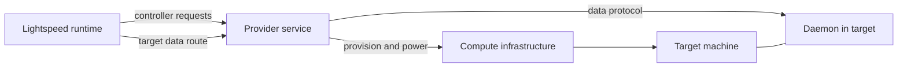

# Implement an environment provider

An environment provider supplies managed compute through Lightspeed's public
environment protocol. It translates requests such as creating, waking, or
closing an environment into the infrastructure it controls, then makes that
environment's filesystem and process service reachable.

The provider implements the environment protocol. It does not need Lightspeed's
database, API implementation, engine, or Temporal runtime. The included Incus
provider demonstrates that separation. If you only need to connect an existing
machine, [outbound daemon registration](../environments/bring-your-own-compute.md)
already provides that path without implementing a provisioning controller.

## Separate control from execution

The controller manages targets: machines or other units of compute owned by
the provider. The data endpoint performs filesystem, process, and job
operations inside a selected target. A target that exists in infrastructure
is not necessarily ready to serve that data protocol.



The current hosted controller implementation supports WebSocket transport.
Public transport enums also name other transports, but that does not mean
the runtime implements them for registered controllers. Use a controller URL
ending in `/control`, optionally under a path prefix. The runtime derives a
sibling data route with this form:

```text
/routes/{universe}/{binding}/{environment}/{incarnation}/{target}
```

Your provider must serve that route and reach the appropriate target's data
endpoint. This is distinct from the public outbound registration routes used
by bring-your-own daemons.

The current connection configuration does not supply a bearer token or
authentication headers to provider controllers. Keep that connection on a
protected network, as the Incus deployment does; the configured URL does not
authenticate callers to a publicly exposed controller.

## Start with the protocol types

The [environment protocol crate](../../../crates/environment-protocol/src/lib.rs)
defines controller and data messages, wire encoding, and the current handshake
version. Start from those types and their serialization fixtures. The handshake
checks protocol compatibility and advertises capabilities; build information
helps diagnose a mismatch but does not authenticate a peer.

The [typed client](../../../crates/environment-client/src/lib.rs) and
[Incus provider](../../../crates/environment-provider-incus/README.md) are useful
implementation references. Keep their internal infrastructure choices separate
from the public wire contract. In particular, the runtime's internal
environment resolver is policy inside Lightspeed, not an interface a third-party
provider needs to implement.

## Implement controller operations

Advertise only the capabilities your controller can fulfill:

| Operation | Provider responsibility |
| --- | --- |
| `controller/initialize` | Negotiate the protocol and describe controller capabilities. |
| `controller/listTemplates` | Return approved templates available to the supplied universe/binding. |
| `controller/createTarget` | Create or reconcile a target from stable request and environment identity. |
| `controller/listTargets`, `controller/getTarget` | Report observed targets and state within that binding. |
| `controller/adoptTarget` | Explicitly transfer an existing target into managed ownership, when supported. |
| `controller/setTargetPower` | Converge toward an advertised power state and report actual observation. |
| `controller/closeTarget` | Remove the owned target; repeated closure should observe it as closed. |
| `controller/ensureIngress`, `controller/removeIngress` | Apply or remove provider-approved application exposure, when supported. |

A create request carries identity and a template selection. For example:

```json
{
  "binding": {
    "bindingId": "primary",
    "universeId": "00000000-0000-0000-0000-000000000001"
  },
  "environmentId": "environment-1",
  "incarnationId": "incarnation-1",
  "requestId": "request-1",
  "templateId": "lightspeed-dev-v1"
}
```

These are controller method parameters, not a public Lightspeed API request.
They come from the protocol's
[create-target fixture](../../../crates/environment-protocol/fixtures/controller_create_target_params.json).
The request does not carry an arbitrary image, private address, or cloud-init
document. The provider's template policy determines what the caller may
provision.

### Make ownership survive retries

An ambiguous infrastructure response is normal: a create request can succeed
while its response is lost. Record enough ownership information to find that
same target on retry. Include universe, binding, environment, incarnation,
request, and template identity, and reject conflicting reuse.

Every mutation and data route must verify the target belongs to the supplied
binding and incarnation. Knowing a native target ID is insufficient. An old
incarnation must not gain access to the replacement environment or destroy
it during delayed cleanup.

Incus uses deterministic names and `user.lightspeed.*` ownership metadata on
native resources. This allows the provider process to restart and reconcile
without a private database. Another provider can use different persistence,
but must preserve the same ownership and retry properties.

Adoption transfers ownership. In the Incus implementation, it
replaces the source VM's networking/profiles with the managed binding policy,
and a later close destroys the adopted VM. Document your provider's adoption
effects as part of its contract rather than presenting adoption as a harmless
label change.

### Report readiness and power honestly

Target status can distinguish creating, starting, ready, paused, suspended,
stopped, closing, closed, failed, and unknown. Report infrastructure observation
and protocol readiness, not merely the desired state requested by a caller.
Advertise only the supported steady power states.

The Incus provider probes the guest data handshake before reporting a running
VM as ready. Until that handshake succeeds, the target remains starting.
Apply the same distinction when your infrastructure reports a machine running
before its daemon, filesystem, or network is usable.

Ingress follows provider policy. The controller request identifies an owned
target; it does not let callers choose arbitrary ports or upstream addresses.
A template advertises `publicIngress`, and the provider decides the approved
port and endpoint. Return the ready public endpoint or disabled state and
remove access when ingress or the target is closed. See
[Networking and ingress](../environments/networking-and-ingress.md) for the
user-facing behavior this must support.

## Supply the data endpoint

Reusing `lightspeed-envd` inside a target avoids implementing the entire data
surface again. The daemon already provides filesystem confinement, process
groups, output cursors, PTYs, background jobs, credential transfer, and idle
observation. Your provider still owns routing and target lifecycle.

A custom data server must implement the `initialize`/`initialized` handshake
and the operations it advertises. Its capabilities must agree with the
controller's target summary. Use the protocol types for the exact handshake
fields and response shape.

Pay attention to the state that survives an individual socket:

| Area | Behavior to preserve |
| --- | --- |
| Filesystem | Explicit paths/root confinement, bounded reads/searches, write semantics, and typed errors. |
| Processes | Caller-owned process IDs, input/termination, retained output, and cursor behavior across connections. |
| Jobs | Namespace/request/job identity, dependency and queue policy, idempotent submission, and retained results. |
| Credentials | Per-call secret handling without logging or persisting injected values in the job specification. |
| Idle observation | Monotonic time since real work, together with running-work and leftover-process information. |

For processes, an explicit `afterSeq` rereads retained output without advancing
the daemon-owned cursor; omitting it uses that cursor. `waitMs` controls how
long an observation waits, while `timeoutMs` is an execution deadline. Treating
both as process-kill settings would break callers that poll long-running work.

The shipped daemon retains process/job state beyond a socket but does not
implement connection resumption through `resumeConnectionId`; initialization
returns a fresh connection ID. Do not infer durable process survival across a
daemon restart from socket reconnection behavior. [Processes and jobs](../environments/processes-and-jobs.md)
explains that separate lifecycle.

`secretEnv` contains plaintext secret values while crossing the data protocol.
Protect the transport and keep those values out of logs, provider metadata,
and workflow history. Redacted debug formatting is not encryption. The
[credential guide](../environments/credentials.md) describes the binding and
injection policy surrounding this transport.

`env/idle` reports a monotonic idle duration. Running processes and jobs count
as work; handshake and idle probes do not. Leftover process groups after their
root exits are reported separately and do not automatically block idle power
policy. That distinction lets policy choose an appropriate freeze or stop
behavior without treating observation itself as activity.

Return the protocol's string-coded errors, such as `notFound`, `forbidden`,
`conflict`, `unsupported`, or `capabilityUnavailable`. These are distinct from
the public Lightspeed API's numeric JSON-RPC error mapping.

<a id="test-the-provider-boundary"></a>

## Test the provider

Start with serialization fixtures and the typed client's expectations. The
protocol and client unit suites can run without provisioning infrastructure:

```bash
cargo test -p environment-protocol
cargo test -p environment-client
```

The existing `assert_environment_data_conformance` helper in
[environment tooling](../../../crates/tools/src/environment_protocol/conformance.rs)
exercises the handshake and generic filesystem operations, mapped errors, and
forbidden-path confinement. Run it from a test harness against a disposable
data endpoint and directory; it creates and removes test files. Keep that
harness separate from the provider's production protocol dependencies.

This is a useful compatibility check, not a complete controller/process/job
test suite. Also exercise ambiguous create retries, conflicting request
identity, cross-binding access, stale incarnations, daemon startup lag,
disconnect/reconnect, duplicate process/job submissions, advertised power
transitions, and ingress teardown. Use a disposable account or project for
infrastructure-backed tests.

## Register and verify it in Lightspeed

Register the provider through `deployment/environment-providers/put`, create an
enabled universe binding, and inspect the returned templates. The
[Incus setup guide](../environments/incus-vms.md) shows the current registration
and binding procedure; use your provider's controller URL and templates.

Create an environment, wait for protocol readiness, read/write a disposable
file, and run a harmless command. Then exercise each advertised power state,
wake it, and close it. Confirm the infrastructure target and any ingress are
actually removed. Verify that retrying the same create does not allocate a
second machine and that stale identity cannot access a replacement.

| Symptom | What to inspect |
| --- | --- |
| Provider registration succeeds but calls fail | Supported WebSocket transport, `/control` URL shape, and private reachability. |
| VM runs but environment never becomes ready | Guest daemon startup and data handshake, including the derived route. |
| Retrying create allocates another target | Missing persisted ownership/request reconciliation. |
| A supported tool returns an unsupported-operation error | Advertised capabilities disagree with the data implementation. |
| A closed target still has public access | Ingress cleanup and infrastructure deletion need reconciliation. |
