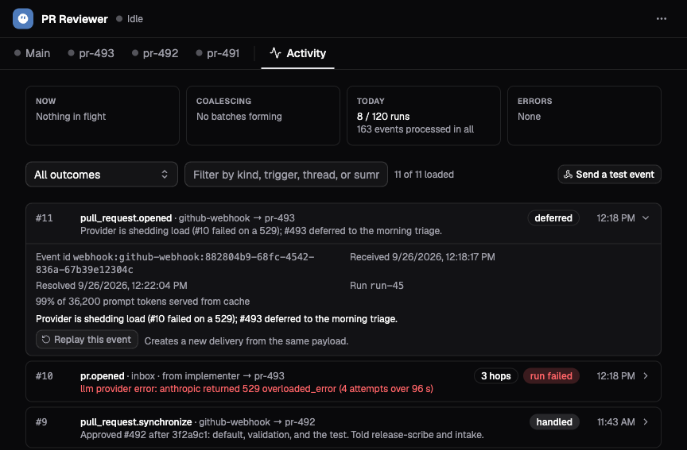

# Bots and triggers

A bot gives an agent an ongoing job and a way to receive work. It combines a
brief, a session profile, triggers, and a controller that routes admitted
events into conversations. A schedule, webhook, or connected chat can supply
the next task without someone opening a session and typing it.

The bot's **Main** conversation handles work routed to its main session.
Other events can create separate threads, for example one conversation per
incident or pull request. The bot record remains the same while those
conversations have their own histories and lifecycles.

Bot session instructions include the bot ID, exact session ID, and session
kind: `main`, `keyed`, or `per-event`. Keyed threads also receive their original
routing key, plus a human-readable thread label when it differs from the key.
Keys and labels appear as JSON-quoted data. Main and per-event sessions have
no routing key.

A routing key identifies a logical thread within a bot, such as `pr-42` or a
chat conversation key. Resetting that thread changes its concrete session ID
but retains the routing key. With `bot_emit`, omit `to` and pass that original
key as `sessionKey` to send an event back to the keyed thread. Omitting
`sessionKey` sends a self-event to Main, even from a routed thread. A session
ID or thread label is not a substitute for the original key.

These instructions are composed when a session is created or its bot profile
is reapplied. Existing routed threads retain their instructions until reset;
older routing records may lack the original key, which is then omitted rather
than inferred from the label or session ID.

This walkthrough builds `release-watch`, which reviews the Acorn release
files from [Build your first agent](../getting-started/first-agent.md). First
create the read-only `release-reviewer` profile from
[Profiles and instructions](profiles-and-instructions.md#create-a-profile-for-a-job).
Use a universe owner/admin or platform administrator account. The deployment
must run the bot controller role as well as the gateway and session workers;
the local full stack includes it.

## Create the bot and send its first event

1. Open **Bots → New bot** and choose **Blank**.
2. Under **Job**, set **Name** to `Release watch` and **Id** to `release-watch`.
   Give it this **Brief**:

   ```text
   Review Acorn release notes when an event requests a check. Use the change
   list and release notes in /workspace. Report unsupported claims, omitted
   changes, and uncertainty. Leave the files unchanged. Resolve each event
   with a concise summary of the review outcome.
   ```

3. Leave **Triggers** empty for the first test.
4. Under **Session profile**, choose **A shared profile** and select
   `release-reviewer`. The wizard otherwise creates a profile for the bot.
5. Leave **Other bots** disabled. Under **Guardrails**, set a daily run limit
   such as `20` and turn off **Can change its own brief and triggers** for this
   fixed setup. Blank bots enable that permission by default.
6. Choose **Create bot** and wait for Main to become ready. The web app asks
   the new bot to introduce itself when its conversation is ready.

Open **Activity → Send a test event**. Enter:

| Field | Value |
| --- | --- |
| Kind | `release.candidate` |
| Summary | `Review the Acorn 1.2 release notes against the saved change list.` |
| Data | `{"release":"1.2","changes":"/workspace/changes.md","notes":"/workspace/release-notes.md"}` |

Choose **Send event**. Find the numbered event in Activity, then switch to
**Main** to inspect the file reads and review. Check the event outcome in
Activity. A test event uses the durable event-admission path even when the
bot has no triggers.

Typing into the bot's Chat composer sends a conversational message. It is
useful for discussing the work, but it does not exercise the same numbered
event admission as **Send a test event**.

## Add a schedule

Open the bot's **Settings → Triggers → Add trigger** and choose **Schedule**.
For a weekday review, enter a name such as `weekday-review`, choose
**On a recurring schedule**, and set:

| Field | Value |
| --- | --- |
| Cron | `0 9 * * 1-5` |
| Timezone | `Europe/Zurich` |
| Task | `Review the current Acorn release files and report any unsupported or missing claims. Do not edit files.` |

Add the trigger. The schedule uses the specified timezone; the bot's daily
run budget resets on UTC days.
Inspect Activity after a scheduled firing to confirm delivery to the intended
conversation.

A one-time schedule uses **Fire at** and pauses itself after firing. Its saved
timestamp is immutable; create another one-time trigger when you need a new
time. Timers within a session serve a different purpose: they let active agent
work wait, while a schedule produces new bot events.

## Receive a webhook

Add a **Webhook** trigger when another system can POST an event. The trigger
row supplies an ingest URL that already identifies the bot and trigger.
The default **URL token only** verification makes that URL a bearer secret:
keep it in the sending system's protected webhook configuration.

For a small generic test, copy the URL and send:

```bash
export LIGHTSPEED_BOT_INGEST_URL="<copied trigger ingest URL>"
curl --fail-with-body "$LIGHTSPEED_BOT_INGEST_URL" \
  -H 'Content-Type: application/json' \
  --data-binary '{"kind":"release.candidate","release":"1.2","summary":"Review the saved Acorn release files."}'
```

The generic webhook preserves the whole body as the event's `data`. In this
example, a filter can inspect `data.release`; if you wrap fields in another
`data` object, their path becomes `data.data.release`. A top-level `kind`
supplies the event kind, with `webhook` as the fallback. The visible event
summary is generated from that kind; the payload's `summary` remains in data.

Identical generic webhook bodies deduplicate by their raw bytes. Posting the
same bytes again returns the existing event instead of starting fresh work.
Use a distinct source occurrence field for a genuinely new occurrence. To
deliberately repeat an already stored event, use Activity's replay action.

The other verification choices are **HMAC-SHA256 signature** and **GitHub
(signed)**. They need an active retrievable secret grant. The GitHub preset
uses GitHub's signature format and delivery ID, maps events to kinds such as
`issues.opened` and `pull_request.opened`, and can route by issue or pull
request. Configure the sender to use the matching verification scheme.

## Poll a system that cannot push events

A poll trigger turns new JSON items into events. In the trigger picker, choose
**Check a URL** or **Run a command**. Configure the interval, an optional dot
path to the items, and a change rule: **Unseen id** or **Increasing field**.
Intervals are at least one minute; the form starts at five minutes.

The first successful poll establishes a baseline and emits no events. Later
polls compare against that cursor. For example, a URL returning
`{"releases":[{"id":"acorn-1.2"}]}` can use `releases` as its items path and
`id` for unseen-item detection. Add a new ID in the source to verify that the
next poll produces an event.

An execution poll needs an existing, lasting execution environment and a
command that prints JSON to stdout. The UI enables **Run a command** when the
profile selects an existing environment. Enter one argument per line in the
command form. Create and configure the machine independently before enabling
the trigger. Leaving **Environment** blank is appropriate only when the
profile already selects an existing machine.

Changing a poll specification resets its cursor and establishes a new
baseline. Ten consecutive poll failures disable the trigger; fix the source
or command before enabling it again.

## Choose where and when events run

The trigger owns event filtering, routing, batching, and busy-session delivery.
Available advanced controls depend on the trigger type; the API exposes the
full configuration in the
[bot contract](../../../crates/api/contract/api-reference.md).

| Choice | Effect |
| --- | --- |
| Main session | Keeps related work in the bot's Main conversation. |
| Per-key routing | Computes a key with CEL, a small expression language, and reuses the thread for that key. |
| Per-event routing | Creates a fresh thread for each event. |
| Coalescing | Collects events for the same route until the quiet period, maximum wait, or maximum count is reached. |
| Queue | Starts a later run when the target conversation is busy. This is the default busy-session policy. |
| Steer | Offers the event to the active run at a subsequent model turn. |
| Append as context only | Adds context without starting a run, even when the session is idle. |

CEL filters can inspect `event`, `data`, and `headers`. A false result or
filter error refuses admission; the refused event is not stored as ordinary
bot activity. Test expressions with `bots/filters/test` before depending on
them. Chat triggers have their own conversation-based routing, described in
[Chat channels](chat-channels.md).

## Read outcomes and replay work

Activity shows the per-bot event number, kind, summary, routed session, and
outcome. Expand an event for its ID and stored detail. The number identifies
the event within this bot; it is not a model turn number.



*The demo's PR Reviewer distinguishes a deferred decision from a failed run.
Expanding an event reveals its stored outcome and replay action.*

The agent can resolve an event as `handled`, `deferred`, `ignored`, or
`blocked`, with a summary. Those are the agent's reported decisions. A
`deferred` outcome does not schedule a retry automatically. An unresolved
event has no explicit resolution, while `run_failed` records an execution
failure. System dispositions such as `steered`, `appended`, or `archived`
describe what the controller did with delivery.

**Replay this event** creates a new event and repeats the agent work using
the original routing. It can repeat external effects. This action is distinct
from deterministic workflow replay used internally to recover state.

## Pause, update, reset, or close

**Pause** stops schedule and poll production and pauses event delivery.
Already accepted external or manual events can wait for the bot to resume.
Pausing does not cancel an active run. A paired chat stays assigned to its
paused bot, but new messages are not buffered for later delivery or routed to
another bot.

The daily run limit includes bot runs and their sub-agent descendants. Work
held by the limit waits for the next UTC day. Flood protection can also pause
an individual trigger, which must be resumed separately.

The named session profile is reapplied to Main at an idle boundary after it
changes. Open routed threads keep their setup until closed. Use the
conversation menu's **Reset Main…** or corresponding thread reset when you
want a fresh conversation. Reset closes the old conversation and its open
children at an idle boundary and retains the previous history according to
retention policy. Main gets a successor as the bot reconciles; a routed
thread gets its next conversation when another event needs it.

Under **Settings → Danger zone**, **Close bot** is terminal. It cancels work,
closes conversations and descendants, archives pending events, removes
schedules, and refuses new work while keeping the bot and its history.
Deleting additionally removes the bot record, triggers, events, and
conversations, and makes its ID available again.

Profiles and environments remain independent resources. Closing or deleting a
bot or any of its sessions leaves its environments intact. Manage machine
cleanup through environment operations and idle policies.

## If an event does not produce the expected work

| Symptom | What to check |
| --- | --- |
| A test event is stored but no run starts | Check bot pause, daily budget, target-session state, and append-only delivery. |
| A webhook retry creates no second event | Identical generic payloads deduplicate; GitHub deliveries use their delivery ID. |
| A webhook never appears in Activity | Check the ingest URL, verification, trigger state, and filter. Filter refusals are not stored events. |
| The first poll appears to do nothing | It establishes a baseline. Introduce a new source item to test later delivery. |
| A trigger stopped producing events | Check poll failures, flood protection, and whether a one-time schedule already fired. |
| A successful run has no useful event outcome | Inspect the conversation and brief. The agent needs to resolve admitted events, not only write a final answer. |

To give the bot a messaging account, continue with
[Chat channels](chat-channels.md). To delegate parts of its work or coordinate
with another bot, read [Sub-agents and federation](subagents-and-federation.md).
