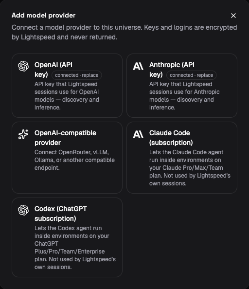

# Models and credentials

Each session selects a model through three values: a provider ID, an API kind,
and a model name. Together they tell Lightspeed where and how to make model
requests. Credentials are stored separately, so a profile can refer to a
provider without containing its API key.

For example, `openai` identifies the built-in OpenAI connection, while
`openai:responses` selects the Responses wire format. The model name selects
a model available on that connection. An OpenAI-compatible service can use
the same wire format under its own provider ID and endpoint.

Provider connections belong to a universe. Use an Operator or Admin account
to configure them on the **Models** page. Once connected, select the model in
a [profile](profiles-and-instructions.md) or session setup.

## Connect OpenAI or Anthropic

1. Open **Models → Add provider**.
2. Choose **OpenAI (API key)** or **Anthropic (API key)**.
3. Enter the provider API key and choose **Save key**.
4. Check **Available models**, then choose **Done**.
5. Open a profile and select one of those models under **Model configuration
   → Model**. Save the profile and create a new session from it.

*The demo's provider catalogue separates connections for session models from
subscriptions used by coding agents inside environments.*

Run a small task to verify that generation works. Then test one capability the
profile actually needs, such as reading a workspace file. Model discovery
confirms that a model is selectable; it does not prove that every tool,
generation setting, or media input works with that model.

The **Claude Code (subscription)** and **Codex (ChatGPT subscription)**
options on the same page supply credentials to coding agents running inside
execution environments. Lightspeed's own session model calls use the API-key
connections above. See [Environment credentials](../environments/credentials.md)
to use a subscription inside a machine.

## Connect an OpenAI-compatible provider

Compatible providers let Lightspeed use a service implementing OpenAI-style
Responses or Chat Completions endpoints. Compatibility describes the request
format; individual services and models can support different features.

Open **Models → Add provider → OpenAI-compatible
provider**. Choose a **Provider** preset for DeepSeek, OpenRouter, Ollama, or
vLLM, or choose **Custom provider**. Configure:

| Field | What to enter |
| --- | --- |
| Custom provider ID | For a custom provider, a stable identifier used by model selections. Presets supply their IDs automatically; `deepseek` and `openrouter` select the corresponding compatibility rules. |
| Base URL | The API base URL advertised by the service, including its API path when required. |
| API key (optional) | The service's key, or leave it empty for an endpoint that does not require authentication. |
| API kinds | The endpoints the service actually implements: Chat Completions, Responses, or both. The form defaults to Chat Completions. |
| Extra headers | Non-secret service-specific headers, if required. Authentication has its own field. |

Choose **Save provider**, check model discovery, and select a model in your
profile. If a provider does not list the model you need, use manual model
selection below.

The base URL must use HTTPS except for loopback addresses. It cannot contain
embedded credentials, a query, or a fragment. Extra headers cannot replace
reserved headers such as `Authorization`, `Host`, or `Content-Type`.

The runtime makes these requests. A URL containing `localhost` therefore
refers to the machine or container running that process, not the computer
running your browser. In a deployment with separate gateway and session
workers, both discovery and generation need access to the endpoint from their
respective processes.

When editing an authenticated compatible provider, reenter the existing API
key or provide a replacement, even if you are changing only its URL or
headers. The form cannot read a saved secret back into its input and requires
that reentry before saving.

## Select the route explicitly

The model picker normally presents a single choice for a model even if the
provider advertises it through two API kinds. It prefers Responses when both
are available. Choose **Enter model manually** to specify the full route:

| Field | Meaning |
| --- | --- |
| **Provider id** | The universe connection to use, such as `openai`, `anthropic`, or a compatible provider ID. |
| **API kind** | `openai:responses`, `openai:completions`, or `anthropic:messages`, as supported by that connection. |
| **Model** | The exact model identifier accepted by the provider. |

Use manual entry when discovery omits a supported model, or when you need
Chat Completions instead of the picker's preferred Responses route. Select
an API kind implemented by that provider.

For an existing session, change compatible model settings only while it is
idle. The API kind is fixed for that session because its conversation is
stored in the provider's native format. Create a new session to use another
API kind. A profile change can select a different kind for future sessions.

Leave optional reasoning and generation settings unset until you need them
and have verified the chosen model supports them. A provider can accept a
model name while refusing an incompatible parameter.

## Understand deployment defaults

An operator can supply deployment-level OpenAI or Anthropic credentials.
Those are fallback credentials when the universe has no corresponding model
record. A universe-specific record takes precedence.

This precedence is intentional. If a universe record exists but is disabled
or cannot supply a usable credential, the request fails rather than silently
using the deployment's credential. Removing the built-in provider record
allows fallback again. Consider that difference when rotating or disabling
keys.

The runtime defaults to provider `openai` and API kind `openai:responses`.
`LIGHTSPEED_CHAT_PROVIDER` and `LIGHTSPEED_CHAT_MODEL` change the default
provider ID and model name. The runtime's default API kind remains Responses,
so setting an Anthropic provider ID alone does not create an Anthropic route.
Select the full route in a profile when using Anthropic or a compatible
service. Exact deployment settings are in the
[environment-variable reference](../reference/environment-variables.md).

The API also supports model OAuth records that refer to a suitable stored
grant and audience. The broker refreshes access tokens for those records.
There is no general model OAuth setup flow in the current web app; integrations
that need it should use the authentication types and methods in the
[API reference](../../../crates/api/contract/api-reference.md).

## Check capability compatibility

Model choice affects which tools Lightspeed can expose. Built-in web search
supports Responses and Anthropic Messages; Chat Completions supports page
fetching but not that search feature. Native MCP execution works across all
three API kinds, while provider-hosted MCP has additional restrictions.
[Tools and MCP](tools-and-mcp.md) explains those choices.

Media support also depends on the selected model. Connecting a chat account
that accepts an image does not make a text-only model able to interpret it.
Verify the input types used by your actual tasks.

## If model requests fail

| Symptom | What to check |
| --- | --- |
| The provider connects but the model is missing | Refresh discovery or enter the exact route manually. Confirm that the credential can access that model. |
| Authentication fails despite a deployment key | Check for an existing universe provider record. Disabled or unusable records block fallback. |
| A compatible service is unreachable | Test reachability from the gateway and session-worker network, and check the base URL and API path. |
| A request rejects tools or generation parameters | Reduce the setup to the supported capabilities and leave optional parameters unset. Discovery alone does not establish feature compatibility. |
| A subscription login did not enable session inference | Configure the model provider separately; coding-agent subscription integrations serve tools inside environments. |
| Updating a profile did not change the current session | Start a new session or update the idle session's setup explicitly. See [Profiles and instructions](profiles-and-instructions.md). |
