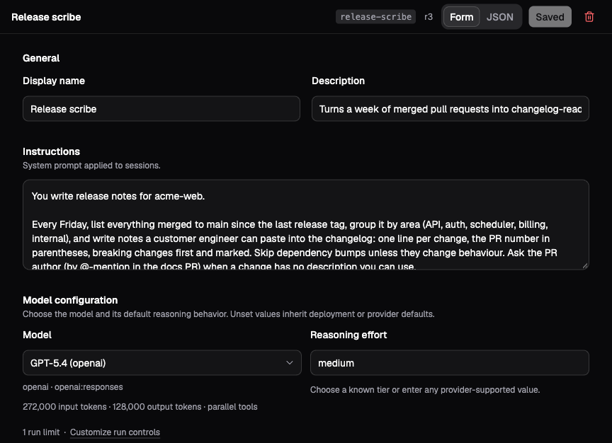

# Profiles and instructions

A profile is a reusable agent setup. It collects the model, instructions,
capabilities, workspace links, and optional environment selection that a
session needs. You can use the same profile for an interactive session, a
bot, or a delegated sub-agent.

For example, a release editor needs instructions about factual claims, a
model that can call tools, and write access to the release workspace. A
release reviewer can use the same files with read-only access and a different
job. Separate profiles make those differences explicit and repeatable.

Profiles belong to a universe. Use a universe owner/admin or platform
administrator account to manage them.

## Create a profile for a job

Open **Profiles → New profile**. Give it a **Display name**, a stable
**Profile id**, and choose **Empty profile** under **Start from**. Choose
**Create** to open the editor.

The editor has **Form** and **JSON** views of the same setup. Start with the
form; use JSON when you need to inspect or transfer the underlying document.
The [API reference](../../../crates/api/contract/api-reference.md) defines
the full `ProfileDocument` and `SessionConfig` shapes.



*The demo's Release scribe profile shows where instructions and model
settings live. Use the reviewer instructions below for this walkthrough.*

Set **Description** to a short account of when this agent is useful. For a
reviewer, use something like:

```text
Checks release notes against a supplied change list and reports unsupported
claims without editing files.
```

Descriptions help people choose profiles and help a delegating agent select
the right specialist. Put the actual procedure in **Instructions**:

```text
You review release notes against the source material supplied for the task.
Read the change list and the proposed release notes before reaching a
conclusion. For each unsupported or missing claim, cite the relevant file
and explain the discrepancy. Do not edit files. If the source is ambiguous,
report the uncertainty instead of filling in the gap.
```

Select an explicit **Model** and enable the capabilities this job requires.
For the reviewer, enable **Virtual File System: Files, Instructions, Skills**,
set **File tools** to **Read only**, and link the `release-notes` workspace at
`/workspace` with **Read only** access. Save the profile as `release-reviewer`.

Create a session from it and ask it to compare `/workspace/changes.md` with
`/workspace/release-notes.md`. Verify both the review and the tool activity.
The [first-agent walkthrough](../getting-started/first-agent.md) shows the
corresponding editor profile and source files.

## Give instructions and grant capabilities

Instructions explain how the agent should work. Capabilities determine which
operations Lightspeed makes available. Both matter: “do not edit files”
expresses the reviewer's procedure, while read-only tools and links enforce
the file-access boundary even if the model asks to write.

The profile editor groups grants into VFS, Web, Sub-agents, Timers,
Environments, and MCP Servers. Leaving a feature absent supplies no tools
from that feature. Enabling one can require further choices, such as which
workspace to link, which child profiles can be called, or which MCP server
to expose.

VFS file tools and Environments together also grant
[VFS transfer tools](../environments/vfs-transfer.md). **Read only** VFS tools
enable materialize into the selected environment; **Edit files** additionally
enable capture into writable workspace links. Prompt or skill sourcing without
file tools does not enable transfers. These rules also apply in session settings.

VFS **Skill discovery** and **Prompt loading** are separate opt-in switches.
Each enables its configuration block (`features.vfs.skills` or
`features.vfs.prompts`); an empty block uses conventional directories beneath
workspace links. Optional root overrides replace the defaults. Clearing an
override restores defaults; switching off disables that source. File tools and
links alone enable neither source. Environment skill discovery is configured
independently under `features.environments.skills`; environment prompts use
`features.environments.prompts` with the same enablement and override rules.

Each domain has a **Working directory** setting: `features.vfs.workingDirectory`
(default `/`) and `features.environments.workingDirectory` (default supplied by
the selected machine). Configure `/workspace` explicitly if that is the desired
VFS base. Environment file tools, commands, jobs, and discovery share the machine
base; a per-command `cwd` override does not change the session setting.

Apply the same reasoning to delegated work. A parent that can call a powerful
child profile can ask that child to use its capabilities. The child's setup
is independent; it is not automatically reduced to the parent's grants.
[Sub-agents and federation](subagents-and-federation.md) explains that boundary.

Keep credentials in the universe's integrations and secrets. Profiles refer
to provider IDs, MCP server IDs, and environment configuration rather than
embedding API keys in instructions. See
[Models and credentials](models-and-credentials.md) and
[Tools and MCP](tools-and-mcp.md).

## Combine profile text with workspace instructions

Profile **Instructions** can hold the agent's stable role and working rules.
For project-specific instructions that should travel with files, configure
VFS **Prompt roots**. Lightspeed loads the prompt files from those roots and
combines them with the profile's instruction text.

The profile text comes before the sourced files. That is an ordering rule,
not a system for resolving contradictory prose. If one source says to edit
the document and another says never to edit it, remove the contradiction.
There is no field-level override operation between English instructions.

Built-in default instructions are a fallback when no authored instruction
sources remain. They are removed when custom instructions are present. In
an existing session, editing **Custom instructions** changes the same managed
instruction layer used for profile text; clearing it still leaves any sourced
prompt files active.

Use a skill for a procedure the agent needs only on relevant tasks. Skill
discovery presents a short catalog, allowing the agent to read the procedure
when useful. [Workspaces and skills](workspaces-and-skills.md) walks through
both prompt sourcing and a review skill.

## Apply changes deliberately

A new ordinary session receives the profile's setup at creation. Saving a
later profile revision affects future sessions; it does not alter those
existing conversations automatically.

For a one-off change, open the idle session's **Session settings**, edit the
setup, and choose **Apply setup**. To apply a saved profile to an existing
ordinary session, use the CLI with the connection settings described in
[Sessions and runs](sessions-and-runs.md#continue-from-the-cli):

```bash
target/debug/lightspeed profiles apply "<session-id>" --profile release-reviewer
```

The API equivalent is `session/profiles/apply`. The session must be open with
no active or queued runs. Its API kind is fixed for the lifetime of the
session, so the applied profile must use that same kind. Create a new session
when changing API kinds.

Applying a profile is not a deep merge of every field:

| Profile content | Effect on an existing session |
| --- | --- |
| `config` present | Replaces the session configuration as a whole. Include the capabilities and links you intend to retain. |
| `config` absent | Leaves the current configuration in place. |
| `instructions` present or absent | Replaces or clears the profile instruction layer. Sourced prompt files follow the resulting VFS setup. |
| `environment` absent | Leaves the active environment unchanged. |
| `environment` present | Applies that selection or provisioning intent. |
| Metadata and retention defaults | Remain creation defaults; applying the profile does not rewrite the existing session's metadata or retention. |

Bots follow their named profile differently. Their Main conversation adopts
profile changes at a later idle reconciliation. Existing routed threads keep
their setup until closed and replaced. A shared profile can therefore affect
several bots; review its users before changing their grants or model. If a
new API kind requires a fresh Main conversation, the controller creates a
successor. See [Bots and triggers](bots-and-triggers.md).

## Set limits and environment intent

The advanced **Run limits** fields include **Max turns** and **Max tool
rounds**. They bound a run's work under the selected defaults. API callers can
provide per-run overrides, so these fields should not be treated as hard
authorization ceilings. Bot daily budgets and sub-agent tree limits govern
different scopes.

An environment intent can select an existing environment or provision one
for a session. A delegated child can also explicitly inherit its parent's
active environment. Existing and inherited environments are shared machines;
provisioning can create a separate one with its own session-close policy.
The profile must grant the relevant environment capability as well as select
the machine. Read [Environments](../environments/overview.md) before adding
compute to a profile that currently needs only VFS files.

Metadata and retention settings supply defaults for newly created sessions.
Use metadata for organization, such as `project=acorn`, and retention to
choose how long a closed session tree should remain stored. Neither supplies
instructions to the agent.

## If the setup does not take effect

| Symptom | What to check |
| --- | --- |
| A saved profile change has no effect in an ordinary session | Apply it explicitly, edit session setup, or start a new session. |
| The agent describes a tool it cannot call | Check the feature grant and its target configuration; instructions alone do not expose tools. |
| Applying a profile removes a previous capability | A supplied `config` replaces the whole configuration. Include all intended grants. |
| Clearing custom instructions leaves instructions active | Check VFS prompt roots and their files. Those are a separate authored source. |
| A bot thread still uses the previous setup | Main reconciles at idle, while an existing routed thread keeps its setup. Reset the appropriate conversation when ready. |
| A concurrent edit is rejected | Reload the current profile or session revision, review the other change, then save again. |
