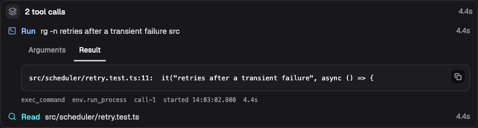

# Sessions and runs

A session holds an agent's conversation and setup. A run is one attempt to
carry out a task in that session: it can contain several model turns and tool
calls before the agent finishes, fails, or is canceled. Sending another task
starts another run with the conversation that came before it.

This distinction gives you two kinds of control. You can ask for more work
after the current task, or change what the agent is doing now. The session
retains both the work and its history when you leave the page.

Use a universe owner/admin or platform administrator account for the web
procedures below. If you haven't completed a task yet, start with
[Build your first agent](../getting-started/first-agent.md).

## Start and continue a session

Open **Sessions → New session**, enter a **Name**, and select a **Profile**.
Choose **Create** to use the saved profile. **Customize setup…** lets you
change the setup for this session without saving those changes back to the
profile. You can also start without a profile and configure the session
directly.

Send a task in the composer. For the release editor from the first-agent
walkthrough, try:

```text
Read /workspace/changes.md and /workspace/release-notes.md.
Check every release-note claim against the change list.
Report any mismatch, but leave the files unchanged.
```

When the answer arrives, send a follow-up in the same session. The agent can
use the earlier conversation and its linked files. Starting a new session
from the same profile gives you a fresh conversation; workspace links may
still point to the same shared files.

## Queue, steer, or stop work

Only one run is active in a session at a time. The composer changes its
behavior while that run is working:

| Action | Effect |
| --- | --- |
| Send while idle | Starts a run. |
| Send while a run is active | Queues a separate run after the current work. Queued runs execute in order. |
| **Cmd+Enter** on macOS, **Ctrl+Enter** elsewhere | Steers the active run with an additional instruction. |
| **Shift+Enter** | Adds a newline in the composer. |
| **Stop run** | Requests cancellation of the active run. |
| Cancel an item in the queued-runs bar | Removes that queued task without stopping the active one. |

Suppose the release editor is checking a long document. Queue
“After this, write a short summary” when that is a second task. Steer with
“Focus the current review on compatibility claims” when you want to change
the review already in progress.

Steering reaches the agent at its next model turn. It does not interrupt a
model response or tool call already executing. If the run is waiting for a
promise, steering waits with it; it does not wake the run by itself.

Cancellation stops further work and requests cancellation of active model and
tool activities. It does not undo effects that have already happened, such as
a saved file or a message sent by a tool. Wait for the run to reach its
canceled state before treating it as stopped. Other queued runs remain queued
and can start afterward, so cancel them separately if you want the session to
remain idle.

For environment commands, canceling a tool activity does not guarantee that
its remote operating-system process has stopped. Inspect and stop that
process explicitly as described in
[Processes and jobs](../environments/processes-and-jobs.md#collect-output-and-stop-a-process).

Some tools pause for approval. Review their arguments and choose **Approve**
or **Reject** for each pending call. The run continues once every pending
decision has been made. See [Tools and MCP](tools-and-mcp.md) for configuring
that policy.

## Inspect what happened

The transcript shows messages and tool activity. Every step a run takes is
one row: an icon for the kind of activity, a verb such as **Read**, **Run**,
**Delegate**, or **Emit**, its target, and how long it took. A finished step
carries no badge; only running, waiting, failed, and cancelled steps are
marked. Click a row to inspect its **Arguments**, **Result**, **Error**, and
any reported **Effects**, with the raw tool name, call id, timing, and output
size on a small line beneath. A final answer saying that a file was saved is
useful, but the tool result and the file itself let you verify the operation.
Images and documents a tool handed the model appear above the tool's result
as thumbnails and document chips; click one to open it at full size. Images
sent with your own message show in the input band the same way, and an image
or document the assistant references by its `media:` handle renders inline
in the reply.

When a run finishes, its thinking, tool calls, and interim notes fold behind
one strip that names the outcome ("Worked for 2m 14s", "Failed after 38s")
and the number of tool calls; the final reply stays visible below it. Click
the strip to open that run. **Collapse completed runs** in the session title
menu controls whether runs load folded; turning it off keeps every run open.
Events delivered to a bot appear as bands headed by their sender and kind.



*Demo mode: an expanded tool call in “Fix flaky scheduler test.” The result
shows what the command found; **Arguments** shows the submitted request.*

Each finished run's strip ends with its context and usage figures (on a
phone they sit at the top of the opened run instead); click them for the
breakdown, or turn them off with **Show run statistics** in the session title
menu. The context figure describes the last model request; cumulative token
figures cover the run. These answer different questions: how much context the
last call used, and how much model work the whole task consumed. A missing
measurement means it was unavailable.

Long conversations load a recent window first. Scroll upward to load older
history. Context compaction can reduce what the model carries into future
calls while leaving the retained transcript available to inspect. It does
not mean that the agent will reproduce every earlier detail from memory; keep
important source material in files it can read again.

## Find and change a session

Use **Filter sessions** in the session list to show closed sessions or
sub-agent sessions. Both can be hidden by the **Hide closed sessions** and
**Hide sub-agent sessions** checkboxes. **Metadata filters** accept
`key=value` pairs, and **Metadata keys to show** adds useful values to the
list.

Metadata is a descriptive map, for example `project=acorn` and
`purpose=release-review`. It does not grant access or instruct the model.
Open **Session settings** to edit it, custom instructions, model configuration,
and other setup, then choose **Apply setup**. Changes to the agent's working
setup require an open session with no active or queued runs.

Existing ordinary sessions keep the setup they received at creation. Editing
their source profile does not update them automatically. See
[Profiles and instructions](profiles-and-instructions.md) for explicit profile
application and the different behavior of bot conversations.

The core and storage support history forks and configuration-only clones, but
the current web app, user CLI, and public RPC contract do not expose an action
to create them. To start a fresh conversation with the same setup, create a
session from the same profile.

## Continue from the CLI

The CLI can open the same session as the web app. On Linux x86_64,
[download the prebuilt CLI](../deployment/self-hosting.md#download-standalone-binaries)
from the release matching your server. You can also build it from the repository:

```bash
cargo build --locked -p cli
```

The example below uses the source build's `target/debug/lightspeed`; replace
that path with `./lightspeed` if you extracted the release binary into your
current directory.

For the development launcher stack from the quickstart, use its private runtime gateway
and the universe UUID from **Settings → General → Identifiers → Lightspeed
universe**:

```bash
export LIGHTSPEED_API_URL=http://127.0.0.1:18080/rpc
export LIGHTSPEED_UNIVERSE="<Lightspeed universe UUID>"
target/debug/lightspeed chat --session "<session-id>"
```

Copy the session ID from **Session details** in the web app's title menu.
The universe UUID is distinct from the readable slug in the browser URL.
For a remote installation, use the gateway address and authentication supplied
by the operator. API-key gateway mode uses `LIGHTSPEED_API_KEY`; it does not
use the trusted universe header from this local example.

Inside the terminal interface, `/help` lists commands. `/steer` sends an
instruction to the active run, and `/approve` or `/reject` decides a pending
approval by ID. `/interrupt` cancels the newest queued run first, or the active
run when no queued run exists. `/quit` exits the interface and leaves the
session available to reopen.

Applications can use `session/runs/start`, `session/runs/read`,
`session/runs/steer`, and `session/runs/cancel` from the
[API reference](../../../crates/api/contract/api-reference.md). Starting a run
acknowledges admission; follow its state and events to obtain the final result.
Use a stable `submissionId` when retrying the same submission.

## Close and retain a session

Leaving a browser tab or quitting the CLI has no effect on session lifecycle.
**Close session** is a separate, permanent action: a closed session cannot
accept more work or be reopened. Its retained history is still inspectable.
**Force close session** also cancels outstanding work, including queued runs.

Closed ordinary sessions can be deleted. **Also delete forks and delegated
children** includes their retention descendants, which must also be closed;
configuration-only clones are separate. **Delete after close (days)** sets
automatic retention, with a blank value keeping history until manual deletion.
The root session owns this policy for its retention tree, so descendants do
not independently choose how long that tree is kept.

Bot and channel conversations have a lifecycle controller. Their session
inspector identifies what manages them; use that controller's reset or close
actions. If you enable direct input in a managed-session inspector, you bypass
the controller's normal event admission, routing, and delivery policies. Use
the [bot conversation](bots-and-triggers.md) or connected chat for normal work.

## If a session behaves unexpectedly

| Symptom | What to check |
| --- | --- |
| A message is waiting while the agent works | It may be a queued run. Use steering for an instruction intended for the current task. |
| Steering has no immediate visible effect | The current model call or tool batch must finish before the next model turn can consume it. |
| Work starts again after stopping | Check for other queued runs. Stopping one run leaves those tasks in place. |
| Setup changes are refused | Wait for active work to finish and drain or cancel queued runs. Reload settings if another editor changed them. |
| A finished child or closed conversation is missing | Clear both hide filters, or follow the child link from the parent transcript. |
| The agent lost a detail from much earlier | Inspect the retained history and restate the needed fact or point it to the source file. The current model context can be smaller than the transcript. |
