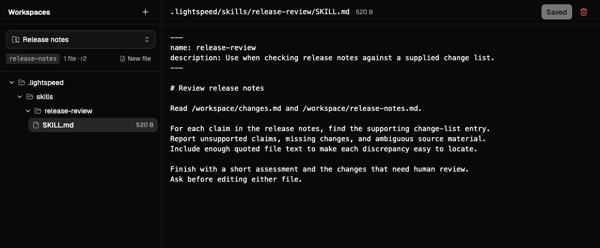

# Workspaces and skills

A VFS workspace holds persistent files that agents and people can read and
edit. A session links the workspace at an absolute path, such as `/workspace`.
The link makes those files visible to the agent without attaching an operating
system or starting a machine.

The same files can also supply instructions and reusable skills. Prompt files
provide instructions that are loaded for the session. Skills describe
procedures the agent can discover and read when a task calls for them. This
lets a project keep its source material and working conventions together.

This guide extends the `release-notes` workspace from
[Build your first agent](../getting-started/first-agent.md). Use a universe
owner/admin or platform administrator account to manage workspaces and profiles.

## Link files into a session

Create or select a workspace under **Workspaces**. **New file** accepts a path
relative to that workspace, and creates directories in the path as needed.
Open a file, edit its contents, and choose **Save**.

In a profile's **Virtual File System: Files, Instructions, Skills** section,
choose **File tools**, then add a **Workspace link**:

| Setting | Meaning |
| --- | --- |
| **File tools → No file tools** | Supplies no model-callable VFS file operations. |
| **File tools → Read only** | Lets the agent inspect accessible files. |
| **File tools → Edit files** | Adds editing operations, subject to link permissions. |
| **Target type → Workspace** | Reads the live workspace as it changes. |
| **Target type → Snapshot** | Reads an immutable snapshot. Snapshot links are always read-only. |
| **Session path** | The absolute path where this agent sees the linked files. |
| **Access** | Whether this link permits writes to a live workspace. |

To edit `release-notes`, use **Edit files**, a live workspace link at
`/workspace`, and **Read and write** access. A reviewer can use **Read only**
for both the tools and the link. Link paths cannot overlap, and prompt or skill
roots must fall inside a configured link.

A profile linking the same workspace into several sessions shares its live
files. A change made by one session becomes visible to another on a subsequent
file operation. A snapshot gives a reader a fixed version instead. For tasks
that must produce independent artifacts, create separate workspaces or use
different output paths deliberately.

## Add project instructions

In **Workspaces → Release notes → New file**, enter
`.lightspeed/prompts/instructions.md`. Create it, enter this text, and save:

```markdown
# Acorn release documentation

The change list in /workspace/changes.md is the source for release claims.
Use "Acorn 1.2" as the release name. Preserve uncertainty in the source:
an absent compatibility statement is not evidence of compatibility.
```

Open the release-editor profile and enable **Prompt loading** under
**Virtual File System**. Leave **VFS prompt roots** empty to use conventional
directories beneath each workspace link. Save, then create a new session from the
profile or apply the updated setup to an existing idle session.

Lightspeed looks inside each configured root for `instructions.md`, followed
by Markdown files directly inside `instructions.d/` in alphabetical order.
For example, this optional file adds a second instruction source:

```text
.lightspeed/prompts/instructions.d/010-style.md
```

Use it for a short convention such as “Use sentence case for headings.” The
capability is explicit: merely placing `.lightspeed` files in a workspace does
not enable sourcing. With `prompts: {}`, Lightspeed searches `.agents/prompts`
and `.lightspeed/prompts` beneath each workspace link, including snapshot links.
Optional comma-separated root overrides replace these defaults. Clearing the
field restores defaults; switching off **Prompt loading** disables sourcing
and removes its sourced instructions at the next reconciliation. Roots have a
deterministic order; their order in the textbox is not a priority mechanism.

Sourced files combine with the profile's custom text. Keep them consistent;
their ordering does not resolve conflicting instructions. See
[Profiles and instructions](profiles-and-instructions.md#combine-profile-text-with-workspace-instructions)
for how those sources fit together.

## Add a skill

A skill has its own directory directly inside a configured skill root. Create
`.lightspeed/skills/release-review/SKILL.md` in the same workspace, then save:

```markdown
---
name: release-review
description: Use when checking release notes against a supplied change list.
---

# Review release notes

Read /workspace/changes.md and /workspace/release-notes.md.

For each claim in the release notes, find the supporting change-list entry.
Report unsupported claims, missing changes, and ambiguous source material.
Include enough quoted file text to make each discrepancy easy to locate.

Finish with a short assessment and the changes that need human review.
Ask before editing either file.
```



*The walkthrough's skill file, entered in demo mode. The file tree shows its
workspace-relative path; the instructions use session paths under `/workspace`.*

Enable **Skill discovery** under **Virtual File System** and set **VFS skill roots** in the profile to `/workspace/.lightspeed/skills`, keeping
readable file tools and the workspace link enabled. Save the profile and
start a session from it. The resulting workspace layout is:

```text
release-notes/
├── changes.md
├── release-notes.md
└── .lightspeed/
    ├── prompts/
    │   ├── instructions.md
    │   └── instructions.d/
    │       └── 010-style.md       # Optional additional instructions
    └── skills/
        └── release-review/
            └── SKILL.md
```

The filename must be `SKILL.md`. Both `name` and `description` are required
frontmatter fields. Frontmatter is YAML: multiline descriptions and nested optional
metadata are supported. Unknown metadata does not grant permissions or execute hooks.
Discovery checks skill directories immediately inside each root rather than
recursively searching arbitrary directory trees.

Now send:

```text
Use the release-review skill to check the Acorn release notes.
Read the skill file before reviewing. Report findings without editing files.
```

Inspect the transcript for a read of the skill and both input files. The
catalog initially supplies names, descriptions, and paths; it does not inject
every skill body into the conversation. Reading the relevant procedure keeps
unused skills out of the working context.

## Select a skill explicitly

With the [CLI connection settings](sessions-and-runs.md#continue-from-the-cli)
configured, list the discovered skills:

```bash
target/debug/lightspeed skills list --session "<session-id>"
```

Copy the returned skill ID. It identifies a catalog entry and may differ from
the skill's name. Submit a request to read and use it:

```bash
target/debug/lightspeed skills use --session "<session-id>" "<skill-id>"
```

This starts an ordinary run when idle, or steers the current run. The instruction
includes the source domain, document path, and base directory for supporting files. In the
chat TUI, `/skills` lists entries, `/skill` opens the picker, and
`/skill <skill-id>` selects an entry directly, including during an active run.

API clients can use `session/skills/list` to obtain the same locations and submit
ordinary input through `session/runs/start` or `session/runs/steer`. See the
[API reference](../../../crates/api/contract/api-reference.md).

Skill selection has no activation state, scope, or deactivation operation.
Skill reads and any skill text inserted as ordinary conversation content can be
compacted like other messages and tool results. The current catalog remains
available; the agent can reread a skill if needed. Mandatory persistent guidance
belongs in the existing instruction mechanism.

## Configure VFS discovery explicitly

VFS skill discovery is independently opt-in through the session or profile's
`features.vfs.skills` block. An empty block enables `.agents/skills` and
`.lightspeed/skills` beneath each workspace link, including snapshot links.
No links means nothing to discover. For example:

```json
{
  "features": {
    "vfs": {
      "workspaceLinks": [{
        "path": "/workspace",
        "target": { "type": "workspace", "workspaceId": "release-notes" },
        "access": "readOnly"
      }],
      "tools": "readOnly",
      "skills": {}
    }
  }
}
```

Omitting `features.vfs.skills` disables discovery and removes its runtime
catalog. To replace the conventional roots, supply a nonempty `roots` list of
absolute paths inside workspace links, such as
`"skills": { "roots": ["/workspace/team-skills"] }`. An explicit empty list
and paths outside links are invalid. Workspace links, filesystem tools, prompt
sourcing, and CLI chat defaults do not enable skill discovery.

The profile editor, new-session form, and session settings expose a
**Skill discovery** switch under **Virtual File System**. It enables defaults
immediately. Optional **VFS skill roots** replace the defaults; clearing the
field restores defaults while leaving discovery enabled. Turn the switch off
to disable discovery. CLI profile documents use the same configuration.

The same enablement rules apply to `features.vfs.prompts`: absent is disabled,
`prompts: {}` uses conventional roots, and explicit roots replace them. Prompts
are loaded automatically as instructions; skills are advertised for the agent
to read when relevant.

Changes are discovered at eligible idle boundaries, including preparation for
new work when no run is active or queued. There are no within-run refresh
hooks. Disabling VFS discovery removes only its catalog; independently
configured environment discovery and its catalog are unchanged. Catalogs keep
separate identities with no cross-domain merging, deduplication, or fallback.

## Discover skills installed on a machine

In the profile editor, new-session form, or session settings, enable
**Skill discovery** under **Environments**. Leave the fields empty to use
environment defaults, or set **Working directory**, **Project root**, and
**Additional skill roots**. The switch is independent of VFS discovery.

The equivalent session or profile configuration is:

```json
{
  "features": {
    "environments": {
      "skills": {
        "workingDirectory": "/workspace/project/src",
        "projectRoot": "/workspace/project",
        "additionalRoots": ["/opt/team-skills"]
      }
    }
  }
}
```

An empty `skills: {}` uses the selected endpoint's default working directory.
Omitting `skills` disables environment discovery. `workingDirectory` and
`projectRoot` must be absolute machine paths. Without `projectRoot`, only the
working directory is searched for project roots; with it, each ancestor through
that boundary is included. A shell command's temporary `cd` does not change
this scope. Additional roots may be absolute or relative to `workingDirectory`.

Discovery checks `.agents/skills/`, `.lightspeed/skills/`, `.claude/skills/`, and
`.codex/skills/` beneath the project directories. In the execution user’s home
reported by the endpoint, only `.agents/skills/` and `.lightspeed/skills/` are
searched automatically, even when home is the working directory or project
boundary. Home `.claude/skills/` and `.codex/skills/` require explicit additional
roots. This supports ordinary installer output and manually
copied directories. Directory symlinks may point to canonical installations
inside the endpoint's filesystem access scope. Aliases to one canonical skill
directory collapse within that environment; independent copies and equal names
remain separate entries.

The environment catalog has the stable context key
`runtime.catalog.skills.environment`; VFS retains `runtime.catalog.skills.vfs`.
`session/skills/list` returns a `catalogs` array. Every catalog has a `source`
(`{ "type": "vfs" }` or `{ "type": "environment", "environmentId": "…" }`),
`catalogRef`, `availability`, `skills`, and `warnings`. Source identity belongs
to the catalog; each skill contains metadata and readable directory/document
paths. Runtime context keys are not exposed in this response. An absent catalog
is omitted; an observed empty or unavailable catalog retains its own section.
The CLI and chat picker retain separate catalog sections and select skills by
their distinct IDs. Environment skills are
read with environment file tools and their scripts run with process tools on
that machine. VFS skills continue to use VFS tools. Copies in both domains are
advertised independently, with no deduplication or automatic fallback.

The runtime scans only at an eligible idle refresh (including idle API reads and
preparation before new work), with no active or queued run. Installing a skill,
finishing a tool/job, or continuing a model turn does not trigger discovery.
Direct file reads always see the current machine file. Selecting another
machine invalidates the former machine's catalog before the next model call;
discovering the new machine waits for the next eligible idle boundary.

Discovery never wakes an offline or paused machine. It requires `fs/scan`,
filesystem read access, and endpoint home/default-directory metadata; there is
no shell or per-file discovery fallback. A scan is bounded to 32 roots, 4,096
visited entries, depth 8, 64 KiB per document, 2 MiB of inspected content, and a
2-second local scan budget. Network discovery is bounded to four seconds.
Missing roots are successful empty observations; inaccessible roots, dangling
links, loops, or limits make the source incomplete. A failed/incomplete refresh
retains the last catalog for that same environment as stale; it never publishes
a partial list as a complete replacement. Scan diagnostics appear in runtime
debug logs. A changed body without changed catalog metadata causes no context
update. Changed metadata appends the usual bounded catalog successor.

## Update files and handle concurrent edits

Live workspace operations resolve the current workspace revision. Writes
check that revision before committing a replacement. If another writer has
changed it, the write can fail with a conflict; Lightspeed does not merge
competing edits automatically. Reload the current file, compare the changes,
and make the intended edit against the new revision.

Prompt sources and skill catalogs refresh at an idle run boundary, or through
the relevant idle API reads. There is no catalog refresh within a run. A later
ordinary skill read sees the current live workspace contents; an immutable
snapshot read keeps its snapshot semantics. Discovery does not pin a separate
copy of the skill body. Previously recorded tool results and inserted text
retain their original bytes during replay, even after the source changes.

A VFS workspace remains a separate filesystem from any execution environment.
Linking `/workspace` does not mount it into a container or daemon machine.
Transfer files explicitly when a process needs them; see
[Environments](../environments/overview.md).

## If files or instructions are missing

| Symptom | What to check |
| --- | --- |
| A file exists in the browser but the agent cannot find it | Combine its workspace-relative path with the link's session path, and check the current session setup. |
| A write fails despite edit tools | Check link access and whether the target is a snapshot. Read-only links remain read-only. |
| Prompt files have no effect | Enable Prompt loading, check the default or overridden roots inside links, use the conventional filenames, and start the next run after the update. |
| A skill is absent from the catalog | Enable Skill discovery and check the default or overridden root, direct child directory, exact `SKILL.md` name, and required frontmatter. |
| A discovered skill has not affected the answer | Inspect whether the agent read it, or select it with `/skill` or `skills use`. Discovery alone loads only its catalog entry. |
| Saving reports a revision conflict | Reload and reconcile with the intervening edit; do not assume the save was merged. |

## Copy files to or from a machine

Linking a VFS workspace does not put it on an execution environment. With both
VFS tools and environment access enabled, use `vfs_materialize` for a file,
subtree or whole workspace, and `vfs_capture` to save machine outputs into an
editable workspace. These tools handle binary files and executable scripts
without passing their bytes through the model. See
[VFS transfer](../environments/vfs-transfer.md) for replacement and retry behavior.
