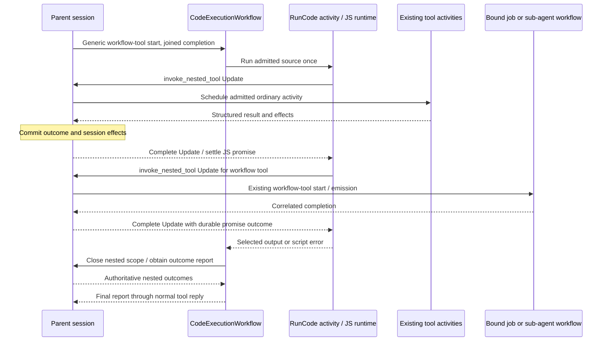

# Later — Code mode

**Status:** Proposed direction, updated 2026-10-07. No implementation started.
Add code mode as a session feature, accepting JavaScript in native QuickJS
inside a dedicated code worker. V1 targets Lightspeed's current trusted
deployments. Wasm isolation and TypeScript source support are later phases.
A separate code workflow owns script execution; the parent session owns all
nested tool admission, scheduling, and durable outcomes. The first version
runs each script once, without JS checkpointing or replay. Names and schemas
below are illustrative, not public API commitments.

## Purpose and scope

Code mode lets the model write a short program that calls authorized tools,
combines their results, and returns only useful output. Loops, conditional
calls, parallel requests, and filtering happen without a model round trip for
every operation. This is especially useful for large tool results and fan-out
to sub-agents or jobs. Model services such as transcription, image generation,
and typed decisions can participate later, after gaining ordinary tool support.

The program runs in Lightspeed's runtime, independently of any attached
execution environment. It can ask an authorized environment tool to execute
a command, but the orchestration script itself is not an environment process.
VFS and environment files remain separate domains accessed through their
existing tools.

The agreed first-version boundaries are:

- Normal asynchronous JavaScript: top-level `await`, loops, branching,
  dependent effects, `Promise.all`, and `Promise.allSettled`.
- Native QuickJS in the code-worker process, with a fresh runtime per execution
  and a restricted host API. This does not provide Wasm memory containment.
- JavaScript source only. TypeScript transpilation is deferred independently
  of the later Wasm integration.
- Tool contracts presented directly as JSON Schema. Generating TypeScript
  declarations from those schemas is an optional later presentation change.
- Capabilities derived from the session's existing grants and bindings,
  further constrained by the code-mode feature configuration. Every substantive
  effect must also be supported as an ordinary Lightspeed tool capability.
- Existing activity policies for individual effects, including their retry,
  timeout, concurrency, attribution, and cancellation rules.
- Workflow-backed tools, including `agent_run`, `agent_spawn`, `job_run`, and
  `job_submit`, with the existing durable promise semantics.
- One execution attempt for the JavaScript program. On failure, return the
  known outcomes and let the model decide what to do next.
- Reject approval-requiring calls before executing the protected effect.
  Durable approval suspension and script resumption are outside v1.

This builds on the existing [architecture](../../documentation/how-it-works/architecture.md)
and [workflow-tool protocol](../../documentation/how-it-works/tools-and-controller-workflows.md).
It does not introduce another general workflow engine.

## Execution architecture

Expose `code_execute` through a trusted workflow-tool declaration using
`Start` delivery and `Joined` completion, like `job_run`. Its recipe starts a
`CodeExecutionWorkflow`. The parent session records the invocation and waits
for the final report using the normal completion promise, reply validation,
and result-recovery protocol.

Keep script lifecycle and session authority separate:

| Component | Responsibility |
| --- | --- |
| `CodeExecutionWorkflow` | Own one `RunCode` attempt, its deadline and cancellation, scope closure, and the final report. |
| `RunCode` activity | Host the interpreter, guest promises, local computation, and a narrow trusted effect bridge. |
| Parent session workflow | Admit every nested tool call, schedule existing activities/workflow tools, apply session effects, and retain authoritative outcomes. |

The trusted Rust bridge sends each tool request directly to the parent session.
The code workflow does not relay every request and result. Guest functions do
not receive Temporal clients, gateway clients, or runtime internals.



### One generic session-owned execution path

The preferred bridge uses an asynchronous Temporal Workflow Update such as
`invoke_nested_tool(execution_id, request_id, binding_id, arguments_ref)`.
Its handler enqueues admission through the parent session's serialized state
path and awaits the nested outcome without blocking that path. The session
uses the admitted binding, schedules the existing activity or workflow-tool
operation, and commits the result and effects before completing the Update.
Several requests may be outstanding; state transitions are serialized while
eligible activities can run concurrently.

This is a generic nested-tool operation, not a code-specific copy of each
tool implementation. Temporal supplies transport, task routing, and the
request/response mechanism. Lightspeed supplies admission, correlation,
deduplication, and lifecycle semantics. All tools use this path in v1; do not
split ordinary calls into a second executor-owned path based on a copied
session snapshot.

Temporal's Rust SDK supports asynchronous update handlers, including waiting
for activities. The repository currently pins SDK 1.0.0. An activity cannot
use a workflow context to schedule ordinary workflow-owned activities, but it
can use a client to send an Update to the session workflow. This does not
require that session to own the `RunCode` activity. See Temporal's
[Rust message-passing documentation](https://docs.temporal.io/develop/rust/workflows/message-passing)
and [task-queue routing](https://docs.temporal.io/task-queue).

Reuse the actual scheduled activity boundary, not just the Rust function
behind an activity. Ordinary effects should use the admitted
`ToolExecutionSpec` and
[`tool_call_activity_options`](../../../crates/temporal-workflow/src/config.rs).
Calling the same implementation directly from `RunCode` would lose independent
Temporal scheduling, history, retry, and timeout behavior.

Preserve the distinction between an infrastructure failure eligible for an
activity retry and a tool-level failure returned as data. Retry-safe effects
retain their bounded policies; process and other non-retry-safe work must not
gain retries merely because JavaScript requested it. The code worker does not
dispatch tool activities onto the sessions queue. Each subsystem schedules
its own activities; existing jobs and sub-agents still use their workflow
protocols.

Using a generic cross-role Update deliberately refines the current
starts/signals convention. It preserves session ownership and avoids a new
custom transport. Scope closure, cancellation, and report retrieval must also
use admitted generic lifecycle operations, with workflow I/O performed through
Temporal workflow messaging or client activities, never arbitrary workflow I/O.

Each nested request needs an execution-local stable identity, bound to its
operation and arguments reference. Retrying transport with the same identity
must attach to the original request or return its outcome; it must not start
another effect. This deduplication concerns bridge delivery, not replaying the
program. Cancelling or losing the client-side Update wait does not itself
cancel the admitted tool operation; scope cancellation is explicit.

### Keep JavaScript ephemeral

`RunCode` uses a regular activity with `maximum_attempts = 1`, an explicit
deadline, heartbeat, and cancellation handling. Do not configure workflow
retries or application recovery loops that silently launch the source again.
Expected script exceptions and rejected calls should produce a report rather
than become a reason to retry the whole activity.

Workflow-task replay reconstructs each owner's recorded orchestration without
re-entering the JavaScript heap. If the code-worker process dies or the activity
times out, the code workflow closes its nested execution scope through the
session, obtains known outcomes, and returns an interrupted report. The
session's nested-call records remain authoritative; do not create a competing
effect ledger in the code workflow. Recreating the JS continuation is outside v1.

There is no need to dynamically register a new Temporal workflow definition
for each generated script. One statically registered code workflow supervises
the ephemeral interpreter. Making generated source itself a replayable workflow
would introduce determinism, versioning,
and continuation semantics that this design deliberately leaves for later.

### Worker and dependency boundary

Prefer an optional separate code-worker binary containing the code workflow
and `RunCode`, with its own task queue. V1 embeds native QuickJS in this
process. Keep that dependency out of the core runtime's mandatory dependency
graph; add Wasmtime and TypeScript transformation to the code worker only in
later phases. Suggested boundaries, with crate names still provisional:

| Package | Contents |
| --- | --- |
| `code-runtime` | Native QuickJS adapter, guest driver, JSON message boundary, and resource limits; later Wasm adapter and TS transformation. |
| Shared workflow contract | Execution descriptors, nested invocation identities, results, and lifecycle messages. Reuse `temporal-workflow` where appropriate. |
| `lightspeed-code-worker` | Code workflow and execution activity registration, Temporal client, and narrow artifact access. |
| `temporal-runtime` sessions role | Existing tool implementations, session state, credentials, and effect scheduling. |

Do not depend on all of `temporal-runtime` merely to reuse a helper. Its
[manifest](../../../crates/temporal-runtime/Cargo.toml) includes gateway,
database, provider, MCP, and environment dependencies that the runner does
not need. Extract small shared types or interfaces where necessary. Keep the
two artifacts on the same release train initially.

This is a proposed exception to the current single hosted binary convention;
the [role ownership boundary](../../../crates/temporal-runtime/src/roles.rs)
still holds because each worker runs its own workflows and activities.
An all-in-one, feature-enabled build remains possible if deployment simplicity
later warrants it. The separate worker is a deployment/dependency boundary;
native QuickJS still shares its memory and privileges. It is not a per-script
process sandbox. Disabling a role at runtime does not remove linked interpreter
dependencies, including Wasmtime if added later.

## Workflow tools and durable promises

JavaScript promises and Lightspeed promises serve different purposes. A JS
promise lets the current JS runtime await a response. A Lightspeed promise
records a durable result relationship with ownership, scope, deadlines, and
cancellation. A host wrapper can connect them without making the JS heap
durable.

The proposed behavior is:

| Script operation | What its JavaScript promise resolves to |
| --- | --- |
| `tools.agent_run(...)` | The joined sub-agent result. |
| `tools.job_run(...)` | The joined job result. |
| `tools.agent_spawn(...)` | A plain durable promise handle. |
| `tools.job_submit(...)` | The operation's keyed durable promise handles. |
| `promises.wait(handle, options)` | A result or wait outcome under the existing promise rules. |

Handles must be non-thenable data: awaiting a submission should not
accidentally await its completion through JavaScript promise assimilation.
The proposed `promises` helper names are a presentation choice over existing
operations, not a second promise subsystem. Wait timeouts remain distinct
from the underlying promise's hard deadline.

Keep the **parent session as the durable holder** in v1. The parent allocates
real promise identities, records admitted invocations, delivers emissions,
validates replies, and resolves promises. The runner bridge receives that
outcome through the nested-call Update and settles the JS wait. Existing
sub-agent preparation and cancellation assume session ownership; moving
ownership to the code workflow would require a broader protocol change.

This requires a generic nested-call admission and completion path correlated
with the outer invocation and nested request ID. It cannot simply send every
call through today's per-call activity: that path rejects workflow-backed
tools and `await`, whose current execution uses batch-unit machinery. Nor
should the runner fabricate tool batches, session events, or promise IDs.
Current workflow-tool validation ties an invocation to a recorded model call
and, for joined completion, the single parked batch. Add explicit durable
nested invocation records and waits; a nested joined call must not create a
second parked conversational batch or replace the outer suspension.

The parent session must process these admissions, emissions, cancellations,
and resolutions while its outer joined call is parked. This is control-plane
progress, not another model turn. Do not recursively drive the parked model
batch or start a run on the waiting parent. A dependency on another model
turn from that same parent would deadlock. The generic extension must be
implemented and tested before claiming nested workflow tools work.
Process requests through the session's serialized admission path without
blocking that loop until the nested effect completes. Preserve receipts and
deduplication across session continue-as-new. Do not roll over blindly while
long-running Update handlers are pending: bound/defer rollover or provide
reconnect/result retrieval by stable identity. Choose and test that policy
before shipping.

Allocate durable promise identities atomically at the session owner. Keep
runtime-owned joined promises out of model-facing wait/cancel/detach helpers;
script-local joined waiters only observe their own admitted nested calls.
In particular, a script must not wait on its own outer completion promise.

Ordinary nested tools can also return session effects and attachments in
addition to output. Their completions must pass through the appropriate
admitted effect-application path, preserving validation and durable state;
returning only their JSON to the runner is insufficient. Commit trusted
effects once before settling the JS call. Subsequent calls must receive the
applicable updated execution facts, such as a new VFS revision or selected
environment. This does not change the immutable authority and bindings
admitted for the execution. Keep intermediate payloads outside conversational
context while retaining their artifact references for the execution trace.

## Capabilities and configuration

Add `code_mode` to the existing session feature configuration. Its settings
can narrow available capabilities and set execution budgets. They do not
expand environment grants, MCP access, VFS attachments, sub-agent authority,
or workflow bindings. Every substantive effect must correspond to an ordinary
Lightspeed tool capability admitted to the session. Code mode adds composition
and result processing, not a second privileged service API.

Resolve an immutable execution context at admission: session/run identity,
configuration revision, capability bindings, initial resource selection,
grants, and limits. Pass it by a host-generated reference, as existing workflow
tools do. Resolve mutable execution facts through the session owner at each
call admission; a stale copy of session state must not overwrite later effects.
The script supplies business arguments; it cannot choose a holder workflow,
task queue, credential, authority reference, or alternate session identity.
Keep runtime checks and existing revocation semantics at the actual effect
boundary.

Separate the callable capability catalog from the tools advertised directly
to the language model. A code-only presentation may hide direct declarations
while retaining authorized callable bindings. Conversely, guessing a function
name must never make an unadmitted operation available. Use stable logical
identities internally, while preserving the exact argument adapter and result
contract associated with the function specification shown to the model.

Useful configuration dimensions are:

| Setting | Purpose |
| --- | --- |
| Enablement and presentation | Enable code mode; choose hybrid or code-only exposure where supported. |
| Capability selection | Select a subset of admitted ordinary tool capabilities, including discoverable tools. |
| Execution limits | Wall time, guest compute, memory, source size, output size, and call count. |
| Effect limits | Maximum outstanding calls, service budgets, and stricter per-call deadlines where allowed. |
| Discovery budget | Decide which declarations are inline and which are discoverable on demand. |

The exact schema and defaults need implementation design. Limit recursive
code-mode invocation in v1; code execution should not be able to bypass its
budget by launching more code executions.

Not every currently advertised tool is locally callable. Provider-hosted
search, fetch, or MCP execution requires a provider turn and may lack a host
adapter. Omit such operations from the code catalog unless a separately
authorized callable implementation exists. Do not silently substitute a
different backend and assume equivalent authority or behavior.

### Later services and minimal utilities

Transcription, image generation, and typed decision models such as Jev must
gain ordinary tool support before scripts can call them. Those tools then
participate through the same admitted catalog, permissions, schemas, usage,
and execution policies as direct LLM tool calls. These service tools can be
implemented after the first code-mode release; a code-only `models.*` API is
not the direction.

Transcription already has a runtime admission and workflow path in
[`transcriptions.rs`](../../../crates/temporal-runtime/src/gateway/service/transcriptions.rs).
Reuse that service boundary rather than create a second provider integration.
Adding its tool surface is still separate work. Image generation and decision
models also need their own adapters and tools. See the separate
[typed decision models proposal](pNNN-typed-decision-models.md).

Keep execution utilities small: text/media output, catalog discovery, waits
over authorized durable promises, bounded local values, and scoped blob/artifact
access. Helpers may make existing operations convenient; they must not expose
raw stores, harness methods, provider clients, or arbitrary gateway methods.
Cross-execution persistence needs an explicit bounded contract if added later.

Media and large results should travel as authorized CAS/artifact handles.
Credentials stay in trusted adapters. Scripts may process structured results
and select text or media for the model without placing every intermediate
payload in model context or Temporal history.

## Execution descriptor and tool catalog

Neither the code workflow nor the runner restores session state. Prepare a
small execution descriptor from the parent and pass large immutable material
by reference. For example:

```typescript
type CodeExecutionDescriptor = {
  executionId: string;
  sessionWorkflowId: string;
  sourceRef: BlobRef;
  catalogRef: BlobRef;
  limits: CodeExecutionLimits;
};
```

The session retains the authoritative bindings and mutable state. The catalog
is metadata for the execution, not an independent authorization database.
Its manifest can contain function names and opaque binding handles,
description/schema references, and a compact authorized MCP server index.
Retain the referenced artifacts and cache immutable content by digest. Do not
repeat the catalog or source in each nested request.

Different consumers need different parts:

| Consumer | Required information |
| --- | --- |
| Code workflow | Execution/parent identities, source and catalog references, limits, and lifecycle protocol. |
| JS executor | Callable names/binding handles, async dispatcher, helpers, and results. Full schemas are not required to execute a wrapper. |
| Model writing the script | Descriptions, exact argument and return contracts, error behavior, and usage guidance. |
| Session/tool boundary | Admitted operation and adapters, schemas for validation, execution policies, and current applicable state. |

The bridge transports JSON-compatible values and explicit artifact handles,
not arbitrary JS functions or object graphs. It can map
`tools.my_tool(args)` to an opaque binding plus execution/request identity and
arguments. The session resolves and validates that binding. Knowing a function
name or binding handle alone does not grant access.

For large MCP inventories, reuse `mcp_find_tools` and `mcp_call` as ordinary
callable tools. They already support bounded browse/search/full-definition
results and named invocation. There is no need to fetch every MCP schema or
create thousands of wrappers before starting a script. Named conveniences can
be added over the same mechanism. Only selected definitions need enter model
context; only used metadata/results need enter runner memory; large payloads
stay out of Temporal history.

An MCP server record revision pins its registered configuration, not the
remote `tools/list` inventory. Discovery can become stale. Retain the observed
definition where needed for traceability, validate through the existing live
tool boundary, and return useful mismatch errors. Do not claim that a cached
manifest freezes an external server's schema or implementation.

## Model-facing specification and execution binding

The core invariant is that **the function name, arguments, return value, and
error behavior seen by the model match the function the script executes**.
Generate the visible specification and its execution binding together.

Lightspeed already has logical built-in operations with Canonical, Codex-like,
and Claude-like presentations. Reuse the resolved presentation shown to the
model and pin its adapter with the binding. If the declaration says
`tools.Bash({ command })`, do not silently decode canonical `argv` arguments.
A canonical code-mode presentation remains possible only if its declarations
are explicitly what the model sees. Stable logical identity does not by itself
identify the argument schema. Preserve the resolved presentation/binding used
when the model received the declaration, including deferred discovery results;
do not regenerate it against a later provider or configuration while executing
the script. This pinning does not bypass current runtime admission checks.

Provider-specific normalization belongs at the session/tool boundary. The
runner forwards objects and settles promises; it does not need the model
provider's complete wire tool definitions. TypeScript declarations are
not required for authoring JavaScript: the model can read JSON Schema directly.
Model-facing schema text does not itself validate results or grant permission;
validation and admission remain at the tool boundary.

### Where JSON Schema appears

Use JSON Schema as both the machine-readable contract and the initial
model-facing representation. Serialize available schemas directly into tool
descriptions or discovery results; do not build a schema-to-TypeScript
converter in v1. TypeScript source support is a separate, also deferred feature.
Use the following placement policy:

1. **Hybrid mode, directly declared tools:** preserve their ordinary argument
   schemas in the provider's native input-schema field. For code-callable tools,
   append script invocation guidance and the available return JSON Schema to
   their descriptions. Avoid repeating those inputs in the code-mode catalog.
2. **The `code_execute` description:** include execution/helper instructions
   and a bounded set of other tool specifications, including names, descriptions,
   input schemas, and available output schemas. In code-only mode this is the
   main specification surface because ordinary direct declarations are hidden.
   Group by namespace and preserve tool usage guidance.
3. **Discovery results:** return omitted descriptions and JSON schemas on demand,
   retaining optional `outputSchema` metadata. A script must output the discovery
   result if the model needs to read it and author a subsequent script; merely
   loading it into guest memory does not place it in model context.

For example, the description string of `code_execute` could include this
illustrative specification for an otherwise unexposed tool. Its `outputSchema`
describes the value obtained by awaiting `tools.find_users(args)`:

```json
{
  "name": "tools.find_users",
  "description": "Find users matching a query.",
  "inputSchema": {
    "type": "object",
    "properties": { "query": { "type": "string" }, "limit": { "type": "integer" } },
    "required": ["query"],
    "additionalProperties": false
  },
  "outputSchema": {
    "type": "object",
    "properties": {
      "users": {
        "type": "array",
        "items": {
          "type": "object",
          "properties": { "id": { "type": "string" }, "name": { "type": "string" } },
          "required": ["id", "name"],
          "additionalProperties": false
        }
      }
    },
    "required": ["users"],
    "additionalProperties": false
  }
}
```

The outer tool's own input schema still describes JavaScript `code` and
execution options. The embedded specifications describe functions available
inside that code; output schemas in descriptions are text, not additional
provider-native return-schema fields. Prefer compact JSON in model requests
and bound the inline catalog. Consider TypeScript rendering later if measured
context savings or model reliability justify the converter.

Pi uses similar placement but renders TypeScript declarations. It uses a
default inline budget of 3,000 estimated tokens, excludes deferred tools, and
offers `searchTools`, `describeTool`, and `describeNamespace`. Its hybrid mode
augments direct descriptions; code-only mode moves their declarations into
the code-mode description. See Pi's
[loadout/declaration implementation](https://github.com/earendil-works/pi/blob/eb326d265ae0b88489a6d10319307780df827cdf/packages/coding-agent/src/extensions/codemode/tool.ts)
and [code-mode documentation](https://pi.dev/docs/latest/codemode#call-tools).

Lightspeed can use the same presentation policy while retaining its existing
MCP search/call tools. Choose its inline budget from measurements rather than
treating Pi's default as a requirement. Discovery and execution must refer to
the same admitted binding, including deferred tools not in the initial prompt.

### Structured results and schema gaps

Ordinary tool descriptions may explain returns in prose, but Lightspeed's
normal declaration pipeline currently does not automatically show a structured
output schema. `FunctionToolSpec` has `output_schema_ref`; the model-facing
resolver does not load it into `FunctionDefinition`. Built-ins serialize typed
results without consistently publishing output schemas, and MCP discovery
currently drops the server's optional `outputSchema`.

Add output schemas for owned tool results and carry available schemas through
metadata to model-facing descriptions and discovery. Where absent, document
the known result envelope and explicitly leave its tool-specific payload
unspecified; do not invent fields or promise a shape inferred from one observed
result. Missing schemas do not prevent tool execution. Preserve descriptions
and error semantics alongside schemas.

[`ToolInvocationOutput`](../../../crates/tools/src/runtime/mod.rs) already
separates structured `output_json`, `model_visible_text`, session effects, and
attachments. Bind a script-visible result projection and describe that exact
shape. The session applies effects; the guest gets structured data and scoped
artifacts, rather than having to parse provider-formatted prose. Preserve MCP
`content`, optional `structuredContent`, and error semantics. Its optional
output schema describes structured content, not the entire response envelope.
See the [MCP tool-result contract](https://modelcontextprotocol.io/specification/2025-06-18/server/tools#structured-content).

## Runtime implementation

V1 embeds native QuickJS through a Rust adapter such as
[`rquickjs`](https://docs.rs/rquickjs/latest/rquickjs/). QuickJS owns parsing,
JS bytecode execution, objects, promises, and microtasks. A Rust driver manages
entry, requests, completions, limits, and cleanup. Keep all library-specific
values, contexts, functions, and promise handles inside that adapter.

Create a fresh QuickJS runtime and context for each execution. Evaluate the
trusted helper prelude and parse the submitted async-function body before
executing it. Accept JavaScript only; reject unsupported syntax before effects.
No Wasm artifact, TS compiler, subprocess, or attached environment is needed
in this phase. Run synchronous interpreter work on a dedicated driver thread
or bounded pool so it cannot block the Temporal worker's async executor.

Expose no ambient filesystem, process, network, credentials, Node APIs, or
unrestricted module loading. Effects go through the bridge. Configure QuickJS
memory and stack limits and an interrupt callback for deadlines/cancellation.
Bound source size, serialization, output, outstanding requests, and repeated
microtask processing; enforce host-call deadlines independently. These are
engine-managed limits, not OS process limits. See the
[QuickJS embedding controls](https://quickjs-ng.github.io/quickjs/developer-guide/intro/).

This phase deliberately accepts native in-process execution for current
trusted deployments. Restricting the JS API does not contain interpreter or
FFI memory-safety faults: they can affect the code worker, including other
executions. Stronger containment is later work, not a v1 guarantee.

### Async guest-to-host bridge

Provide one narrow nonblocking request bridge. The shared JS prelude creates
a promise, retains its resolve/reject functions under a request identity, and
sends a bounded JSON request through a native host callback. That callback
enqueues the request and returns immediately. Rust performs the session Update
asynchronously. All ordinary tool wrappers use this boundary.

Keep the engine boundary small and explicit:

- Start: JavaScript source, admitted binding metadata, and limits.
- Request: request identity, opaque binding identity, and JSON arguments.
- Completion: request identity and JSON result or explicit error data.
- Output/lifecycle: selected output, terminal report, and cancellation.

Transport JSON-compatible values and scoped artifact handles. Define how
unsupported JS values are rejected; do not expose native Rust objects, borrowed
buffers, or interpreter handles outside the adapter. One private adapter is
enough for v1; no general runtime plugin framework is needed.

On completion, an event goes to the driver owning that runtime. The driver
delivers it to the prelude to settle the matching promise, then pumps QuickJS's
pending-job queue so the continuation after `await` runs. Completion tasks
must not concurrently enter the same runtime. Guest locals and continuations
remain in memory while the host waits; this is ordinary async execution, not
durable JS state.

Do not block the host callback on the Temporal operation. That would prevent
the interpreter from issuing later sibling calls in `Promise.all`. Wrappers
return pending JS promises promptly; external effects overlap while guest
execution stays single-threaded. Rust future/promise conveniences may be used
inside the adapter, but do not expose library-specific types to the session
bridge or tool implementations.

Bound both synchronous guest execution and repeated microtask processing.
The driver waits without consuming CPU when only host calls are outstanding,
but the live heap and execution activity slot remain allocated.

### Later phase: Wasm isolation

Replace the native interpreter adapter with QuickJS compiled to Wasm, hosted
by Wasmtime. Keep the JS prelude, JSON message boundary, tool catalog, session
Update bridge, and code workflow intact. This is a localized backend migration,
not a dependency switch: it requires guest artifact packaging, imports/exports,
linear-memory copying and ownership, job pumping, and limit/trap handling.
Use a compatible QuickJS version and feature set and verify script behavior
against the same contract tests.

[quickjs-wasi](https://github.com/vercel-labs/quickjs-wasi) provides a candidate
QuickJS-NG Wasm artifact and C interface. Its host library is TypeScript, so a
Rust Wasmtime adapter or small C facade is still needed. Share a Wasmtime
engine and compiled interpreter module; create a fresh Store/Instance and
linear memory per execution. The model's JS source is still parsed by QuickJS,
not compiled to Wasm per request. Replace the native request callback with a
nonblocking Wasm import and deliver completions through the guest interface.

Evaluate precompiling the trusted interpreter artifact and omitting Wasmtime
compiler features from the release, with matching target/configuration and
runtime versions. Measure actual footprint and latency. Expose only the
required imports, avoiding broad WASI capabilities. Add Wasm memory limits and
fuel/epoch interruption while retaining independent host-call deadlines. See
[precompilation](https://docs.wasmtime.dev/examples-pre-compiling-wasm.html),
the [security model](https://docs.wasmtime.dev/security.html), and
[interruption mechanisms](https://docs.wasmtime.dev/examples-interrupting-wasm.html).

### Later phase: TypeScript source support

Add an explicit JS/TS language selection. For TypeScript, use a native Rust
transformation step such as Oxc before evaluating the emitted JavaScript in
the same QuickJS runtime. This does not require Node, Deno, or a `tsc` process.
See [Oxc's Rust transformer](https://oxc.rs/docs/guide/usage/transformer).

Support annotations, interfaces, aliases, generics, assertions, and `satisfies`.
Transpile without type checking; do not imply that TS annotations enforce tool
contracts. The initial TS phase need not support package fetching,
project/tsconfig resolution, TSX, or decorators. Enums, parameter properties,
and runtime namespaces require transforms beyond type erasure: either support
them deliberately through the chosen
transformer or reject them clearly. Do not promise arbitrary TS-project
compatibility. Preserve source locations for errors and reject invalid source
before executing effects. See [Oxc's TS support](https://oxc.rs/docs/guide/usage/transformer/typescript).

Keep the compiler dependencies with the code worker. Native TS preprocessing
needs its own source-size, concurrency, and resource bounds even after Wasm
is added; guest limits do not cover it. Merely timing out a wait does not
interrupt synchronous compiler work. This phase does not depend on Wasm or
require generating TypeScript declarations for tool schemas.

### Outer tool and script output

Use one ordinary JSON-schema tool initially. The signature below is shorthand
for this design document; the provider receives an input JSON Schema:

```typescript
declare function code_execute(args: {
  code: string,                 // body of an async function
  timeout_ms?: number,          // may only narrow admitted limits
  max_output_tokens?: number   // may only narrow admitted limits
}): Promise<CodeExecutionReport>;
```

The JSON specifications described above accompany this tool in the model request.
V1 always interprets `code` as JavaScript; add a language selector in the later
TS phase.
Provider-native freeform source input can be added later as another
presentation of the same logical operation.

For example, with helper names and business schemas still to be finalized:

```javascript
const results = await Promise.allSettled(
  briefs.map(brief => tools.agent_run({ profile: "researcher", brief }))
);

for (const [index, result] of results.entries()) {
  if (result.status === "fulfilled") {
    text({ index, summary: result.value.summary });
  } else {
    text({ index, error: String(result.reason) });
  }
}
```

Loops and dependent calls also work: a script can list records, fetch selected
details, filter them, and dispatch jobs for the matches. Local computation
remains inside the JS runtime; only effects cross the activity/workflow
boundary. `ParallelSafe` and `Exclusive` policies still
apply even when the script requests several calls concurrently. They do not
promise isolation from other sessions using the same resource.

Provide explicit text/media output helpers and a bounded final return value.
Only selected output and the compact execution report enter the model's tool
result. Keep the complete nested-call trace inspectable separately. A small
cross-execution JSON store could be added later, but neither persistent globals
nor live-heap continuation is required for v1.
The current joined-result projection does not automatically separate a full
report from model-visible output. Return a compact envelope with trace/artifact
references, or extend the generic projection deliberately; do not return the
entire nested-call journal as the joined payload.

### Latency expectations to validate

No Lightspeed prototype measurements exist yet. Keep interpreter cost separate
from durable scheduling and actual tool execution:

| Part | Provisional expectation |
| --- | --- |
| Native interpreter | Linked into the code worker; no per-script Wasm compilation or module loading. |
| Fresh VM, prelude, and a small script | A 1–10 ms engineering target, not a measured guarantee. |
| JS loops/filtering and bridge serialization | Local workload-dependent computation; no Temporal operation per JS statement. |
| Nested Update plus activity | Plan for tens to hundreds of milliseconds of coordination depending on deployment/load, plus the actual tool runtime; measure before committing a budget. |

Pi reports approximately 20 ms for worker-thread startup and VM creation in
its implementation, which is not a Lightspeed/native QuickJS benchmark.
Temporal gives an illustrative approximately 50 ms activity-scheduling round
trip, not a complete
Lightspeed nested-call estimate. See [Pi's executor](https://github.com/earendil-works/pi/blob/eb326d265ae0b88489a6d10319307780df827cdf/packages/codemode/README.md#how-it-works)
and [Temporal latency guidance](https://docs.temporal.io/design-patterns/performance-latency-patterns).

Measure fresh-VM `return 1`, realistic specifications/source, JSON processing,
a local bridge no-op, and a session Update plus no-op activity. Measure Wasm
startup and TS transformation separately when those later phases are prototyped.
Compare sequential and parallel effects and saturated workers at p50/p95/p99.
End-to-end tool latency also includes outer workflow startup, `RunCode`
scheduling, and final reply delivery. Sequential effects accumulate scheduling
cost; parallel effects overlap subject to policy and capacity. Queueing and
retries can substantially increase either.

## Failure, cancellation, and observability

Every execution needs a report with its terminal status, selected output,
script error if any, and a reference to per-call outcomes. Distinguish completed,
failed, rejected-before-dispatch, and unresolved effects. Exact wire states
remain to be defined. Where dispatch may have succeeded but a durable receipt
is missing, say that the outcome is unknown; do not imply that nothing happened
or that retrying is safe.

Build this report from the code workflow's lifecycle result and the session's
authoritative nested-call outcomes, with large material in CAS. It is not a
new replay log for JavaScript. Temporal history alone is not the user-facing
audit interface: project useful execution and nested-call metadata into
existing tracing/result surfaces, including usage and attribution.

| Event | Required behavior |
| --- | --- |
| One effect fails and the script catches it | Settle that JS promise according to the wrapper contract; allow further authorized work within budget. |
| Uncaught script error | Stop accepting new effects; settle or reconcile outstanding calls; return the error and known outcomes. |
| Runtime/worker loss or activity timeout | Do not rerun source. Close the nested scope, retrieve the session's known outcomes, and report interruption. |
| Approval required | Return a typed unsupported-approval error before dispatching the protected effect. No durable approval wait. |
| Execution cancellation or deadline | Stop dispatch, interrupt the guest, propagate cancellation according to ownership, and perform bounded cleanup. |
| Remote success without confirmed receipt | Preserve uncertainty and any known remote handle; do not claim exactly-once execution. |

`Promise.all` rejection does not cancel its sibling calls. Track every
dispatched request independently, including work whose promise the script
never awaits. Once the script ends, stop new dispatch and drain or request
cancellation under the execution's cleanup deadline. The code workflow closes
the nested scope through the session's generic lifecycle operation. Session
Update handlers must finish or explicitly end their waits with an unresolved
outcome at the cleanup cutoff before final reporting. The session rejects late
requests and keeps late external outcomes attributable without reviving the
script. Transport disconnection alone does not close the scope.

Keep existing ownership rules for durable submissions. A failed JS waiter
does not erase a session-owned promise or cancel unrelated work. Preserve
durable handles in the report, and distinguish an outstanding bridge request
from work already handed off under an admitted run/session scope. Specify the
scope and cancellation mapping for each wrapper before shipping. Cancellation
is best effort and never means that completed remote side effects were undone.

Separate code execution activity capacity from session tool activity capacity. A
separate code worker supplies that separation; any all-in-one build must also
reserve capacity so waiting `RunCode` activities cannot starve their effects.
Load-test both queues. Bound call counts, payloads, and execution duration so
nested calls cannot exhaust session or code-workflow history.
Honor existing workflow-tool and promise limits as well; larger code-mode
loops do not implicitly bypass per-run admission limits.

The Temporal hop adds latency and history overhead compared with a direct
host callback. Measure that cost against avoided model turns. Cached metadata
lookup, formatting, and pure computation stay local; live MCP discovery still
uses the ordinary tool execution path.

## Comparison with other implementations

Research snapshot: 2026-10-07. The Lightspeed column describes the proposal,
not delivered behavior.

| Dimension | Pi built-in code mode | Cloudflare Agents code mode | Proposed Lightspeed v1 |
| --- | --- | --- | --- |
| Execution boundary | Fresh QuickJS Wasm VM. | Fresh Dynamic Worker using Workers' V8 isolates. | Fresh native QuickJS runtime in the code-worker process for trusted deployments; JavaScript only. Wasm and TS are later phases. |
| Effects | Injected tool/model functions route through the host. | Host tool functions or connectors exposed through Workers RPC. | Ordinary admitted tools only; the session owns scheduling and results. |
| Discovery | Typed declarations and search/describe helpers. | Generated typed definitions; durable runtime also offers connector discovery. | JSON Schema in direct descriptions, code-tool description, and discovery results, matched to execution bindings. |
| Script recovery | Built-in VM execution is ephemeral; small explicit stored values are separate. | Simple executor is stateless; optional durable runtime supports recorded-call replay around approval pauses. | Script is ephemeral; lifecycle workflow and session-owned effects are durable. |
| Retry boundary | Tool-specific host behavior. | Connector/backend behavior; durable call recording is distinct from an activity scheduler. | Existing per-effect Temporal policies, with no whole-script retry. |
| Approvals | Follow host tool integration. | Simple `createCodeTool` excludes approval tools; durable runtime supports approval and resume. | Reject approval-requiring effects in v1. |

Pi demonstrates the relevant basic pattern: asynchronous guest JavaScript,
host-routed tools, typed discovery, and model helpers in one sandbox. Its
built-in executor should not be confused with the separate Pi Durable task
system. Lightspeed can adopt the programming model while retaining its own
session authority and effect lifecycle. See the
[original writeup](https://lucumr.pocoo.org/2026/10/6/codemode/),
[Pi documentation](https://pi.dev/docs/latest/codemode), and
[code-mode package](https://github.com/earendil-works/pi/blob/eb326d265ae0b88489a6d10319307780df827cdf/packages/codemode/README.md).

Cloudflare has two relevant layers: a simple `createCodeTool` path and
`createCodemodeRuntime`, which adds durable execution records, approvals, and
resume behavior. The latter re-executes source after an approval pause and
returns recorded results for previously applied calls, checking call sequence
and arguments. It does not restore a live JS heap, and paused-execution resume
is not a general promise to recover arbitrary worker crashes. Its approval
guidance recommends sequential connector calls where parallel arrival order
could diverge on replay. Lightspeed v1 avoids that replay constraint by ending
an interrupted script and reporting outcomes. See Cloudflare's
[AI SDK integration](https://developers.cloudflare.com/agents/tools/codemode/ai-sdk/),
[durable runtime](https://developers.cloudflare.com/agents/tools/codemode/durable-runtime/),
and [deterministic replay guidance](https://developers.cloudflare.com/agents/tools/codemode/how-it-works/#deterministic-replay).

Cloudflare's default executor blocks direct outbound networking while allowing
explicit host capabilities over RPC; isolation does not require Wasm. Its
separate Dynamic Workflows package exposes actual workflow steps and retries
to dynamically loaded code. That is another design point, rather than a
requirement for code mode. See
[how code mode works](https://developers.cloudflare.com/agents/tools/codemode/how-it-works/)
and [Dynamic Workflows](https://developers.cloudflare.com/dynamic-workers/usage/dynamic-workflows/).

[AgentOS](https://github.com/smartcomputer-ai/agent-os/) is useful prior art for
generated programs and typed effects. Its earlier Python agent programs and
later Wasm effect/receipt architecture are different designs. The latter's
[effect contract](https://github.com/smartcomputer-ai/agent-os/blob/ec63cb775306f0728a65a4045b6b0457a025af36/spec/05-effects.md)
is a useful authority-boundary reference. Lightspeed should reuse its existing
Temporal and session machinery rather than import another workflow engine.

## Implementation seams and acceptance criteria

The main existing seams are:

- [Session preparation](../../../crates/temporal-runtime/src/gateway/service/session_preparation.rs):
  feature admission, toolset assembly, and trusted workflow-tool recipes.
- [Tool catalog](../../../crates/llm-runtime/src/tool_catalog.rs): logical
  identities and resolved model presentation; bind the shown specification to
  execution without requiring full schemas in the runner.
- [Runtime definitions/results](../../../crates/tools/src/runtime/mod.rs),
  [function declarations](../../../crates/harness/src/core/components/tooling.rs),
  and [MCP discovery](../../../crates/temporal-runtime/src/gateway/service/mcp_discovery.rs):
  carry output schemas through metadata and preserve structured result projections.
- [Session tools](../../../crates/temporal-runtime/src/worker/session_tools.rs)
  and [tool activities](../../../crates/temporal-runtime/src/worker/activities/tools.rs):
  execution bindings, argument validation, effect results, and native MCP policy.
- [Tool-batch orchestration](../../../crates/temporal-workflow/src/workflows/session/tool_batches.rs):
  existing per-call scheduling versus workflow-tool/await batch execution.
- [Workflow-tool state](../../../crates/harness/src/core/components/workflow_tool.rs)
  and [promises](../../../crates/harness/src/core/components/promise.rs):
  durable ownership and correlation. Add only deterministic generic admission
  facts here; keep interpreter execution and infrastructure I/O outside the harness.

Implementation should proceed in these steps:

1. Define the execution descriptor, matched specification/binding metadata,
   and script-visible result contract. Add output schemas for owned tool results
   and carry available output schemas through the common catalog and MCP discovery.
2. Add generic session-owned nested admission/completion for ordinary calls,
   workflow tools, and promise waits while the outer joined call is parked.
   Reuse activity policies and the session's effect-application path.
3. Embed native QuickJS behind the JSON message boundary and connect the direct
   session Update bridge. Demonstrate JavaScript dependent/parallel effects,
   guest job pumping, interruption, and engine-managed resource limits.
4. Add feature admission, the trusted joined code workflow, and separate worker
   packaging. Implement single-attempt lifecycle, scope closure, outcome
   reporting after runner loss, and the session rollover policy.
5. Add hybrid/code-only JSON Schema presentation, existing MCP discovery/call
   integration, scoped artifacts, compact model output, and execution tracing.
   TypeScript declaration rendering remains optional later work.
6. Validate failure behavior, release footprint, and latency before choosing
   defaults for trusted deployments. Wasm isolation and TS source support are
   separate later phases, as are new transcription/image/decision-model tools.

Acceptance coverage must include a loop with multiple effects per iteration,
parallel ordinary calls, dependent calls, joined jobs/sub-agents, and durable
submit-then-wait. Exercise sibling failure, unawaited calls, duplicate bridge
delivery, approval rejection, denied/guessed capabilities, cancellation, and
worker loss after some effects complete. Verify that safe individual activity
retries do not restart the script or repeat completed siblings. Replay tests
must cover any new deterministic nested admission and completion behavior.

Verify that the model-visible argument and return specification matches the
actual wrapper and session binding for each provider presentation and deferred
discovery path. Cover JavaScript syntax errors before effects, unknown output
schemas, MCP structured content and errors, and bounded catalogs without loading every
remote definition at startup. Discovery results must reach model context when
explicitly output, while schemas are not required merely to forward a call.

Verify fresh runtime state per execution, absent ambient I/O APIs, native
memory/stack limits, deadline interrupts, and bounded microtask processing.
These checks do not claim containment of native interpreter faults. Add Wasm
containment/ABI coverage and TS transformation/diagnostics with their respective
later phases, reusing the execution and tool-contract cases.

Also verify that a parked parent handles nested completion without a model
turn, that sub-agent ownership/cancellation remains valid, and that saturated
runner capacity cannot starve tool execution. The final model output should
stay compact while every nested effect remains attributable and inspectable.
Exercise parent rollover, lost Update responses, scope closure, and late
requests/results without duplicating effects or requiring JS replay.

Remaining v1 implementation decisions are the native embedding/driver details,
generic nested-admission and scope-lifecycle DTOs, result/error
contracts, configuration defaults, cleanup and durable-submission scope
mapping, rollover policy, and exact crate/release packaging. Session ownership,
direct bridge requests, specification/binding correspondence, and ordinary-tool
capability parity are the proposed direction. Wasm package/ABI choices and the
TS syntax subset belong to later phases. Wasm isolation, TS source support,
TypeScript declaration generation, approval replay, persistent JS heaps,
code-only model services, and a general program/workflow deployment system
remain outside the first version.
