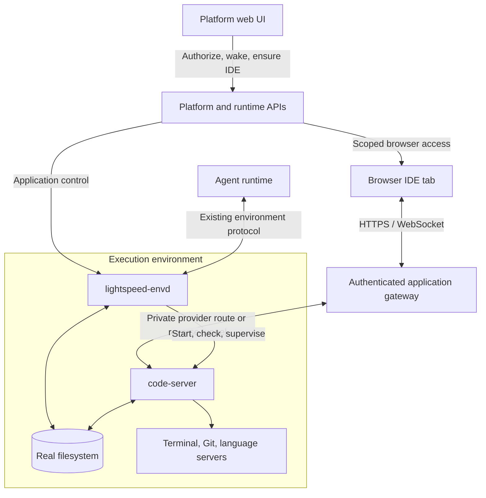

# Environment Browser IDE And Managed Applications

**Status**

- Later / proposed 2026-09-08. No implementation in this document.
- Agreed direction: use code-server for the browser IDE, with `lightspeed-envd`
  managing its local availability and lifecycle.
- First delivery: a preinstalled IDE in supported Incus images, opened in a
  separate browser tab through authenticated private application access.
- Follow-ups: outbound application tunnels, installation on demand, and an
  embedded IDE beside the session transcript.

Related designs: [environment ownership](../p118-environment-domain-and-lifecycle.md),
[daemon gateway](../p119-environment-daemon-gateway-enrollment.md),
[Incus provider](../p120-incus-environment-provider.md),
[public ingress](../p121-environment-public-ingress.md),
[power and idle policy](../p126-environment-power-and-idle-policy.md),
[outbound registration](../p148-key-based-outbound-environment-registration.md),
and [envd distribution](../p152-envd-release-and-distribution.md).

## Goal

Let an authorized Platform user open a VS Code-style IDE on an environment's
real filesystem: browse and edit files, inspect agent changes, use Git, and
run a terminal against the same machine the agent uses.

An IDE belongs to a universe environment. Sessions and bots referencing that
environment link to the same application. Opening an IDE does not create a
session, change the active environment of another session, or acquire ownership
of the environment's lifetime.

The environment filesystem remains distinct from Lightspeed's VFS workspaces.
The editor and agent access the same environment disk directly; there is no
mount, overlay, synchronization, or implicit import from VFS. See the
[environment specification](../../spec/04-environments.md).

## Editor choice

Use [code-server](https://github.com/coder/code-server), which supplies a
browser workbench and its environment-local backend. Git, terminals, file
watchers, extensions, and language servers execute in the environment with
access to its installed tools and files. Supported extensions and toolchains
still depend on what the environment provides.

Monaco alone supplies an editor component; a full IDE would require building
the surrounding workbench and remote integrations. OpenVSCode Server is another
viable distribution, but code-server's hosting conveniences make it the chosen
starting point. Its [FAQ](https://coder.com/docs/code-server/FAQ) describes
hosting support and the Open VSX extension gallery. Extension availability
must not be presented as identical to Microsoft's marketplace.

Microsoft's separately distributed VS Code Server has
[service-offering restrictions](https://code.visualstudio.com/docs/remote/faq#_can-i-repackage-or-reuse-vs-code-server-in-my-own-public-service-offering);
the selected distribution is code-server. Pin and review the distribution and
bundled extensions when packaging the image.

## Architecture and ownership



| Component | Owns |
| --- | --- |
| Platform | User authentication, user-facing authorization, Open IDE flow, application access requests, and UI state. |
| Runtime environment services | Universe/environment validation, incarnation fencing, power intent, and the existing lifecycle policy. |
| envd | Local application discovery, optional approved installation, startup, readiness, bounded supervision, and activity observations. |
| Application gateway | Browser access validation and HTTP/WebSocket forwarding to an authorized application route. |
| Environment provider | Machine lifecycle and provider-private connectivity through the environment protocol boundary. |
| code-server | IDE behavior and local filesystem/tool access under the configured OS identity. |

envd acts as a local application controller. Global authorization and machine
power decisions remain outside the guest. Application traffic, health probes,
and process supervision perform no I/O in the deterministic engine and add no
editor state to session replay.

The application gateway is a responsibility that can extend an existing hosted
runtime role. This plan does not require a new standalone control-plane
service or a second deployment model. Cross-role lifecycle work follows the
existing workflow starts/signals; browser traffic never becomes Temporal
activities or workflow history.

## Current foundation and gaps

Verified against the repository when this proposal was written:

- The [environment data protocol](../../../crates/environment-protocol/src/data/methods.rs)
  already provides filesystem operations, search, process execution, and PTYs.
  A full code-server integration uses its own backend for IDE operations;
  these existing methods continue serving agent tools.
- The [environment gateway](../../../crates/temporal-server/src/environments/gateway.rs)
  routes by universe, environment, and incarnation. Registered daemons can
  serve envd traffic through reverse-dialed data sockets. Those sockets carry
  the envd protocol today, not arbitrary application HTTP or TCP traffic.
- The [Incus edge proxy](../../../crates/environment-provider-incus/src/edge.rs)
  supports HTTP, streaming, and WebSockets to one approved guest port. Its
  existing public application route has no Platform-user authorization and
  is not sufficient for private IDE access. IDE-specific upgrade/header
  behavior also needs end-to-end verification.
- envd manages processes and jobs but has no managed-application capability.
  Its [idle report](../../../crates/environment-daemon/src/lib.rs) treats a
  running managed process or job as busy. Launching code-server indefinitely
  through those APIs would keep the environment awake indefinitely.
- The [Incus envd service](../../../crates/environment-provider-incus/image/lightspeed-envd.service)
  runs as an unprivileged user with restricted writable paths. Image
  provisioning currently installs envd and development dependencies, but no
  code-server distribution.

## Managed application capability

Add a small optional capability to `environment-protocol`, implemented by envd.
The initial application identity is `ide`, backed by a locally configured
code-server definition. Keep the protocol useful for later private previews
or other environment applications without building a general deployment DSL.

Illustrative operations, subject to contract design during implementation:

```text
apps/read    { appId: "ide" }
apps/ensure  { appId: "ide" }
apps/stop    { appId: "ide" }
```

A status reports availability, configured/installed version, observed state,
and bounded diagnostics. Useful states are `notInstalled`, `installing`,
`starting`, `ready`, `stopped`, and `failed`; unsupported capability is distinct
from an application that failed to start. Internal route information stays
server-side. Public clients receive an authorized launch/access result rather
than a guest address or deployment credential.

The application definition supplies the executable, version, OS identity,
working directory, settings directory, local endpoint, and readiness probe.
Callers select an admitted application identity, not an arbitrary executable,
installation URL, shell script, or forwarding destination. Ordinary envd
process execution remains its separate existing capability.

Required lifecycle behavior:

- `ensure` is idempotent and concurrent requests converge on one instance per
  application per environment incarnation. Installation and startup have
  bounded waits and observable progress.
- Process existence alone is not readiness. Check the local HTTP endpoint;
  the gateway separately verifies that browser HTTP/WebSocket access works.
- Recover from crashes with bounded retries and backoff. Report persistent
  failure without a restart loop that consumes the environment indefinitely.
- After envd restarts, reconcile local ownership safely: recover an owned
  instance or cleanly replace it. A reused PID or an occupied port is not
  proof of ownership. Define this behavior before shipping supervision.
- Stop and close clean up owned processes and routes. Existing browser
  connections cannot acquire access to a replacement incarnation.
- One process supervisor owns code-server. The portable default is an envd
  child-process supervisor; a host service-manager adapter can follow if
  needed. Avoid competing restart policies.

Keep observed application health local to envd, with bounded projections when
needed. Do not build a second durable environment lifecycle state machine in
Postgres. Desired local application state and ownership metadata may live in
envd's state directory to support restart reconciliation.

## Installation and upgrades

The first implementation uses a pinned, preinstalled code-server build in
supported managed images. envd validates the installation and starts it on
demand. Settings and extensions use an explicitly writable persistent guest
directory. This avoids network dependencies on the Open IDE path.

Installation on demand is an optional later mode for environments whose
operators enable it. Resolve a supported OS/architecture artifact from an
approved manifest, verify its digest, stage it in a writable application
directory, and activate it atomically after validation. Preserve a working
installation on failure. envd's
[self-upgrade implementation](../../../crates/environment-daemon/src/upgrade.rs)
provides patterns for verification, but IDE version policy remains separate
from envd protocol compatibility.

envd does not gain root privileges or run package-manager commands to satisfy
arbitrary host dependencies. Missing dependencies, incompatible platforms,
read-only installation paths, and disabled installation return explicit
unavailable/failure results. Image provisioning remains responsible for system
packages. Upgrades are controlled operations with defined restart behavior,
not automatic replacement of an IDE during active use.

## Private application access

Opening the IDE follows this sequence:

1. Platform authenticates the user and checks environment access within the
   selected universe. Full IDE access includes file mutation and process
   execution; membership or permission to inspect metadata alone must not
   accidentally grant it.
2. Runtime services resolve the current incarnation, request running power
   where supported, and wait for readiness. Offline external/registered
   machines without power control produce a clear unavailable state.
3. An authenticated runtime request invokes `apps/ensure` through the
   environment protocol. The user sees installation/startup progress or a
   useful failure.
4. Issue a short-lived launch grant scoped to the authorized user, universe,
   environment incarnation, and application. Exchange it for an application
   browser session, using a one-time handoff without leaving reusable bearer
   credentials in URLs. Renewed access rechecks current authorization.
5. The application gateway validates HTTP requests and WebSocket upgrades,
   establishes the allowed route, and forwards streaming traffic with bounded
   buffers and backpressure.

Use separate origins for environment content and the Platform management app,
with isolation between environments and narrowly scoped cookies. The IDE does
not receive the Platform login cookie, universe API keys, envd registration
credentials, or the deployment gateway token. Define expiry/revocation for
already-open streams as well as new requests. Closing an environment or
replacing its incarnation invalidates access and active routes.

code-server's local endpoint is reachable only through the intended private
route, using appropriate network restrictions and/or a private upstream
credential. The IDE's chosen folder and envd's filesystem settings do not by
themselves sandbox a terminal or extension; effective access comes from the OS
identity, filesystem permissions, and environment isolation. Preserve daemon
credential protections when launching the application. Environment credential
bindings used by envd process/job APIs are not automatically injected into
code-server terminals; any IDE credential exposure needs explicit policy.

### Network delivery stages

**Managed Incus environments first.** Use provider-private routing to the
approved IDE endpoint behind the authenticated application gateway. Reuse
existing forwarding components where suitable, while preserving the provider's
protocol-only dependency boundary. Do not consume or change the existing
public application's one-port route implicitly; IDE access is a distinct
private application capability with its own route authorization.

**Outbound-only environments next.** Extend the gateway/envd transport with
application streams. envd connects a scoped stream to the locally registered
application endpoint; the gateway handles browser-facing HTTP/WebSocket access.
Reuse daemon identity, incarnation fencing, and reverse-dial pairing. Keep
application bytes off the registration control socket and separate from envd
JSON-RPC frames. This is new transport work, not a capability of the current
reverse data route. Resolve stream ownership and cleanup, and respect the
existing single-owner gateway limitation until replica routing is implemented.

## Idle policy and resource use

Managed applications require separate activity accounting from foreground
processes and durable jobs. An available code-server process, its language
servers, health checks, and transport pings must not alone keep the environment
awake. Application status reads are observation, like existing idle reads.

Introduce a renewable, bounded browser-use lease. Authorized use acquires or
renews it; disconnects and abandoned sessions eventually let it expire. envd
includes live use in its idle observations, and the existing lifecycle
controller remains the sole authority deciding pause, suspend, stop, or close.
Avoid per-keystroke or per-request writes to Postgres. Acquire use protection
before startup and route opening, including cancellation of pending automatic
power-down through the existing environment-use path.

Terminal activity needs an explicit contract: processes launched by code-server
are outside envd's current process/job registry. The first release must define
whether terminal work extends use beyond a browser lease and how it is
observed; it cannot infer that guarantee from existing running-job counts.
If the first slice relies only on browser leases, document that detached IDE
commands do not receive durable-job keep-awake guarantees. Define background-tab
renewal and inactivity expiry before release. Reopening a sleeping managed
environment goes through the ordinary wake/ensure flow.

## UI and shared filesystem behavior

Start with an **Open IDE** action on the environment view and links from
sessions/bots that reference it. Open a separate tab with the environment's
configured working directory. Surface unsupported, starting, unavailable, and
failed states, with retry where useful. Account for additional IDE and language
server memory in environment sizing.

An embedded workbench beside chat is a later presentation change. It needs
explicit frame policy, secure-origin behavior, authentication handoff, and
keyboard/clipboard testing. Keep private app previews separate from management
content as well.

File watchers expose saved agent changes, but sharing a filesystem does not
provide collaborative editing or merge unsaved buffers. Verify code-server's
external-change and save-conflict behavior while an agent edits the same file.
Show the relevant agent/run state and provide an explicit pause/cancel workflow
if needed; do not silently pause every session using a shared environment.
IDE edits are external filesystem mutations, not automatically replayable
session events. Audit access/lifecycle actions without claiming an event log
of every terminal command or file edit.

## Delivery plan

- [ ] Define the managed-app capability, lifecycle semantics, private routing
      boundary, and user authorization rules in the Rust protocol/API types.
- [ ] Package pinned code-server in a supported Incus image and implement envd
      read/ensure/stop, local readiness, restart reconciliation, and diagnostics.
- [ ] Add browser-use accounting and specify terminal/background-tab behavior;
      preserve existing job and idle-policy semantics.
- [ ] Implement private application access, origin isolation, grant exchange,
      HTTP/WebSocket forwarding, expiry, and incarnation revocation.
- [ ] Add the Platform Open IDE action, startup/failure UX, and demo stubs.
- [ ] Validate the complete Incus path before calling the first slice shipped.
- [ ] Extend routing to outbound-only registered environments with explicit
      application streams and cleanup semantics.
- [ ] Add optional verified installation on demand for supported environments.
- [ ] Add embedded IDE presentation and private previews when needed.

When implementing public DTOs or methods, regenerate the committed API
contract and TypeScript consumers. Update the environment specification,
Platform documentation, and README when the capability actually ships.

## Acceptance and verification

- Concurrent open requests create one IDE; repeated ensure/stop operations and
  envd restarts do not duplicate or adopt unrelated processes.
- Installation failure preserves the previous build and exposes actionable
  diagnostics. Unsupported or policy-disabled installations fail explicitly.
- An authorized user can open files, save changes, use Git, and run a terminal
  on the same filesystem used by agent tools. VFS remains independent.
- Local readiness failure, HTTP routing failure, and WebSocket failure are
  distinguishable. Verify reconnects, streaming, and slow-client backpressure.
- Cross-universe access, unauthorized application IDs, expired/replayed grants,
  and stale incarnations fail. Revocation and environment close terminate
  established access as defined by policy.
- Health polling and an unused IDE permit idling; valid browser use prevents
  automatic sleep. Lease expiry, pending power-down, wake, and the chosen
  terminal policy have focused coverage with controlled clocks.
- Validate shared-file conflict behavior and ensure filesystem restrictions and
  credential inheritance match the intended IDE authority.
- For the outbound slice, validate access without inbound guest connectivity,
  plus daemon/gateway reconnects and superseded-connection cleanup.

Use protocol/supervisor tests and fake application servers for local coverage,
then browser integration checks. Credentialed Incus/Temporal acceptance follows
the repository's explicit live-test authorization and serialization rules.

## Deferred scope

Multi-user collaborative buffers, per-human isolated IDE processes, a general
package manager, arbitrary app deployment definitions, read-only IDE isolation,
and automatic VFS synchronization are outside this proposal. A lightweight
Monaco file panel could be added separately if a smaller inspection surface
becomes useful; it is not required for the code-server integration.
