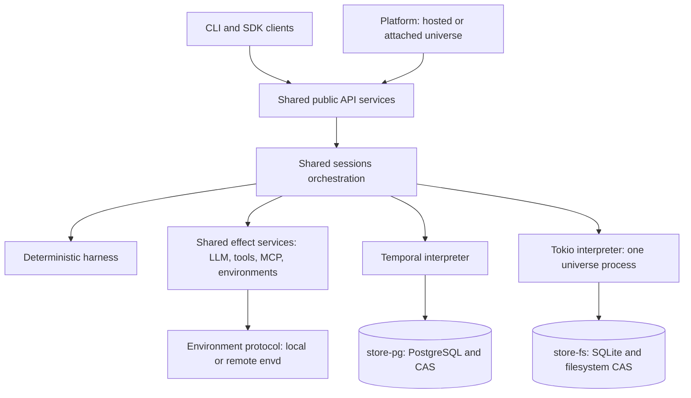

# PNNN: Local runtime without Temporal

**Status**

- Later / exploratory. Written 2026-10-01; direction and code review updated
  2026-10-06. No implementation started.
- Preferred architecture: one orchestration core, two execution substrates
  (Option C below). A separately implemented local session runtime is not the
  direction.
- Restart policy agreed 2026-10-06: interrupt unfinished ordinary tool attempts,
  preserve durable runs and sub-agent supervision, and continue where possible.
- Local v1 excludes external/custom workflow tools, externally managed sessions
  and SDK callback functions. A later SDK-host protocol is exploratory.
- Packaging and Platform connectivity still need decisions.
- Code-sharing and effort figures are estimates from source review, not a
  prototype or delivery commitment.

Lightspeed should be easy to deploy as one local universe as well as operate
as a fully managed agent system. The local runtime is a small deployment of
that system, supporting most core session behavior. Building a competing local
coding-agent CLI is not the main objective.

## Direction: one universe per runtime process

The preferred local shape is one process owning one universe: the API gateway,
session orchestration, effect execution and runtime maintenance run together,
mostly as asynchronous Tokio tasks, with multiple threads where useful. Do
not introduce independently deployed gateway and worker roles for local v1.
The exact gateway/runtime packaging boundary remains open, but separate crates
or internal interfaces do not require separate processes.

That universe can contain many sessions, sub-agents, VFS workspaces and
attached environments. It is not one process per conversation, and it is not
necessarily the current checkout or working directory. Several clients may
connect to the same owning process. Running another independent universe means
another process with its own data directory.

The intended scope is:

- Keep Temporal and PostgreSQL for the hosted runtime.
- Extract shared session orchestration into a sans-IO `sessions` crate above
  `harness`; use it from both Temporal and a local Tokio interpreter.
- Store runtime-owned universe data in **one SQLite database**, with CAS bytes
  in the filesystem, together behind **`store-fs`**. This mirrors `store-pg`
  owning both record and CAS storage; a separate `store-sqlite` crate is not the
  preferred package boundary.
- Support sessions and runs, queue/steer/cancel, approvals, context and
  compaction, events, fork/clone, VFS, profiles and skills, models, MCP,
  sub-agents, and resuming persisted sessions. Aim to preserve existing session
  behavior under the local restart policy below.
- Support different execution environments through the existing environment
  protocol. The machine hosting the runtime is just another explicitly enabled
  environment, accessed through envd. Bundled, embedded or sidecar envd
  packaging is undecided.
- Use environment variables for user/provider credentials by default. Runtime
  configuration may store references to those variables, not their values.
  OAuth and any necessary local credential persistence remain open.
- Let the Platform attach/adopt a local universe as well as manage hosted
  universes. The Platform is an optional, separate management application;
  standalone local execution must not require its login or database.
- Leave bots, channels and their schedules out of local v1. Session waits,
  promise deadlines and cancellation timers remain in scope.
- Leave external/custom workflow-tool integrations, `session/managed/start`
  and SDK-hosted local functions out of local v1. Ordinary sessions remain
  controllable through the public API/SDK. Built-in sub-agents and environment
  jobs still use the generic protocol internally; MCP remains in scope.

The single-process rule concerns ownership of the runtime and its store.
Execution environments, shell commands, and potentially SDK tool hosts may
have their own processes. Whether a packaged envd counts as an allowed sidecar
or must run inside the runtime is an explicit packaging question, not a reason
to split session ownership across workers.

## Why this is feasible, and what single-process ownership does not solve

The deterministic harness already runs without Temporal. One owning process
also removes the need for distributed worker leases, cross-process session
ownership, and failover coordination. SQLite transactions plus an exclusive
lock on the universe data directory are a plausible local foundation. Async
concurrency and multiple Tokio threads do not require multiple database owners.
Each session still needs serialized state transitions and expected-head checks
when committing its events, even when effects execute concurrently.

Temporal still supplies behavior that a process and a database do not provide
by themselves. The session event log, checkpoints and CAS are persisted outside
Temporal, but queued admissions, preparation receipts, pending delivery and
other orchestration state also live in Temporal. Replaying only the session log
is not a complete recovery strategy.

The local design has these persistence and ownership requirements. The restart
behavior is decided below; journal layout and other storage mechanics still
need design work.

| Boundary | Local requirement |
| --- | --- |
| Ownership | One runtime holds the data-directory lock for its lifetime. A second opener attaches to it or fails clearly; it must not independently drive sessions against the same database. |
| API acknowledgement | Define the durable acceptance point. Work acknowledged as accepted must be committed to the event log or a recoverable inbox before replying; otherwise the response must mean something weaker explicitly. |
| Session restart | Load the harness log/checkpoint plus orchestration records or reproducible cursors. Preparation idempotency receipts, pending admissions and unresolved child executions cannot simply disappear. |
| Emissions and completion | Preserve an outbox or a reconstructible delivery cursor, stable invocation IDs and completion deduplication. There is a crash window between committing an event and delivering its effect. |
| External effects | Apply the agreed restart policy below: interrupt ordinary unfinished tool attempts, restart pending model/compaction operations, and preserve durable child runs. External effects may already have happened; single-process execution does not imply exactly-once effects. |
| Cancellation | Cancellation is a request to the effect adapter. Suppress stale results by operation identity even when the underlying request or remote process cannot be stopped immediately. |
| Sleep and deadlines | Persist absolute deadlines and recompute due work on wake/restart. No local work progresses while the process is stopped; remote environment jobs may continue and need reconciliation. Whether retry backoff itself survives restart is separate from preserving accepted work. |
| CAS consistency | Make blob writes durable before committing references; collect unreferenced files later. SQLite and filesystem CAS are not one atomic transaction, so startup repair, collection and backup need an explicit protocol. |

These requirements are much smaller than replacing Temporal's hosted
availability and distributed scheduling guarantees. They still need tests that
kill and restart the process at commit/effect boundaries. Reduced availability
is reasonable locally; silently losing accepted work or rerunning an ambiguous
shell command should not be an accidental consequence of that choice.

## Agreed restart policy

**Decision, 2026-10-06:** recover durable sessions, runs and their supervision
relationships; terminate unfinished ordinary tool attempts with an interrupted
result; continue the runs where possible. A process restart does not itself
cancel a run or close a session.

| Work at the time of the crash | Recovery behavior |
| --- | --- |
| Tool result already committed | Preserve it, including completed siblings in a partially finished batch. |
| Ordinary tool call without a committed result | Record a terminal interrupted result. Do not automatically replay the old invocation. The agent receives the error and may inspect the situation before choosing a new action. |
| Model generation or compaction without a committed result | Restart the pending logical operation. Interrupt its execution attempt without synthesizing a terminal generation failure, which currently fails the run. |
| Approval wait or timer | Restore the wait and its existing absolute deadline. Waiting for approval is not an interrupted external execution. |
| Sub-agent delegation | Recover the same child session/run and parent completion promise. Apply the ordinary-tool interruption policy inside the child and resume supervision. |

Structured concurrency follows durable run/session ownership, not the lifetime
of a Tokio future. Restore that ownership before scheduling recovered work,
retain existing scopes and absolute deadlines, and respect recorded cancellation
or session closure. Do not fail a delegation's promise while independently
resuming its child. Reconcile partially prepared children and terminal children
whose results were not delivered; preserve initialized configuration or pinned
preparation inputs rather than rereading a changed profile and creating new work.

The existing per-call completion path can represent an interrupted ordinary
call as `Failed` with a `runtime_interrupted` error reason. It preserves completed
sibling results and lets the active run continue once the batch finishes.
For interrupted external executions represented by promises, resolve the
affected promises and use the normal joined/await resume paths. An existing
sub-agent delegation keeps its promise pending while its child recovers.

“Aborted” describes the runtime abandoning an attempt; it does not prove that
external execution stopped or that its side effects were rolled back. A
hard-killed runtime cannot run cleanup. Separate envd processes deliberately
survive connection loss, and an MCP server may continue processing a request.
The local contract is therefore:

- On graceful shutdown, cancel owned execution scopes, request targeted remote
  cancellation and wait for bounded cleanup.
- On restart, reconcile or cancel known owned remote executions before allowing
  conflicting work to continue. Represent unconfirmed external outcomes
  explicitly; an interrupted result must not imply that retrying is harmless.
- Persist attempt identity, ownership and remote execution handles before
  dispatch, so recovery can locate the work even if the start response was lost.
  Distinguish attempts from logical invocations and discard stale completions
  without failing the recovered session.
- Complete recovery for a run and its supervision relationships before normal
  dispatch resumes. Recovery itself must be safe to repeat after another crash,
  producing only one terminal interruption result per abandoned call.
- Cancel only work owned by the interrupted scope. A completed process tool
  call may have returned a live handle or left a background service running;
  interruption of a later read does not confer ownership of that process.
  Never cancel all work on a shared envd as a runtime-recovery shortcut.
- Automatic cancellation while the runtime remains dead would require explicit
  envd/tool-host ownership leases or watchdogs. That is a later enhancement,
  not a local v1 guarantee, and cannot universally cover arbitrary MCP servers.

This is a bounded part of the local recovery implementation, not a redesign of
structured concurrency. It still requires durable attempt records, child
execution phases, completion deduplication and crash-boundary tests; it avoids
having to transparently resume every external tool attempt.

## Storage, environments and credentials

### One local store package

[`store-fs`](../../../crates/store-fs/src/lib.rs) already groups a filesystem
CAS, JSONL session store and JSON VFS catalog. It is about 1.6k code lines,
including tests. It is not a SQLite backend and does not implement the full
hosted registry, access, blob-graph and orchestration storage surface.

The proposed evolution is to put SQLite-backed records and the existing CAS
layout behind that package. Use `store-pg` as the behavioral reference for the
shared store traits, not as a schema to copy wholesale: local v1 does not need
bot/channel tables, PostgreSQL-specific locking or every deployment feature.
It does need session indexes and metadata, VFS heads/mounts, profiles,
environment and MCP configuration, access/identity as required, CAS reachability,
and the local orchestration records described above. Decide whether existing
JSONL stores remain a test adapter or migrate; they should not become a second
authoritative runtime database.

One SQLite database means one logical database for runtime-owned universe
records; journal/WAL files are implementation details. envd has its own
filesystem domain and state today: daemon identity, job records and transfer
journals. Its state must not be silently folded into the universe database.

### Environments stay independent

The existing environment client/protocol and runtime resolver provide the
correct boundary for local and remote machines. There is no need to invent a
special shell executor in the session harness. The host machine should be
registered or configured as an environment and subject to the same attachment,
readiness, capability and credential rules as another machine.

VFS workspaces remain separate from the host checkout and envd filesystem.
Creating a universe under `.lightspeed` must not implicitly mount, copy or
synchronize the current directory into VFS. The default host environment root,
whether it is enabled automatically, and its permissions remain decisions.

The runtime can bundle envd for convenience, but packaging should preserve the
protocol boundary. envd currently persists its own private daemon identity and
job state under its configured state directory; it has no SQLite dependency.
Embedding it does not automatically remove that separate lifecycle.

### Environment-variable credentials first; OAuth unresolved

There is already an
[`EnvSecretResolver`](../../../crates/llm-runtime/src/secrets.rs), and runtime
model resolution can fall back to environment-configured provider credentials.
That is a good foundation for local configuration. Other paths need adaptation:
[environment credential bindings](../../../crates/temporal-runtime/src/environments/credentials.rs)
currently use auth grants, provider credentials or stored direct secrets.

OAuth is not just an API key loaded once. Current auth flows persist PKCE
verifiers, access/refresh tokens and rotated refresh tokens through the
[`SecretStore`](../../../crates/auth/src/secrets.rs). Callback registration also
assumes a gateway URL; some current MCP OAuth paths need a publicly fetchable
HTTPS client metadata URL. Full OAuth parity therefore needs a policy for both
mutable secrets and local callback reachability.

Options to evaluate are an external credential broker, reauthentication with
ephemeral local tokens, or opt-in persistent local credentials (for example an
OS credential store or encrypted storage). No choice is made here. Generated
runtime API credentials and envd's private identity need a separate explicit
policy too. “Environment variables by default” must not be presented as a
claim that the existing stack never persists any secret material.

## Platform adoption: intended capability, not implemented multi-runtime support

The Platform should offer two deployment choices through the same session UI:
managed/hosted universes and attached local universes. Adopting a universe means
connecting to its existing identity and data, not importing its sessions into
the hosted runtime or taking over its local process.

There is useful scaffolding today, but separate runtime endpoints do **not**
currently work end to end:

- [`universes.gatewayUrl`](../../../platform/db/src/schema/platform.ts) can name
  an endpoint, but
  [`clientOptions`](../../../platform/backend/src/runtime-client.ts) deliberately
  rejects any URL other than `LIGHTSPEED_API_URL` and confines the single
  `LIGHTSPEED_PLATFORM_API_KEY` to that endpoint. Tests assert this restriction.
- The existing [`/adopt` route](../../../platform/backend/src/routes/universes.ts)
  links an existing universe on that configured deployment. It accepts no
  separate runtime endpoint or credential.
- Runtime `single` auth mode rejects Authorization, universe and actor headers,
  while Platform member calls send all three. Single-universe ownership is not
  the same thing as the existing unauthenticated single mode.
- Platform feature switches hide UI; they are not runtime capability checks.
  The current API handshake does not advertise bots/channels/OAuth/local-tool
  availability at the granularity this needs.

Attaching local universes therefore needs:

1. An explicit runtime connection with an endpoint, bound credential reference,
   universe identity, version/capabilities and connection status. Preserve the
   key-to-endpoint restriction when supporting multiple connections.
2. Connectivity from the Platform backend: a reachable endpoint or an outbound
   tunnel/relay. A hosted Platform cannot reach a laptop's loopback listener
   just because the user's browser can.
3. Authentication that preserves the Platform's member checks and actor
   attribution, scoped to the one local universe.
4. Capability-aware UI and explicit unsupported-method responses for features
   excluded from local v1. Public session wire compatibility alone is not
   enough to make the whole current UI work unchanged.
5. Attach/detach and ownership rules distinct from provisioning, repairing or
   deleting a managed runtime. Also settle UUID/slug conflicts: the Platform
   currently expects globally unique universe IDs and cached slugs, while
   runtime slugs are deployment-local.

A directly reachable local runtime is a useful first adoption prototype; it
can validate adoption before choosing a tunnel architecture. Platform
adoption is part of the intended outcome, not a reason to put the Platform
server inside the one-process local runtime.

## Workflow tools and SDK-owned local functions: deferred beyond v1

**Scope decision, 2026-10-06:** local v1 does not expose external/custom workflow
tools, externally managed sessions or SDK callback functions. It rejects
`session/managed/start` and arbitrary external workflow bindings clearly, with
capability reporting that lets clients avoid offering them. An SDK can still
start, read, steer and cancel ordinary sessions through the public API.

This leaves built-in sub-agents and environment jobs in scope. The current
[session preparation](../../../crates/temporal-runtime/src/gateway/service/session_preparation.rs)
injects these as system bindings, and the
[harness](../../../crates/harness/src/core/components/workflow_tool.rs) keeps
those bindings separate from the immutable managed-session declaration. Retain
their generic invocation/completion machinery in the shared core and interpret
it locally; do not replace it with feature-specific transports. Existing MCP
integration also remains in scope.

### Later direction: an SDK process hosts tools and/or controls sessions

An SDK application could launch local Lightspeed, establish an authenticated
connection, register functions and optionally act as a session's lifecycle
controller. Lightspeed still owns the durable universe, session state,
orchestration and model execution. User function code executes in the SDK
application; the runtime sends invocations and receives results through a
protocol. This preserves one runtime process owning the universe while allowing
separate application/tool processes.

Launching the process is a packaging convenience, not the source of tool
authority or session ownership. Design the protocol so an authorized SDK host
could also attach to an already-running universe. Tool hosting and lifecycle
control should be independent capabilities: a host may supply functions, manage
sessions, or do both. The current managed-session contract already separates
tool receivers from an optional lifecycle controller.

Proposals to evaluate after v1:

- **Registration and admission:** universe registration makes a tool available
  for selection, not automatically enabled everywhere. A session explicitly
  admits selected definitions/bindings. Session-private tools can be admitted
  without publishing them to a universe-wide catalog.
- **Stable bindings:** pin the schema/version, completion semantics and logical
  host identity when a session admits a tool. Reconnecting a host or updating
  its registry must not silently replace an existing session's tool contract.
  Decide separately whether later versions allow explicit binding changes;
  today's managed declarations are immutable.
- **Execution protocol:** carry invocation/attempt IDs, arguments or CAS
  references, deadlines, cancellation and correlated terminal results. Bind
  completion authority to the admitted host and acknowledge persisted results
  so retransmission can be deduplicated. SDK languages wrap the same protocol.
- **Lifecycle control:** declare which sessions the SDK manages and deliver
  their lifecycle notifications durably. Ordinary run submission, steering and
  cancellation can reuse the API; registration alone grants no extra authority
  over other sessions.
- **Host loss:** preserve durable sessions and bindings, while interrupted
  callback attempts follow the agreed restart policy. Reconnection restores
  availability, not abandoned invocations. Distinguish stable host identity from
  a live connection and reject completions from retired attempts. Decide the
  disconnect grace period and whether controller-dependent work pauses when
  its SDK controller is unavailable.

Reuse the generic workflow-tool semantics rather than introducing another tool
system. The harness already owns schemas, invocation IDs, completion promises,
cancellation and deduplication without importing Temporal. Its `WorkflowStartRef`
is substrate-neutral, but today's
[start adapter](../../../crates/temporal-runtime/src/worker/activities/workflow_tools.rs)
interprets recipes as Temporal workflow types and task queues. A connected SDK
host is a natural candidate for a bound receiver with a new transport; starting
a new host per invocation would be a separate lifecycle choice.

The existing `bound + pull` mode permits only `accepted` completion, so it is not
already a request/result callback protocol. A local binding needs authenticated
completion, cancellation and recovery semantics for joined results/promises.
The transport (for example an inherited connection, local socket or loopback
RPC), registration API and JavaScript/Python SDK surface remain undecided. This
future work does not block v1 or require language-specific branches in the
harness or stable session worker.

## How much code can be shared?

### Measurement and existing reusable code

The following inventory was measured on 2026-10-06 with `cloc` over tracked
Rust `src` files selected by `git ls-files`. Counts exclude comments and blank
lines, but **include inline tests and `src` test modules**; they are not
production-only LOC. Integration tests, generated non-Rust contracts and the
Platform frontend are outside this inventory. Sharing estimates are code-review
judgments, not an automated classification or a measured final design.

| Already separate from Temporal | Approximate code lines | Reuse assessment |
| --- | ---: | --- |
| `harness` | 29.7k | Reuse deterministic session state, admissions and `CoreAgentDrive`; keep I/O outside it. |
| `llm-runtime` + `llm-clients` | 20.4k | Reuse provider-native request/response adapters and model execution. |
| `tools` | 24.7k | Reuse tool definitions, VFS, skills, schemas and environment-protocol adapters. |
| `api` + `api-projection` | 16.8k | Reuse public wire contracts, dispatch and projections; expose local availability accurately. |
| `vfs`, `environments`, `environment-client`, `environment-protocol`, `mcp`, `profiles` | 9.1k | Reuse domain contracts and adapters; implement persistent local stores and runtime wiring. |
| `environment-daemon` | 11.1k | Reuse the execution service; packaging and its lifecycle remain to be chosen. |
| `cli` | 21.5k | Reuse HTTP client/TUI; add local launch/attach behavior if wanted. |

The first five rows are about **101k lines already outside the two Temporal
crates**. This is an inventory of reusable components, not a promise that every
line or feature ships in local v1. Auth also has reusable abstractions, but
credential mode decisions determine how much of it is applicable.

[`SessionRunner`](../../../crates/test-support/src/runner/drive.rs), used by
evals, proves in-process execution is possible. It does not replace production
orchestration: it awaits model calls and tool batches without the hosted
admission racing and progressive execution behavior. Ultimately evals and
tests should exercise the shared orchestrator, rather than promoting this
runner unchanged as the local implementation.

### Extracting `temporal-workflow`

The crate has about **17.7k source code lines**. Roughly 6.6k belong to bots and
channels and can stay hosted-only. The session tree is about 7.5k, including
2.0k in its separate test module plus more inline tests. Preparation/rehydration,
sub-agent/environment-job/transcription workflows and shared DTOs/activity
declarations bring the session-related review surface to about **10.6k**.

| Area | Shared code to extract | What remains substrate-specific |
| --- | --- | --- |
| Preparation, rehydration and status | Candidate validation, commit decisions, state reconstruction, receipts and readiness semantics | Store calls, effect completion and Temporal continuation wiring |
| Admissions, active run and waits | Admission ordering/eligibility, run-slot policy, wake decisions, cancellation and stale-result rules | Signal/channel receipt, timers, executor racing and cancellation primitives |
| Tool batches | Progressive dispatch policy and per-call effect identity | Futures/activities and transport execution |
| Promise sources and workflow starts | Deadlines, retry decisions, invocation identity, completion/delivery bookkeeping | Temporal workflow start/describe/query/signal or local execution registry |
| Sub-agent and environment-job orchestration | Child preparation, supervision, terminal results, cleanup policy | Temporal shells or local tasks using the same environment/service adapters |

A plausible shared core is **roughly 3–5k lines of orchestration and contracts
after reshaping**, plus associated conformance coverage. This is a design-size
estimate; it is not a claim that 3–5k current lines can simply be moved.
[`preparation_candidate`](../../../crates/temporal-workflow/src/workflows/session/preparation_candidate.rs),
`session_preparation` and `rehydrate` contain easier pure extractions. The harder
parts are
[`control`](../../../crates/temporal-workflow/src/workflows/session/control.rs),
[`tool_batches`](../../../crates/temporal-workflow/src/workflows/session/tool_batches.rs)
and the preparation loop, where state decisions and async execution are mixed.

There is already substantial unit coverage of pure helpers; the benefit is
making whole orchestration interleavings testable without Temporal, not claiming
that no unit tests exist today. Continue-as-new, workflow registration, history
handling and Temporal retry/heartbeat mechanics stay in the hosted interpreter.
The hosted bot/channel shells need not all be rewritten to deliver local v1.

### Extracting `temporal-runtime`

The runtime has about **53.5k source code lines**, of which the gateway subtree
is about 21.7k. A roughly **20.7k-line candidate pool** consists of `SessionTools`,
native MCP, secret resolution, environments, sub-agent services, checkpointing,
credential injection and activity modules. Those categories do not overlap the
gateway count, but neither pool is already completely neutral.

Plan on **roughly 20–30k current source lines being extracted or adapted into
shared services**, including their existing tests: approximately **40–55% of
this crate**. The rest includes hosted bot/channel control, deployment setup,
Temporal wrappers, and code that stays optional or needs a local replacement.
This range is a refactoring footprint, not the number of new lines to write.

The necessary boundaries are broader than a `SessionControl` trait:

- [`GatewayAgentApi`](../../../crates/temporal-runtime/src/gateway/service/mod.rs)
  owns both a Temporal `Client` and `Arc<PgStore>`. Separate session control
  (start/admit/status/cancel/close) from shared API behavior, and replace
  concrete PostgreSQL registry/access/preparation dependencies with appropriate
  store/service interfaces. Authentication also names a PostgreSQL key store.
- [`ActivityState`](../../../crates/temporal-runtime/src/worker/activities/state.rs)
  already uses many store, LLM and tool traits, but preparation still holds
  `PgStore`. Extract effect services with neutral requests/results and crate-local
  error types. Keep `ActivityError`, retries, heartbeats and cancellation context
  in Temporal wrappers.
- [`SessionTools`](../../../crates/temporal-runtime/src/worker/session_tools.rs),
  environment resolution and native MCP contain much of the shared execution
  behavior. They need dependency cleanup rather than a second implementation.
  [`SubagentChildRuntime`](../../../crates/temporal-runtime/src/subagents.rs)
  is already a useful seam for replacing the child-session backend.
- Some request/response DTOs and helper functions live in `temporal-workflow`
  even when they express neutral work. Move them with their shared service
  contracts so local code does not depend on the Temporal crate just for types.
- Reapers, environment reconciliation and CAS collection already run as Tokio
  loops, but their stores and some workflow operations are hosted-specific.
  Reuse policy and services; do not describe these loops as plug-in local code.

Most of the core agent behavior should therefore remain one implementation.
The work is concentrated in extracting orchestration/services and adding a new
storage/execution substrate. A percentage of the *entire future local product*
would be misleading before its new SQLite, recovery, Platform and tool-host code
exists; the measured component sizes and extraction ranges above are the more
useful planning quantities.

## Proposed shared architecture

These are logical boundaries, not separate local services. Proposed crate roles:

| Crate / boundary | Responsibility |
| --- | --- |
| `harness` | Existing event-sourced agent loop; no infrastructure I/O. |
| `sessions` (new) | Pure session orchestration state, ordered inputs and effect intents above the harness. |
| Shared runtime services (name/split TBD) | API service behavior, preparation, effect execution, environment/MCP integration and neutral contracts. I/O is allowed here. |
| `store-fs` | Local SQLite records, CAS, migrations, ownership and recovery storage. |
| `store-pg` | Existing hosted store. |
| `temporal-workflow` | Temporal orchestration interpreter, workflow registration, hosted controller shells. |
| `temporal-runtime` | Hosted composition, Temporal activities/client adapters and roles. |
| `local-runtime` (provisional) | Single-universe composition, Tokio interpreter and shared API/services. Binary/CLI packaging remains open. |

Keep `sessions` above `harness` because their state has different sources of
truth. Harness state is reconstructed from recorded session events;
orchestration also tracks in-flight admissions, effects and delivery. This
separation preserves the harness replay invariant and leaves room to supervise
an external harness through the same session machinery later.

### Prefer a synchronous core with async interpreters

`sessions` should consume ordered inputs such as admission arrival, effect
completion and observed time, and emit intents such as append events, execute
or cancel work, deliver an envelope and arrange a wake. Effects stay outside
that core. Temporal rollover/history policy belongs to the Temporal interpreter,
not to every local session's state machine.

This makes cancellation/admission races explicit and testable, and permits
serializable orchestration state. Shared code does not need to run futures
under both Temporal's workflow executor and Tokio. Temporal's workflow rules
still apply to the interpreter, and changes to core decisions still need
workflow compatibility/replay review.

A shared async implementation behind a host trait remains an alternative to
compare during the spike. Port one slice—the wait loop plus admission racing
against a running effect—and compare complexity and tests. Avoid forcing every
linear I/O helper into a state machine; ordinary shared effect services can
remain async. The existing pure bot-controller policy inside its Temporal shell
is a useful precedent, without expanding local v1 to include bots.

## Alternatives and effort

| Option | Assessment under the clarified scope |
| --- | --- |
| A · Bundle Temporal and PostgreSQL | Could simplify launching today's product, but does not meet the single-process, SQLite local-runtime direction. |
| B · Independently implement local orchestration | Faster initial demo, but duplicates admission, cancellation, promises and sub-agent semantics. Not the chosen direction. |
| C · One orchestration core, two substrates | Preferred. Extract shared session/services first, then add local execution/storage while retaining Temporal hosted. |
| D · Replace hosted Temporal too | Separate, much larger distributed-systems project. Not required for this outcome. |

The earlier 22–33 engineer-week estimate covered a narrower local session
runtime and assumed more gateway portability than the code currently provides.
Keep it as a historical planning reference, not a new commitment. It also did
not establish the cost of real multi-runtime Platform adoption, complete local
crash recovery, OAuth or an SDK callback/tool-host contract.

Re-estimate after the first extraction and recovery spike. A credible plan must
budget separately for:

- shared orchestration, neutral contracts and hosted conformance;
- gateway/effect service extraction, including PostgreSQL coupling;
- SQLite records/migrations and filesystem CAS recovery/collection in `store-fs`;
- local ownership, admission persistence, effect recovery and shutdown;
- environment wiring and envd packaging;
- env-based configuration, local identity and any selected credential exception;
- Platform attachment, authentication, capability handling and connectivity;
- release packaging and end-to-end parity tests.

SDK local tools and externally managed sessions are excluded from the v1
estimate. Full OAuth still needs an explicit scope decision. Session export/import
to hosted is independent of Platform adoption and is not an assumed beta
deliverable.

## Open decisions

- [ ] **Process/package boundary:** confirm that the API gateway stays inside
  the owning runtime process. Choose embedded or sidecar/bundled envd and how
  a CLI or SDK starts or connects to the process.
- [ ] **Universe location:** explicit data directory, a default under the user's
  home, project-local `.lightspeed`, or named universes with discoverable paths?
  Recommendation to evaluate: persist an independent universe UUID and let a
  project directory select a universe; do not derive its identity from cwd.
  Moving a directory or opening two checkouts should have defined behavior.
- [ ] **Host environment:** enable it by default or opt in; which filesystem
  root and permission/sandbox policy? Keep this independent of universe/VFS
  storage placement.
- [ ] **Recovery storage mechanics:** exact durable admission point,
  attempt/child-execution journal and outbox layout, retry-backoff persistence,
  CAS recovery and backups. These implement the agreed restart policy above;
  interrupted-tool and sub-agent behavior are no longer open decisions.
- [ ] **Credentials/OAuth:** whether to allow persisted local credentials, where
  to keep them, and how callbacks work. Decide runtime connection credentials
  and envd identity separately from user/provider secrets.
- [ ] **Platform attachment:** direct connectivity first or a tunnel/relay;
  credential ownership; actor attribution; attach/detach/deletion semantics;
  universe UUID and slug conflicts across deployments.
- [ ] **Later SDK-host protocol (after v1):** tool registration/admission,
  independent lifecycle control, transport, result acknowledgement and host-loss
  behavior. Explore SDK launch and attach modes; this is not a v1 dependency.
- [ ] **Capability edge cases:** explicitly enumerate the supported public API
  subset, including standalone transcription and credential mutation methods.
  Externally managed sessions and custom workflow-tool integrations are already
  excluded from v1; advertise and reject unsupported methods consistently.

## Suggested sequence and validation

1. **Extraction/recovery spike.** Compare sync and async designs for one racing
   slice; run it against both interpreters. Prototype one SQLite-backed universe
   with filesystem CAS and an ordinary envd connection. Exercise a sub-agent and
   kill the runtime around admission, append, invocation and completion commits.
   Verify interrupted calls let the same run continue, completed sibling results
   survive, parent/child identities and deadlines are retained, and stale
   completions cannot overwrite recovery outcomes. Cover restarted model calls,
   preserved approval waits, nested sub-agents, unreachable or still-running
   remote executions, and a second crash during recovery itself.
2. **Shared core and services, hosted first.** Extract `sessions`, neutral effect
   contracts and shared API services incrementally while Temporal remains the
   production interpreter. Reuse existing tests and add deterministic
   interleaving/replay coverage; validate hosted behavior with the relevant
   serialized live suites during implementation.
3. **Complete the local substrate.** Implement the agreed store and recovery
   contract, environment/credential mode and process lifecycle. Run the same
   session conformance suite against hosted and local backends, with explicit
   additional local crash tests and declared differences in guarantees. Verify
   that public managed-session/custom workflow integrations are unavailable
   while built-in sub-agents and environment jobs still work.
4. **Platform adoption and packaging.** Attach an existing local universe with
   its identity/data intact, then exercise member attribution, capabilities,
   offline/reconnect behavior and detach. Choose connectivity and SDK packaging
   based on the prototype; release only the agreed capability subset.

The spike can run beside the first shared extraction. It should test the
intended small universe deployment, rather than validate only a coding-agent
CLI over the eval runner. The hosted extraction remains useful on its own:
less SDK coupling, broader unit coverage and one definition of session behavior.
