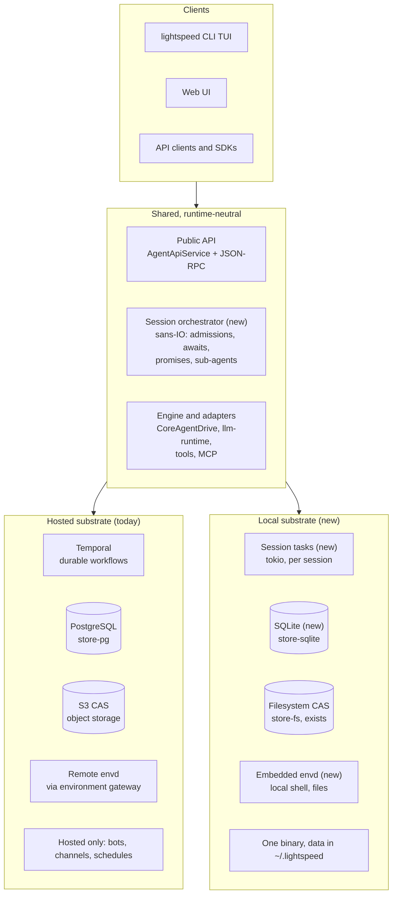

# PNNN: Local runtime without Temporal

**Status**
- Later / exploratory. Written 2026-10-01 as a review for roadmap discussion,
  not a decision.
- Effort figures are estimates from reading the code, not from a prototype.

A local Lightspeed with no Temporal, Postgres or Docker looks achievable in
four to five months with two engineers, including a validation spike. The
reason is that Temporal only orchestrates our work: every durable fact already
lives in Postgres and CAS, and the agent loop already runs in-process for
evals.

Suggested direction to explore:

- Keep Temporal for the hosted runtime.
- Add a local runtime for interactive sessions: SQLite, a filesystem CAS and an
  embedded envd, behind the existing public API.
- Have both runtimes share one session orchestration core rather than forking
  it.
- Leave bots, channels and schedules as hosted-only features.

## How much we rely on Temporal

Temporal is our orchestrator, not our database. The session event log,
checkpoints, CAS and all domain records already live in Postgres, and the bot
controller treats its Postgres row as authoritative. What only Temporal holds
is in-flight orchestration: queued admissions, pending emissions and their
retry backoffs, workflow-start dedupe, the bot inbox and coalescing buffers,
chat delivery state, and Schedules.

The orchestration surface is broad, though:

- **7 workflow types:** session, sub-agent execution, environment job,
  transcription, bot controller, bot trigger fire, chat conversation.
- **About 20k lines** in `temporal-workflow`, written directly against the
  Temporal SDK (`&mut WorkflowContext` everywhere), with no trait in between.
  About 40% is pure logic.
- **About 36 client call sites** in the server: starts, signals, queries,
  describes and terminates.
- **About 60 activities** across sessions, bots and channels, with about 32
  retry policies.
- **External workers:** the TypeScript chat connectors are Temporal activity
  workers on their own task queues.

The server crate is about 40k lines of production code. Most of it (gateway,
environments, MCP, secrets, `SessionTools`) has little or no Temporal coupling.

| Temporal capability | What we use it for | Local equivalent |
| --- | --- | --- |
| Durable workflow per session, replay, continue-as-new | `AgentSessionWorkflow` drives `CoreAgentDrive`, races admissions against running activities, runs preparation; rolls over at 10k history events | A tokio task per active session, rebuilt from the log and checkpoint on start (`create_or_load_session` already does this) |
| Signals | About 13 API mutations funnel into one `submit_admissions` signal; `deliver_emission` carries workflow-to-workflow results | A channel into the session task; a persisted inbox only if an admission must survive a crash before it is committed |
| Queries + poll loops | The gateway polls `status` every 500 ms in about 15 wait-until-accepted loops; bot, chat and job snapshots | A direct reply from the session task, which is simpler than today |
| Activities with retry, timeouts, heartbeats | LLM, tools, storage, MCP, environment jobs; heartbeats are how cancellation reaches LLM and tool futures | Plain async calls with a retry helper and a cancellation token. Backoff state is lost on restart, which is acceptable locally. |
| Durable timers | Await deadlines, promise hard deadlines, cancel watchdog, emission and start retries, bot idle-close | Timers recomputed from state on start; the engine's `await_wake` already derives the next wake from state |
| Workflow-id dedupe, signal-with-start | Session start, environment jobs, workflow-tool executions, bot controllers, conversations | Unique keys in the store plus an in-process registry of live session tasks |
| Workflow-tool protocol | Sub-agents, environment-job tools, external plugin workflows (contract is Temporal signals, queries and task queues) | In-process spawn for sub-agents and jobs. External plugins need another transport or stay hosted-only. |
| Schedules | Bot cron and poll triggers | An in-process scheduler, or hosted-only |
| Task queues to external workers | Telegram and WhatsApp connectors | Hosted-only |

Several parts were already built without Temporal and would carry over
unchanged:

- The reapers, the environment reconciler and the CAS sweeper are plain tokio
  loops.
- Clients follow progress by long-polling events from Postgres; there is no SSE
  or WebSocket.
- The expected-head check on event appends and the promise reaper already
  assume that signals can be lost.

## What already runs without Temporal

Most of the agent already runs without Temporal: an in-process agent loop
exists today and is used by `crates/eval` against real providers. The
architecture work done so far (sans-IO engine, CAS references, store traits) is
what makes a second runtime plausible.

| Piece | State today | Reusable as-is for local? |
| --- | --- | --- |
| `engine` (30k lines) incl. `CoreAgentDrive` | Deterministic, zero Temporal dependency. Emits `AppendEvents`, `GenerateLlm`, `CompactContext`, `InvokeTools`, `Idle`, `Closed`. | Yes |
| `SessionRunner` in `test-support` (2.5k lines) | Substrate-neutral loop: `drive_until_quiescent` fulfils LLM, compaction and tool actions in-process. Used by `eval` and replay tests. | Yes, after promoting it out of test-support |
| `llm-runtime` + `llm-clients` (31k lines) | `impl CoreAgentLlm for LlmRuntime`; Anthropic, OpenAI Responses, Completions. | Yes |
| `tools` (27k lines) | `InlineToolRuntime`, local and scoped filesystem tools, VFS, skills. | Mostly. The local process executor is a one-line placeholder, so there is no in-process shell tool. |
| `store-fs` (1.8k lines) | Real filesystem CAS (`.lightspeed/cas/sha256/...`), VFS catalog, partial `FsSessionStore` (no listing, metadata, or cross-process lock). Unused in production. | CAS yes; session store needs finishing |
| In-memory stores | Session, blob, environments, auth, bots, channels, MCP registry. | Tests and ephemeral runs only |
| `environment-daemon` (envd, 12k lines) | Runs on a laptop today (`./dev.sh runtime` starts one on `127.0.0.1:19091`). | Yes, embedded or as a sidecar |
| `bots`, `channels` domain crates | Pure state and policy; `controller/state.rs` (2.5k lines) has zero Temporal references. | Logic yes; the workflow shells around it no |
| `cli` (24k lines) | Pure HTTP client of the hosted gateway (`HttpAgentApi`). | The TUI yes; needs a local backend behind it |
| `platform/web` | Talks to the runtime only through the generated API client; the browser demo already swaps in an in-browser backend. | Yes, if a local runtime serves the same API |

Two dependencies are not Temporal but still block a local install: PostgreSQL
(`store-pg`, 18k lines, 10 migrations) and S3-compatible object storage
(optional; small blobs are already inlined in Postgres). There is no SQLite
anywhere in the tree. The [first-class runtime CLI](../p183-first-class-runtime-cli.md)
work explicitly put "no embedded database or runtime alternative" out of scope.

## Four ways to get there

The options differ mainly in where the session orchestration lives: today it is
about 20k lines of Rust written directly against the Temporal SDK, with no
abstraction between it and the SDK.

| Option | What it means | Hosted runtime | Local install | Rough effort | Main risk |
| --- | --- | --- | --- | --- | --- |
| **A. Bundle the current stack** | A launcher starts the Temporal dev server (SQLite-backed), an embedded or managed Postgres, envd and `lightspeed-server` as subprocesses behind one command. | Unchanged | One command, but Go + Postgres binaries, several processes, and slow startup | 2–4 weeks | Feels like a server install, not a CLI tool, so it may not fix adoption |
| **B. Two runtimes** | Keep the Temporal runtime. Build a separate local runtime around `SessionRunner`, SQLite and the filesystem CAS that serves the same public API. | Unchanged | Single binary, no services | 2–3 months for interactive sessions | Orchestration semantics (admission, steering, cancel, promises, sub-agents) are re-implemented and drift from the hosted behaviour |
| **C. One orchestration core, two substrates** | Do for the session workflow what the engine did for the agent loop: move admission racing, preparation, promise polling, emission delivery and the watchdog into a sans-IO orchestrator. Temporal and a local tokio/SQLite substrate each interpret it. | Temporal stays, behind a thinner shell | Single binary, no services | 3–5 months, mostly refactoring the hosted path first | A large refactor of working, live-validated code; Temporal's determinism rules (e.g. no custom wakers) constrain the shared design |
| **D. Drop Temporal everywhere** | Option C, plus a Postgres-backed durable substrate (inbox, outbox, timers, leases) replaces Temporal in hosted too. | Postgres-only; we own scheduling, leases and failover | Same binary with SQLite | 6+ months | We take on the distributed-systems work Temporal does today: worker leases, failover, timer sweeps, at-least-once delivery, schedules |

Option B is the fastest route to a real local product, but every orchestration
feature then has to be built twice. Option C costs more up front and leaves a
single definition of session behaviour; it is also the only path that keeps
Option D open later without committing to it now. Option A is worth a short
spike only to test whether "one command" alone moves adoption.

## Where a local runtime plugs in

The local runtime keeps the public API, the engine and the adapters as they
are. The new work is the extracted orchestrator and the substrate under it. The
CLI and web UI need no changes to talk to either runtime.

## What a local version would take

A useful local v1 is about eight work items, assuming its scope is interactive
sessions only. Bots, chat channels, schedules, Platform login and
multi-universe tenancy stay hosted features. Those are always-on, multi-user
concerns, and they account for most of the Temporal surface we would otherwise
have to replace (bot controller, trigger fires, conversations, Schedules,
connector task queues).

In scope for local v1: sessions and runs; steer, cancel and approvals; local
files and shell; MCP; skills and profiles; sub-agents; resuming a session days
later. The public API stays identical, so the CLI TUI and the web UI work
unchanged.

The effort figures are engineer-weeks for someone who knows the codebase, at
review-level confidence. The "Effort" column assumes Option C; the last column
notes where Option B differs.

| # | Work item | What exists | What is new | Effort | Option B instead |
| --- | --- | --- | --- | --- | --- |
| 1 | Local backend behind the public API | `AgentApiService` trait (about 119 methods, many with "unavailable" defaults) and a generic `dispatch_json_rpc` in `crates/api` | `LocalAgentApi` implementing the session, run, context, events, VFS and models subset. The CLI calls it in-process; `lightspeed serve` exposes it to the web UI. | 3–4 | Same |
| 2 | Session orchestrator | `CoreAgentDrive`; `SessionRunner` (synchronous drive-until-quiescent); the Temporal session workflow | Admissions handled while a model or tool call runs (steer, cancel, approvals), awaits and timers, promises, queued runs, sub-agents spawned in-process | 8–12, which includes reshaping the hosted workflow | 5–7 on its own, then every later feature built twice |
| 3 | SQLite store | Store traits in `engine`, `vfs`, `environments`, `auth`, `mcp`, `profiles`; `store-pg` as the reference | A `store-sqlite` crate with one-file migrations. jsonb containment becomes `json_each` or filtering in the app; `text[]` becomes JSON; advisory locks become a single-writer process lock. | 3–5 | Same |
| 4 | Filesystem CAS + collection | `FsBlobStore` (sha256 layout) | Wire it in; reference roots and sweeps without Postgres | 1 | Same |
| 5 | Local shell and process tools | envd (12k lines) runs on laptops today; the in-process `ProcessExecutor` is a placeholder | Embed envd as a library over an in-memory transport, or spawn it as a sidecar. Default the active environment to the working directory. | 2–3 | Same |
| 6 | Permission model for a user's own machine | MCP approvals (`AwaitingApproval`, parked runs) | Approvals for shell and writes outside the workspace, with allow rules per session and per directory. Codex and Claude Code users expect this. | 2–3 | Same |
| 7 | Identity and configuration | Single-user auth mode; model defaults; `connect` profiles in the CLI | An implicit local universe and actor; provider keys from environment variables or the OS keychain; a data directory such as `~/.lightspeed` | 1–2 | Same |
| 8 | Packaging and tests | Release pipeline for envd (musl builds); replay vectors | One `lightspeed` binary (TUI by default, plus `serve`); the substrate-neutral test suite run against both substrates | 2–3 | Tests per runtime |

Total: about 22–33 engineer-weeks for Option C, or 19–28 for Option B before
the duplication cost. With two people in parallel, that is roughly three to
four months of calendar time, plus the spike in the sequence below.

Two items are mostly mechanical. The gateway's Temporal calls are concentrated
in `workflow.rs` and `session_lifecycle.rs` (start, `submit_admissions`,
`status` polling, describe, terminate). Putting them behind a small
`SessionControl` trait would let the hosted gateway and the local backend share
most of the 19k-line service layer. The activity helpers return Temporal error
types (`ActivityError`, `ApplicationFailure`), so they need a neutral error
type before the local substrate can call them.

## Risks and open questions

The biggest risk is not the database swap. It is that two runtimes slowly
disagree about what a session does.

**Risks**

- **Semantic drift.** Steering, cancellation, promise deadlines and sub-agent
  budgets have been hardened against live Temporal suites. A second runtime
  needs the same conformance suite, written against the substrate-neutral API
  and run against both substrates in CI.
- **Crash and sleep semantics.** Today Temporal retries an activity interrupted
  by a worker restart. Locally, a closed laptop lid or a killed process leaves
  an LLM call or shell command half-done. We need an explicit rule, probably:
  retry model calls, and mark interrupted shell commands as interrupted rather
  than re-running them. This overlaps the parked idempotency work for tools.
- **Two writers on one data directory.** Two CLI windows on the same session
  need either a file lock per session or one local daemon that owns the store.
  Codex and Claude Code avoid this by being one process per conversation.
- **Every schema change twice.** Each `store-pg` migration needs a SQLite twin.
  The release metadata currently pins one schema revision.
- **Shared orchestrator under Temporal's rules.** For Option C, the shared code
  must stay deterministic and avoid custom wakers (the TMPRL1100 constraint).
  That suggests a sans-IO state machine, as `bots::controller::state` already
  is, rather than shared async code.
- **Plugin contract.** The workflow-tool contract is defined in Temporal terms
  (signals, queries, task queues). External plugin workflows would not run
  locally unless the contract gets a second, non-Temporal binding.

**Open questions**

- [ ] Is the adoption blocker really infrastructure, or also the first-run
  experience (keys, environments, profiles)? Option A answers this cheaply.
- [ ] Should a local session be movable to hosted, e.g. `lightspeed push`?
  Sessions are event logs plus CAS, so export and import look plausible, and
  that would make local an on-ramp to hosted rather than a fork.
- [ ] What is Lightspeed's differentiator against Codex, Claude Code and Pi on
  a laptop? Candidates: provider-native multi-model sessions, durable
  resumable sessions, VFS workspaces, sub-agents, and the same agent later
  running as a hosted bot.
- [ ] Should local sandbox shell commands (macOS seatbelt, Linux namespaces),
  or rely on approvals alone at first?
- [ ] Would hosted ever drop Temporal (Option D)? If not, Option C's main
  payoff is a single definition of behaviour, not portability.

## Suggested sequence

A short spike decides whether the refactor starts. Durations are calendar weeks
for two engineers; each gate sits between phases, and the first one is the real
decision.

| Phase | Duration | Work | Gate after |
| --- | --- | --- | --- |
| 0 · Spike | 2–4 weeks | CLI over `SessionRunner`; in-memory or SQLite store; embedded envd; try with design partners | **Go / no-go:** spike used on real tasks; pick Option B or C |
| 1 · Extract the core | 5–7 weeks | Sans-IO orchestrator; thin Temporal shell; `SessionControl` trait; neutral activity errors | **Hosted unchanged:** live Temporal suites green on the thin shell |
| 2 · Local substrate | 5–7 weeks | SQLite store; local session tasks; shell approvals; one-binary packaging | **Parity:** conformance suite green on both substrates |
| 3 · Beta and bridge | 2–3 weeks | Public local release; push session to hosted; docs and onboarding | Then revisit Option D |

Start with a throwaway-tolerant spike. Wire the existing CLI to an in-process
`SessionRunner` with an embedded envd, then put it in front of a few design
partners. That tests the adoption hypothesis for 2–4 weeks of work, before we
commit to refactoring hosted orchestration. If the spike lands, extract the
orchestrator while hosted is the only consumer, so live suites prove nothing
changed. Only then build the local substrate on top of it.
