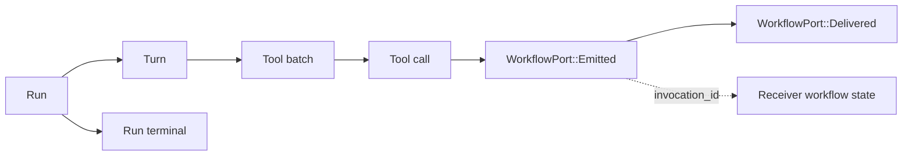
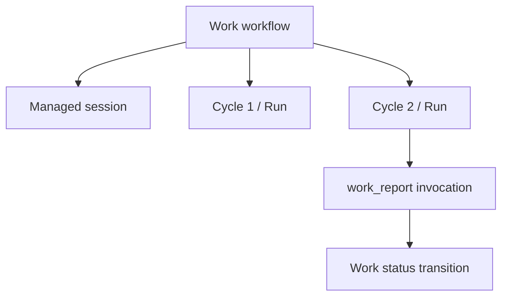

# P100: Workflow-Bound Tool Ports — Typed Agent-to-Workflow Signals

**Status**
- Proposed 2026-07-23.
- Greenfield: internal workflow protocols and engine event vocabulary may
  change without compatibility aliases.
- First consumer: **P101 (Durable Work)**, which declares `work_report` when
  it creates its managed session.
- Second intended topology: message mutation tools bound to a shared
  `MessagingWorkflow`; the full P71 migration is a follow-on and does not
  block P101.
- Builds on **P92 (Unified Suspension)**, **P95 (Config Redesign)**, the
  existing tool-result/effect path, CAS-backed tool arguments, and Temporal
  cross-workflow signaling.

## Decision

Add **workflow-bound tool ports** as the one generic extension point for an
agent session to emit typed facts to admitted durable workflows.

The trusted runtime may declare a schema-defined function tool on behalf of a
lifecycle controller or built-in workflow service, with one fixed receiver:

```text
lifecycle controller / workflow service
  -> declares port {
       tool: "work_report",
       input_schema: WorkReportV1,
       schema_revision: 1,
       receiver: admitted AgentWorkWorkflow endpoint
     }

model
  -> calls work_report({...})

session
  -> validates the call against the declared schema
  -> appends a typed WorkflowPort::Emitted event
  -> returns a small accepted result to the model
  -> delivers one generic workflow_tool_invoked signal to the port receiver

receiver workflow
  -> deduplicates invocation_id
  -> interprets WorkReportV1
  -> updates its own state machine
```

The model chooses a registered tool and supplies only that tool's declared
arguments. It cannot choose:

- a workflow id;
- a Temporal signal name;
- a universe;
- a port id or schema revision;
- a delivery mode.

Those are fixed by the admitted port binding.

P100 implements **notify-only** ports. Calling a port records and eventually
delivers a fact; it does not synchronously execute the receiver's handler or
return a semantic response from that workflow. A later request/reply mode
should create a Promise and reuse `await` rather than invent a second waiting
primitive.

## Why This Is The Right Abstraction

Lightspeed already has several communication mechanisms, but each has a
specific destination and lifecycle:

| Mechanism | Meaning |
|---|---|
| `message_send` | deliver content to an external messaging channel |
| `agent_send` | place content in another session's mailbox |
| `agent_request` + Promise | ask another session to run and await its result |
| `RunTerminalNotifyIntent` | tell a holder workflow that one admitted run terminated |
| workflow-bound tool port | let the agent emit a schema-validated semantic fact to one admitted receiver workflow |

The missing primitive is not another general mailbox. It is a safe way for a
workflow to lend an agent a small part of its command vocabulary.

Without ports, every workflow-backed product feature faces two bad choices:

1. add a bespoke tool, effect kind, signal DTO, delivery loop, and retry policy;
2. expose a raw tool such as
   `signal(workflow_id, signal_name, arbitrary_json)`.

The first duplicates infrastructure. The second gives model output authority
over routing and protocol selection, is difficult to authorize, and turns
every receiving workflow into an untyped public endpoint.

Workflow-bound tool ports separate the stable transport from product meaning:

```text
generic, owned by P100              domain-specific, owned by consumer
---------------------------------   -----------------------------------
port declaration                    tool name and description
JSON Schema validation              payload DTO
fixed receiver destination          interpretation
invocation identity                 state transition
session-log emission                business invariants
at-least-once Temporal delivery     duplicate handling result
```

This is a singular extension point without becoming arbitrary pub/sub.

## Product Invariants

1. **Every model-visible port is an ordinary typed function tool.**
   Providers need no workflow-specific vocabulary.
2. **The destination is capability-bound, never argument-bound.**
3. **The session log is authoritative for what the agent emitted.**
   Temporal signal history is delivery evidence, not the sole copy of the
   invocation.
4. **The receiver workflow is authoritative for what the emission means.**
   The session does not interpret `work_report`, `request_approval`, or future
   domain payloads.
5. **Delivery is at least once.** Receivers deduplicate by a deterministic
   invocation id.
6. **A successful tool result means “recorded for delivery,” not “the
   receiver completed handling it.”**
7. **Ports do not wake or steer arbitrary sessions.** Session-to-session
   communication remains Fleet/mailbox behavior.
8. **Ports do not create opaque reducer branches.** The engine understands the
   generic port lifecycle; only the receiver understands the payload.

## Vocabulary

- **Lifecycle controller** — the optional durable workflow that owns the
  session's higher-level objective or lifecycle, such as
  `AgentWorkWorkflow`.
- **Receiver workflow** — the durable workflow named by one admitted port
  binding. It may be the lifecycle controller or a shared workflow service.
- **Workflow service** — a registered receiver such as Messaging whose
  endpoint is resolved by trusted runtime policy rather than supplied by the
  model or raw profile config.
- **Port** — one model-visible function tool plus an immutable receiver
  binding.
- **Port definition** — tool name, description, JSON Schema refs, semantic
  type, and schema revision.
- **Port binding** — the admitted association between a port definition, one
  session, and one receiver workflow.
- **Invocation** — one observed model tool call of a declared port.
- **Emission** — the durable session-log fact created from a valid invocation.
- **Delivery** — the generic Temporal signal attempt from the session workflow
  to the bound receiver workflow.
- **Handler** — receiver-owned deterministic logic that interprets a delivered
  payload.

“Signal” in this document means the fixed Temporal transport signal. A port is
not a dynamically named Temporal signal and is not a general subscription.

## Ownership And Authority

### One lifecycle controller, multiple port receivers

P100 fixes the topology to:

```text
Session
  lifecycle controller: AgentWorkWorkflow?       // zero or one

  ports:
    work_report      -> AgentWorkWorkflow
    message_send     -> MessagingWorkflow
    message_edit     -> MessagingWorkflow
    request_approval -> ApprovalWorkflow          // later
```

The lifecycle controller answers “who owns this session's outer loop?” Each
port receiver answers “which workflow owns this semantic operation?” They are
independent relationships.

A Work-managed session has one `AgentWorkWorkflow` controller and binds
`work_report` to it. The same session may bind messaging tools to a
`MessagingWorkflow`. A standalone bridge session has no lifecycle controller
but may still receive Messaging service ports through its admitted messaging
feature.

Every receiver is validated to belong to the session's universe and recorded
durably. No receiver identity is accepted from model arguments.

### Workflow endpoint identity

Use a typed, versioned reference:

```rust
pub struct WorkflowEndpointRef {
    pub universe_id: Uuid,
    pub workflow_id: String,
    pub workflow_kind: String,
    pub protocol_version: u32,
    pub class: WorkflowEndpointClass,
}

pub enum WorkflowEndpointClass {
    LifecycleController,
    Service {
        service_id: String,
        routing_key: String,
    },
}
```

`workflow_kind` is diagnostic and admission metadata, not a dynamic signal
name. Every receiver implements the same fixed P100 signal.

The workflow id remains stable across continue-as-new. The binding never
contains a Temporal run id.

For lifecycle controllers, the receiver must already exist because it created
or owns the managed session. For built-in services, the trusted service
resolver owns workflow-id composition, sharding/routing policy, start args,
and signal-with-start/ensure-start behavior. A profile selects
`features.messaging`; it does not select a Messaging workflow shard.

### Who may declare ports

P100 admits bindings only through trusted runtime materialization:

- a managed-session controller may declare controller-bound ports when it
  creates the session; in P100, those bindings are immutable for that
  session's lifetime;
- a built-in feature resolver may materialize ports to a registered workflow
  service, for example `features.messaging` to the canonical same-universe
  Messaging endpoint;
- public/profile config may grant a known feature but never contain a raw
  Temporal workflow id;
- ordinary public `session/config/put` callers cannot invent, retarget, or
  widen a resolved receiver binding;
- session read projections expose bounded port summaries separately from the
  public config document;
- a model cannot create or mutate a port.

P100 needs only a small built-in workflow-service resolver, not a public
registry. A future workflow SDK may expose custom service registration behind
an authenticated endpoint capability. Dynamic controller-port replacement may
be added only when a real controller needs it.

## Port Definition

Illustrative types:

```rust
pub struct WorkflowToolPortDefinition {
    pub port_id: WorkflowToolPortId,
    pub revision: u32,
    pub semantic_type: String,
    pub function: FunctionToolSpec,
}

pub struct WorkflowToolPortBinding {
    pub definition: WorkflowToolPortDefinition,
    pub receiver: WorkflowEndpointRef,
    pub binding_fingerprint: String,
}
```

`FunctionToolSpec` already carries:

- the model-visible name;
- description ref;
- input JSON Schema ref;
- optional output JSON Schema ref;
- strictness and provider options.

For notify-only ports, the runtime owns the output. The model-visible result is
a stable acknowledgement such as:

```json
{
  "accepted": true,
  "invocationId": "wpi_..."
}
```

Consumers should not use the optional function output schema to imply that the
receiver has processed the emission.

### Semantic type and revision

`semantic_type` is a reverse-DNS-style identifier such as:

```text
lightspeed.work.report.v1
lightspeed.approval.request.v1
acme.invoice.triage.v3
```

It lets the receiver select a typed decoder and makes traces intelligible. It
does not select a destination or handler in the session.

The definition revision and the schema/document fingerprints are copied into
every emission. Replacing a port creates a new immutable binding fingerprint.
An in-flight call continues to use the toolset revision against which the turn
was planned.

### Validation

At binding admission:

- tool and port ids obey existing identifier limits;
- tool names do not collide with standard, Fleet, messaging, MCP, or other
  declared tools;
- description and schemas exist in CAS;
- input and optional output schemas are supported JSON Schema documents;
- semantic type and revision are non-empty and versioned;
- receiver universe equals session universe;
- the receiver came from the lifecycle-controller capability or a registered
  workflow-service resolver, never an untrusted raw workflow id;
- binding size and total port count stay below deployment limits.

The managed-session creation fingerprint includes its optional lifecycle
controller and controller-bound port definitions. Retrying with the same
session id and fingerprint reopens it; retrying with a different controller or
controller-port set is a conflict. Service-bound port fingerprints derive from
the admitted feature/config revision and the registered service endpoint.

At invocation:

- the call resolves to the exact binding from its planned toolset revision;
- arguments validate against that binding's input schema;
- the runtime, not the model, supplies receiver and binding metadata;
- oversized arguments remain CAS-backed through the existing observed tool
  call.

A schema-invalid invocation is an ordinary failed tool call. It creates no
port emission.

## Config And Toolset Integration

P95 made the installed toolset derived state. P100 preserves that invariant by
resolving workflow-bound tools from two trusted declaration sources:

```text
effective tool declaration
  = public/profile SessionConfig features
      -> built-in workflow-service ports
  + immutable lifecycle-controller port declarations
```

Illustrative internal declarations:

```rust
pub struct ControllerWorkflowPorts {
    pub version: u32,
    pub controller: WorkflowEndpointRef,
    pub ports: Vec<WorkflowToolPortDefinition>,
}

pub struct ResolvedWorkflowServicePort {
    pub service_id: String,
    pub binding: WorkflowToolPortBinding,
}
```

The distinction is authority:

- public/profile feature blocks are changed through the existing config path;
- the feature resolver maps known capabilities to registered service
  endpoints—for example `features.messaging` to MessagingWorkflow bindings;
- lifecycle-controller ports are admitted only from trusted managed-session
  creation args and are immutable in P100.

Toolset reconciliation consumes both sections and still produces one
`ToolPatch` and one toolset revision. It installs each port as:

- a normal `ToolKind::Function(FunctionToolSpec)` for provider presentation;
- a runtime `ToolBinding` whose execution mode is
  `WorkflowPort { port_id, binding_fingerprint }`.

This is not a return to an externally writable `session/tools/update` API.
Callers declare capabilities; the runtime still materializes tools.

Later public config changes may add or remove built-in service ports through
their normal feature blocks and existing idle/toolset-revision rules, while
preserving immutable lifecycle-controller ports. There is no second toolset
writer and no model-controlled endpoint.

## Session Event Vocabulary

P100 adds a closed generic event family:

```rust
pub enum WorkflowPortEvent {
    Emitted {
        invocation: WorkflowToolInvocation,
    },
    Delivered {
        invocation_id: WorkflowToolInvocationId,
    },
    DeliveryFailed {
        invocation_id: WorkflowToolInvocationId,
        error_ref: BlobRef,
        retryable: bool,
    },
}
```

Controller-port declarations are durable managed-session creation facts.
Service-port declarations are reproducibly derived from the admitted session
config and registered same-universe service endpoint. Both may reuse existing
config/tool events rather than add a second event family. `Emitted`,
`Delivered`, and terminal `DeliveryFailed` are not optional: they form the
durable outbox.

The invocation envelope is bounded:

```rust
pub struct WorkflowToolInvocation {
    pub invocation_id: WorkflowToolInvocationId,
    pub port_id: WorkflowToolPortId,
    pub semantic_type: String,
    pub schema_revision: u32,
    pub binding_fingerprint: String,
    pub session_id: SessionId,
    pub run_id: RunId,
    pub turn_id: TurnId,
    pub tool_batch_id: ToolBatchId,
    pub tool_call_id: ToolCallId,
    pub arguments_ref: BlobRef,
}
```

The receiver endpoint is copied into durable delivery state but need not
be repeated in the receiver-facing envelope because the signal target is
already fixed.

`invocation_id` is deterministically derived from:

```text
session id
+ run id
+ turn id
+ tool batch id
+ tool call id
+ binding fingerprint
```

It is stable across activity retry, worker restart, and session
continue-as-new.

### Payload access

The Temporal signal carries the bounded envelope and `arguments_ref`, not an
unbounded copy of model arguments. A receiving workflow:

1. validates envelope metadata and deduplicates `invocation_id`;
2. buffers the envelope in workflow state;
3. uses a consumer-owned activity to load the CAS blob and decode its typed
   payload;
4. records that bounded activity result in Temporal history before branching.

P100 may provide a generic CAS-load/schema-check activity helper, but it does
not dynamically interpret the consumer's semantic type. This keeps workflow
code deterministic and avoids duplicating large arguments into both session
and receiver histories.

### Relationship to `ToolEffect`

Existing tools may return generic `ToolEffect` values, and Promise tools decode
recognized effects into typed Promise events/state because the session must
branch on them.

Workflow ports follow the same convergence but do not leave receiver
delivery as an opaque consumer convention:

```text
tool runtime recognizes WorkflowPort binding
  -> creates a typed internal port-emission effect
  -> engine validates it against the active binding and call joins
  -> same command append records Tool::CallCompleted
     and WorkflowPort::Emitted
  -> reducer adds invocation to pending port deliveries
```

The generic `ToolEffect` carrier may be reused internally to avoid changing
the tool runtime trait, but the durable contract is `WorkflowPortEvent`, not a
magic string that every product independently scans.

The model supplies only arguments. It cannot forge the internal effect,
invocation joins, receiver, or binding fingerprint.

## The Event Log As A Graph

The session log remains a linear, totally ordered event stream. Typed ids form
causal edges over that stream:



This is the same pattern already used by runs, turns, tool calls, submission
ids, correlations, and Promises:

```text
physical storage:  append-only event sequence
logical shape:     typed causal graph projected from stable ids
```

P100 does not turn the event log into an arbitrary graph database. It adds one
closed edge type: a tool call emitted a workflow-bound invocation, and that
invocation was delivered.

Product workflows may build their own state graphs in Temporal history:



The session log proves what the agent did and emitted. The receiver history
proves how its domain state machine interpreted those facts.

## Delivery Protocol

Every compatible receiver workflow exposes one fixed signal:

```text
workflow_tool_invoked(WorkflowToolInvocation)
```

There are no dynamic Temporal signal names.

The session workflow owns a log-backed delivery pump:

1. reduce `WorkflowPort::Emitted` into `pending_port_deliveries`;
2. for a built-in service endpoint, apply its registered ensure-start policy;
3. send `workflow_tool_invoked` to that invocation's admitted receiver
   workflow id;
4. on accepted signal operation, append `WorkflowPort::Delivered`;
5. retry transient transport failures with deterministic policy;
6. surface a bounded terminal failure without dropping the invocation.

Delivery is **at least once**. A crash after the signal is accepted but before
`Delivered` is appended may send the invocation again.

The receiver keeps a bounded deduplication set keyed by `invocation_id`, or
incorporates the id into its domain transition:

```rust
if handled_invocations.insert(invocation.invocation_id.clone()) {
    apply_typed_handler(invocation);
}
```

The receiver must not infer ordering across different sessions. Within one
session, event order is available through run/turn/batch/call joins, but
duplicate delivery remains possible.

### Tool completion versus delivery

The port tool call completes when `Emitted` is durable. It does not wait for
Temporal signal acceptance.

This keeps tool execution from coupling model latency to an arbitrarily
long-lived receiver and avoids a deadlock where:

```text
session waits for receiver handler
receiver waits for run terminal or another external event
run cannot terminate because tool call is waiting
```

The session workflow should flush pending emissions promptly, but domain
workflows must tolerate either ordering between port delivery and the separate
run-terminal notification. P101 Work buffers `work_report` invocations and
reconciles them only at the matching run-terminal boundary.

## Failure Semantics

### Crash after emission, before signal

The invocation remains in `pending_port_deliveries` after rehydration and is
sent.

### Crash after signal, before delivered append

The signal may be repeated. Receiver deduplication prevents a second domain
transition.

### Receiver is temporarily unavailable

Retry delivery with bounded backoff. The tool call remains successful because
the emission is durable. Pending delivery gates unsafe session
continue-as-new unless all required outbox state is carried forward.

### Receiver does not exist or rejects the protocol

After a bounded non-retryable determination, append `DeliveryFailed` and make
the failure visible in session projection/diagnostics. P100 does not
automatically fail or cancel the session; the owning product or operator
decides how a lost receiver is repaired.

### Public config tries to mutate a port

Admission rejects any raw receiver or retarget attempt. Controller-bound ports
are immutable after managed-session creation. Built-in service ports may be
added or removed only by changing their owning feature through the existing
config/toolset revision path.

### Duplicate tool-result admission

Existing tool-call admission idempotency prevents a second `Emitted` event for
the same call. Receiver deduplication remains required for transport retries.

### Malformed payload

Schema validation fails before emission. If CAS content later cannot be read,
the receiver records a domain-visible malformed/unreadable invocation and must
not invent a successful interpretation.

### Receiver continue-as-new

Signals target the stable workflow id, never a run id. The receiver carries
its dedupe/domain state across continue-as-new.

### Session continue-as-new

Pending delivery state and receiver bindings are carried forward. The stored
session events remain the source for reconstruction.

## Notify Now, Promise Later

P100 deliberately distinguishes two interaction shapes:

```text
notify:
  agent calls port
  -> emission is durable
  -> model receives accepted
  -> receiver reacts independently

request/reply (later):
  agent calls workflow-backed request port
  -> emission creates Promise
  -> receiver eventually resolves Promise
  -> agent uses await/cancel/detach
```

The later mode should add a `PromiseSource::WorkflowToolInvocation` and use the
P92 suspension machinery. It should not keep a tool activity open, add
`workflow_port_wait`, or overload notify delivery acknowledgements with domain
results.

P101 Work needs notify only: `work_report` declares the agent's disposition;
the Work workflow does not return information through that call.

## First Consumer: P101 Work

P101 declares:

```text
tool name:        work_report
semantic type:    lightspeed.work.report.v1
schema revision:  1
receiver:         the AgentWorkWorkflow that created the session
```

Illustrative payload:

```rust
pub struct WorkReportV1 {
    pub outcome: WorkDispositionKind,
    pub summary: Option<String>,
    pub requested_input: Option<String>,
}
```

P100 guarantees only that a valid invocation is durably emitted and delivered.
P101 owns:

- whether `complete` or `blocked` is valid in its current state;
- conflicting-report policy;
- buffering until the matching run terminates;
- result construction;
- whether another execution cycle is scheduled.

This division is the proof that the abstraction is useful: a later approval,
triage, escalation, or workflow-specific control tool reuses P100 without
adding another session delivery protocol.

## Second Topology: Messaging As A Workflow Service

P100 must support this shape even though the complete messaging migration need
not block P101:

```text
Work-managed session
  lifecycle controller: AgentWorkWorkflow

  work_report   -> AgentWorkWorkflow
  message_send  -> MessagingWorkflow
  message_edit  -> MessagingWorkflow
  message_react -> MessagingWorkflow
```

`features.messaging` remains the public/profile capability. Its trusted
materializer resolves the model-visible message tools to a canonical
same-universe Messaging service endpoint; neither the config document nor the
model contains that workflow id.

The eventual message path is:

```text
message_send call
  -> WorkflowPort::Emitted in the session log
  -> workflow_tool_invoked to MessagingWorkflow
  -> deduplicate by invocation_id
  -> enqueue/update the bridge-facing outbox through an idempotent activity
  -> receive or observe delivery acknowledgement
  -> retain delivery lifecycle in MessagingWorkflow state/history
```

The invocation id deterministically derives the message/outbox id. Notify mode
returns `accepted` once the session emission is durable. If the agent must wait
for actual channel delivery, the future request/reply mode creates a Promise.

The existing PostgreSQL outbox remains useful as the bridge-facing delivery
queue and query projection. If messaging moves behind a workflow, it must not
become an independent second business-state authority: the workflow owns
orchestration and retry state, while outbox writes and acknowledgements are
idempotent transport operations.

`message_noop` has no external lifecycle and may remain inline. Pure,
bounded tools do not become workflows merely because ports exist.

## Scope

P100 includes:

1. Zero or one immutable lifecycle-controller reference on a session.
2. Any bounded number of fixed, same-universe receiver endpoints across that
   session's ports.
3. A generic internal managed-session start operation usable by any registered
   lifecycle controller, not only Work.
4. Schema-defined, model-visible function tools derived into the normal
   session toolset.
5. Immutable controller-bound ports admitted at managed-session creation and
   built-in service ports resolved from known feature grants.
6. Notify-only invocation semantics.
7. A typed `WorkflowPortEvent` family and reducer-owned pending-delivery state.
8. One fixed `workflow_tool_invoked` Temporal signal.
9. Deterministic invocation identity and receiver deduplication guidance.
10. At-least-once, log-backed delivery across retry, restart, and
   continue-as-new.
11. Session/API projections sufficient to inspect declared ports, emissions,
    pending delivery, and terminal delivery failure.
12. Protocol, reducer, runtime, and live Temporal tests.
13. P101's `work_report` plus a second receiver/service binding in the same
    session as the proof that routing is not controller-specific.

## Explicit Non-Goals

P100 does not add:

- `signal(workflow_id, signal_name, json)` or any model-selectable routing;
- global topics, broadcast, wildcard subscriptions, or a pub/sub registry;
- multiple lifecycle controllers per session;
- external webhook, schedule, email, or bridge ingress;
- session-to-session messaging or replacement of Fleet;
- synchronous handler completion;
- request/reply ports or a second waiting primitive;
- arbitrary receiver-defined reducer events;
- model-authored tool schemas or runtime port creation;
- adding or retargeting controller-declared ports after managed-session
  creation;
- a public endpoint that lets ordinary session callers target Temporal
  workflows;
- a durable product database for port invocations;
- Work status, goal-loop, approval, or other consumer semantics;
- dynamic tool registration while a turn or tool batch is active.

## API And Projection Surface

P100 is primarily an internal workflow protocol. It adds no public mutation
RPCs.

Existing session reads should project bounded diagnostics:

```rust
pub struct WorkflowToolPortView {
    pub port_id: WorkflowToolPortId,
    pub tool_name: ToolName,
    pub semantic_type: String,
    pub revision: u32,
    pub receiver_workflow_kind: String,
    pub binding_fingerprint: String,
}

pub struct WorkflowPortDeliveryView {
    pub invocation_id: WorkflowToolInvocationId,
    pub port_id: WorkflowToolPortId,
    pub run_id: RunId,
    pub tool_call_id: ToolCallId,
    pub status: WorkflowPortDeliveryStatus,
    pub error_ref: Option<BlobRef>,
}
```

Full arguments remain behind the existing CAS/event authorization boundary.
Do not copy payloads into summary views.

If a future workflow SDK exposes managed-session creation with ports, it
should use an authenticated server operation bound to the calling workflow's
endpoint capability. Dynamic custom changes, if later needed, must not be
implemented as a general `session/tools/update` or accept raw unverified
workflow ids.

## Crate And Module Shape

Expected changes:

```text
crates/engine/
  workflow-port ids, endpoint/binding DTOs
  WorkflowPortEvent and deterministic reducer state
  validation of typed internal emission effects
  session-log projections

crates/tools/
  WorkflowPort ToolExecutionMode/binding
  generic inline invocation adapter
  schema validation and stable acknowledgement

crates/temporal-workflow/
  optional lifecycle-controller and resolved receiver bindings
  workflow_tool_invoked signal DTO
  pending-delivery pump state

crates/temporal-server/
  controller-authorized managed-session creation path
  built-in workflow-service endpoint resolver
  effective config/toolset materialization
  cross-workflow signal operation
  delivery retry/failure projection

crates/api/ and api-projection/
  read-only port and delivery views if exposed through session reads
```

P100 does not add domain handlers to `engine`. A receiver workflow imports
the envelope type and owns its typed payload DTO.

## Implementation Plan

### Slice 1: Port, endpoint, and controller contracts

- [ ] Add validated workflow endpoint, port, and invocation ids.
- [ ] Add the optional immutable same-universe lifecycle controller to the
      trusted managed-session start path.
- [ ] Add `WorkflowToolPortDefinition`, semantic type/revision, and binding
      fingerprint validation.
- [ ] Bind every port to one admitted `WorkflowEndpointRef`.
- [ ] Admit immutable controller ports atomically with managed-session
      creation.
- [ ] Add a built-in service resolver that maps known feature grants to
      same-universe endpoints without exposing workflow ids in config.
- [ ] Reject raw receiver creation or retargeting from ordinary public config
      writes.

### Slice 2: Toolset and event-log integration

- [ ] Materialize port definitions as ordinary `FunctionToolSpec` entries plus
      `WorkflowPort` runtime bindings.
- [ ] Validate call arguments against the admitted schema.
- [ ] Add typed internal emission effect handling.
- [ ] Atomically append tool completion and `WorkflowPort::Emitted`.
- [ ] Reduce emitted invocations into pending delivery state.
- [ ] Project declarations, emissions, delivery, and failure without inlining
      payloads.

### Slice 3: Temporal delivery

- [ ] Add the fixed `workflow_tool_invoked` signal and envelope.
- [ ] Send each pending emission to its immutable bound receiver id.
- [ ] Append delivered/terminal-failure facts.
- [ ] Make retry safe across the signal-accepted/append gap.
- [ ] Carry binding and outbox state through session continue-as-new.
- [ ] Provide a reusable receiver-side invocation deduper/helper.

### Slice 4: Prove multiple receivers and Work

- [ ] Register a minimal service receiver with a different port schema.
- [ ] Bind controller and service ports to the same session and prove each
      invocation reaches only its fixed receiver.
- [ ] Have P101 declare `work_report` when it creates its managed session.
- [ ] Deliver `WorkReportV1` through `workflow_tool_invoked`.
- [ ] Buffer delivery before run terminal and reconcile only after the exact
      run terminates.
- [ ] Prove no Work-specific tool effect, Temporal signal, or delivery loop is
      required.

### Slice 5: Failure and compatibility coverage

- [ ] Test schema-invalid calls create no emission.
- [ ] Test duplicate tool-result admission creates one emission.
- [ ] Test crash before signal and crash after signal/before delivered append.
- [ ] Test duplicate receiver delivery.
- [ ] Test public config cannot retarget controller or service bindings.
- [ ] Test ordinary feature reconciliation can add/remove its own built-in
      service ports at an idle boundary.
- [ ] Test each receiver and the session continue-as-new independently.
- [ ] Test receiver absent, protocol mismatch, and terminal delivery failure.
- [ ] Confirm Fleet, Promises, messaging bridges, MCP, and standalone sessions
      are unchanged.

Live Temporal tests must source `local/env.sh` and run serially with
`--test-threads=1`.

## Acceptance Criteria

P100 is complete when:

1. A trusted controller workflow can create/own a session with a typed port,
   while a known feature can independently add a port bound to a registered
   service workflow.
2. The model sees only the declared tool name, description, and schema; it
   cannot choose the receiver or transport.
3. A valid call atomically produces an ordinary successful tool result and one
   typed, CAS-backed `WorkflowPort::Emitted` fact linked to the exact
   run/turn/batch/call.
4. The session delivers the invocation through one fixed generic Temporal
   signal with at-least-once semantics.
5. Retry, duplicate delivery, worker restart, and both workflows'
   continue-as-new do not lose an invocation or apply one receiver transition
   twice.
6. Invalid arguments and unauthorized port declaration/mutation fail without
   emitting or signaling.
7. Toolset derivation remains capability-driven and no public
   `session/tools/update` surface returns.
8. P101 implements `work_report` only as a schema and Work handler over this
   substrate, with no Work-specific transport.
9. One session can deliver controller and service port invocations to two
   different fixed receiver workflows without changing the session engine or
   delivery pump.
10. Existing Fleet, Promise, external messaging, MCP, and run-terminal behavior
   remains unchanged.

## Follow-On Boundary

P100 intentionally leaves these seams:

- request/reply ports may create Promises;
- an authenticated workflow SDK may expose custom endpoint registration and
  controller-owned managed-session creation;
- the existing messaging tools may migrate to a MessagingWorkflow using the
  topology defined here;
- port invocation projections may feed mission control or evals;
- hardened deterministic workflows may expose request ports as agent tools;
- external systems may start controller workflows through a separate ingress
  plane.

Those extensions should reuse the fixed envelope, invocation identity, event
family, and authority model. They should not weaken the central rule: the
agent chooses a granted semantic operation, never an arbitrary destination.
