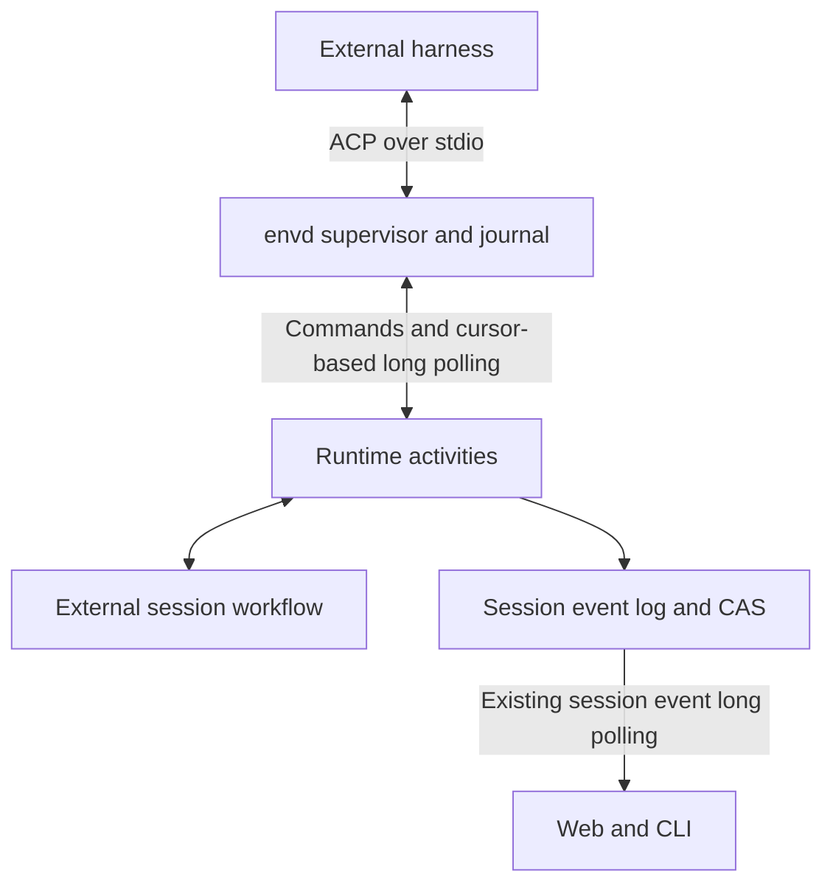

# P185 — External harness sessions in environments

**Status:** Proposed, 2026-09-29. Repository and upstream documentation reviewed;
no bridge, compatibility trial, or runtime changes implemented.

## Outcome

Run third-party agent harnesses inside Lightspeed environments and expose their
conversations through the existing session API, event log, and clients. A user
can choose a harness, submit work, follow messages and tool activity, answer
permission requests, cancel work, and return to the conversation later where
the harness supports persistence.

Lightspeed owns admission, orchestration, access policy, retained observations,
and supervision. The external harness owns its model calls, context, tools,
and internal execution loop. Recovering Lightspeed's workflow or transcript
does not imply recovering a harness's interrupted execution.

Use Agent Client Protocol (ACP) as the first integration driver to validate.
Keep the internal session model and environment supervision independent of
ACP so a harness can use a native interface when required.

Implement this in modules within existing workspace crates. Begin with the
environment protocol, its client, and envd, then drive one real harness through
that boundary before changing Lightspeed session storage, workflows, or UI.

This is the opposite direction from the
[editor ACP adapter](later/pNNN-editor-acp-adapter.md): here Lightspeed is the
ACP client and an external harness is the agent. That proposal exposes
Lightspeed as an agent to editors. The
[A2A adapter](later/pNNN-a2a-protocol-adapter.md) addresses delegation between
agent services and remains a separate integration.

## Protocol choice and adoption

The relevant alternatives are ACP, harness-native interfaces, and integration
with an existing agent host. A2A addresses independently operated agent
services rather than the detailed control of a harness launched on a machine.

Upstream evidence reviewed on 2026-09-29:

| Integration | Documented approach | Implication |
| --- | --- | --- |
| [Zed external agents](https://zed.dev/docs/ai/external-agents) | ACP and an agent registry | ACP is an established external-agent path in a shipping editor. |
| [JetBrains AI Assistant](https://www.jetbrains.com/help/ai-assistant/acp.html) | Registry and manually configured ACP agents | A second editor family consumes the same integration surface. |
| [VS Code Agent Host](https://code.visualstudio.com/blogs/2026/08/26/agent-host-architecture) | Harness-specific adapters, including Copilot SDK and Claude Agent SDK; AHP between host and clients | A shared session experience does not require every harness to speak the same protocol. |
| [Copilot CLI](https://docs.github.com/en/copilot/reference/copilot-cli-reference/acp-server) | An ACP server, currently public preview | ACP is also exposed by a major harness vendor. |

This establishes concrete implementations, not measured usage share or a
guarantee of future convergence. Compatibility must be demonstrated against
the versions Lightspeed intends to ship.

[Agent Host Protocol (AHP)](https://code.visualstudio.com/docs/agents/concepts/agent-host)
provides synchronized session state for multiple clients connected to a host.
Its host-owned state, snapshots, and ordered updates are relevant design
references. Adopting it would be a separate decision to reuse an existing host
or expose Lightspeed to AHP clients; it is not required for the initial bridge.

Native interfaces remain valid alternatives. For example,
[Codex App Server](https://learn.chatgpt.com/docs/app-server) exposes rich
Codex integration, while Claude Agent SDK and Pi RPC provide their respective
harness boundaries. A direct driver can avoid adapter feature gaps at the
cost of maintaining harness-specific integration and version compatibility.

## Initial harness targets

| Harness | ACP route | Evidence and qualification |
| --- | --- | --- |
| Codex | `codex-acp` adapter | [Adapter](https://github.com/agentclientprotocol/codex-acp) starts Codex App Server and translates requests and events. |
| Claude | `claude-agent-acp` adapter | [Adapter](https://github.com/agentclientprotocol/claude-agent-acp) uses Claude Agent SDK; this is an SDK integration, not control of the interactive terminal UI. |
| OpenCode | Native `opencode acp` | [Documentation](https://opencode.ai/docs/acp/) describes an ACP subprocess over stdio. |
| Pi | `pi-acp` adapter | [Adapter](https://github.com/svkozak/pi-acp) starts `pi --mode rpc`; it documents incomplete capabilities, including no forwarding of ACP-provided MCP configuration into Pi. |

The compatibility trial pins harness and adapter versions. Presence in a
registry does not establish support for permissions, persistence, concurrency,
or every native feature. Record supported operations and limitations per
tested combination rather than exposing one global ACP-support flag.

Start with ACP v1 and negotiated capabilities. The
[ACP v2 announcement](https://agentclientprotocol.com/announcements/acp-v2-draft)
currently labels v2 a draft and changes prompt and session lifecycle semantics.
Keep version mappings inside the driver; do not make a v1 prompt response the
universal definition of run completion.

## Current repository boundary

- [StoredEvent](../../crates/engine/src/session/stored.rs) already has a generic
  `kind`, `version`, and `payload` envelope. The session store supports ordered
  appends with an expected head and retains referenced content.
- [Session storage projections](../../crates/engine/src/storage/session.rs)
  recognize native core lifecycle and run events. Generic storage does not yet
  make sessions independent of the engine.
- [API projections](../../crates/api-projection/src/lib.rs) consume native core
  state and events. Current-state reads, transcript views, and run output need
  explicit external-backend support.
- [Session event reads](../../crates/api/src/sessions.rs) already support a
  cursor and `waitMs`; the web client already tails this API.
- The [environment process protocol](../../crates/environment-protocol/src/data/process.rs)
  closes ordinary pipe stdin after initial input; later input requires a PTY.
  ACP requires persistent bidirectional pipes, so it cannot simply use the
  existing interactive process surface unchanged.
- The [environment-job workflow](../../crates/temporal-workflow/src/workflows/environment_job.rs)
  is a precedent for supervising machine work outside the engine. Its job
  polling and completion semantics are not an ACP implementation.

## Proposed design

### 1. Separate sessions, harnesses, and processes

Make the session backend explicit. The following is conceptual, not a final
Rust or public-wire definition:

```text
SessionBackend = Lightspeed | ExternalHarness

ExternalHarness configuration:
  harness identity and pinned installation/configuration revision
  driver kind (initially ACP)
  environment identity
  working directory
  credential binding references
  admitted execution policy

ExternalHarness runtime binding:
  harness instance ID
  external session ID
  journal generation and committed ingestion cursor
  negotiated protocol version and capabilities
```

Model three distinct resources:

| Resource | Meaning |
| --- | --- |
| Harness installation | Executable/adapter, version, and launch configuration available on an environment |
| Harness instance | Running endpoint, connection, and owned process tree |
| Harness session | Logical conversation addressed through that endpoint |

The session backend is fixed at creation initially. Changing harnesses or
drivers for an existing conversation requires a deliberate compatibility or
transfer operation; a shared transcript is not transferable native context.
External configuration must not require a fictitious Lightspeed model route
or apply Lightspeed's native model default to an unrelated harness.

ACP permits multiple sessions on a connection. Process allocation is an
implementation detail: an adapter may multiplex in one runtime or spawn a
process per session. [ACP architecture](https://agentclientprotocol.com/get-started/architecture)
and [session setup](https://agentclientprotocol.com/protocol/v1/session-setup)
describe the distinction between a connection and a conversation.

Initially allocate one ACP instance per active Lightspeed session. An instance
may contain an adapter and several child processes. Keep the schema capable
of sharing an instance later, but do not introduce pooling before testing
concurrency, cancellation, authentication scope, and failure isolation.
Separate processes do not isolate shared machine files or credentials.

### 2. envd owns the local bridge

Extend `environment-protocol` with an optional harness-supervision capability
and a distinct method family. Reuse existing environment connections,
authentication, and gateway routing; do not introduce a second
Lightspeed-to-envd protocol or service. ACP is the envd-to-harness boundary.
Daemons that only support files and processes need not implement this capability.

The initial operation families cover instance start/stop, conversation
open/restore/close, input submission, interaction responses, cancellation,
repeatable event reads, and acknowledgements. Use stable operation identities
and typed supervision facts, with versioned driver-specific observation
payloads where necessary. Avoid an unrestricted JSON-RPC forwarding method.
Settle exact method names and payloads in the environment-only validation slice.

Add a harness supervisor to envd, with ACP as its first driver. It launches
the configured executable, maintains the connection, manages the process tree,
and journals observations. Reuse process-management primitives where suitable,
but provide persistent stdin/stdout pipes and separate stderr; do not carry
ACP through a PTY or a lossy terminal-output buffer.

The driver performs initialization, capability negotiation, session creation
or restoration, prompt delivery, and response correlation. It continuously
reads ACP notifications and requests as they arrive. envd does not poll the
harness for generated text. This follows
[ACP's bidirectional stdio transport](https://agentclientprotocol.com/protocol/v1/transports).

envd remains an environment service: no Lightspeed database access, Temporal
dependency, bot routing, or native engine dependency. The environment protocol
defines the supervision requests and observations. The Incus provider continues
to depend only on that protocol boundary.

Launch definitions and credential bindings come from admitted configuration.
Do not let model-authored arguments choose arbitrary harness executables or
secret sources. Resolve credentials outside durable session state and keep
them out of protocol transcripts and process diagnostics.

#### Module placement and Rust SDK

Add no new workspace crates for this work. Keep responsibilities in focused
modules within the crates that already own each boundary:

| Existing crate | Responsibility |
| --- | --- |
| `environment-protocol` | Harness capability, request/response types, observation envelopes, and typed errors |
| `environment-client` | Typed calls over existing connections and an executable validation example |
| `environment-daemon` | Harness supervisor, ACP driver, local journal, and process cleanup |
| `engine` | Shared deterministic session/log types in existing session/storage modules, separate from the native core reducer |
| `temporal-workflow` | External-session state machine and workflow, added after bridge validation |
| `temporal-server` | Runtime activities, admission, and backend dispatch, added after bridge validation |
| `store-pg` / `store-fs` | Existing session-log persistence and backend-aware projections |
| `api` / `api-projection` | Public session capabilities and views for both backends |

Use the official
[`agent-client-protocol` Rust SDK](https://docs.rs/agent-client-protocol/2.2.0/agent_client_protocol/)
inside the daemon's ACP driver. Its client, typed handlers, session helpers,
and byte-stream transports supply the protocol machinery. Version 2.2.0 was
reviewed for this proposal; pin the chosen compatible release during the trial.
The SDK's version is distinct from the wire protocol: use stable ACP v1
initially and leave draft protocol-v2 features disabled.

Adding this upstream dependency does not introduce a new Lightspeed workspace
crate. Keep SDK types out of `environment-protocol` and public session types.
envd owns supervision, journaling, and cancellation policy even if SDK helpers
are used for transport or launching. Prefer supplying supervisor-owned pipes
when SDK process ownership would conflict with envd cleanup or restart rules.
The validation slice must exercise that lifetime boundary rather than only
demonstrate the SDK's one-shot client example.

### 3. Long polling connects two event-driven boundaries



Use a repeatable read operation conceptually shaped as:

```text
read_events(instance, external_session, generation, after_seq, wait_ms, limit)
```

Return available observations immediately. When caught up, wait until new
observations arrive or the bounded timeout expires. A small coalescing window
may batch streaming output; permission requests and terminal outcomes should
not wait behind a large text buffer. This differs from a periodic poll that
only checks every few seconds, and from existing process reads that collect
output until their wait budget expires.

The runtime activity reads envd; product clients independently read the committed
Lightspeed log. Product clients do not connect directly to envd. The initial
validation example deliberately exercises envd through `environment-client`
before this runtime path exists. Keep page and byte limits,
timeouts, and cancellation aligned through direct and gateway-routed paths.
The transport must allow cancellation or permission replies while a read is
outstanding; one blocked request must not monopolize the connection.

Use bounded normal activities for waiting I/O, with heartbeat/cancellation
support where needed. Batch observations and put payloads in CAS so Temporal
history carries references and decision facts. Do not create a workflow signal
or activity result per token. Continue-as-new preserves pending command IDs,
binding identity, and committed cursors.

### 4. A separate workflow supervises the external session

Introduce an external-session workflow with a small deterministic state
machine. It admits inputs, queues runs, schedules bridge commands and reads,
handles interactions, records outcomes, and owns cleanup. It does not invoke
the native engine's model/tool planning loop or reconstruct native context.

Initially allow one active foreground run per external session and queue later
inputs. Steering and background work are explicit capabilities, not assumed
equivalents across harnesses. A protocol update may belong to the session
without belonging to the current run. Map completion from documented driver
semantics and preserve the original stop reason alongside the public outcome.

Use the existing runtime binary and sessions role initially. Other controllers
communicate through workflow starts and signals. For delegation from a native
Lightspeed agent, use the generic workflow-tool protocol to start or address
an external-session controller and return its result. ACP transport must not
become a feature-specific branch in the stable native session worker.

### 5. Reuse the session log and extract shared session concepts

Separate shared session identity, lifecycle, storage contracts, and public
facts from native core execution within the existing session/storage modules
in `engine`. Do not create a new session-domain crate. The external workflow
may reuse those deterministic types without driving the native core reducer
or requiring a populated `CoreAgentState`; it has its own reducer and
checkpoint format. envd remains independent of `engine` and session storage.

Retain one ordered session log with backend-aware event families:

| Family | Examples |
| --- | --- |
| Shared lifecycle | Session created/closed, backend binding established |
| Shared work | Input admitted, run started, completed, cancelled, interrupted |
| Shared interaction | Permission requested, decision recorded, interaction expired |
| Native execution | Generation, context, and native tool-execution facts |
| External execution | Imported update batch, command delivery state, connection/recovery facts |

The lifecycle and run facts have one authoritative representation per backend;
do not emit independently mutable duplicate histories. Both backends project
into common public message, tool, interaction, and run views.

Retain protocol-native external update batches in CAS with driver/schema
version, source identity, and sequence range. Use typed, bounded control facts
for workflow decisions and derive detailed transcript views from retained
payloads. Preserve unfamiliar updates for later inspection without pretending
they have known control semantics. Register content roots and nested retention
edges explicitly, including media referenced by external payloads.

An external tool update reports work owned by the harness; it never schedules
the corresponding Lightspeed native tool. Likewise, a permission response
authorizes the pending external request rather than resolving a native MCP
continuation. Generalize interaction subjects and decision options instead of
forcing ACP requests into the current MCP-only approval representation.

Keep one logical workflow owner of appends per session. Ingestion, input
admission, and interaction decisions converge through that owner and the
existing expected-head checks. Catalog activity, current-state reads, run
outputs, retention, and checkpoints must all recognize the selected backend.

Unsupported operations return typed capability errors. In particular, native
context edits, compaction, fork/clone, provider changes, and tool configuration
cannot silently acquire invented external semantics. Expose capabilities to
clients so unavailable controls can be explained or omitted.

### 6. Journal delivery and command recovery are separate guarantees

envd keeps a local persisted delivery journal. Lightspeed's session log is the
authoritative retained product history. Import follows this order:

1. envd journals an observation with a stable source sequence number.
2. Lightspeed reads after its committed source cursor.
3. A store operation atomically appends the imported observations and their
   cursor advancement, deduplicating retries by source identity and range.
4. Only after commit does Lightspeed acknowledge the cursor to envd.
5. envd may prune acknowledged entries under its retention policy.

Use an instance/journal generation to distinguish sequence spaces. On a lost
append response, recover the committed import before retrying or acknowledging.
A repeated read must not advance a destructive server-side cursor. Lost or
expired ranges produce a typed gap; never silently truncate protocol history.
Bound disk use and define backpressure or explicit failure when unacknowledged
data cannot be retained. A machine lost before import can still lose its
unreplicated observations; local journaling does not provide replication.

Commands carry stable operation IDs and immutable input fingerprints. Record
admission before dispatch and recover the existing operation on retry. An ACP
JSON-RPC request ID only correlates messages; it is not an exactly-once promise.
There remains a crash window between sending a prompt and recording evidence
of its execution. Inspect or restore existing work where supported; otherwise
record an uncertain/interrupted outcome instead of automatically repeating it.

Distinguish connection loss, daemon restart, harness exit, environment loss,
and session-history restoration. Restoring a conversation does not prove an
interrupted command resumed. Replayed harness history must be reconciled as
history, not appended as duplicate new output. Missing message identities or
ambiguous replay require a defined driver policy and explicit diagnostics.

Cancellation records intent, sends the driver's cancellation operation, and
observes the result. Apply a declared escalation policy for owned processes
when graceful cancellation fails. Late success cannot revive a terminal run;
later cleanup observations remain recordable. Pending permission replies are
correlated to the instance generation and request, so a stale decision cannot
authorize a replacement process's unrelated request.

### 7. Preserve environment and resource boundaries

Bind execution to a concrete environment; changing the native session's
active-machine selection is not migration of an external harness. Advertise
ACP filesystem or terminal callbacks only when implemented against that
environment and its admitted access policy. The harness may also execute
directly on the machine, so callbacks alone are not a sandbox boundary.

VFS attachments do not become machine files automatically. Transfers remain
explicit. Working directory and persistent harness state must survive for
restoration to work; retain their locations separately from the transcript.
Account for harness-owned work in environment idle/power policy and define
session close, inactivity, and environment deletion cleanup explicitly.

Commands and observations use the existing environment authorization and
namespace boundary. The bridge can operate without a Lightspeed session row,
database, or workflow. When integrated into the runtime, bind bridge resources
to the admitted universe/environment/session relationship. Product-client
access continues through existing session visibility and runtime authorization.
envd receives the authority it needs to supervise the instance, not general
access to session records.

## Delivery plan and validation

- [x] Review current storage, projections, process transport, and upstream
  integration choices; record this proposal.
- [ ] Extend `environment-protocol` and `environment-client` with the minimum
  coherent harness capability and operations; add envd modules for ACP
  supervision, journal reads/acknowledgements, command identity, and cleanup.
- [ ] Drive one pinned real harness end to end through `environment-client`
  and envd using a small executable example in an existing crate. Validate
  the environment-protocol boundary before wiring it into Lightspeed sessions.
- [ ] Extend that same validation path to pinned Codex, Claude, OpenCode, and
  Pi combinations. Record capabilities, process topology, headless
  authentication, limitations, and an ACP/native-driver decision per target.
  Fix protocol or daemon gaps exposed by these trials before broader wiring.
- [ ] Extract shared session contracts and backend dispatch. Define native
  event compatibility or an explicit greenfield reset/migration; do not
  silently reinterpret existing stored events or checkpoints.
- [ ] Implement the external workflow, atomic ingestion, interaction handling,
  cancellation, recovery, and generic workflow-tool integration.
- [ ] Extend public API projections and web/CLI controls, then publish a tested
  capability matrix and operational guidance.

### First implementation milestone: drive a harness through envd

The first milestone is a working environment-only path:

```text
environment-client example
  -> existing environment transport and new harness methods
  -> envd harness supervisor
  -> ACP driver
  -> real harness
```

Run this without Temporal, PostgreSQL, a Lightspeed session, Platform, or a
new public session API. The example uses the same typed environment calls
that later runtime activities will use; it must not talk ACP directly or
invoke private daemon methods. Harness credentials are supplied through the
chosen test environment's explicit setup.

It must open a conversation, submit a task, receive incremental observations
through long polling, answer an interaction when requested, observe a terminal
outcome, and submit a second task to the same conversation. It must also
exercise cancellation while a read is pending, reconnect and reread from a
cursor without duplicate command execution, acknowledge consumed journal
entries, and close the instance with observable cleanup. Capture capability
limits and distinguish live reconnection from restoration after process loss.

Use a scripted peer for deterministic failure and permission paths that the
selected real harness cannot reliably trigger. A small local cursor sink in
the example can exercise acknowledgement ordering; it does not validate the
later atomic session-store ingestion or become a second production store.

Exit this milestone with reproducible instructions, pinned versions, captured
outcomes, and resolved transport/lifetime issues. Follow with the remaining
harness trials on the same environment-protocol path. Session model changes,
Temporal integration, and client UI work come after this validation, so a
failed integration assumption is corrected at the smallest boundary.

### Compatibility and regression coverage

The compatibility trial covers startup/authentication, a streamed task with
tool activity, permission grant/denial where supported, a second prompt,
cancellation during work, two concurrent conversations, disconnect/reconnect,
and restoration after process loss. Distinguish unsupported behavior from an
adapter defect. A native driver is justified by a required capability or
reliability gap; it is not an automatic parallel deliverable.

Offline tests use scripted ACP peers and temporary daemon state. Cover partial
frames, stderr separation, interleaved updates and requests, repeated pages,
duplicate commands, uncertain dispatch, append-response loss, commit-before-
ack crashes, journal gaps, stale generations, cancellation races, pending
permissions during reads, and explicit teardown. Replay tests verify external
state and transcript projections without rerunning the harness. Preserve
native session lifecycle, transcript, retention, and checkpoint coverage.

Live and credentialed trials are opt-in and must not silently skip missing
prerequisites. Follow the repository's serialized Temporal live-test rules.
No such trials have run as part of this document.

Regenerate public API consumers and the workflow contract when their types
change. If schema migrations are added, align the required schema revision
and release metadata. Runtime and user documentation updates accompany the
implemented behavior after user review; this proposal does not claim it ships.

## Questions to settle during the trial

- Which required capabilities fail through ACP for the pinned target versions,
  and does a native interface actually close those gaps?
- What journal limits, flush/coalescing intervals, and idle instance policy
  give acceptable latency without excessive workflow history or machine cost?
- Which harness state directories and credential arrangements permit reliable
  headless restoration within an environment?
- How should uncertain external execution appear in shared run status and
  recovery controls without implying that a retry is safe?
- Which configuration and interaction options can use shared public types,
  and which need explicitly driver-specific extensions?

## Out of scope for the first delivery

Harness pooling, automatic cross-harness context migration, automatic replay
of ambiguous prompts, universal feature parity, A2A federation, an inbound
editor ACP server, and AHP client/server compatibility. These can build on the
same session boundary without changing the initial protocol decision into a
requirement for every future backend.
