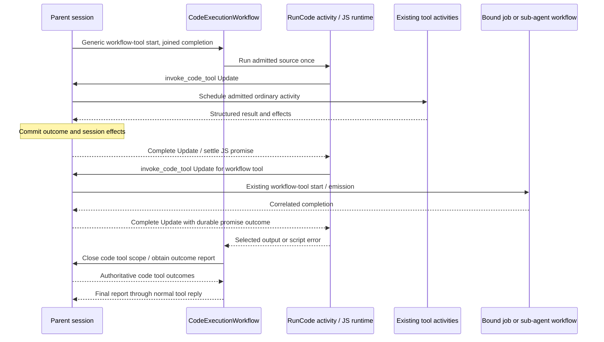

# Code mode

**Status:** Native QuickJS execution, session-owned effects, the code workflow,
worker role, opt-in session admission, the `CodeTool` naming pass, and model-facing
output JSON Schemas are implemented end to end, updated 2026-10-08.
The existing `lightspeed-runtime` binary includes the `code` role, which can run
alongside other roles or in its own process. V1 targets trusted deployments;
Wasm isolation and TypeScript source support remain later phases.
A separate code workflow owns one script attempt and its cleanup; the parent
session owns tool admission, scheduling, and durable outcomes. JavaScript is
never checkpointed or replayed. Code mode adds an ordinary `code_execute` tool
alongside the existing tools. The model chooses direct calls or JavaScript
composition; code-only exposure is not planned. When code mode is enabled,
ordinary function descriptions include their available return JSON Schemas and
script-call guidance. Provider-native input schema fields are unchanged.

## Remaining work

The execution path is usable in trusted deployments. The remaining work is
broader live integration coverage and operational validation:

1. **Broaden integration and failure coverage.** The real OpenAI Responses path
   works. Provider request tests cover schema presentation on all three adapters,
   including injected native MCP metadata and selected image/PDF lowering.
   Native/deferred MCP discovery and calls, registered environment jobs, and
   real sub-agent sessions now have code-mode live coverage. Add actual-model
   tests for other providers. Exercise safe individual-effect
   activity retries, parent Continue-As-New, and approval-required MCP calls.
   Add delayed-preparation cancellation and exhausted-finalization-retry cases.
   Lifecycle retries, worker-process loss, cancellation, and workflow replay are
   already covered.
2. **Improve execution inspection.** Compact reports, detailed CAS reports, and
   bounded `CodeToolProgress` events exist. Add useful per-execution/per-call
   inspection and usage/attribution to tracing or existing client surfaces.
   Web and CLI currently preserve progress cursors without displaying these
   internal calls as conversational turns.
3. **Measure production sizing.** Benchmark release binary size, memory, complete
   outer-tool latency, history growth, and saturated combined/separate-role
   workers. Verify waiting interpreters cannot starve session effects under load.
   Local interpreter and bridge timings are diagnostic samples, not production
   sizing or multi-universe fairness results.

Wasm isolation, TypeScript source support, optional TypeScript declaration
rendering, and ordinary transcription/image/decision-model tools remain later
phases. [Shared content references and code output](p192-content-references-and-code-output.md)
implements ordinary blob tools, file integration, and awaitable `media()`/`file()`
helpers. No separate named store is planned. The current guest surface is `tools`,
`text(value)`, `media(source, options?)`, `file(source, options?)`, and a JSON
return value. Durable waits already work through the
ordinary `tools["await"]` call. Approval suspension,
persistent JS heaps, and durable JavaScript replay remain outside v1.

## Implementation progress

The first slice established callable contracts and execution metadata:

- `tools::callable` resolves the common model catalog and retains matching
  function specifications and argument adapters. `llm-runtime` consumes this
  resolver while keeping provider wire formatting and response normalization.
  Callable snapshots omit provider transport options. Provider options cannot
  override the function name, argument schema, or other reserved contract fields.
- Workflow callable resolution starts from the admitted workflow definition,
  pins its binding fingerprint, and distinguishes acknowledgements from joined
  replies. It cannot pair an old argument adapter with a newer same-name binding.
- `FunctionDefinition` carries optional output JSON Schema. Owned result schemas
  derive from the actual serialized filesystem, process, job, subagent, web-fetch,
  promise-control, attachment-reference, and transfer results. Claude Edit's
  creation/editing variants and workflow acknowledgement shapes are explicit.
- MCP discovery retains optional `outputSchema` through cached/native metadata
  and deferred full definitions. Search results retain it when it fits their
  existing bounds; truncated results direct callers to full definitions. This
  schema continues to describe `structuredContent`, not the response envelope.
- `ScriptToolResult` defines successful structured values and failed calls with
  optional structured error output. Session effects and attachment admission
  stay with the host; formatted provider text is not the script return value.
- Process tools project retained output into `stdout`/`stderr` strings when it
  is valid UTF-8, or lossless `stdout_bytes`/`stderr_bytes` arrays otherwise.
  Exactly one field per stream is present, including empty strings for empty
  output; output schemas enforce this exclusivity. Execution, polling, and kill
  variants share this conversion across presentations. Process metadata is
  preserved, with `stdout_omitted_at`/`stderr_omitted_at` retaining byte offsets.
  The environment protocol keeps raw bytes and direct model calls retain their
  existing text formatting. Native QuickJS integration covers parsing string
  stdout and handling binary fallback across process polls. Awaitable `media()`
  and `file()` helpers now use ordinary blob tools to select output assets.
- `temporal-workflow` owns a validated `CodeExecutionDescriptor` with source and
  catalog CAS references, parent identity, and explicit positive execution limits.
  It introduces no interpreter dependency. The workflow integration contract now
  exports the descriptor, lifecycle DTOs, signals, queries, and activity names.

Runtime-owned `await` and environment-control schemas now derive from their
serialized result DTOs. Core job/sub-agent declarations publish their owned
reply schemas; submission acknowledgements remain distinct from later replies.
Generic joined workflow bindings need a declared reply schema (or an authored
function's declared result); an arbitrary workflow does not inherit the result
schema of its underlying built-in operation. Missing schemas remain callable.

The second slice implements the session-owned execution path end to end:

- The parent session exposes typed scope-open, invoke, and scope-close Updates
  plus an authoritative report Query. `CodeToolClient`, Rust DTOs, and generated
  TypeScript workflow contracts provide the trusted host boundary.
- The session resolves opaque callable bindings from its existing grants and the
  current model presentation, including native injected MCP tools. Searchable MCP
  tools use the existing discovery/call tools. Changed catalogs reject new calls
  through stale scopes instead of silently rebinding them.
- The deterministic harness records scopes, request identities, arguments,
  independent waits, and outcomes. Repeated delivery attaches to the admitted
  request; reusing an identity with different arguments or a binding is rejected.
  The outer model batch remains parked, and code tool results do not create turns.
- The session schedules each code tool call as a Temporal activity using existing
  execution implementations, retry/deadline policies, environment readiness,
  promise controls, and effect application. Parallel-safe calls share a bounded
  window; exclusive calls retain ordering. Workflow-backed calls and explicit
  promise waits suspend independently. Approval-required calls fail before the
  protected effect, without inheriting an earlier model-call approval.
- Scope cancellation reconciles admitted work, including joined preparation
  results arriving after closure. Completed outcomes remain authoritative;
  acknowledged model-owned submissions retain their existing ownership rules.
  Forced run/session termination records unfinished outcomes as unavailable,
  explicitly allowing that an external effect may already have happened.
- Pending Update handlers and in-flight dispatch prevent session rollover or
  completion until reconciled. Durable identities and outcomes survive replay.
  Public `CodeToolProgress` events preserve contiguous event cursors without
  adding conversational tool calls or exposing internal bindings and payloads.

The third slice implements native JavaScript execution and its host bridge:

- `codemode` embeds `rquickjs` 0.14 with one fresh runtime/context and dedicated
  native thread per execution. It compiles the complete async-function body
  before effects, supports async loops, dependent calls, `Promise.all`, and
  `Promise.allSettled`, and retains selected `text(value)` output and a return
  value. There are no ambient I/O APIs or module loaders.
- A private prelude captures its own intrinsics, creates immutable tool wrappers,
  and exchanges JSON arguments/results through bounded queues. Opaque handles
  remain pinned to their wrappers. Unsupported values, including undefined
  fields, functions, accessors, cycles, non-finite numbers, and sparse arrays,
  fail serialization instead of silently changing the payload.
- Positive limits bound source/catalog size, requests, completions, retained
  output, heap, stack, total calls, and outstanding calls. Native interrupts and
  checks between microtasks enforce cancellation and elapsed time, including
  host waits. Limits remain terminal if guest code catches an interrupt error.
- `temporal_runtime::code::CodeRunner` loads and verifies bounded source/catalog
  blobs, checks the catalog against an existing unused session scope, and routes
  each request through `CodeToolClient`. It does not restore session state,
  schedule tool activities itself, or retry JavaScript. A minimal versioned
  execution manifest carries names and handles; execution does not need schemas.
- Successful calls resolve to JSON values; failures reject with `kind`,
  `message`, and optional structured `value`. Native MCP envelopes remain intact.
  An oversized result becomes a guest error while the session still records the
  actual successful effect and its content reference. Transport failures report
  unknown outcomes. Neither model context nor effect carriers enter JavaScript.
- Normal completion, script errors, cancellation, and preparation failures after
  scope verification close admission and reconcile pending calls within a cleanup
  budget. A supervised task retains runner capacity through cleanup when its
  caller is dropped. The report keeps selected output, interpreter diagnostics,
  authoritative per-call outcomes, and any cleanup failure separately.
- Code tool durable completion records now omit model context and effect carriers.
  A digest of the full incoming result preserves exact retry checks. Legacy full
  results migrate on decode; replay tests verify that effects still apply and
  changed retries are rejected without retaining the discarded payload.

The fourth slice implements the durable lifecycle and session admission:

- `features.codeMode` grants an ordinary joined `code_execute` tool with a pinned
  source/context reference, optional logical tool selection, and bounded limits.
  Generated arguments cannot supply routing identities, authority, or CAS inputs.
  The parent session resolves the actual callable catalog; an omitted selection
  uses its host-callable tools except the outer code tool, while an empty list
  permits only local computation. Each call still passes session admission.
- The shared web configuration editor exposes a Code mode toggle for profiles,
  sessions, and bot setup. Its collapsed Customize limits link reveals only
  timeout, maximum tool calls, and maximum outstanding calls. New grants use all
  eligible session tools by default. Other settings have no controls; existing
  API-authored values are preserved when editing the visible limits.
- `CodeExecutionWorkflow` uses the generic start/reply/cancellation/recovery
  protocol. Retryable preparation opens the scope and persists a minimal catalog;
  `code_run` has exactly one activity attempt. Retryable finalization closes the
  scope, reads known outcomes, persists a report, and replies to the waiting parent.
  Generic workflow starts reject reuse of a completed execution identity so a lost
  start acknowledgement cannot start the same invocation again.
- The `code` role polls its own queue, with independent activity slots and a
  process-wide interpreter semaphore shared across universes. The default limit
  is four interpreters. Capacity wait, bounded input loading, and JS share one
  attempt deadline. Heartbeats continue through cancellation, cleanup, and report
  persistence. Waiting scripts cannot consume the sessions role's activity slots.
- A missing runner receipt yields an interruption report from the session's
  authoritative outcomes without replaying source. Cancellation allows a bounded
  runner grace period before finalization. Cancellation observed during
  finalization updates the report once while preserving the runner receipt.
  If preparation lost its receipt,
  finalization fences the same scope using idempotent open/close operations,
  preventing a delayed preparation from leaving admission open.
- The model receives selected `text` output, the return value, diagnostics,
  outcome counts, and a detailed-report CAS reference. Reports link source,
  catalog, outputs, errors, and attachments without inlining every code tool result.
  Completed script failures resolve with a report, allowing the model to decide
  what to do next. Completed external effects remain committed after script failure.

The fifth slice implements model-facing JSON Schema presentation:

- With `features.codeMode` enabled, OpenAI Responses, OpenAI Completions, and
  Anthropic Messages append compact return JSON Schemas and script-call/error
  guidance to ordinary function descriptions. Names, input schemas, strictness,
  provider options, and existing usage instructions are preserved. Disabled code
  mode keeps ordinary descriptions unchanged. Tools excluded by `allowedTools`
  are explicitly unavailable inside scripts; recursive code execution stays denied.
- The harness supplies the admitted logical selection and workflow completion
  facts with the generation request, including them in its fingerprint. It adds
  no schema-loading I/O or provider formatting. Workflow routing, recipes, and
  authority stay out of this presentation metadata. Pending generation reconstructs
  the same metadata after replay.
- The model adapter and script callable resolver share workflow-result projection:
  joined calls use their declared reply schema, while submissions describe their
  acknowledgement and promise handles. An arbitrary joined workflow with no
  declared result does not inherit its underlying built-in's result schema.
- Await materialization uses `tools::concurrency::AwaitOutput`; environment
  controls serialize the DTOs in `tools::environment::control`. Their schemas
  describe nullable/omitted fields and generic producer payloads. Core job and
  sub-agent workflow declarations persist their reply schemas at admission.
- Native injected MCP descriptions distinguish the result envelope from the
  server's optional `structuredContent` schema and explain remote errors and
  binary-to-`blobRef` conversion. Search/call helpers explain the same contract
  for deferred tools and how to emit discovery results for a subsequent script.
  Unknown schemas stay unspecified and do not block execution.
- The real-model test now relies on the rendered tool contracts to create timers,
  await their handles, and count resolved results; its prompt no longer supplies
  return-field names or shapes.

Validation for the model-facing slice passed: 260 harness, 266 tools, 194
LLM-runtime, 395 runtime, and 153 workflow library tests; provider baseline and
code-mode presentation tests; three workflow-contract checks; and the exact
workspace Clippy gate. All 19 targeted live tests passed serially: one
schema-driven real-model run, nine code-workflow cases, and nine ordinary
sub-agent lifecycle/media cases. The sub-agent cases validate the new reply
schemas against existing behavior. Code-mode coverage now also runs actual
environment-job and sub-agent workflows, as described below.

The `CodeTool` naming pass is complete across harness commands/events/state,
Temporal Updates, queries and activities, runtime adapters, public progress
events, generated contracts/TypeScript consumers, tests, and this roadmap.
`CodeExecution` names the outer script/workflow; `CodeToolCall` and
`CodeToolScope` name the ordinary effects and their session-owned admission scope.

Validation for the lifecycle slice passed: 98 API, 40 API projection, 258
harness, 266 tools, 153 workflow, and 395 runtime library tests (one runtime test
intentionally ignored), plus five runtime CLI tests. All nine API artifact tests
and three workflow contract tests passed after regeneration. Full TypeScript
checking, 1,296 consumer tests, production/demo builds, workspace formatting,
whitespace checks, and
`cargo clippy --workspace --all-targets --locked -- -D warnings` passed.
Existing HTTP-server tests require localhost access. No provider credentials
are needed for these checks.

After the naming pass, the scoped Rust unit suites, all 12 API/workflow artifact
checks, full TypeScript checking, 14 SDK tests, 87 transcript/tail tests, docs
checks, formatting, whitespace checks, and the exact workspace Clippy gate
passed again. All 21 runtime code-mode live checks passed serially, including
the real-model and separate-process recovery tests. The real-model test needed
one rerun after its exact model-tool-call assertion failed; its repeatability
remains to be checked when extending presentation coverage.

Three serialized `code_tools_live` protocol tests passed against local Temporal
and PostgreSQL using a simulated runner and production session activities.
They cover parallel/dependent
calls, joined workflow replies, submit-then-wait, duplicate/conflicting requests,
denied bindings, sibling failure, abandoned client waiters, scope cancellation,
and forced session shutdown. Harness tests also cover replay and late-completion
races. All seven checks in the new `codemode_live` suite passed: six behavioral
tests through the production session path and a fresh-runtime timing diagnostic.
They cover actual JavaScript loops, ordinary and joined parallel/dependent calls,
submit-then-wait, caught errors, sibling failure, cancellation, large results,
preparation errors, and cleanup after dropping the caller. The suite uses fixture
workflows for job/sub-agent replies, without provider credentials. All nine tests
in `code_workflow_live` pass through public feature admission and production
code/session workers on separate queues. They cover looped parallel effects,
submit-then-wait, selected output, partial script failure, deadlines, empty
capability selection, lost runner receipts without source replay, and parent
cancellation with preserved output and closed scopes. They also inject lost
preparation/finalization receipts to verify activity retries without another JS
attempt, supply an unavailable runner report to verify cleanup still happens,
and hold finalization to exercise late cancellation deterministically. Every
completed code-workflow history is replayed offline with no activities registered;
authoritative outcomes and execution counts must remain unchanged. Model responses
are scripted; these cases need no provider credentials.

`code_worker_process_live` passes an actual process-loss scenario: kill only the
code worker launched by the test after its first effect, start a replacement on
the same queue, and recover through the production heartbeat timeout. Temporal
history must contain one scheduled/started JS attempt; the report preserves the
known effect, marks the missing JS output, and closes the scope. The recovered
history also passes offline replay.

`code_model_live` passes with the configured real OpenAI model and production
session/code workers. The model writes async JavaScript, runs two timer effects
and one durable wait, selects a compact result, and consumes it in its next turn.
The prompt supplies the task; the provider gets return-contract details from
the rendered tool descriptions.
It requires provider credentials and does not silently skip missing prerequisites.

`code_capabilities_live` adds two serialized integration tests. A local native
MCP HTTP server exercises injected calls, search and full-definition retrieval,
input/output schema preservation, structured results, a catchable remote error,
and a dependent recovery call. Search-only tools remain absent from the direct
script catalog; explicitly emitted definitions reach the outer model result.
The second test registers a real environment daemon and runs `job_run` alongside
`agent_run`, then `job_submit` alongside `agent_spawn` and one durable `await`.
It checks exact filesystem effects, results correlated to their promise handles,
the admitted environment, owned child sessions with completed runs, and child
closure. Each test uses a fresh universe and separate code/session queues and
cleans up its daemon/server, database records, and stored objects. Model responses
are scripted; job and child completions come from production workflows.
Both live cases pass serially against local Temporal/PostgreSQL/MinIO, with
loopback MCP explicitly allowed. Workspace Clippy and formatting checks pass.

Eight additional live tests in `crates/codemode/tests/` pass directly against the
public interpreter boundary with real asynchronous filesystem I/O. They cover
parallel reads and dependent writes across loop iterations; committed and
unfinished effects surviving script failure, cancellation, and deadlines;
rejection of late completions; concurrent-runtime isolation; and completion
delivery during continuous microtasks. Real filesystem rejection recovery proves
that an error frees outstanding-call capacity; a fan-out quota case proves caught
guest errors cannot admit excess writes and that admitted effects may still finish.
These fixtures keep I/O in the host and
need no Temporal server or provider credentials. Run them together with the 17
unit tests using
`cargo test -p codemode --locked -- --include-ignored --test-threads=1`.

## Purpose and scope

Code mode lets the model write a short program that calls authorized tools,
combines their results, and returns only useful output. Loops, conditional
calls, parallel requests, and filtering happen without a model round trip for
every operation. This is especially useful for large tool results and fan-out
to sub-agents or jobs. Model services such as transcription, image generation,
and typed decisions can participate later, after gaining ordinary tool support.

The program runs in Lightspeed's runtime, independently of any attached
execution environment. It can ask an authorized environment tool to execute
a command, but the orchestration script itself is not an environment process.
VFS and environment files remain separate domains accessed through their
existing tools.

The agreed first-version boundaries are:

- Normal asynchronous JavaScript: top-level `await`, loops, branching,
  dependent effects, `Promise.all`, and `Promise.allSettled`.
- Native QuickJS in the process hosting the `code` role, with a fresh runtime
  per execution and a restricted host API. This does not provide Wasm memory
  containment. Roles may share one process or run separately from the same binary.
- JavaScript source only. TypeScript transpilation is deferred independently
  of the later Wasm integration.
- Tool contracts presented directly as JSON Schema. Generating TypeScript
  declarations from those schemas is an optional later presentation change.
- Capabilities derived from the session's existing grants and bindings,
  further constrained by the code-mode feature configuration. Every substantive
  effect must also be supported as an ordinary Lightspeed tool capability.
- Existing activity policies for individual effects, including their retry,
  timeout, concurrency, attribution, and cancellation rules.
- Workflow-backed tools, including `agent_run`, `agent_spawn`, `job_run`, and
  `job_submit`, with the existing durable promise semantics.
- One execution attempt for the JavaScript program. On failure, return the
  known outcomes and let the model decide what to do next.
- Reject approval-requiring calls before executing the protected effect.
  Durable approval suspension and script resumption are outside v1.

This builds on the existing [architecture](../documentation/how-it-works/architecture.md)
and [workflow-tool protocol](../documentation/how-it-works/tools-and-controller-workflows.md).
It does not introduce another general workflow engine.

## Execution architecture

Expose `code_execute` through a trusted workflow-tool declaration using
`Start` delivery and `Joined` completion, like `job_run`. Its recipe starts a
`CodeExecutionWorkflow`. The parent session records the invocation and waits
for the final report using the normal completion promise, reply validation,
and result-recovery protocol.

Keep script lifecycle and session authority separate:

| Component | Responsibility |
| --- | --- |
| `CodeExecutionWorkflow` | Own one `RunCode` attempt, its deadline and cancellation, scope closure, and the final report. |
| `RunCode` activity | Host the interpreter, guest promises, local computation, and a narrow trusted effect bridge. |
| Parent session workflow | Admit every code tool call, schedule existing activities/workflow tools, apply session effects, and retain authoritative outcomes. |

The trusted Rust bridge sends each tool request directly to the parent session.
The code workflow does not relay every request and result. Guest functions do
not receive Temporal clients, gateway clients, or runtime internals.



### One session-owned code tool path

The implemented bridge uses the asynchronous Temporal Workflow Update
`invoke_code_tool(execution_id, request_id, binding_id, arguments_ref)`.
Its handler enqueues admission through the parent session's serialized state
path and awaits the code tool outcome without blocking that path. The session
uses the admitted binding, schedules the existing activity or workflow-tool
operation, and commits the result and effects before completing the Update.
Several requests may be outstanding; state transitions are serialized while
eligible activities can run concurrently.

The protocol lives in
[`temporal-workflow::code_tools`](../../crates/temporal-workflow/src/code_tools.rs):

| Operation | Behavior |
| --- | --- |
| `open_code_tool_scope` Update | Bind an execution identity to a pending joined parent invocation, a narrowed tool allowlist, and call limits. The session resolves opaque binding handles. |
| `invoke_code_tool` Update | Admit or reattach to an execution-local request and await its durable outcome. Arguments travel by CAS reference. |
| `close_code_tool_scope` Update | Stop new admission and optionally request cancellation; return the current scope report. Closing does not itself wait for every call to become terminal. |
| `code_tool_scope_report` Query | Read current bindings and per-request status/output references, including completions occurring after closure. |

Current hard bounds are 32 scopes per run, 1,024 calls per scope, 64 outstanding
calls per scope, 4,096 bindings per scope, and 256 simultaneous Update waiters.
Ordinary activity concurrency and workflow-tool limits still apply. These are
host safeguards; the code-mode feature adds narrower configurable budgets. The
code workflow closes admission, reconciles remaining outcomes under its cleanup
budget, and produces the final report.

`CodeToolCall` names an ordinary tool call issued by a code-mode script while
the model's outer `code_execute` call remains pending. A `CodeToolScope` governs
those calls under one execution identity. The outer script/workflow is the
`CodeExecution`; its calls have a code tool origin instead of belonging to
another model-produced batch.

The [harness records](../../crates/harness/src/core/components/code_tool.rs)
provide deterministic scope admission, deduplication, effect validation, waits,
and cancellation. Commands request transitions; events record accepted facts for
replay. The interpreter and all I/O remain outside the harness. Temporal supplies
activity scheduling and retries; this bookkeeping retains the session's domain
authority while its outer call is parked.

This session-owned code tool operation reuses the ordinary tool implementations.
Temporal supplies transport, task routing, and the request/response mechanism.
Lightspeed supplies admission, correlation, deduplication, and lifecycle
semantics. All script tool calls use this path in v1; do not
split ordinary calls into a second executor-owned path based on a copied
session snapshot.

Temporal's Rust SDK supports asynchronous update handlers, including waiting
for activities. The repository currently pins SDK 1.0.0. An activity cannot
use a workflow context to schedule ordinary workflow-owned activities, but it
can use a client to send an Update to the session workflow. This does not
require that session to own the `RunCode` activity. See Temporal's
[Rust message-passing documentation](https://docs.temporal.io/develop/rust/workflows/message-passing)
and [task-queue routing](https://docs.temporal.io/task-queue).

Reuse the actual scheduled activity boundary, not just the Rust function
behind an activity. The implemented `code_tool_invoke` activity delegates to
the existing execution paths and uses the admitted
`ToolExecutionSpec` and
[`tool_call_activity_options`](../../crates/temporal-workflow/src/config.rs).
Calling the same implementation directly from `RunCode` would lose independent
Temporal scheduling, history, retry, and timeout behavior.

Preserve the distinction between an infrastructure failure eligible for an
activity retry and a tool-level failure returned as data. Retry-safe effects
retain their bounded policies; process and other non-retry-safe work must not
gain retries merely because JavaScript requested it. The code worker does not
dispatch tool activities onto the sessions queue. Each subsystem schedules
its own activities; existing jobs and sub-agents still use their workflow
protocols.

Using a generic cross-role Update deliberately refines the current
starts/signals convention. It preserves session ownership and avoids a new
custom transport. Scope closure, cancellation, and report retrieval must also
use admitted generic lifecycle operations, with workflow I/O performed through
Temporal workflow messaging or client activities, never arbitrary workflow I/O.

Each code tool request needs an execution-local stable identity, bound to its
operation and arguments reference. Retrying transport with the same identity
must attach to the original request or return its outcome; it must not start
another effect. This deduplication concerns bridge delivery, not replaying the
program. Cancelling or losing the client-side Update wait does not itself
cancel the admitted tool operation; scope cancellation is explicit.

### Keep JavaScript ephemeral

`RunCode` uses a regular activity with `maximum_attempts = 1`, an explicit
deadline, heartbeat, and cancellation handling. Do not configure workflow
retries or application recovery loops that silently launch the source again.
Expected script exceptions and rejected calls should produce a report rather
than become a reason to retry the whole activity.

Workflow-task replay reconstructs each owner's recorded orchestration without
re-entering the JavaScript heap. If the process hosting the code role dies or
the activity times out, the code workflow closes its code tool scope
through the session, obtains known outcomes, and returns an interrupted report. The
session's code tool call records remain authoritative; do not create a competing
effect ledger in the code workflow. Recreating the JS continuation is outside v1.

There is no need to dynamically register a new Temporal workflow definition
for each generated script. One statically registered code workflow supervises
the ephemeral interpreter. Making generated source itself a replayable workflow
would introduce determinism, versioning,
and continuation semantics that this design deliberately leaves for later.

### Crate structure

The new library crate is `crates/codemode`; extend the existing crates below.
Ship everything in the existing `lightspeed-runtime` binary. A library boundary
keeps the interpreter independently testable and makes its later Wasm migration
local without requiring a separate executable or a general runtime plugin framework.

| Crate | Responsibility and implementation status |
| --- | --- |
| `codemode` | Implemented native QuickJS adapter, private JS prelude, promise-job driver, bounded JSON bridge, execution limits, cancellation, and selected output. Later Wasm adapter and TS preprocessing. |
| `temporal-runtime` | Session activities, `CodeRunner`, the `code` role/queue, preparation/run/finalization activities, and CAS report storage are implemented. |
| `temporal-workflow` | Code tool DTOs, `CodeToolClient`, session orchestration, and `CodeExecutionWorkflow` with a single-attempt activity lifecycle are implemented. |
| `harness` | Implemented deterministic code tool invocation origins, admission facts, waits, and outcome records preserving session-owned effects and promises. No interpreter or infrastructure I/O. |
| `tools` | Shared callable specifications/bindings, output-schema metadata, and owned result schemas are implemented. The ordinary `code_execute` definition and trusted admission context are implemented. |
| `llm-runtime` | Model-facing presentation of the same resolved tool specifications; provider-native wire formatting stays here. Code-mode descriptions include available return JSON Schema and matching script guidance. |
| `mcp` | Optional output schemas are preserved in discovered metadata and carried onward by runtime discovery and presentation. |
| `api` | Code tool progress telemetry and the public `codeMode` session feature, limits, and generated consumers are implemented. |

`codemode` has no dependency on Temporal, the harness, session state, tool
implementations, providers, or stores. Its caller supplies JavaScript source,
opaque callable bindings, and execution limits, receives tool requests, and
supplies results through the JSON bridge. Interpreter values, contexts,
functions, and promise handles remain private to this crate. The engine treats
artifact handles as opaque data; the host resolves authorized artifacts.

`temporal-runtime` depends on both `codemode` and `temporal-workflow` and adapts
between them. `temporal-workflow` must not depend on `codemode`: durable workflow
inputs contain execution identities and source/catalog references, while the
interpreter accepts materialized source and plain values. Keep durable DTOs in
the existing workflow contract and engine-local types in `codemode`; the runtime
loads artifacts and translates results back into durable references. QuickJS
therefore does not enter the workflow dependency graph.

Two implemented refactors support this structure:

- **Code tool invocation admission:** separates call origin from the assumption
  that every call belongs to the active model tool batch. Code tool requests have
  an explicit execution scope and identity, reusing validation, scheduling
  policies, and effect application while keeping code tool waiting/completion
  state separate from the outer parked batch. The deterministic facts belong
  in the harness; Temporal admission/waiting and effectful adapters remain in
  their existing crates.
- **Shared callable specifications:** common host-callable metadata and binding
  projection now live in `tools`. Direct model tools and code mode consume
  the same resolver, including provider presentation adapters. Provider wire
  materialization stays in `llm-runtime`; `codemode` has no tool registry or
  tool implementation dispatch.

No new protocol, scheduler, registry, store, or worker-framework crate is
required for v1. Keep code tool contracts in the existing workflow
modules rather than adding a feature-specific transport package.

### Worker roles and deployment

The `code` role is part of the existing
[role wiring](../../crates/temporal-runtime/src/roles.rs). It polls its own
task queue for `CodeExecutionWorkflow` and its prepare/run/finalize activities. The sessions role continues
to own code tool admission, activities, effects, and durable promises.
Both deployment choices use the same executable:

```sh
# All roles in one process (also the default).
lightspeed-runtime --roles all

# Or run these worker roles in separate processes.
lightspeed-runtime --roles sessions
lightspeed-runtime --roles code
```

The default queue is `lightspeed-code`. Set `--code-task-queue` or
`LIGHTSPEED_TASK_QUEUE_CODE` consistently on gateway, sessions, and code
processes when using a custom queue. `--code-max-concurrent-executions` or
`LIGHTSPEED_CODE_MAX_CONCURRENT_EXECUTIONS` sets the interpreter limit per code
process (default four). The code queue must differ from other role queues.

Other roles are selected as required by the deployment. Running the code role
does not grant code-mode access to a session; session feature admission still
controls that. Preserve the same Temporal start/Update/completion path when
roles share a process. Do not introduce a direct in-memory session shortcut:
moving a role to a separate process should change deployment configuration,
not execution semantics.

Native QuickJS is linked into the runtime binary; disabling a role does not
remove its code from the executable. Measure the stripped release-size delta
with the selected embedding features. Native execution shares the hosting
process's memory and privileges, including any colocated roles; worker-role
separation is not a per-script process sandbox. Revisit build features or
separate binary packaging when Wasmtime is introduced, without changing the
session protocol.

## Workflow tools and durable promises

JavaScript promises and Lightspeed promises serve different purposes. A JS
promise lets the current JS runtime await a response. A Lightspeed promise
records a durable result relationship with ownership, scope, deadlines, and
cancellation. A host wrapper can connect them without making the JS heap
durable.

The implemented behavior follows the ordinary tool contracts:

| Script operation | What its JavaScript promise resolves to |
| --- | --- |
| `tools.agent_run(...)` | The joined sub-agent result. |
| `tools.job_run(...)` | The joined job result. |
| `tools.agent_spawn(...)` | The ordinary submission acknowledgement containing a durable promise handle. |
| `tools.job_submit(...)` | The ordinary submission acknowledgement containing keyed durable promise handles. |
| `tools["await"](...)` | A result or wait outcome under the existing promise rules. |

Handles must be non-thenable data: awaiting a submission should not
accidentally await its completion through JavaScript promise assimilation.
There is no separate `promises` helper in the current guest prelude. A future
convenience helper could wrap the ordinary wait tool without adding a second
promise subsystem. Wait timeouts remain distinct from the underlying promise's
hard deadline.

Keep the **parent session as the durable holder** in v1. The parent allocates
real promise identities, records admitted invocations, delivers emissions,
validates replies, and resolves promises. The runner bridge receives that
outcome through the code tool call Update and settles the JS wait. Existing
sub-agent preparation and cancellation assume session ownership; moving
ownership to the code workflow would require a broader protocol change.

The implemented code tool call admission and completion path correlates each call
with the outer invocation and its own request ID. The ordinary per-call activity
rejects workflow-backed tools and `await`, so the code tool adapter reuses their
preparation paths and returns effects or a wait specification to the session.
Workflow-tool validation now accepts a durable code tool origin as well as a model
call. Independent code tool waits preserve the outer suspension; the runner never
fabricates model batches, session events, or promise IDs.

The parent session must process these admissions, emissions, cancellations,
and resolutions while its outer joined call is parked. This is control-plane
progress, not another model turn. Do not recursively drive the parked model
batch or start a run on the waiting parent. A dependency on another model
turn from that same parent would deadlock. This path is implemented and covered
by live Temporal tests with joined workflow bindings and independent waits.
Requests pass through the session's serialized admission path while the
dispatcher and Update waiters progress independently. Continue-as-new is deferred
while Update handlers, queued work, or in-flight dispatch remain. Rehydration
retains scope/request identities and durable results, and the client addresses
the stable session workflow ID. The code workflow now has bounded activity, cancellation, and cleanup budgets
so a stuck interpreter cannot wait indefinitely before attempting scope closure.

Allocate durable promise identities atomically at the session owner. Keep
runtime-owned joined promises out of model-facing wait/cancel/detach helpers;
script-local joined waiters only observe their own admitted code tool calls.
In particular, a script must not wait on its own outer completion promise.

Ordinary code tools can also return session effects and attachments in
addition to output. Their completions must pass through the appropriate
admitted effect-application path, preserving validation and durable state;
returning only their JSON to the runner is insufficient. Commit trusted
effects once before settling the JS call. Subsequent calls must receive the
applicable updated execution facts, such as a new VFS revision or selected
environment. This does not change the immutable authority and bindings
admitted for the execution. Keep intermediate payloads outside conversational
context while retaining their artifact references for the execution trace.

## Capabilities and configuration

Enable code mode using `features.codeMode` in the public session configuration.
Internally this is the `code_mode` feature. Its settings
can narrow available capabilities and set execution budgets. They do not
expand environment grants, MCP access, VFS attachments, sub-agent authority,
or workflow bindings. Every substantive effect must correspond to an ordinary
Lightspeed tool capability admitted to the session. Code mode adds composition
and result processing, not a second privileged service API.

Admission pins session/run identity, source, limits, and optional tool selection
in an immutable host-generated CAS context. The session-owned scope binds the
actual callable handles and registry revision. Mutable execution facts, including
resource selection, remain with the session owner at each call admission; a
stale copy of session state must not overwrite later effects.
The script supplies business arguments; it cannot choose a holder workflow,
task queue, credential, authority reference, or alternate session identity.
Keep runtime checks and existing revocation semantics at the actual effect
boundary.

Derive the callable catalog from the session's authorized ordinary tools and
their presented specifications. Code-mode capability selection may narrow that
catalog. Ordinary tool declarations remain available to the model alongside
`code_execute`; deferred tools retain the existing discovery/call path. Guessing
a function name must never make an unadmitted operation available. Use stable
logical identities internally, while preserving the exact argument adapter and
result contract associated with the function specification shown to the model.

Configuration status is:

| Setting | Implemented | Remaining |
| --- | --- | --- |
| Enablement | Opt-in `codeMode` adds `code_execute` alongside ordinary tools. | Complete for v1. |
| Capability selection | Logical `allowedTools` narrows admitted host-callable capabilities. | Complete for v1. |
| Execution limits | Attempt deadline, memory, stack, source/catalog/request/result/output bytes, and call count. | Additional compute metering if later isolation requires it. |
| Effect limits | Outstanding calls plus existing per-tool retry, timeout, and concurrency policies. | Optional service budgets or narrower per-call settings. |
| Discovery | Existing MCP search/call tools, schema metadata, and bounds; live code-mode discovery/call integration. | Broader actual-model/provider coverage. |

The implemented configuration uses flat camelCase fields:

```json
{
  "features": {
    "codeMode": {
      "timeoutMs": 60000,
      "allowedTools": ["concurrency.sleep", "concurrency.await"]
    }
  }
}
```

`allowedTools` contains logical tool IDs, not provider-presented JavaScript
function names. Omit it to allow all granted host-callable tools except the
parent code tool; `[]` permits only local computation. Recursive code execution
is unavailable. Omit `codeMode` to disable the feature.

Defaults are 60 seconds per attempt, 64 MiB memory, 1 MiB stack, 256 KiB source,
1 MiB each for catalog, request, result, and selected output, 128 calls, and 16
outstanding calls. Positive hard ceilings are 10 minutes, 512 MiB memory, 8 MiB
stack, 1 MiB source, 8 MiB for the other byte limits, 1,024 calls, and 64
outstanding calls. `timeout_ms` in a tool call can only narrow the feature's
budget. The joined promise reserves additional time for preparation, cleanup,
and delivery. Additional service-specific budgets remain optional later settings.

Not every currently advertised tool is locally callable. Provider-hosted
search, fetch, or MCP execution requires a provider turn and may lack a host
adapter. Omit such operations from the code catalog unless a separately
authorized callable implementation exists. Do not silently substitute a
different backend and assume equivalent authority or behavior.

### Later services and minimal utilities

Transcription, image generation, and typed decision models such as Jev must
gain ordinary tool support before scripts can call them. Those tools then
participate through the same admitted catalog, permissions, schemas, usage,
and execution policies as direct LLM tool calls. These service tools can be
implemented after the first code-mode release; a code-only `models.*` API is
not the direction.

Transcription already has a runtime admission and workflow path in
[`transcriptions.rs`](../../crates/temporal-runtime/src/gateway/service/transcriptions.rs).
Reuse that service boundary rather than create a second provider integration.
Adding its tool surface is still separate work. Image generation and decision
models also need their own adapters and tools. See the separate
[typed decision models proposal](later/pNNN-typed-decision-models.md).

Keep execution utilities small: text/media output, catalog discovery, waits
over authorized durable promises, bounded local values, and scoped blob/artifact
access. Helpers may make existing operations convenient; they must not expose
raw stores, harness methods, provider clients, or arbitrary gateway methods.
Cross-execution persistence needs an explicit bounded contract if added later.

Media and large results should travel as authorized CAS/artifact handles.
Credentials stay in trusted adapters. Scripts may process structured results
and select text or media for the model without placing every intermediate
payload in model context or Temporal history.

## Execution descriptor and tool catalog

Neither the code workflow nor the runner restores session state. Prepare a
small execution descriptor from the parent and pass large immutable material
by reference. For example:

```typescript
type CodeExecutionDescriptor = {
  executionId: string;
  sessionWorkflowId: string;
  sourceRef: BlobRef;
  catalogRef: BlobRef;
  limits: CodeExecutionLimits;
};
```

The session retains the authoritative bindings and mutable state. The catalog
is metadata for the execution, not an independent authorization database.
Its manifest can contain function names and opaque binding handles,
description/schema references, and a compact authorized MCP server index.
Retain the referenced artifacts and cache immutable content by digest. Do not
repeat the catalog or source in each code tool request.

Different consumers need different parts:

| Consumer | Required information |
| --- | --- |
| Code workflow | Execution/parent identities, source and catalog references, limits, and lifecycle protocol. |
| JS executor | Callable names/binding handles, async dispatcher, helpers, and results. Full schemas are not required to execute a wrapper. |
| Model writing the script | Descriptions, exact argument and return contracts, error behavior, and usage guidance. |
| Session/tool boundary | Admitted operation and adapters, schemas for validation, execution policies, and current applicable state. |

The bridge transports JSON-compatible values and explicit artifact handles,
not arbitrary JS functions or object graphs. It can map
`tools.my_tool(args)` to an opaque binding plus execution/request identity and
arguments. The session resolves and validates that binding. Knowing a function
name or binding handle alone does not grant access.

For large MCP inventories, reuse `mcp_find_tools` and `mcp_call` as ordinary
callable tools. They already support bounded browse/search/full-definition
results and named invocation. There is no need to fetch every MCP schema or
create thousands of wrappers before starting a script. Named conveniences can
be added over the same mechanism. Only selected definitions need enter model
context; only used metadata/results need enter runner memory; large payloads
stay out of Temporal history.

An MCP server record revision pins its registered configuration, not the
remote `tools/list` inventory. Discovery can become stale. Retain the observed
definition where needed for traceability, validate through the existing live
tool boundary, and return useful mismatch errors. Do not claim that a cached
manifest freezes an external server's schema or implementation.

## Model-facing specification and execution binding

The core invariant is that **the function name, arguments, return value, and
error behavior seen by the model match the function the script executes**.
Generate the visible specification and its execution binding together.

Lightspeed already has logical built-in operations with Canonical, Codex-like,
and Claude-like presentations. Reuse the resolved presentation shown to the
model and pin its adapter with the binding. If the declaration says
`tools.Bash({ command })`, do not silently decode canonical `argv` arguments.
A canonical code-mode presentation remains possible only if its declarations
are explicitly what the model sees. Stable logical identity does not by itself
identify the argument schema. Preserve the resolved presentation/binding used
when the model received the declaration, including deferred discovery results;
do not regenerate it against a later provider or configuration while executing
the script. This pinning does not bypass current runtime admission checks.

Provider-specific normalization belongs at the session/tool boundary. The
runner forwards objects and settles promises; it does not need the model
provider's complete wire tool definitions. TypeScript declarations are
not required for authoring JavaScript: the model can read JSON Schema directly.
Model-facing schema text does not itself validate results or grant permission;
validation and admission remain at the tool boundary.

### Where JSON Schema appears

Use JSON Schema as both the machine-readable contract and the initial
model-facing representation. Serialize available schemas directly into tool
descriptions or discovery results; do not build a schema-to-TypeScript
converter in v1. TypeScript source support is a separate, also deferred feature.
Schema metadata, MCP discovery propagation, and description augmentation are
implemented. The placement policy is:

1. **Directly declared tools:** preserve their ordinary argument
   schemas in the provider's native input-schema field. For code-callable tools,
   append script invocation guidance and the available return JSON Schema to
   their descriptions. Keep these tools directly callable and avoid repeating
   their specifications in the `code_execute` description.
2. **The `code_execute` description:** include execution/helper instructions
   and explain how scripts call the ordinary tools using their existing contracts.
   Names, argument schemas, and tool-specific guidance come from the ordinary
   declarations or discovery results.
3. **Discovery results:** return omitted descriptions and JSON schemas on demand,
   retaining optional `outputSchema` metadata. A script must output the discovery
   result if the model needs to read it and author a subsequent script; merely
   loading it into guest memory does not place it in model context.

For example, a discovery result could include this illustrative specification
for a deferred tool. Its `outputSchema`
describes the value obtained by awaiting `tools.find_users(args)`:

```json
{
  "name": "tools.find_users",
  "description": "Find users matching a query.",
  "inputSchema": {
    "type": "object",
    "properties": { "query": { "type": "string" }, "limit": { "type": "integer" } },
    "required": ["query"],
    "additionalProperties": false
  },
  "outputSchema": {
    "type": "object",
    "properties": {
      "users": {
        "type": "array",
        "items": {
          "type": "object",
          "properties": { "id": { "type": "string" }, "name": { "type": "string" } },
          "required": ["id", "name"],
          "additionalProperties": false
        }
      }
    },
    "required": ["users"],
    "additionalProperties": false
  }
}
```

The outer tool's own input schema still describes JavaScript `code` and
execution options. Ordinary declarations and discovery results describe functions
available inside that code; output schemas in descriptions are text, not additional
provider-native return-schema fields. Prefer compact JSON in model requests
and retain existing discovery bounds. Consider TypeScript rendering later if measured
context savings or model reliability justify the converter.

Pi's hybrid presentation also augments direct tool descriptions, using
TypeScript declarations. It offers `searchTools`, `describeTool`, and
`describeNamespace` for discovery. See Pi's
[loadout/declaration implementation](https://github.com/earendil-works/pi/blob/eb326d265ae0b88489a6d10319307780df827cdf/packages/coding-agent/src/extensions/codemode/tool.ts)
and [code-mode documentation](https://pi.dev/docs/latest/codemode#call-tools).

Lightspeed adds output JSON Schema to ordinary tool descriptions when code mode
is enabled, using its existing MCP search/call tools for discovery.
Discovery and execution must refer to
the same admitted binding, including deferred tools not in the initial prompt.

### Structured results and schema gaps

With code mode enabled, the declaration pipeline appends structured return
schemas to function descriptions. The shared resolver loads
`FunctionToolSpec.output_schema_ref` into `FunctionDefinition`, owned result DTOs
publish serialization schemas, and MCP discovery preserves the server's optional
`outputSchema`. Arbitrary workflow replies without a declared schema and unknown
external result shapes remain explicitly unspecified.

When extending owned result-schema coverage, use the same metadata for model
descriptions and execution bindings. Where absent, document
the known result envelope and explicitly leave its tool-specific payload
unspecified; do not invent fields or promise a shape inferred from one observed
result. Missing schemas do not prevent tool execution. Preserve descriptions
and error semantics alongside schemas.

[`ToolInvocationOutput`](../../crates/tools/src/runtime/mod.rs) already
separates structured `output_json`, `model_visible_text`, session effects, and
attachments. Bind a script-visible result projection and describe that exact
shape. The session applies effects; the guest gets structured data and scoped
artifacts, rather than having to parse provider-formatted prose. Preserve MCP
`content`, optional `structuredContent`, and error semantics. Its optional
output schema describes server-side structured content, not the entire response
envelope. Native MCP normalization replaces inline image/audio `data` and
embedded resource `blob` fields with `blobRef` in both `content` and
`structuredContent`; descriptions explain this transformation alongside the
server-declared schema. Remote `isError` becomes a rejected guest promise rather
than an `isError` field in the normalized result.
See the [MCP tool-result contract](https://modelcontextprotocol.io/specification/2025-06-18/server/tools#structured-content).

## Runtime implementation

The `codemode` crate embeds native QuickJS through
[`rquickjs` 0.14](https://docs.rs/rquickjs/0.14.0/rquickjs/). QuickJS owns parsing,
JS bytecode execution, objects, promises, and microtasks. A Rust driver manages
entry, requests, completions, limits, and cleanup. Keep all library-specific
values, contexts, functions, and promise handles inside that adapter.

Create a fresh QuickJS runtime and context for each execution. Evaluate the
trusted helper prelude and parse the submitted async-function body before
executing it. Accept JavaScript only; reject unsupported syntax before effects.
No Wasm artifact, TS compiler, subprocess, or attached environment is needed
in this phase. Synchronous interpreter work runs on a dedicated driver thread
so it cannot block the Temporal worker's async executor. Cloned `CodeRunner`
instances share an explicit semaphore capacity and cleanup budget.

Expose no ambient filesystem, process, network, credentials, Node APIs, or
unrestricted module loading. Effects go through the bridge. Configure QuickJS
memory and stack limits and an interrupt callback for deadlines/cancellation.
Bound source size, serialization, output, outstanding requests, and repeated
microtask processing; enforce host-call deadlines independently. These are
engine-managed limits, not OS process limits. See the
[QuickJS embedding controls](https://quickjs-ng.github.io/quickjs/developer-guide/intro/).

This phase deliberately accepts native in-process execution for current
trusted deployments. Restricting the JS API does not contain interpreter or
FFI memory-safety faults; these can affect the hosting process, including other
executions and colocated roles. Stronger containment is later work, not a v1
guarantee.

### Async guest-to-host bridge

Provide one narrow nonblocking request bridge. The shared JS prelude creates
a promise, retains its resolve/reject functions under a request identity, and
sends a bounded JSON request through a native host callback. That callback
enqueues the request and returns immediately. Rust performs the session Update
asynchronously. All ordinary tool wrappers use this boundary.

Keep the engine boundary small and explicit:

- Start: JavaScript source, admitted binding metadata, and limits.
- Request: request identity, opaque binding identity, and JSON arguments.
- Completion: request identity and JSON result or explicit error data.
- Output/lifecycle: selected output, terminal report, and cancellation.

Transport JSON-compatible values and scoped artifact handles. Define how
unsupported JS values are rejected; do not expose native Rust objects, borrowed
buffers, or interpreter handles outside `codemode`. One private engine adapter
inside the crate is enough for v1; no general runtime plugin framework is needed.

On completion, an event goes to the driver owning that runtime. The driver
delivers it to the prelude to settle the matching promise, then pumps QuickJS's
pending-job queue so the continuation after `await` runs. Completion tasks
must not concurrently enter the same runtime. Guest locals and continuations
remain in memory while the host waits; this is ordinary async execution, not
durable JS state.

Do not block the host callback on the Temporal operation. That would prevent
the interpreter from issuing later sibling calls in `Promise.all`. Wrappers
return pending JS promises promptly; external effects overlap while guest
execution stays single-threaded. Rust future/promise conveniences may be used
inside the adapter, but do not expose library-specific types to the session
bridge or tool implementations.

Bound both synchronous guest execution and repeated microtask processing.
The driver waits without consuming CPU when only host calls are outstanding,
but the live heap and execution activity slot remain allocated.

### Later phase: Wasm isolation

Replace the native interpreter adapter inside `codemode` with QuickJS compiled
to Wasm, hosted by Wasmtime. Keep the JS prelude, JSON message boundary, tool
catalog, session Update bridge, and code workflow intact. This is a localized backend migration,
not a dependency switch: it requires guest artifact packaging, imports/exports,
linear-memory copying and ownership, job pumping, and limit/trap handling.
Use a compatible QuickJS version and feature set and verify script behavior
against the same contract tests.

[quickjs-wasi](https://github.com/vercel-labs/quickjs-wasi) provides a candidate
QuickJS-NG Wasm artifact and C interface. Its host library is TypeScript, so a
Rust Wasmtime adapter or small C facade is still needed. Share a Wasmtime
engine and compiled interpreter module; create a fresh Store/Instance and
linear memory per execution. The model's JS source is still parsed by QuickJS,
not compiled to Wasm per request. Replace the native request callback with a
nonblocking Wasm import and deliver completions through the guest interface.

Evaluate precompiling the trusted interpreter artifact and omitting Wasmtime
compiler features from the release, with matching target/configuration and
runtime versions. Measure actual footprint and latency. Expose only the
required imports, avoiding broad WASI capabilities. Add Wasm memory limits and
fuel/epoch interruption while retaining independent host-call deadlines. See
[precompilation](https://docs.wasmtime.dev/examples-pre-compiling-wasm.html),
the [security model](https://docs.wasmtime.dev/security.html), and
[interruption mechanisms](https://docs.wasmtime.dev/examples-interrupting-wasm.html).

### Later phase: TypeScript source support

Add an explicit JS/TS language selection. For TypeScript, use a native Rust
transformation step such as Oxc before evaluating the emitted JavaScript in
the same QuickJS runtime. This does not require Node, Deno, or a `tsc` process.
See [Oxc's Rust transformer](https://oxc.rs/docs/guide/usage/transformer).

Support annotations, interfaces, aliases, generics, assertions, and `satisfies`.
Transpile without type checking; do not imply that TS annotations enforce tool
contracts. The initial TS phase need not support package fetching,
project/tsconfig resolution, TSX, or decorators. Enums, parameter properties,
and runtime namespaces require transforms beyond type erasure: either support
them deliberately through the chosen
transformer or reject them clearly. Do not promise arbitrary TS-project
compatibility. Preserve source locations for errors and reject invalid source
before executing effects. See [Oxc's TS support](https://oxc.rs/docs/guide/usage/transformer/typescript).

Keep the compiler dependencies with the code worker. Native TS preprocessing
needs its own source-size, concurrency, and resource bounds even after Wasm
is added; guest limits do not cover it. Merely timing out a wait does not
interrupt synchronous compiler work. This phase does not depend on Wasm or
require generating TypeScript declarations for tool schemas.

### Outer tool and script output

Use one ordinary JSON-schema tool initially. The signature below is shorthand
for this design document; the provider receives an input JSON Schema:

```typescript
declare function code_execute(args: {
  code: string,                 // body of an async function
  timeout_ms?: number          // may only narrow admitted limits
}): Promise<CodeExecutionReport>;
```

Existing ordinary tool specifications accompany this tool in the model request.
Available return JSON Schemas and script-call guidance are appended to their
descriptions when code mode is enabled.
V1 always interprets `code` as JavaScript; add a language selector in the later
TS phase.
Provider-native freeform source input can be added later as another
presentation of the same logical operation.

For example, with helper names and business schemas still to be finalized:

```javascript
const results = await Promise.allSettled(
  briefs.map(brief => tools.agent_run({ agent: "researcher", input: brief }))
);

for (const [index, result] of results.entries()) {
  if (result.status === "fulfilled") {
    text({ index, result: result.value });
  } else {
    text({ index, error: String(result.reason) });
  }
}
```

Loops and dependent calls also work: a script can list records, fetch selected
details, filter them, and dispatch jobs for the matches. Local computation
remains inside the JS runtime; only effects cross the activity/workflow
boundary. `ParallelSafe` and `Exclusive` policies still
apply even when the script requests several calls concurrently. They do not
promise isolation from other sessions using the same resource.

`text(value)`, awaitable `media()` / `file()`, and a bounded JSON return value
are implemented. The helpers compose ordinary blob tools and select admitted
assets for the outer result, as described in
[shared content references and code output](p192-content-references-and-code-output.md).
Only selected output and the compact execution report enter the model's tool
result. The complete code tool call report is stored separately. No separate
named store is planned; persistence uses existing VFS files and retained
blobs. Neither persistent globals nor live-heap continuation is required for v1.
The joined payload is a compact envelope with selected output, diagnostics,
outcome counts, and `report_ref`. `output_available` distinguishes retained JS
output from a missing runner receipt; an empty array alone cannot make that
distinction. The detailed code tool call report lives in CAS.

### Latency expectations to validate

Latest local development-profile measurements on 2026-10-08 used 32 fresh
pure-JavaScript executions: init/prelude/compile p50 **0.563 ms**, p95 **0.707 ms**;
thread startup through final report p50 **0.671 ms**, p95 **0.853 ms**. Two ordinary
tool calls in the live suite took **370 ms** and **398 ms**, including session
Updates, CAS, and activities. Its ten-call mixed workflow took **4.84 s** including
preparation and cleanup. These are diagnostic samples, not production benchmarks;
they exclude outer code-workflow startup and activity scheduling.

Keep interpreter cost separate from durable scheduling and actual tool execution:

| Part | Provisional expectation |
| --- | --- |
| Native interpreter | Linked into the code worker; no per-script Wasm compilation or module loading. |
| Fresh VM, prelude, and a small script | Initial local observations around 1 ms; validate production builds and load. |
| JS loops/filtering and bridge serialization | Local workload-dependent computation; no Temporal operation per JS statement. |
| Code tool Update plus activity | Plan for tens to hundreds of milliseconds of coordination depending on deployment/load, plus the actual tool runtime; measure before committing a budget. |

Pi reports approximately 20 ms for worker-thread startup and VM creation in
its implementation, which is not a Lightspeed/native QuickJS benchmark.
Temporal gives an illustrative approximately 50 ms activity-scheduling round
trip, not a complete
Lightspeed code tool call estimate. See [Pi's executor](https://github.com/earendil-works/pi/blob/eb326d265ae0b88489a6d10319307780df827cdf/packages/codemode/README.md#how-it-works)
and [Temporal latency guidance](https://docs.temporal.io/design-patterns/performance-latency-patterns).

Measure fresh-VM `return 1`, realistic specifications/source, JSON processing,
a local bridge no-op, and a session Update plus no-op activity. Measure Wasm
startup and TS transformation separately when those later phases are prototyped.
Compare sequential and parallel effects and saturated workers at p50/p95/p99.
End-to-end tool latency also includes outer workflow startup, `RunCode`
scheduling, and final reply delivery. Sequential effects accumulate scheduling
cost; parallel effects overlap subject to policy and capacity. Queueing and
retries can substantially increase either.

## Failure, cancellation, and observability

Every execution needs a report with its terminal status, selected output,
script error if any, and a reference to per-call outcomes. The session protocol
now distinguishes admission rejection from per-call `pending`, `waiting`,
`succeeded`, `failed`, `cancelled`, and `unavailable` outcomes. `CodeRunReport`
separates script output/errors from the authoritative scope snapshot and cleanup
errors; the code finalizer now stores its durable report and compact outer-tool reply. Where dispatch may have
succeeded but a durable receipt is missing, say that the outcome is unknown;
do not imply that nothing happened or that retrying is safe.

Build this report from the code workflow's lifecycle result and the session's
authoritative code tool call outcomes, with large material in CAS. It is not a
new replay log for JavaScript. Temporal history alone is not the user-facing
audit interface: project useful execution and code tool call metadata into
existing tracing/result surfaces, including usage and attribution. The current
public event projection emits bounded `CodeToolProgress` lifecycle records so
clients retain contiguous cursors; web and CLI consumers keep these out of the
conversation. Detailed code-workflow reports now live in CAS; richer execution tracing remains planned.

| Event | Required behavior |
| --- | --- |
| One effect fails and the script catches it | Settle that JS promise according to the wrapper contract; allow further authorized work within budget. |
| Uncaught script error | Stop accepting new effects; settle or reconcile outstanding calls; return the error and known outcomes. |
| Runtime/worker loss or activity timeout | Do not rerun source. Close the code tool scope, retrieve the session's known outcomes, and report interruption. |
| Approval required | Return a failed outcome before dispatching the protected effect. The guest receives a rejected tool promise carrying the error. No durable approval wait. |
| Execution cancellation or deadline | Stop dispatch, interrupt the guest, propagate cancellation according to ownership, and perform bounded cleanup. |
| Remote success without confirmed receipt | Preserve uncertainty and any known remote handle; do not claim exactly-once execution. |

`Promise.all` rejection does not cancel its sibling calls. Track every
dispatched request independently, including work whose promise the script
never awaits. Once the script ends, stop new dispatch and drain or request
cancellation under the execution's cleanup deadline. The code workflow closes
the code tool scope through the session's generic lifecycle operation. Session
Update handlers may remain pending after the cleanup cutoff. The report then
retains the last known outcomes and a cleanup diagnostic; session reconciliation
continues until the calls settle or the session is forcibly terminated. The session rejects late
requests and keeps late external outcomes attributable without reviving the
script. Transport disconnection alone does not close the scope. Scope closure,
owned-promise cancellation, report retrieval, and code-workflow finalization
are implemented. Runner cleanup has a separate 10-second budget; cancellation
waits up to 20 seconds for a receipt before the finalizer takes over.
A finalizer that exhausts its activity retries fails the workflow; ordinary
workflow-tool recovery then reports that failure to the parent.

Completed replies root their report graph through the session promise payload.
After parent cancellation, an unaccepted final report may be referenced only by
Temporal's snapshot and is subject to the existing uncommitted-blob grace period
(default seven days). Queryability of a workflow does not pin its blobs forever.

Keep existing ownership rules for durable submissions. A failed JS waiter
does not erase a session-owned promise or cancel unrelated work. Preserve
durable handles in the report, and distinguish an outstanding bridge request
from work already handed off under an admitted run/session scope. Specify the
scope and cancellation mapping for each wrapper before shipping. Cancellation
is best effort and never means that completed remote side effects were undone.

Separate code execution activity capacity from session tool activity capacity.
Configure independent worker limits and interpreter threads even when the
roles share a process, so waiting `RunCode` activities cannot starve their
effects. Load-test both combined-role and separate-process deployments. Bound
call counts, payloads, and execution duration so code tool calls cannot exhaust
session or code-workflow history.
Honor existing workflow-tool and promise limits as well; larger code-mode
loops do not implicitly bypass per-run admission limits.

The Temporal hop adds latency and history overhead compared with a direct
host callback. Measure that cost against avoided model turns. Cached metadata
lookup, formatting, and pure computation stay local; live MCP discovery still
uses the ordinary tool execution path.

## Comparison with other implementations

Research snapshot: 2026-10-07. The Lightspeed column describes the proposal,
not delivered behavior.

| Dimension | Pi built-in code mode | Cloudflare Agents code mode | Proposed Lightspeed v1 |
| --- | --- | --- | --- |
| Execution boundary | Fresh QuickJS Wasm VM. | Fresh Dynamic Worker using Workers' V8 isolates. | Fresh native QuickJS runtime through `codemode` in the `code` role of the shared binary; roles may run together or separately. Trusted deployments, JavaScript only; Wasm and TS later. |
| Effects | Injected tool/model functions route through the host. | Host tool functions or connectors exposed through Workers RPC. | Ordinary admitted tools only; the session owns scheduling and results. |
| Discovery | Typed declarations and search/describe helpers. | Generated typed definitions; durable runtime also offers connector discovery. | JSON Schema in ordinary tool descriptions and discovery results, matched to execution bindings; `code_execute` explains composition. |
| Script recovery | Built-in VM execution is ephemeral; small explicit stored values are separate. | Simple executor is stateless; optional durable runtime supports recorded-call replay around approval pauses. | Script is ephemeral; lifecycle workflow and session-owned effects are durable. |
| Retry boundary | Tool-specific host behavior. | Connector/backend behavior; durable call recording is distinct from an activity scheduler. | Existing per-effect Temporal policies, with no whole-script retry. |
| Approvals | Follow host tool integration. | Simple `createCodeTool` excludes approval tools; durable runtime supports approval and resume. | Reject approval-requiring effects in v1. |

Pi demonstrates the relevant basic pattern: asynchronous guest JavaScript,
host-routed tools, typed discovery, and model helpers in one sandbox. Its
built-in executor should not be confused with the separate Pi Durable task
system. Lightspeed can adopt the programming model while retaining its own
session authority and effect lifecycle. See the
[original writeup](https://lucumr.pocoo.org/2026/10/6/codemode/),
[Pi documentation](https://pi.dev/docs/latest/codemode), and
[code-mode package](https://github.com/earendil-works/pi/blob/eb326d265ae0b88489a6d10319307780df827cdf/packages/codemode/README.md).

Cloudflare has two relevant layers: a simple `createCodeTool` path and
`createCodemodeRuntime`, which adds durable execution records, approvals, and
resume behavior. The latter re-executes source after an approval pause and
returns recorded results for previously applied calls, checking call sequence
and arguments. It does not restore a live JS heap, and paused-execution resume
is not a general promise to recover arbitrary worker crashes. Its approval
guidance recommends sequential connector calls where parallel arrival order
could diverge on replay. Lightspeed v1 avoids that replay constraint by ending
an interrupted script and reporting outcomes. See Cloudflare's
[AI SDK integration](https://developers.cloudflare.com/agents/tools/codemode/ai-sdk/),
[durable runtime](https://developers.cloudflare.com/agents/tools/codemode/durable-runtime/),
and [deterministic replay guidance](https://developers.cloudflare.com/agents/tools/codemode/how-it-works/#deterministic-replay).

Cloudflare's default executor blocks direct outbound networking while allowing
explicit host capabilities over RPC; isolation does not require Wasm. Its
separate Dynamic Workflows package exposes actual workflow steps and retries
to dynamically loaded code. That is another design point, rather than a
requirement for code mode. See
[how code mode works](https://developers.cloudflare.com/agents/tools/codemode/how-it-works/)
and [Dynamic Workflows](https://developers.cloudflare.com/dynamic-workers/usage/dynamic-workflows/).

[AgentOS](https://github.com/smartcomputer-ai/agent-os/) is useful prior art for
generated programs and typed effects. Its earlier Python agent programs and
later Wasm effect/receipt architecture are different designs. The latter's
[effect contract](https://github.com/smartcomputer-ai/agent-os/blob/ec63cb775306f0728a65a4045b6b0457a025af36/spec/05-effects.md)
is a useful authority-boundary reference. Lightspeed should reuse its existing
Temporal and session machinery rather than import another workflow engine.

## Implementation seams and acceptance criteria

The new `codemode` crate provides the interpreter boundary described above.
The main existing seams are:

- [Session preparation](../../crates/temporal-runtime/src/gateway/service/session_preparation.rs):
  feature admission, toolset assembly, and trusted workflow-tool recipes.
- [Tool catalog](../../crates/llm-runtime/src/tool_catalog.rs): logical
  identities and resolved model presentation; bind the shown specification to
  execution without requiring full schemas in the runner.
- [Runtime definitions/results](../../crates/tools/src/runtime/mod.rs),
  [function declarations](../../crates/harness/src/core/components/tooling.rs),
  and [MCP discovery](../../crates/temporal-runtime/src/gateway/service/mcp_discovery.rs):
  carry output schemas through metadata and preserve structured result projections.
- [Session tools](../../crates/temporal-runtime/src/worker/session_tools.rs)
  and [tool activities](../../crates/temporal-runtime/src/worker/activities/tools.rs):
  execution bindings, argument validation, effect results, and native MCP policy.
- [Code tool execution protocol](../../crates/temporal-workflow/src/code_tools.rs)
  and [session dispatcher](../../crates/temporal-workflow/src/workflows/session/code_tools.rs):
  typed Temporal Updates, independent activity scheduling, and outcome recovery.
- [Tool-batch orchestration](../../crates/temporal-workflow/src/workflows/session/tool_batches.rs):
  ordinary model-batch execution, retained alongside the scoped call path.
- [Workflow-tool state](../../crates/harness/src/core/components/workflow_tool.rs)
  and [promises](../../crates/harness/src/core/components/promise.rs):
  durable ownership and correlation. Add only deterministic generic admission
  facts here; keep interpreter execution and infrastructure I/O outside the harness.

Implementation sequence and current status:

1. **Implemented — contract foundation.** Define the execution descriptor,
   matched specification/binding metadata, and script-visible result contract.
   Refactor shared callable specifications into `tools`, add output schemas for
   owned results, and carry available schemas through the common catalog and
   MCP discovery.
2. **Implemented — session-owned execution.** Add code tool admission and
   completion for ordinary calls, workflow tools, and promise waits while the
   outer joined call is parked.
   Reuse activity policies and the session's effect-application path.
3. **Implemented — interpreter and host bridge.** Add `crates/codemode` with native QuickJS
   behind the JSON message boundary. Connect guest tool requests to the existing
   session Update client in `temporal-runtime`. Demonstrate JavaScript
   dependent/parallel effects, guest job pumping, interruption, and engine-managed
   resource limits.
4. **Implemented — durable lifecycle and admission.** Add feature admission, the trusted joined code workflow in `temporal-workflow`,
   and the `code` role/queue in `temporal-runtime`. Implement single-attempt
   lifecycle, scope closure, outcome reporting after runner loss, and bounded
   cleanup under the implemented session rollover policy. Ship the existing
   runtime binary for both combined and separate-role deployments.
5. **Implemented — model presentation.** Available output JSON Schemas and
   invocation/error guidance appear in ordinary descriptions on all three
   provider adapters. Owned await/environment schemas and core workflow reply
   schemas are filled in; the real-model test uses these contracts without
   prompt-supplied return hints. Ordinary tools remain alongside `code_execute`.
   TypeScript declaration rendering remains optional.
   Transcript projection also identifies code execution as its own activity
   family. The web UI uses a distinct code icon/color in call rows and folded
   run summaries, with JavaScript and source line count in the compact row;
   source remains in the expandable arguments. VFS, blob, job, and injected
   MCP calls reuse the existing activity styles.
6. **Remaining — integration coverage and operational validation.** Extend the
   existing OpenAI Responses cases to other actual model providers. Native/deferred
   MCP and real job/sub-agent runtimes have scripted-model live coverage.
   Cover effect retries, parent rollover,
   remaining lifecycle failure races, and saturation; improve execution inspection
   and measure release footprint and complete lifecycle latency. Worker-process
   loss, bounded cleanup, lifecycle retries, and offline code-workflow replay
   are already tested. Wasm, TS source support, and new model-service tools are
   separate later phases.

Acceptance coverage must include a loop with multiple effects per iteration,
parallel ordinary calls, dependent calls, joined jobs/sub-agents, and durable
submit-then-wait. Exercise sibling failure, unawaited calls, duplicate bridge
delivery, approval rejection, denied/guessed capabilities, cancellation, and
worker loss after some effects complete. Verify that safe individual activity
retries do not restart the script or repeat completed siblings. Replay tests
must cover any new deterministic code tool admission and completion behavior.

Verify that the model-visible argument and return specification matches the
actual wrapper and session binding for each provider presentation and deferred
discovery path. Cover JavaScript syntax errors before effects, unknown output
schemas, MCP structured content and errors, and bounded catalogs without loading every
remote definition at startup. Discovery results must reach model context when
explicitly output, while schemas are not required merely to forward a call.

Verify fresh runtime state per execution, absent ambient I/O APIs, native
memory/stack limits, deadline interrupts, and bounded microtask processing.
These checks do not claim containment of native interpreter faults. Add Wasm
containment/ABI coverage and TS transformation/diagnostics with their respective
later phases, reusing the execution and tool-contract cases.

Also verify that a parked parent handles code tool completion without a model
turn, that sub-agent ownership/cancellation remains valid, and that saturated
runner capacity cannot starve tool execution. The final model output should
stay compact while every code tool effect remains attributable and inspectable.
Exercise parent rollover, lost Update responses, scope closure, and late
requests/results without duplicating effects or requiring JS replay.
Run interpreter contract cases directly against `codemode` without Temporal,
and integration cases with both colocated and separate code/session workers.
Verify that the workflow crate does not acquire an interpreter dependency.

The concrete gaps are tracked in [Remaining work](#remaining-work). Keep these
acceptance criteria as regression requirements while presentation and coverage
expand, including specification/binding correspondence and ordinary-tool
capability parity. Wasm package/ABI choices, TS syntax
support, and TypeScript declaration rendering belong to later phases. Approval
replay, persistent JS heaps, code-only model services, and a general
program/workflow deployment system remain outside the first version.
